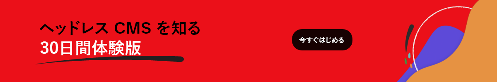

# スニペット

## AEM ヘッドレス体験版プロモ{#aem-headless-trials-promo}

[{align="left"}](https://commerce.adobe.com/business-trial/sign-up?items%5B0%5D%5Bid%5D=649A1AF5CBC5467A25E84F2561274821&amp;cli=headless_exl_banner_campaign&amp;co=US&amp;lang=ja)

## Edge 配信サービス{#edge-delivery-services}

[!BADGE Edge 配信サービスを使用して AEM Sites から公開するには、こちらをクリックしてください。]{type=Positive url="https://experienceleague.adobe.com/docs/experience-manager-cloud-service/content/edge-delivery/overview.html?lang=ja" tooltip="AEM から Edge 配信サービスへの公開"}

## Edge 配信サービスとページエディター{#edge-delivery-services-and-page-editor}

[!BADGE Edge 配信サービスを使用して AEM Sites から公開するには、こちらをクリックしてください。]{type=Positive url="https://experienceleague.adobe.com/docs/experience-manager-cloud-service/content/edge-delivery/overview.html?lang=ja" tooltip="AEM から Edge 配信サービスへの公開"}

## Edge 配信サービスとユニバーサルビジュアルエディター{#edge-delivery-services-and-universal-visual-editor}

[!BADGE Edge 配信サービスを使用して AEM Sites から公開するには、こちらをクリックしてください。]{type=Positive url="https://experienceleague.adobe.com/docs/experience-manager-cloud-service/content/edge-delivery/overview.html?lang=ja" tooltip="AEM から Edge 配信サービスへの公開"}
