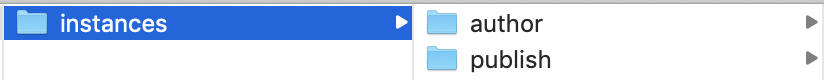
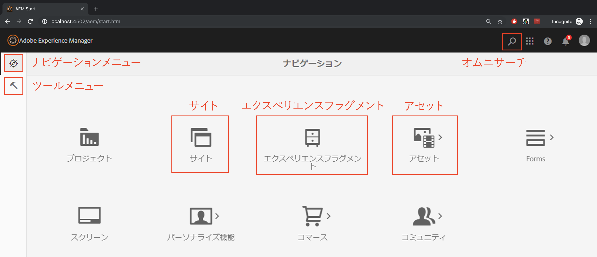

# Adobe Experience ManagerとAdobe Targetの統合

この節では、Adobe TargetとのAdobe Experience Managerの設定方法を、様々なシナリオで説明します。 シナリオと組織の要件に基づきます。

* **Adobe Target追加 JavaScriptライブラリ（すべてのシナリオで必要）AEMでホストされるサイト**&#x200B;の場合、「 [起動](https://docs.adobe.com/content/help/ja-JP/launch/using/overview.html)」を使用してターゲットライブラリをサイトに追加できます。 Launchは、関連する顧客エクスペリエンスに電力を供給するために必要なすべてのタグを簡単に導入および管理する方法を提供します。
* **Adobe Target追加のCloud Services（エクスペリエンスフラグメントのシナリオで必要）** AEMのお客様は、エクスペリエンスフラグメントオファーを使用してAdobe Target内でアクティビティを作成する場合、Cloud Servicesをレガシーを使用しAEMて統合する必要があります。 この統合は、エクスペリエンスフラグメントをAEMからHTML/JSONオファーとしてターゲットにプッシュし、オファーとAEMの同期を維持するために必要です。 
*この統合は、シナリオ1の実装に必要です。*

## 前提条件

* **Adobe Experience Manager (AEM){#aem}**
   * AEM 6.5(*最新のService Packを推奨*)
   * AEM WKNDリファレンスサイトパッケージのダウンロード
      * [aem-guides-wknd.ui.apps-0.0.1-SNAPSHOT.zip](https://github.com/adobe/aem-guides-wknd/releases/download/archetype-18.1/aem-guides-wknd.ui.apps-0.0.1-SNAPSHOT.zip)
      * [aem-guides-wknd.ui.content-0.0.1-SNAPSHOT.zip](https://github.com/adobe/aem-guides-wknd/releases/download/archetype-18.1/aem-guides-wknd.ui.content-0.0.1-SNAPSHOT.zip)
      * [コアコンポーネント](https://github.com/adobe/aem-core-wcm-components/releases/download/core.wcm.components.reactor-2.5.0/core.wcm.components.all-2.5.0.zip)
      * [デジタルデータレイヤー](assets/implementation/digital-data-layer.zip)

* **Experience Cloud**
   * 組織へのアクセス：Adobe Experience Cloud- <https://>`<yourcompany>`.experiencecloud.adobe.com
   * 次のソリューションでプロビジョニングされたExperience Cloud
      * [Adobe Experience Platform Launch](https://experiencecloud.adobe.com)
      * [Adobe Target](https://experiencecloud.adobe.com)
      * [AdobeI/Oコンソール](https://console.adobe.io)

* **環境**
   * Java 1.8またはJava 11(AEM 6.5以降のみ)
   * Apache Maven（3.3.9 以降）
   * Chrome

>[!NOTE]
>
> お客様は、 [AdobeサポートからのExperience Platform LaunchI/OとAdobeI/Oのプロビジョニングを受けるか](https://helpx.adobe.com/jp/contact/enterprise-support.ec.html) 、システム管理者に連絡する必要があります。

### AEMのセットアップ{#set-up-aem}

このチュートリアルを完了するには、AEMオーサーインスタンスとパブリッシュインスタンスが必要です。 作成者インスタンスが実行中のインスタンス `http://localhost:4502` と発行インスタンスで実行中のインスタンスがあり `http://localhost:4503`ます。 詳しくは、次を参照してください。 [ローカルAEM開発環境を設定します](https://helpx.adobe.com/experience-manager/kt/platform-repository/using/local-aem-dev-environment-article-setup.html)。

#### AEM作成者インスタンスと発行インスタンスの設定

1. AEM Quickstart Jarのコピーと [ライセンスを取得します。](https://helpx.adobe.com/experience-manager/6-5/sites/deploying/using/deploy.html#GettingtheSoftware)
2. 次のようなフォルダー構造をコンピューター上に作成します。
   
3. Quickstart jarの名前をに変更し、ディレクトリの下 `aem-author-p4502.jar` に配置し `/author` ます。 デ追加ィレクトリの下のフ `license.properties``/author` ァイル。
   
4. Quickstart jarのコピーを作成し、に名前を変更して、ディレクトリの下に配置 `aem-publish-p4503.jar` し `/publish` ます。 ディレ追加クトリの下にある `license.properties` ファイルのコピー `/publish` です。
   
5. 重複が `aem-author-p4502.jar` ファイルをクリックして、作成者インスタンスをインストールします。 これにより、ローカルコンピューターのポート4502で実行されている作成者インスタンスが開始されます。
6. 以下の資格情報を使用してサインインします。ログインに成功すると、AEMホームページ画面に誘導されます。
username : **admin** password : **admin**
   
7. 重複が `aem-publish-p4503.jar` ファイルをクリックして、発行インスタンスをインストールします。 発行インスタンスの新しいタブがブラウザーで開き、ポート4503で実行され、WebRetailホームページが表示されています。 このチュートリアルでは、WKNDリファレンスサイトを使用して、パッケージを作成者インスタンスにインストールします。
8. Webブラウザー()でAEM作成者に移動し `http://localhost:4502`ます。 AEM開始画面で、 *[ツール/展開/パッケージに移動します](http://localhost:4502/crx/packmgr/index.jsp)*。
9. AEM用のパッケージをダウンロードしてアップロードします(上記の *[前提条件/AEM](#aem)*)。
   * [aem-guides-wknd.ui.apps-0.0.1-SNAPSHOT.zip](https://github.com/adobe/aem-guides-wknd/releases/download/archetype-18.1/aem-guides-wknd.ui.apps-0.0.1-SNAPSHOT.zip)
   * [aem-guides-wknd.ui.content-0.0.1-SNAPSHOT.zip](https://github.com/adobe/aem-guides-wknd/releases/download/archetype-18.1/aem-guides-wknd.ui.content-0.0.1-SNAPSHOT.zip)
   * [core.wcm.components.all-2.5.0.zip](https://github.com/adobe/aem-core-wcm-components/releases/download/core.wcm.components.reactor-2.5.0/core.wcm.components.all-2.5.0.zip)
   * [digital-data-layer.zip](assets/implementation/digital-data-layer.zip)

   >[!VIDEO](https://video.tv.adobe.com/v/28377?quality=12&learn=on)
10. パッケージをAEM Authorにインストールした後、AEM Package Managerでアップロードされた各パッケージを選択し、 **詳細/複製** を選択して、パッケージがAEM Publishに展開されることを確認します。
11. この時点で、WKNDリファレンスサイトと、このチュートリアルに必要なすべての追加パッケージが正常にインストールされました。

[次の章](./using-launch-adobe-io.md):次の章では、LaunchとAEMを統合します。
