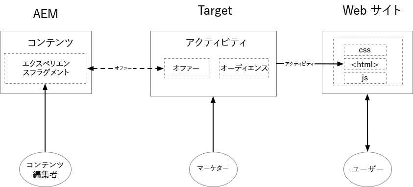
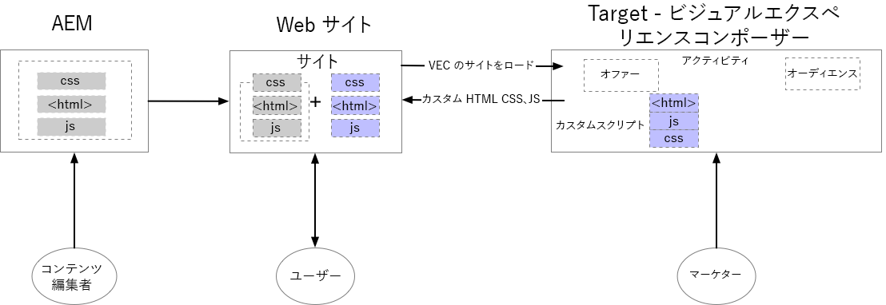
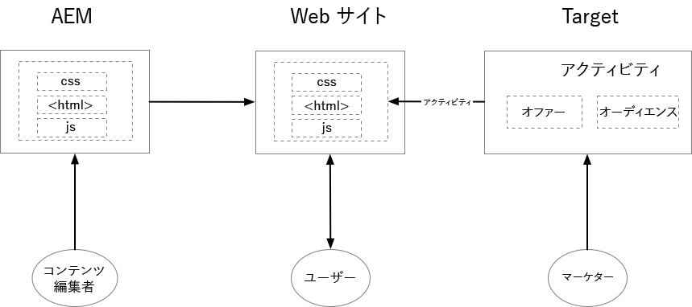

# AEMとAdobe Targetの使い始めに {#getting-started-with-aem-target}

AEMとターゲットは、両方とも、一見重なり合うような機能を持つ強力なソリューションです。 お客様は、これらの製品をどのように、いつどのように組み合わせて使用し、パーソナライズされたエクスペリエンスを提供するかを理解するのに苦労する場合があります。 エンドユーザーごとに最適化されたエクスペリエンスを提供するには、社内の異なるチームが緊密に連携し、誰が何を行うかを定義する必要があります。

このチュートリアルでは、AEMとターゲットの3つのシナリオについて説明します。これは、組織にとって最も効果的なシナリオと、各チームのコラボレーション方法を理解するのに役立ちます。

* シナリオ1:AEMエクスペリエンスフラグメントを使用したパーソナライゼーション
* シナリオ2:Visual Experience Composerを使用したパーソナライゼーション
* シナリオ3:フルWebページエクスペリエンスのパーソナライズ

## AEMエクスペリエンスフラグメントを使用したパーソナライゼーション {#personalization-using-aem-experience-fragment}

このシナリオでは、AEMとターゲットを使用します。 明らかに、両方の製品には独自の強みがあり、パーソナライズされたエクスペリエンスをサイトのユーザーに提供するには、 **パーソナライズされたコンテンツ(AEMのコンテンツ)** とインテリジェントな方法(ターゲット) **** が必要です。

AEMを使用すると、パーソナライズされたコンテンツを作成し、コンテンツとアセットを一元的に集約して、パーソナライズ戦略を強化できます。 AEMを使用すると、コードを記述することなく、デスクトップ、タブレットおよびモバイルデバイス用のコンテンツを1か所で簡単に作成できます。 すべてのデバイスにページを作成する必要はありません。AEMでは、コンテンツを使用して各エクスペリエンスを自動的に調整します。 ボタンを押すと、コンテンツをAEMからAdobe Targetにオファーとして書き出すこともできます。

現在は、ターゲットのAEMからのオファーの形でパーソナライズされたコンテンツを提供しています。 ターゲットにより、これらのオファーを、動作、コンテキストおよびオフラインの変数を組み込んだ、ルールベースの学習アプローチとAI主導の機械学習アプローチの組み合わせに基づいて、規模の大きい方法で配信できます。  ターゲットを使用すると、A/Bおよび多変量分析(MVT)アクティビティを簡単に設定および実行して、最適なオファー、コンテンツおよびエクスペリエンスを決定できます。

**エクスペリエンスフラグメントは** 、コンテンツやエクスペリエンスの作成者を、ターゲットを使用してビジネスの成果をもたらすパーソナライズの専門家と結び付けるための大きな一歩となります。

* AEMコンテンツエディターでは、エクスペリエンスフラグメントとそのバリエーションとしてパーソナライズされたコンテンツを作成できます。
* AEMは、エクスペリエンスフラグメントHTMLをターゲットに&#x200B;書き出します
* ターゲット&#x200B;は、AEM Experience Fragmentマークアップをアクティビティのオファーとして使用します
* ターゲットはエクスペリエンスフラグメントHTMLを配信し、AEMは参照画像を提供します

   

**このシナリオを実装するには、次の操作が必要です。**

* [起動とAdobeI/Oを使用してAEMとAdobe Targetを統合](./implementation.md#integrating-aem-target-options)
* [レガシーCloud Servicesを使用したAEMとAdobe Target](./implementation.md#integrating-aem-target-options)

***上記の統合を実装した後、[シナリオの詳細を調査します](./personalization-use-case-1.md)。***

## Visual Experience Composerを使用したパーソナライゼーション

マーケターは、コードを変更せずにWebサイトをすばやく変更し、Adobe TargetVisual Experience Composer(VEC)を使用してテストを実行できます。 VECはWYSIWYG（表示されるもの）のユーザーインターフェイスで、サイトのコンテキスト内でパーソナライズされたエクスペリエンスやオファーを簡単に作成およびテストできます。 Webページ(またはオファー)またはモバイルWebページのレイアウトとコンテンツをドラッグ&amp;ドロップ、入れ替え、変更することで、ターゲットアクティビティのエクスペリエンスとオファーを作成できます。

VECはAdobe Targetの主な特徴の一つだ。 VECを使用すると、マーケターやデザイナーは視覚的なインターフェイスを使用してコンテンツを作成および変更できます。 コードを直接編集しなくても、多くのデザインの選択肢を作成できます。 コンポーザーで使用可能な編集オプションを使用して、HTMLおよびJavaScriptを編集することもできます。

* コンテンツはAEMに格納され、コンテンツエディターはサイトページを作成および管理します
* ターゲットは、AEMがホストするサイトページを使用してテストとパーソナライゼーションを実行します。
* ターゲットがパーソナライズされたコンテンツを配信
* Adobe TargetVECを使用して新しいコンテンツが作成されます
* AEMがホストするサイトとAEMがホストしないサイトの両方に適用

   

**このシナリオを実装するには、次の操作が必要です。**

* [起動とAdobeI/Oを使用してAEMとAdobe Targetを統合](./implementation.md#integrating-aem-target-options)

***上記の統合を実装した後、[シナリオを詳しく調べます。](./personalization-use-case-3.md)***

## フルWebページエクスペリエンスのパーソナライズ

Adobe Experience ManagerとAdobe Targetの統合により、パーソナライズされたエクスペリエンスをサイトのユーザーに提供できます。 また、指定したテスト期間中にコンバージョンを改善するのに最も適したWebサイトコンテンツのバージョンをより深く理解するのにも役立ちます。 例えば、A/Bテストでは、Webサイトコンテンツの複数のバージョンを比較して、コンバージョン、販売または特定した他の指標について最も高い上昇率を示すコンテンツを調べます。 マーケティング担当者は、Adobe Target内にアクティビティを作成して、ユーザーがサイトのコンテンツをどのように操作し、サイト指標に与える影響を理解できます。

* コンテンツはAEMに格納され、コンテンツエディターはサイトページを作成および管理します
* ターゲットは、AEMがホストするサイトページを使用してテストとパーソナライゼーションを実行します。
* ターゲットがパーソナライズされたコンテンツを配信
* ここに新しいコンテンツは作成されません
* AEMサイトとAEM以外のサイトの両方に適用

   

**このシナリオを実装するには、次の操作が必要です。**

* [起動とAdobeI/Oを使用してAEMとAdobe Targetを統合](./implementation.md#integrating-aem-target-options)

***上記の統合を実装した後、[シナリオを詳しく調べます。](./personalization-use-case-2.md)***
