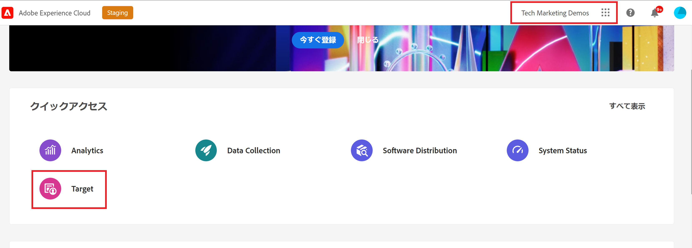
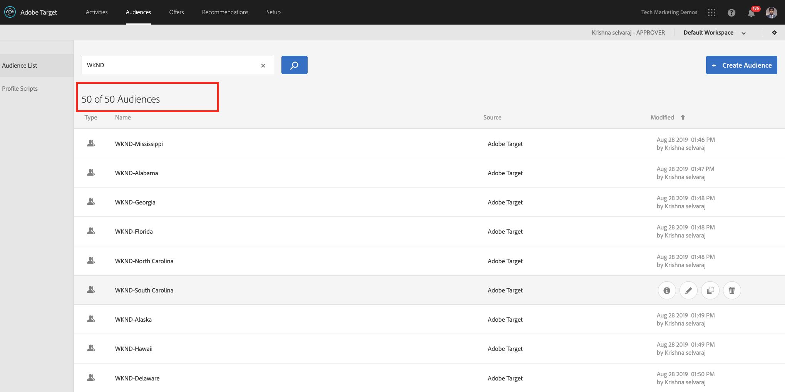
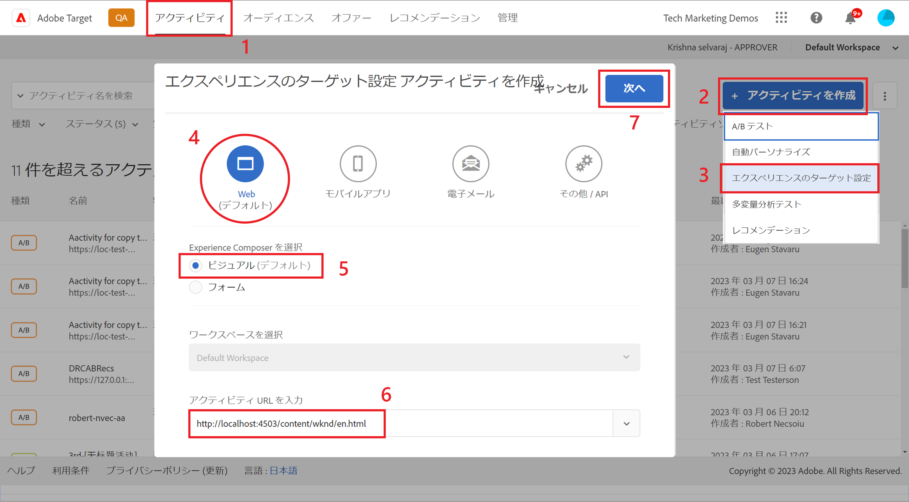
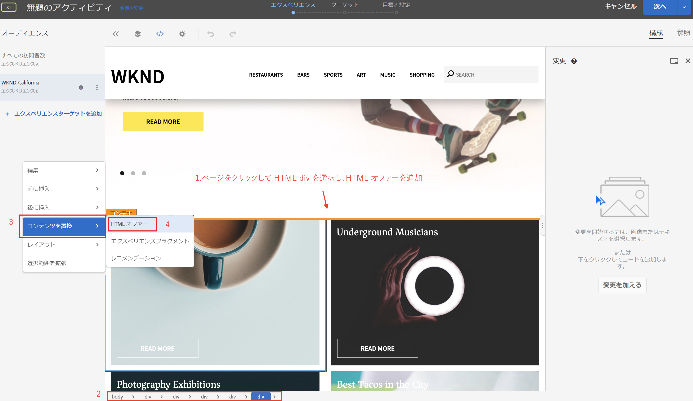
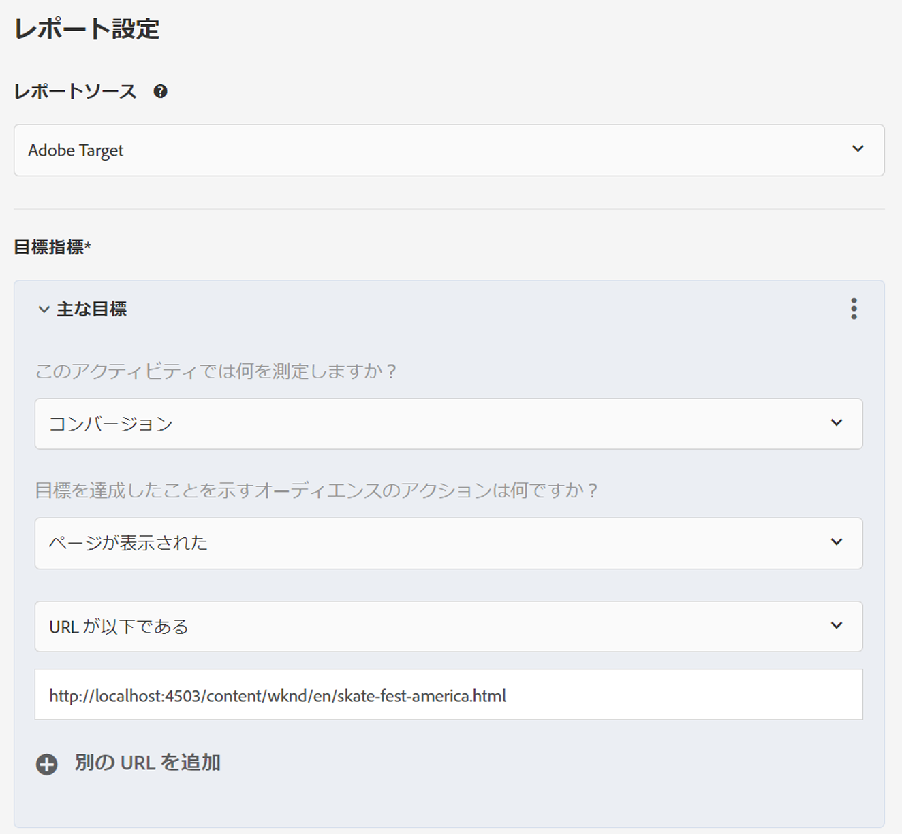
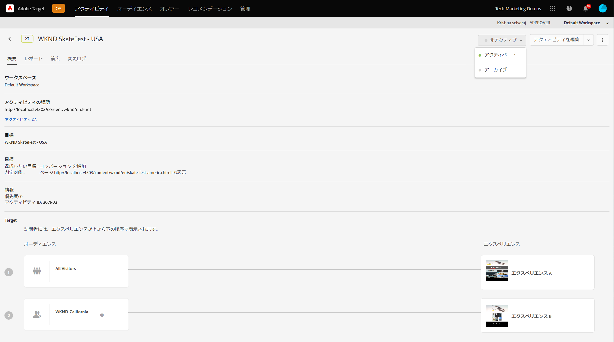
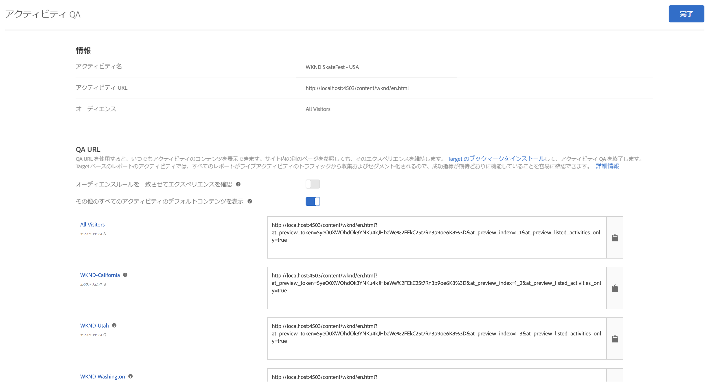

# AEMエクスペリエンスフラグメントとAdobe Targetを使用したパーソナライゼーション

AEMエクスペリエンスフラグメントをHTMLオファーとしてAdobe Targetに書き出す機能により、AEMの使いやすさと能力を、強力なAutomated Intelligence(AI)およびMachine Learning(ML)機能と組み合わせて、エクスペリエンスを大規模にテストおよびパーソナライズできます。

AEMは、すべてのコンテンツとアセットを一元的に集約し、パーソナライズ戦略を強化します。 AEMを使用すると、コードを記述することなく、デスクトップ、タブレットおよびモバイルデバイス用のコンテンツを1か所で簡単に作成できます。 すべてのデバイスにページを作成する必要はありません。AEMでは、コンテンツを使用して各エクスペリエンスを自動的に調整します。

ターゲットを使用すると、行動、コンテキストおよびオフラインの変数を組み込んだ、ルールベースの学習アプローチとAI主導の機械学習アプローチを組み合わせて、スケールを合わせたパーソナライズされたエクスペリエンスを提供できます。  ターゲットを使用すると、A/Bおよび多変量分析(MVT)アクティビティを簡単に設定および実行して、最適なオファー、コンテンツおよびエクスペリエンスを決定できます。

エクスペリエンスフラグメントは、ターゲットを使用してビジネスの成果を引き起こしているマーケティング担当者とコンテンツ制作者を結び付けるための大きな一歩となります。

## シナリオの概要

WKNDのサイトは、自社のウェブサイトを通じて米国全土で **SkateFestチャレンジ** (SkateFest Challenge)を発表し、各州でオーディションの入会を希望しています。 マーケティング担当者には、WKNDサイトホームページでキャンペーンを実行するタスクが割り当てられており、そのユーザーの場所に関連するバナーメッセージと、イベントの詳細ページへのリンクが含まれています。 WKNDサイトのホームページを調査し、現在の場所に基づいてパーソナライズされたエクスペリエンスを作成し、配信する方法を学びます。

### 関係するユーザー

この練習では、次のユーザが関与し、管理者アクセスが必要となるタスクを実行する必要があります。

* **コンテンツプロデューサー/コンテンツエディタ** (Adobe Experience Manager)
* **マーケティング担当者** (Adobe Target/最適化チーム)

### 前提条件

* **AEM**
   * [AEM authorインスタンス](./implementation.md#getting-aem) 、およびlocalhost 4502および4503でそれぞれ実行されているパブリッシュインスタンス。
* **Experience Cloud**
   * 組織へのアクセス：Adobe Experience Cloud- <https://>`<yourcompany>`.experiencecloud.adobe.com
   * 次のソリューションでプロビジョニングされたExperience Cloud
      * [Adobe Target](https://experiencecloud.adobe.com)

### WKNDサイトホームページ

1. マーケティング担当者が、AEMコンテンツエディターとWKND SkateFestキャンペーンの話し合いを開始し、要件の詳細を説明します。
   * ***要件***:米国の各州の訪問者向けにパーソナライズされたコンテンツを使用して、WKNDサイトホームページのWKND SkateFestキャンペーンを推進します。 ホームページカルーセルの下に追加、背景画像、テキスト、ボタンを含む新しいコンテンツブロックが追加されました。
      * **背景画像**:画像は、ユーザがWKNDサイトページを訪問した元の状態に関連する必要があります。
      * **テキスト**:「Auditionへのサインアップ」
      * **ボタン**:「イベントの詳細」WKND SkateFestページ
      * **WKND SkateFestページ**:オーディションの開催場所、日時など、イベントの詳細を含む新しいページ。
1. 要件に基づいて、AEM Content Editorはコンテンツブロックのエクスペリエンスフラグメントを作成し、オファーとしてAdobe Targetに書き出します。 コンテンツの作成者は、米国のすべての州向けにパーソナライズされたコンテンツを提供するために、1つのエクスペリエンスフラグメントマスターバリエーションを作成し、その他50種類のバリエーションを州ごとに1つずつ作成できます。 各状態のバリエーションのコンテンツと関連する画像およびテキストを手動で編集できます。 エクスペリエンスフラグメントをオーサリングする場合、コンテンツエディターは、アセットファインダーオプションを使用して、AEM Assets内で使用可能なすべてのアセットにすばやくアクセスできます。 エクスペリエンスフラグメントがAdobe Targetに書き出されると、そのすべてのバリエーションもオファーとしてAdobe Targetに押し出されます。

1. エクスペリエンスフラグメントをAEMからオファーとしてAdobe Targetに書き出した後、マーケターは、これらのオファーを使用してターゲット内にアクティビティを作成できます。 WKNDサイトのSkateFestキャンペーンに基づき、マーケティング担当者は、各州のWKNDサイト訪問者に対して、パーソナライズされたエクスペリエンスを作成し、配信する必要があります。 エクスペリエンスのターゲット設定アクティビティを作成するには、マーケターはオーディエンスを識別する必要があります。 WKND SkateFestキャンペーンの場合、WKNDのウェブサイトを訪問している訪問者の所在地に基づいて、50のオーディエンスを作成する必要があります。
   * [オーディエンス](https://docs.adobe.com/content/help/en/target/using/introduction/target-key-concepts.html#section_3F32DA46BDF947878DD79DBB97040D01) :アクティビティのターゲットを定義し、ターゲット設定が可能なあらゆる場所で使用されます。 ターゲットオーディエンスは、定義された訪問者条件のセットです。 オファーは、特定のオーディエンス（またはセグメント）をターゲットに設定できます。 そのオーディエンスに属する訪問者のみが、対象となるエクスペリエンスを閲覧できます。  例えば、特定のブラウザーを使用するオーディエンスや特定の地域の訪問者で構成されるオファーに対してブラウザーを提供できます。
   * [オファー](https://docs.adobe.com/content/help/en/target/using/introduction/target-key-concepts.html#section_973D4CC4CEB44711BBB9A21BF74B89E9) とは、キャンペーン中やアクティビティ中にWebページに表示されるコンテンツです。 Webページをテストする場合は、場所の異なるオファーを使用して各エクスペリエンスの成功を測定します。 オファーには、次のような様々なタイプのコンテンツを含めることができます。
      * 画像
      * テキスト
      * **HTML**
         * *HTMLオファーは、このシナリオのアクティビティに使用されます*
      * リンク
      * ボタン

## コンテンツエディタのアクティビティ

>[!VIDEO](https://video.tv.adobe.com/v/28596?quality=12&learn=on)

>[!NOTE]
>
>エクスペリエンスフラグメントを公開してから、Adobe Targetに書き出します。

## マーケティング担当者のアクティビティ

### 地域ターゲティングを使用したオーディエンスの作成 {#marketer-audience}

1. 組織 [Adobe Experience Cloud](https://experiencecloud.adobe.com/) (<https://>`<yourcompany>`.experiencecloud.adobe.com)に移動します。
1. Adobe IDを使用してログインし、正しい組織に属していることを確認します。
1. ソリューションの切り替えボタンで、 **ターゲットをクリックし** 、 **** Adobe Targetを起動します。

   

1. 「 **オファー** 」タブに移動し、「WKND」オファーを検索します。 AEMからHTMLオファーとして書き出された、エクスペリエンスフラグメントのバリエーションのリストを確認できるはずです。 各オファーは、状態に対応します。 例えば、 *WKND SkateFest California* （カリフォルニア州）は、カリフォルニア州のWKNDサイト訪問者に提供されるオファーです。

   

1. メインナビゲーションで、 **オーディエンスをクリックします**。

   マーケティング担当者は、米国の州ごとに、WKNDのサイト訪問者用に50のオーディエンスを作成する必要があります。

1. オーディエンスを作成するには、「 **オーディエンスを作成** 」ボタンをクリックし、オーディエンスの名前を入力します。

   **オーディエンス名の形式：WKND-\&lt;*状態*\>**

   

1. Click **Add Rule > Geo**.
1. 「 **選択**」をクリックし、次のいずれかのオプションを選択します。
   * 国
   * **州***(WKNDサイトのSkateFestキャンペーンの州を選択)*
   * 市区町村
   * 郵便番号
   * 緯度
   * 経度
   * DMA
   * 携帯電話会社

   **地域** -オーディエンスを使用して、国、都道府県、市区町村、郵便番号、DMA、携帯電話会社など、地理的な場所に基づいてターゲットを行います。 位置情報パラメーターを使用すると、訪問者の地域情報に基づいてアクティビティやエクスペリエンスをターゲットできます。 このデータは、ターゲットリクエストのたびに送信され、訪問者のIPアドレスに基づきます。 他のターゲット値と同様に、これらのパラメーターを選択します。

   >[!NOTE]
   >訪問者のIPアドレスは、mboxリクエストと共に訪問（セッション）ごとに1回渡され、その訪問者の地域ターゲティングパラメーターが解決されます。

1. 演算子を **一致として選択し**、適切な値(例：California)を参照し、変更を **保存します** 。 この場合は、状態名を入力します。

   

   >[!NOTE]
   >1つのオーディエンスに複数のルールを割り当てることができます。

1. 手順6 ～ 9を繰り返して、他の状態のオーディエンスを作成します。

   

この時点で、米国の様々な州のすべてのWKNDサイト訪問者用のオーディエンスの作成に成功しました。また、州ごとに対応するHTMLオファーも作成されています。 次に、エクスペリエンスのターゲット設定アクティビティを作成して、WKNDサイトホームページの対応するオファーとオーディエンスをターゲットします。

### 地域ターゲティングを使用したアクティビティの作成

1. Adobe Target・ウィンドウから「 **アクティビティ** 」タブに移動します。
1. 「 **アクティビティを作成** 」をクリックし、「 **エクスペリエンスのターゲット設定** 」アクティビティタイプを選択します。
1. 「 **Web** 」チャネルを選択し、「 **Visual Experience Composer**」を選択します。
1. **アクティビティURLを入力し** 、「 **次へ** 」をクリックしてVisual Experience Composerを開きます。

   WKNDサイトホームページ公開URL:http://localhost:4503/content/wknd/en.html

   

1. **Visual Experience Composerを読み込むには、ブラウザーで「安全でないスクリプトの読み込みを** 許可 **** 」を有効にし、ページを再読み込みします。

   

1. Visual Experience ComposerエディターでWKNDサイトホームページが開きます。

   

1. VECにオーディエンスを追加するには、「オーディエンス」の下にある「 **追加エクスペリエンスのターゲット設定** 」をクリックし、「WKND-California」オーディエンスを選択して「 **次へ**」をクリックします。

   

1. VEC内のWKNDサイトページをクリックし、WKND-Californiaオーディエンス用のオファーを追加するHTML要素を選択し、「 **置換文字列** 」オプションを選択して、 **HTMLオファーを選択します**。

   

1. オファーから「UI」を選択し、「 **完了** 」をクリックします **。WKND-California** オーディエンス用のWKND SkateFest California **HTMLオファーを選択します**。
1. これで、WKND-CaliforniaオーディエンスのWKNDサイトページに **WKND SkateFest California** HTMLオファーが追加されていることを確認できます。
1. 手順7 ～ 10を繰り返して、他の状態のエクスペリエンスターゲット設定を追加し、対応するHTMLオファーを選択します。
1. 「 **次へ** 」をクリックして続行すると、オーディエンスとエクスペリエンスとの対応付けが表示されます。
1. 「 **次へ** 」をクリックして、「目標と設定」に移動します。
1. レポートソースを選択し、アクティビティの主な目標を特定します。 シナリオでは、レポートソースを **Adobe Targetとして選択し、アクティビティをコンバージョンとして測定し、ページを表示したアクション******、WKND SkateFest詳細ページを指すURLを測定します。

   

   >[!NOTE]
   >また、レポートソースとしてAdobe Analyticsを選択することもできます。

1. 現在のアクティビティ名の上にマウスポインターを置くと、 **WKND SkateFest - USA**&#x200B;という名前に変更し、 **保存して変更を閉じます** 。
1. アクティビティの詳細画面で、「アクティビティを **アクティブ化** 」を確認します。

   

1. WKND SkateFestキャンペーンは、すべてのWKNDサイト訪問者に提供されます。
1. [WKNDサイトホームページに移動すると](http://localhost:4503/content/wknd/en.html)、地域(*状態：カリフォルニア*)。

   

### ターゲットアクティビティQA

1. 「 **アクティビティの詳細/概要** 」タブで、「 **アクティビティQA** 」ボタンをクリックすると、すべてのエクスペリエンスに直接QAリンクを設定できます。

   

1. WKNDサイトホームページに移動すると 、地域（状態）に基づいたWKND SkateFestオファーを確認できます。
1. 以下のビデオを見て、オファーがページに配信される方法、応答トークンのカスタマイズ方法、品質チェックの実行方法を理解してください。

>[!VIDEO](https://video.tv.adobe.com/v/28658?quality=12&learn=on)

## 概要

この章では、コンテンツエディターで、Adobe Experience Manager内でWKND SkateFestキャンペーンをサポートするすべてのコンテンツを作成し、HTMLオファーとしてAdobe Targetに書き出して、ユーザーの地域に基づいたエクスペリエンスターゲット設定を作成できました。
