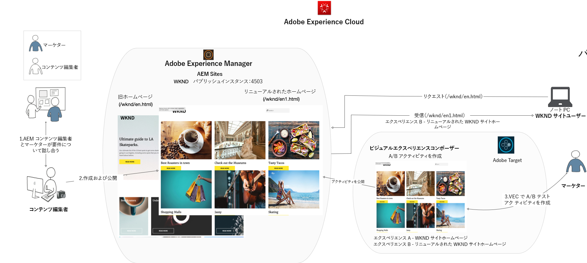
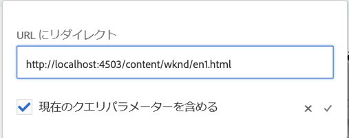
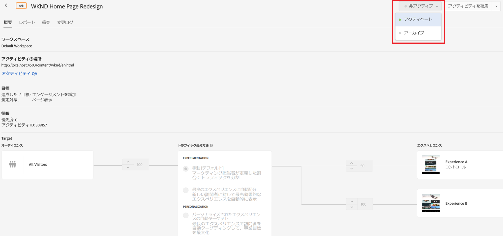
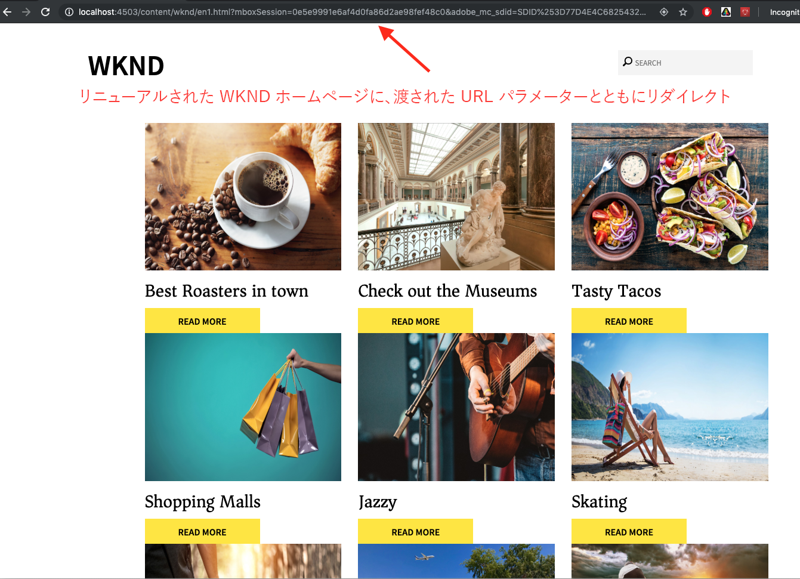

# Adobe Targetを使用したフルWebページエクスペリエンスのパーソナライズ

前の章では、エクスペリエンスフラグメントとして作成され、AEMからHTMLオファーとして書き出されたコンテンツを使用して、Adobe Target内で地域ベースのアクティビティを作成する方法を学びました。

この章では、AEMでホストされるサイトページをAdobe Targetを使用して新しいページにリダイレクトするアクティビティの作成について説明します。

## シナリオの概要

WKNDサイトはホームページを再設計し、現在のホームページ訪問者を新しいホームページにリダイレクトしたいと考えています。 同時に、再設計されたホームページがユーザーの関与と売上高を改善する方法についても理解します。 マーケティング担当者には、訪問者を新しいホームページにリダイレクトするアクティビティを作成するタスクが割り当てられています。 WKNDのサイトホームページを調べ、Adobe Targetを使用したアクティビティの作成方法を学びましょう。

### 関係するユーザー

この練習では、次のユーザが関与し、管理者アクセスが必要となるタスクを実行する必要があります。

* **コンテンツプロデューサー/コンテンツエディタ** (Adobe Experience Manager)
* **マーケティング担当者** (Adobe Target/最適化チーム)

### WKNDサイトホームページ

### 前提条件

* **AEM**
   * [AEM authorおよびpublish](./implementation.md#getting-aem) インスタンスは、それぞれlocalhost 4502および4503で実行されます。
   * [ADOBE EXPERIENCE PLATFORM LAUNCHを使ってAdobe Targetと統合されたAEM](./using-launch-adobe-io.md#aem-target-using-launch-by-adobe)
* **Experience Cloud**
   * 組織へのアクセス：Adobe Experience Cloud- <https://>`<yourcompany>`.experiencecloud.adobe.com
   * 次のソリューションでプロビジョニングされたExperience Cloud
      * [Adobe Target](https://experiencecloud.adobe.com)

## コンテンツエディタのアクティビティ

1. マーケティング担当者が、AEMコンテンツエディターとWKNDホームページの再設計に関するディスカッションを開始し、要件の詳細を説明します。
   * ***要件*** :カードベースのデザインでWKNDサイトホームページを再設計します。
2. 要件に基づいて、AEM Content Editorはカードベースのデザインを持つ新しいWKNDサイトホームページを作成し、新しいホームページを公開します。

## マーケティング担当者のアクティビティ

1. マーケティング担当者は、リダイレクトオファーをエクスペリエンスとしてA/Bターゲットアクティビティを作成し、成功目標と指標を追加して、100%のWebサイトトラフィックを新しいホームページに割り当てます。
   1. Adobe Targetのウィンドウで、**アクティビティ**&#x200B;タブに移動します。
   2. 「**アクティビティを作成**」ボタンをクリックし、アクティビティの種類を「**A/Bテスト**」に選択します

      
   3. 「**Web**」チャネルを選択し、「**Visual Experience Composer**」を選択します。
   4. **アクティビティURL**&#x200B;を入力し、「**次へ**」をクリックしてVisual Experience Composerを開きます。
      
   5. **Visual Experience Composer**&#x200B;を読み込むには、ブラウザーで「安全でないスクリプトを読み込むことを許可&#x200B;**」を有効にし、ページを再読み込みします。**
      
   6. Visual Experience ComposerエディターでWKNDサイトホームページが開きます。
      
   7. **エクスペリエンスB**の上にカーソルを置き、「その他の表示」を選択します。
      
   8. 「**URLにリダイレクト**」オプションを選択し、新しいWKNDホームページへのURLを入力します。 (http://localhost:4503/content/wknd/en1.html)
      
   9. **変更を** 保存し、アクティビティの作成の次の手順に進みます。
   10. **トラフィック配分方法**&#x200B;を手動で選択し、100%のトラフィックを&#x200B;**エクスペリエンスB**に割り当てます。
      
   11. 「**次へ**」をクリックします。
   12. アクティビティに&#x200B;**目標指標**を指定し、A/Bテストを保存して閉じます。
      
   13. アクティビティの名前(**WKNDホームページの再設計**)を指定し、変更を保存します。
   14. アクティビティの詳細画面で、**アクティビティを**アクティブにします。
      
   15. WKNDホームページ(http://localhost:4503/content/wknd/en.html)に移動すると、再設計されたWKNDサイトホームページ(http://localhost:4503/content/wknd/en1.html)にリダイレクトされます。
      

## 概要

この章では、マーケティング担当者が、AEMでホストされるサイトページをAdobe Targetを使用して新しいページにリダイレクトするアクティビティを作成できました。
