# Visual Experience Composerを使用したパーソナライゼーション

この章では、ターゲット内からWebページのレイアウトとコンテンツをドラッグ&amp;ドロップ、入れ替え **、変更することにより、** Visual Experience Composerを使用したエクスペリエンスの作成について説明します。

## シナリオの概要

WKNDサイトのホームページは、市内のアクティビティ、または市内周辺で行う最善の方法をカードレイアウトの形で表示します。 マーケターには、ホームページの変更タスクが割り当てられています。カードのレイアウトを並べ替え直すことで、ユーザーの関与やコンバージョンへの影響を確認できます。

### 関係するユーザー

この練習では、次のユーザが関与し、管理者アクセスが必要となるタスクを実行する必要があります。

* **コンテンツプロデューサー/コンテンツエディタ** (Adobe Experience Manager)
* **マーケティング担当者** (Adobe Target/最適化チーム)

### WKNDサイトホームページ

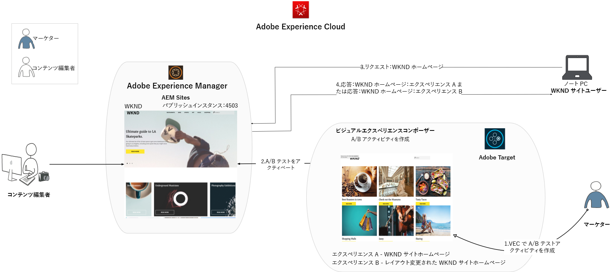

### 前提条件

* **AEM**
   * [AEM 4503で実行される発行インスタンス](./implementation.md#getting-aem)
   * [ADOBE EXPERIENCE PLATFORM LAUNCHを使ってAdobe Targetと統合されたAEM](./using-launch-adobe-io.md#aem-target-using-launch-by-adobe)
* **Experience Cloud**
   * 組織へのアクセス：Adobe Experience Cloud- <https://>`<yourcompany>`.experiencecloud.adobe.com
   * [Adobe Targetで準備されたExperience Cloud](https://experiencecloud.adobe.com)

## マーケティング担当者のアクティビティ

1. マーケターはAdobe Target内にA/Bターゲットアクティビティを作成します。
   1. Adobe Target・ウィンドウから「 **アクティビティ** 」タブに移動します。
   2. 「 **アクティビティを作成** 」ボタンをクリックし、アクティビティタイプを **A/Bテストとして選択します**

      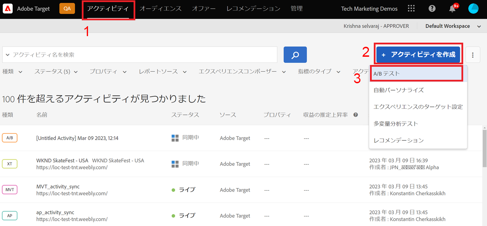
   3. 「 **Web** 」チャネルを選択し、「 **Visual Experience Composer**」を選択します。
   4. **アクティビティURLを入力し** 、「 **次へ** 」をクリックしてVisual Experience Composerを開きます。
      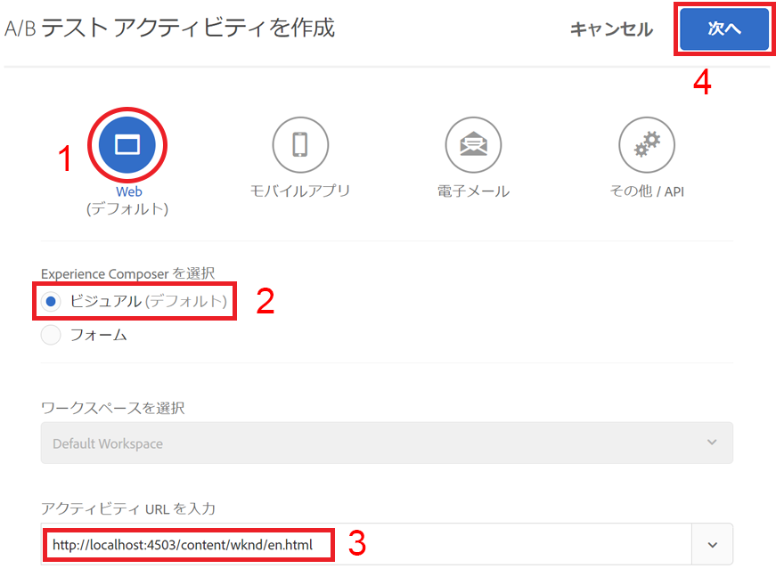
   5. **Visual Experience Composerを読み込むには、ブラウザーで「安全でないスクリプトの読み込みを** 許可 **** 」を有効にし、ページを再読み込みします。
      
   6. Visual Experience ComposerエディターでWKNDサイトホームページが開きます。
      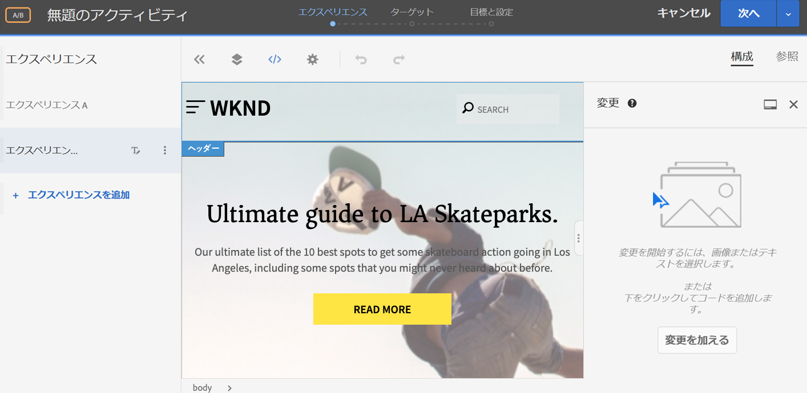
   7. **エクスペリエンスA** はデフォルトのWKNDホームページを提供します。エクスペリエンスB ****のコンテンツレイアウトを編集します。
      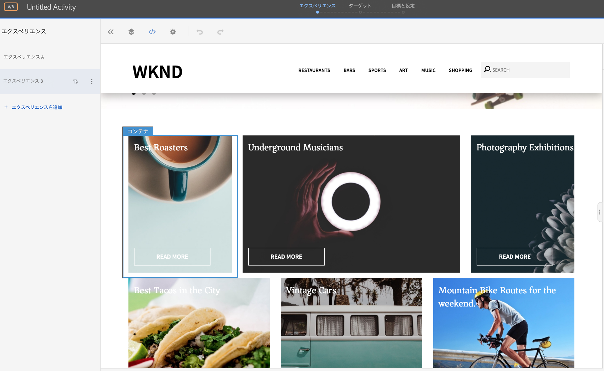
   8. カードレイアウトコンテナの1つ(「*Best Roasters*」)をクリックし、「 **Reargand** 」オプションを選択します。
      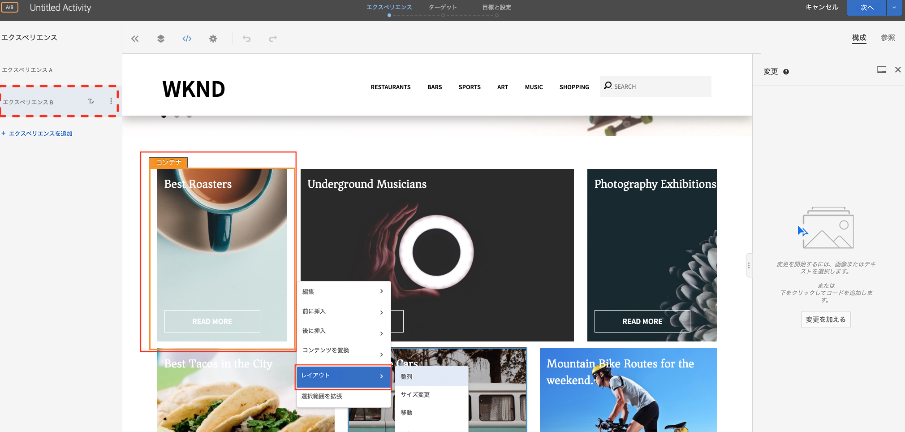
   9. 整列するコンテナをクリックし、目的の位置にドラッグ&amp;ドロップします。 1行目の1列目から1行目の3列目まで、 *最良のばいせん* コンテナを並べ替えます。 「 *ベスト・ロースター* 」コンテナは、「 *フォトグラフィー展示会* 」コンテナの隣にあります。
      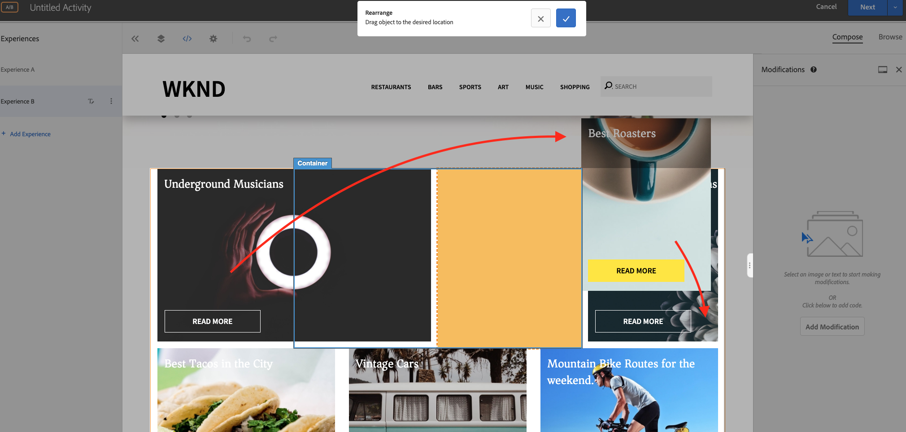

      **スワップ後**
      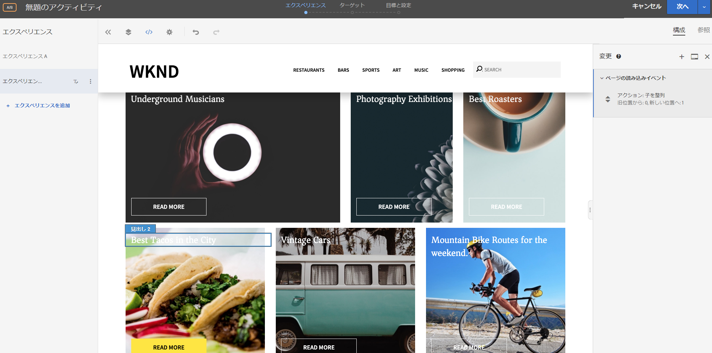
   10. 同様に、他のカードコンテナの位置を並べ替えます。
      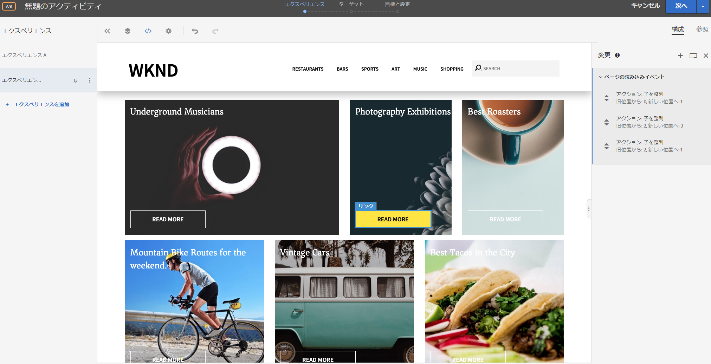
   11. また、カルーセルコンポーネントの下、およびカードレイアウトの上にヘッダーテキストを追加します。
   12. カルーセルコンテナをクリックし、「 **後に挿入」/「HTML** 」オプションを選択してHTMLを追加します。
      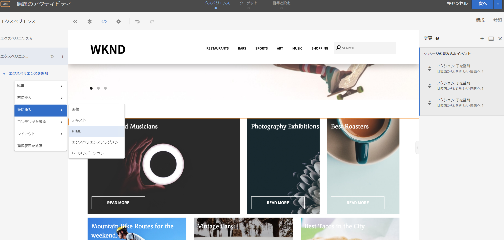

      ```html
      <h1 style="text-align:center">Check Out the Hot Spots in Town</h1>
      ```

      
   13. 「 **次へ** 」をクリックしてアクティビティに進みます。
   14. 「 **トラフィック配分方法** 」を手動で選択し、100%のトラフィックを **エクスペリエンスBに割り当てます**。
      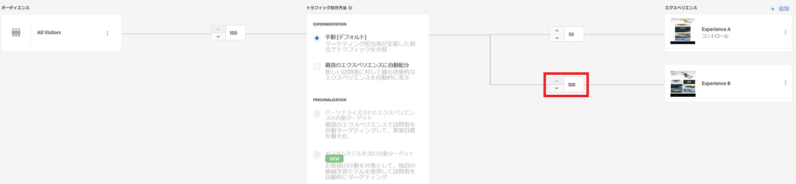
   15. 「**次へ**」をクリックします。
   16. アクティビティの **目標指標を指定し** 、A/Bテストを保存して閉じます。
      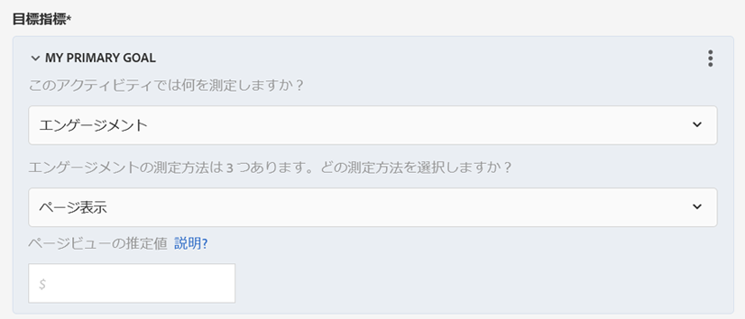
   17. アクティビティの名前(**WKNDホームページ更新**)を指定し、変更を保存します。
   18. アクティビティの詳細画面で、「アクティビティを **アクティブ化** 」を確認します。
      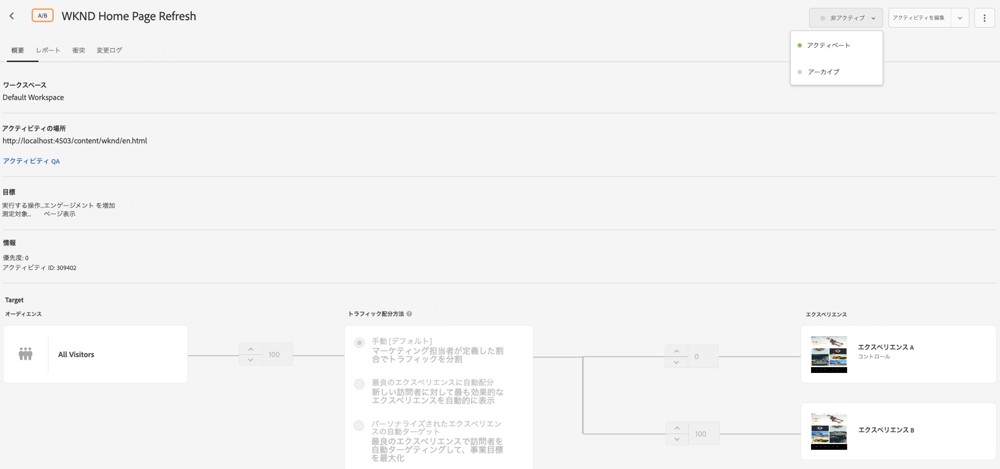
   19. WKNDホームページ(http://localhost:4503/content/wknd/en.html)に移動すると、WKNDホームページの更新A/Bテストアクティビティに追加した変更が表示されます。
      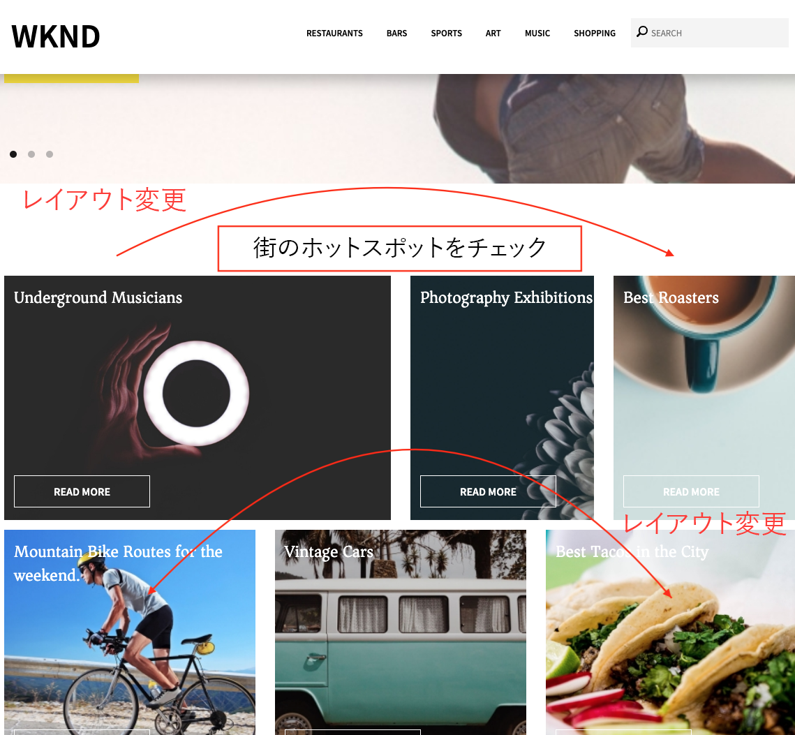
   20. ブラウザコンソールを開き、ネットワークタブを調べて、WKNDホームページの更新A/Bテストアクティビティに対するターゲット応答を探します。
      

## 概要

この章では、マーケティング担当者が、テストを実行するコードを変更することなく、Webページのレイアウトとコンテンツをドラッグ&amp;ドロップ、入れ替え、変更することで、Visual Experience Composerを使用してエクスペリエンスを作成できました。
