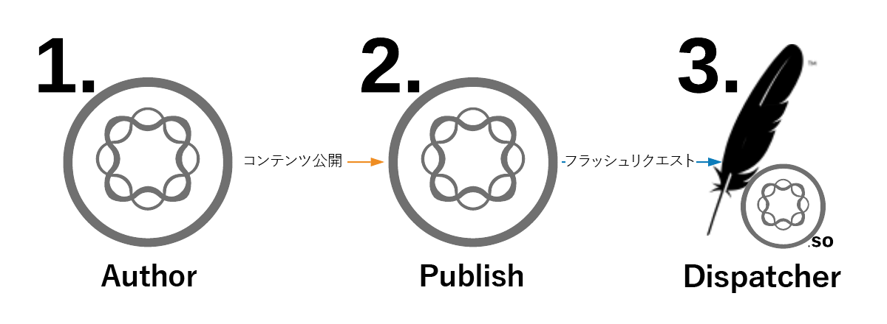
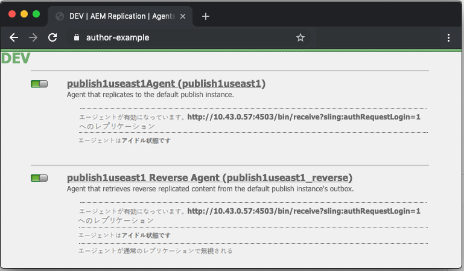
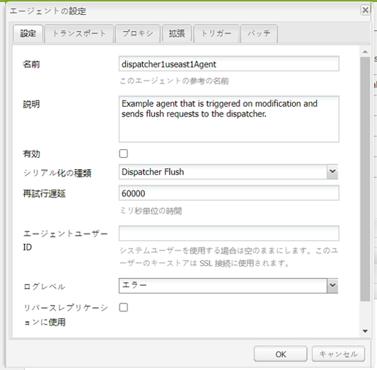
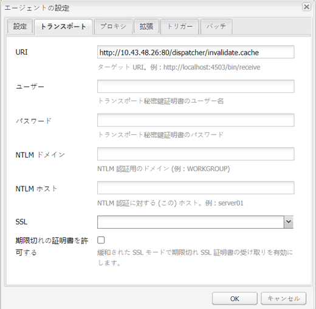
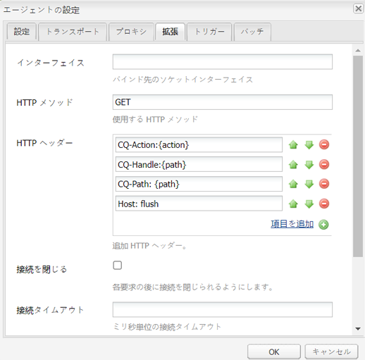
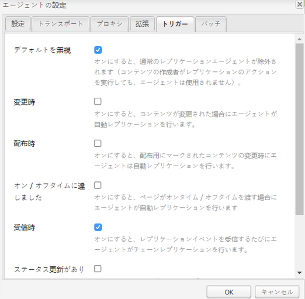

# Dispatcher バニティー URL

[目次](./overview.md)

[&lt; - 前へ：変数の使用と理解](./variables.md)

このドキュメントでは、フラッシュがどのように発生するのか、およびキャッシュのフラッシュと無効化を実行するメカニズムについて説明します。


## 仕組み

### 操作の順序

一般的なワークフローは、コンテンツの作成者がページをアクティベートする際に最適です。公開者が新しいコンテンツを受信すると、次の図に示されるように、Dispatcher に対するフラッシュリクエストがトリガーされます。

この一連のイベントでは、新規または変更されたアイテムのみがフラッシュされます。これにより、キャッシュをクリアする前にパブリッシャーがコンテンツを受け取るようになります。変更がパブリッシャーから取得できるようになる前にフラッシュが発生する競合状態を避けることができます。

## レプリケーションエージェント

オーサー環境には、パブリッシャーを指すように設定されたレプリケーションエージェントがあり、何かがアクティベートされると、そのファイルとすべての依存関係をパブリッシャーに送信するトリガーが発生します。

パブリッシャーはファイルを受け取ると、受信時イベントでトリガする Dispatcher を指すように設定されたレプリケーションエージェントを持つことになります。その後、フラッシュリクエストがシリアル化され、Dispatcher に post されます。

### オーサーレプリケーションエージェント

次に、設定済みの標準レプリケーションエージェントの例をスクリーンショットで示します


通常、オーサーに対して、コンテンツのレプリケート先のパブリッシャーごとに 1 つまたは 2 つのレプリケーションエージェントが設定されます。

1 つ目は、コンテンツのアクティベーションをプッシュする標準レプリケーションエージェントです。

2 つ目はリバースエージェントです。これはオプションで、リバースレプリケーションアクティビティとしてオーサーに取り込む新しいコンテンツが各パブリッシャーのアウトボックスにあるかどうかを確認するように設定されています

### パブリッシャーレプリケーションエージェント

設定済みの標準フラッシュレプリケーションエージェントの例を次のスクリーンショットで示します


### 仮想ホストを受け取る DISPATCHER フラッシュレプリケーション

Dispatcher モジュールは特定のヘッダーを探し、POST リクエストが AEM レンダーに渡すものか、またはフラッシュリクエストとしてシリアル化され、Dispatcher ハンドラー自体で処理する必要があるかを特定します。

以下は、これらの値を示す設定ページのスクリーンショットです。


デフォルト設定ページには、`Dispatcher Flush` として `Serialization Type` が表示され、エラーレベルを設定できます。



「`Transport`」タブをクリックすると、フラッシュリクエストを受け取る Dispatcher の IP アドレスを指すように設定されている `URI` を確認できます。パス `/dispatcher/invalidate.cache` は、フラッシュかどうかをモジュールが判断する方法ではなく、フラッシュリクエストであることがわかるようアクセスログに表示される明白なエンドポイントにほかなりません。「`Extended`」タブでは、Dispatcher モジュールに対するフラッシュリクエストであると見なすために存在するものを確認します。



フラッシュリクエストの `HTTP Method` は、いくつかの特別なリクエストヘッダーを持つ以下の `GET` リクエストです。
- CQ-Action
   - リクエストに基づくAEM 変数を使用します。値は通常、*アクティベートまたは削除*&#x200B;です。
- CQ-Handle
   - リクエストに基づいて AEM 変数を使用します。値は通常、フラッシュされた項目の完全パスです（例：`/content/dam/logo.jpg`）
- CQ-Path
   - リクエストに基づいて AEM 変数を使用します。値は通常、フラッシュされる項目の完全パスです（例：`/content/dam`）
- Host
   - `Host` ヘッダーが、Dispatcher Apache web サーバー（`/etc/httpd/conf.d/enabled_vhosts/aem_flush.vhost`）で設定される特定の `VirtualHost` をターゲットするようにスプーフィングされる場所です。これは、`aem_flush.vhost` ファイルの `ServerName` または `ServerAlias` のエントリに一致するハードコードされた値です。



「`Triggers`」タブで、使用する切り替え済みのトリガーとその内容を確認します

- `Ignore default`
   - これを有効にすると、ページのアクティベーション時にレプリケーションエージェントがトリガーされなくなります。これは、オーサーインスタンスがページに変更を加えた場合にフラッシュがトリガーするものです。これはパブリッシャーなので、このタイプのイベントはトリガーしたくありません。
- `On Receive`
   - 新しいファイルを受け取ったら、フラッシュをトリガーします。そのため、更新されたファイルをオーサーが送信すると、フラッシュリクエストがトリガーされ、Dispatcher に送信されます。
- `No Versioning`
   - 新しいファイルを受け取ったので、パブリッシャーが新しいバージョンを生成しないように、これをチェックします。ファイルを置き換え、パブリッシャーではなくオーサーのバージョン管理を信頼します。

一般的なフラッシュリクエストを `curl` コマンドで見てみましょう。

```
$ curl \ 
-H "CQ-Action: Activate" \ 
-H "CQ-Handle: /content/dam/logo.jpg" \ 
-H "CQ-Path: /content/dam/" \ 
-H "Content-Length: 0" \  
-H "Content-Type: application/octect-stream" \ 
-H "Host: flush" \ 
http://10.43.0.32:80/dispatcher/invalidate.cache
```

このフラッシュの例では、ディレクトリ内の `.stat` ファイルを更新して、`/content/dam` パスをフラッシュします。

## `.stat` ファイル

フラッシュメカニズムは本質的にシンプルです。キャッシュファイルが作成されるドキュメントルートで生成される `.stat` ファイルの重要性について説明します。

`.vhost` および `_farm.any` ファイル内で、ドキュメントルートディレクティブを設定して、キャッシュの場所と、エンドユーザーからのリクエストが入ったときにファイルを保存／提供する場所を指定します。

Dispatcher サーバーで次のコマンドを実行すると、`.stat` ファイルの検索が開始されます。

```
$ find /mnt/var/www/html/ -type f -name ".stat"
```

キャッシュ内にアイテムがあり、Dispatcher モジュールによってフラッシュリクエストが送信および処理されたときに、このファイル構造がどのように見えるかを以下の図に示します。


### stat ファイルのレベル

各ディレクトリには、`.stat` ファイルが存在します。これは、フラッシュが発生したことを示すインジケーターです。上記の例では、対応するファーム設定ファイル内で `statfilelevel` 設定が `3` に設定されています。

`statfilelevel` 設定は、モジュールがトラバースして `.stat` ファイルを更新するフォルダー数の深さを示します。.stat ファイルは空で、日付スタンプを含むファイル名にすぎず、手動で作成することもできますが、Dispatcher サーバーのコマンドラインで touch コマンドを実行します。

stat ファイルレベルの設定が高すぎると、各フラッシュリクエストが stat ファイルにタッチしているディレクトリツリーをトラバースします。これは、大規模なキャッシュツリーで大きなパフォーマンスヒットになる可能性があり、Dispatcher の全体的なパフォーマンスに影響を与える可能性があります。

このファイルレベルの設定が低すぎると、フラッシュリクエストが意図した以上にクリアされる可能性があります。これにより、キャッシュから提供されるリクエストが少なくなり、キャッシュがより頻繁にチャーンし、パフォーマンスの問題が発生する可能性があります。

>[!BEGINSHADEBOX 「メモ」]

適切なレベルで `statfilelevel` を設定します。フォルダー構造を見て、多くのディレクトリをトラバースする必要がなく、簡潔なフラッシュができるように設定されていることを確認します。システムのパフォーマンステスト中にテストして、ニーズに合っていることを確認します。

複数の言語をサポートしているサイトが良い例です。一般的なコンテンツツリーには、次のディレクトリがあります

`/content/brand1/en/us/`

この例では、stat ファイルレベル設定の 4 を使用します。これにより、**`us`** フォルダーの下にあるコンテンツをフラッシュする際に、言語フォルダーもフラッシュされなくなります。

>[!ENDSHADEBOX]

### stat ファイルのタイムスタンプハンドシェイク

コンテンツのリクエストが同じルーチンで発生する場合

1. `.stat` ファイルのタイムスタンプは、リクエストされたファイルのタイムスタンプと比較されます
2. `.stat` ファイルがリクエストされたファイルよりも新しい場合、キャッシュされたコンテンツが削除され、AEM から新しいコンテンツが取得されてキャッシュされます。次に、コンテンツが提供されます
3. `.stat` ファイルがリクエストされたファイルよりも古い場合、ファイルが新しいことを認識され、コンテンツが提供されます。

### キャッシュハンドシェイク - 例 1

上記の例では、コンテンツ `/content/index.html` に対するリクエストです。

`index.html` ファイルの時間は 2019-11-01 @ 6:21PM です

最も近い `.stat` ファイルの時間は 2019-11-01 @ 12:22PM です

上記の内容を理解すると、インデックスファイルが `.stat` ファイルよりも新しく、ファイルをリクエストしたエンドユーザーにキャッシュから提供されることがわかります

### キャッシュハンドシェイク - 例 2

上記の例では、コンテンツ `/content/dam/logo.jpg` に対するリクエストです。

`logo.jpg` ファイルの時間は 2019-10-31 @ 1:13PM です

最も近い `.stat` ファイルの時間は 2019-11-01 @ 12:22PM です

この例でわかるように、ファイルは `.stat` ファイルより古いので、リクエストしたエンドユーザーに提供される前に、削除され、新しいファイルが AEM から取り出されてキャッシュ内で置換されます。

## ファームファイル設定

設定オプションの完全なセットに対するすべてのドキュメントについては、 [https://docs.adobe.com/content/help/ja/experience-manager-dispatcher/using/configuring/dispatcher-configuration.html#configuring-dispatcher_configuring-the-dispatcher-cache-cache](https://experienceleague.adobe.com/docs/experience-manager-dispatcher/using/configuring/dispatcher-configuration.html?lang=ja) を参照してください

キャッシュのフラッシュに関連する内容を一部取り上げています。

### ファームのフラッシュ

オーサートラフィックおよびパブリッシャートラフィックからファイルをキャッシュする 2 つの重要な `document root` ディレクトリがあります。これらのディレクトリを新しいコンテンツで最新の状態を保持するには、キャッシュをフラッシュする必要があります。これらのフラッシュリクエストは、リクエストを拒否したり、望ましくないことを行ったりする可能性のある通常の顧客トラフィックファーム設定とは無関係です。代わりに、このタスクに 2 つのフラッシュファームを提供します。

- `/etc/httpd.conf.d/available_farms/001_ams_author_flush_farm.any`
- `/etc/httpd.conf.d/available_farms/001_ams_publish_flush_farm.any`

これらのファームファイルは、ドキュメントルートディレクトリをフラッシュする以外は何もしません。

```
/publishflushfarm {  
    /virtualhosts {
        "flush"
    }
    /cache {
        /docroot "${PUBLISH_DOCROOT}"
        /statfileslevel "${DEFAULT_STAT_LEVEL}"
        /rules {
            $include "/etc/httpd/conf.dispatcher.d/cache/ams_publish_cache.any"
        }
        /invalidate {
            /0000 {
                /glob "*"
                /type "allow"
            }
        }
        /allowedClients {
            /0000 {
                /glob "*.*.*.*"
                /type "deny"
            }
            $include "/etc/httpd/conf.dispatcher.d/cache/ams_publish_invalidate_allowed.any"
        }
    }
}
```

### ドキュメントルート

この設定エントリは、ファームファイルの次のセクションにあります。

```
/myfarm { 
    /cache { 
        /docroot
```

Dispatcher がキャッシュディレクトリとしてデータを取り込み、管理するディレクトリを指定します。

>[!NOTE]
>
>このディレクトリは、web サーバーが使用するように設定されているドメインの Apache ドキュメントのルート設定と一致する必要があります。
>
>Apache ドキュメントルートのサブフォルダーにある各ファームごとにネストされた docroot フォルダーを持つことは、多くの理由で非常に困難です。

### 統計ファイルレベル

この設定エントリは、ファームファイルの次のセクションにあります。

```
/myfarm { 
    /cache { 
        /statfileslevel
```

この設定では、フラッシュリクエストが送信されたときに生成される必要がある `.stat` ファイルの深さを測定します。

`/var/www/html/` のドキュメントルートで `/statfileslevel` を次の番号に設定すると、`/content/dam/brand1/en/us/logo.jpg` のフラッシュ時に次の結果が得られます。

- 0 - 次の統計ファイルが作成されます
   - `/var/www/html/.stat`
- 1 - 次の統計ファイルが作成されます
   - `/var/www/html/.stat`
   - `/var/www/html/content/.stat`
- 2 - 次の統計ファイルが作成されます
   - `/var/www/html/.stat`
   - `/var/www/html/content/.stat`
   - `/var/www/html/content/dam/.stat`
- 3 - 次の統計ファイルが作成されます
   - `/var/www/html/.stat`
   - `/var/www/html/content/.stat`
   - `/var/www/html/content/dam/.stat`
   - `/var/www/html/content/dam/brand1/.stat`
- 4 - 次の統計ファイルが作成されます
   - `/var/www/html/.stat`
   - `/var/www/html/content/.stat`
   - `/var/www/html/content/dam/.stat`
   - `/var/www/html/content/dam/brand1/.stat`
   - `/var/www/html/content/dam/brand1/en/.stat`
- 5 - 次の統計ファイルが作成されます
   - `/var/www/html/.stat`
   - `/var/www/html/content/.stat`
   - `/var/www/html/content/dam/.stat`
   - `/var/www/html/content/dam/brand1/.stat`
   - `/var/www/html/content/damn/brand1/en/.stat`
   - `/var/www/html/content/damn/brand1/en/us/.stat`

>[!NOTE]
>
>タイムスタンプのハンドシェイクが発生すると、最も近い `.stat` ファイルが検索されることに注意します。
>
>`/var/www/html/.stat` にのみ `.stat` ファイルレベル 0 と stat ファイルがある場合、`/var/www/html/content/dam/brand1/en/us/` 下のコンテンツは、最も近い `.stat` ファイルを検索し、5 つ上のフォルダーをトラバースして、レベル 0 に存在する唯一の `.stat` ファイルを見つけ、そのファイルと日付を比較します。つまり、この高いレベルで 1 回フラッシュすると、キャッシュされたすべてのアイテムが基本的に無効になります。

### 無効化の許可

この設定エントリは、ファームファイルの次のセクションにあります。

```
/myfarm { 
    /cache { 
        /allowedClients {
```

この設定内に、フラッシュリクエストを送信できる IP アドレスのリストを配置します。フラッシュリクエストが Dispatcher に送信される場合、信頼された IP からのリクエストが必要です。これを誤って設定しているか、信頼されていない IP アドレスからフラッシュリクエストが送信された場合は、ログファイルに次のエラーが表示されます。

```
[Mon Nov 11 22:43:05 2019] [W] [pid 3079 (tid 139859875088128)] Flushing rejected from 10.43.0.57
```

### 無効化ルール

この設定エントリは、ファームファイルの次のセクションにあります。

```
/myfarm { 
    /cache { 
        /invalidate {
```

これらのルールは通常、フラッシュリクエストで無効化できるファイルを示します。

ページのアクティベーションによって重要なファイルが無効化されるのを防ぐために、無効化できるファイルと手動で無効化する必要のあるファイルを指定するルールを適用できます。html ファイルの無効化のみを許可する設定のサンプルセットを次に示します。

```
/invalidate { 
   /0000 { /glob "*" /type "deny" } 
   /0001 { /glob "*.html" /type "allow" } 
}
```

## テスト／トラブルシューティング

ページをアクティベートし、ページのアクティベーションが成功したことを示す緑色の光が表示されたら、アクティベートしたコンテンツがキャッシュからもフラッシュされます。

ページを更新すると、古い情報が表示されます。なぜでしょう。緑色の光は表示されました。

フラッシュプロセスを手動でいくつか実行し、何が間違っているのかを確認してみましょう。パブリッシャーのシェルから、curl を使用して次のフラッシュリクエストを実行します。

```
$ curl -H "CQ-Action: Activate" \ 
-H "CQ-Handle: /content/<PATH TO ITEM TO FLUSH>" \ 
-H "CQ-Path: /content/<PATH TO ITEM TO FLUSH>" \ 
-H "Content-Length: 0" -H "Content-Type: application/octet-stream" \ 
-H "Host: flush" \ 
http://<DISPATCHER IP ADDRESS>/dispatcher/invalidate.cache
```

テストフラッシュリクエストの例

```
$ curl -H "CQ-Action: Activate" \ 
-H "CQ-Handle: /content/customer/en-us" \ 
-H "CQ-Path: /content/customer/en-us" \ 
-H "Content-Length: 0" -H "Content-Type: application/octet-stream" \ 
-H "Host: flush" \ 
http://169.254.196.222/dispatcher/invalidate.cache
```

リクエストコマンドを Dispatcher に送信したら、ログでの処理と、`.stat files` での処理を確認する必要があります。ログファイルを追跡すると、次のエントリが表示され、フラッシュリクエストが Dispatcher モジュールにヒットしたことを確認できます

```
[Wed Nov 13 16:54:12 2019] [I] [pid 19173:tid 140542721578752] Activation detected: action=Activate [/content/dam/logo.jpg] 
[Wed Nov 13 16:54:12 2019] [I] [pid 19173:tid 140542721578752] Touched /mnt/var/www/html/.stat 
[Wed Nov 13 16:54:12 2019] [I] [pid 19173:tid 140542721578752] Touched /mnt/var/www/html/content/.stat 
[Wed Nov 13 16:54:12 2019] [I] [pid 19173:tid 140542721578752] Touched /mnt/var/www/html/content/dam/.stat 
[Wed Nov 13 16:54:12 2019] [I] [pid 19173:tid 140542721578752] "GET /dispatcher/invalidate.cache" 200 purge [publishfarm/-] 0ms
```

モジュールが取得され、フラッシュリクエストが承認されたことがわかったら、それが `.stat` ファイルに与えた影響を確認する必要があります。次のコマンドを実行し、別のフラッシュの実行時にタイムスタンプが更新されることを確認します。

```
$ watch -n 3 "find /mnt/var/www/html/ -type f -name ".stat" | xargs ls -la $1"
```

コマンド出力から、現在の `.stat` ファイルのタイムスタンプがわかります

```
-rw-r--r--. 1 apache apache 0 Nov 13 16:54 /mnt/var/www/html/content/dam/.stat 
-rw-r--r--. 1 apache apache 0 Nov 13 16:54 /mnt/var/www/html/content/.stat 
-rw-r--r--. 1 apache apache 0 Nov 13 16:54 /mnt/var/www/html/.stat
```

もう一度フラッシュを実行して、タイムスタンプの更新を確認します

```
-rw-r--r--. 1 apache apache 0 Nov 13 17:17 /mnt/var/www/html/content/dam/.stat 
-rw-r--r--. 1 apache apache 0 Nov 13 17:17 /mnt/var/www/html/content/.stat 
-rw-r--r--. 1 apache apache 0 Nov 13 17:17 /mnt/var/www/html/.stat
```

コンテンツのタイムスタンプと `.stat` ファイルのタイムスタンプを比較しましょう

```
$ stat /mnt/var/www/html/content/customer/en-us/.stat 
  File: `.stat' 
  Size: 0           Blocks: 0          IO Block: 4096   regular empty file 
Device: ca90h/51856d    Inode: 17154125    Links: 1 
Access: (0644/-rw-r--r--)  Uid: (   48/  apache)   Gid: (   48/  apache) 
Access: 2019-11-13 16:22:31.000000000 -0400 
Modify: 2019-11-13 16:22:31.000000000 -0400 
Change: 2019-11-13 16:22:31.000000000 -0400 
 
$ stat /mnt/var/www/html/content/customer/en-us/logo.jpg 
File: `logo.jpg' 
  Size: 15856           Blocks: 32          IO Block: 4096   regular file 
Device: ca90h/51856d    Inode: 9175290    Links: 1 
Access: (0644/-rw-r--r--)  Uid: (   48/  apache)   Gid: (   48/  apache) 
Access: 2019-11-11 22:41:59.642450601 +0000 
Modify: 2019-11-11 22:41:59.642450601 +0000 
Change: 2019-11-11 22:41:59.642450601 +0000
```

タイムスタンプを見ると、どれも `.stat` ファイルよりも新しいため、キャッシュからファイルを提供するようモジュールに指示する `.stat` ファイルよりもコンテンツの時間が新しいことがわかります。

明らかに、このファイルのタイムスタンプは更新されており、「フラッシュ」または置き換えの条件を満たしていません。

[次へ -> バニティー URL](./disp-vanity-url.md)
