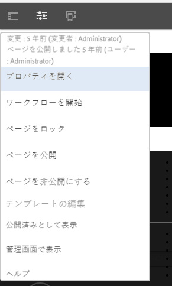
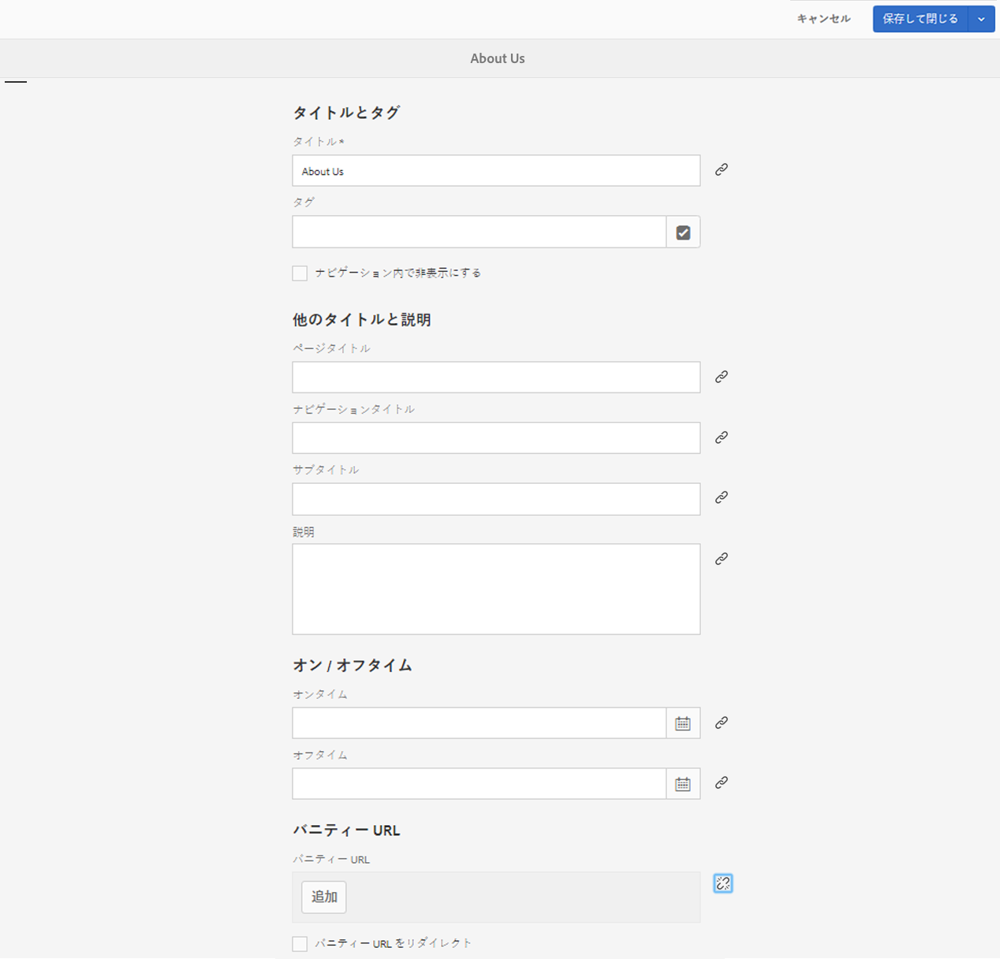
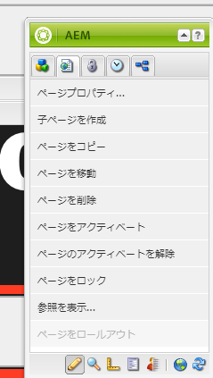
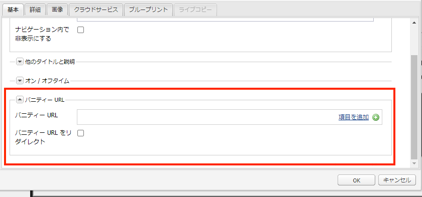

# Dispatcher バニティー URL

[目次](./overview.md)

[&lt;- 前：Dispatcher のフラッシュ](./disp-flushing.md)

## 概要

このドキュメントでは、AEM でバニティ URL を扱う方法と、書き換えルールを使用してコンテンツを配信のエッジに近づける方法について説明します

## バニティ URL とは

意味のあるフォルダー構造に存在するコンテンツがある場合、必ずしも参照しやすい URL に存在するとは限りません。バニティ URL はショートカットのようなもので、実際のコンテンツが存在する場所を参照する短い、または一意の URL です。

例：`/content/we-retail/us/en/about-us.html` をポイントする `/aboutus`

AEM オーサーには、AEM 内のコンテンツの 1 つにバニティ URL プロパティを設定して公開するオプションが用意されています。

この機能を使用するには、バニティを許可するように Dispatcher フィルターを調整する必要があります。作成者がこれらのバニティページエントリの設定に必要となる割合で Dispatcher 設定ファイルを調整する際には、これによって無理が生じます。

このため、Dispatcher モジュールには、コンテンツツリーにバニティとしてリストされるすべての項目を自動許可する機能があります。


## 仕組み

### バニティ URL の作成

作成者が AEM のページにアクセスしてページのプロパティをクリックし、「_バニティ URL_」セクションにエントリを追加します。変更を保存してページをアクティベートすると、バニティがページに割り当てられます。

また、作成者は、_バニティ URL エントリ_&#x200B;を追加する際に「_バニティ URL をリダイレクト_」チェックボックスを選択することもできます。これにより、バニティ URL が 302 リダイレクトとして動作します。つまり、ブラウザーが（`Location` 応答ヘッダー経由で）新しい URL に移動するように指示され、ブラウザーが新しい URL に対して新しいリクエストを行います。

#### タッチ UI：





#### クラシックコンテンツファインダー：






>[!NOTE]
>
>これにより、名前空間の問題が発生する傾向があることを理解してください。バニティエントリはすべてのページに対してグローバルです。これは、回避策について計画する必要がある欠点の 1 つですが、これについては後で説明します。


## リソースの解決とマッピング

各バニティエントリは、内部リダイレクトの Sling マップエントリです。

マップは、AEM インスタンスの Felix コンソール（`/system/console/jcrresolver`）に表示されます。

バニティエントリによって作成されたマップエントリのスクリーンショットを次に示します。


上記の例では、AEM インスタンスに `/aboutus` へのアクセスを指示すると、`/content/we-retail/us/en/about-us.html` に解決されます。

## Dispatcher の自動許可フィルター

安全な状態の Dispatcher は、JCR ツリーのルートであることが理由で、Dispatcher 経由でパス `/` での要求を除外します。

パブリッシャーが、`/system` などのパスではなく、`/content` およびその他の安全なパスなどからのコンテンツを許可していることを確認するのが重要です。

以下は、`/` のベースフォルダーに格納されているバニティ URL です。安全を確保しながらパブリッシャーにどう到達できるでしょうか。

シンプルな Dispatcher には自動フィルターの許可メカニズムが備わっており、AEM パッケージをインストールしてから、そのパッケージページを指すように Dispatcher を設定する必要があります。

[https://experience.adobe.com/#/downloads/content/software-distribution/en/aem.html?package=/content/software-distribution/en/details.html/content/dam/aem/public/adobe/packages/granite/vanityurls-components](https://experience.adobe.com/#/downloads/content/software-distribution/en/aem.html?package=/content/software-distribution/en/details.html/content/dam/aem/public/adobe/packages/granite/vanityurls-components)

Dispatcher には、そのファームファイルに設定セクションがあります。

```
/vanity_urls { 
    /url    "/libs/granite/dispatcher/content/vanityUrls.html" 
    /file   "/tmp/vanity_urls" 
    /delay  300 
}
```

秒単位の `/delay` パラメーターは、一定の間隔単位ではなく条件ベースのチェックで動作します。Dispatcher はリストにない URL のリクエストを受信すると、`/file`（認識されたバニティー URL のリストを格納）の変更タイムスタンプを評価します。現時点と `/file` の最終変更日との間の時間差が `/delay` 期間より小さい場合、`/file` は更新されません。`/file` の更新は、次の 2 つの条件下で発生します。

1. 受信リクエストは、キャッシュされていない、または `/file` にリストされていない URL に対するものです。
1. `/file` が最後に更新されてから少なくとも `/delay` 秒が経過しました。

このメカニズムは、サービス拒否（DoS）攻撃から保護するように設計されています。DoS 攻撃では、バニティー URL 機能を悪用して、Dispatcher をリクエストで圧倒する可能性があります。

簡単に言うと、バニティー URL を含む `/file` は、`/file` にまだ存在しない URL に対するリクエストが到着した場合と、`/file` の最後の変更が `/delay` 期間よりも前に行われた場合にのみ更新されます。

`/file` の更新を明示的にトリガーするには、前回の更新から必要な `/delay` 時間が経過したことを確認した後で、存在しない URL をリクエストできます。この目的の URL の例を以下に示します。

- `https://dispatcher-host-name.com/this-vanity-url-does-not-exist`
- `https://dispatcher-host-name.com/please-hand-me-that-planet-maestro`
- `https://dispatcher-host-name.com/random-vanity-url`

このアプローチでは、前回の変更から指定された `/delay` 間隔が経過した場合に、Dispatcher に `/file` の更新を強制します。

応答のキャッシュを `/file` 引数（この例では `/tmp/vanity_urls`）に保存します。

そのため、URI で AEM インスタンスにアクセスすると、取得内容が表示されます。


文字通り、非常にシンプルなリストです

## バニティルールとしてのルールの書き換え

上述のように、AEM に組み込まれているデフォルトのメカニズムの代わりに、書き換えルールを使用することが挙げられるのはなぜでしょうか。

名前空間の問題、パフォーマンス、より適切に処理できる高レベルのロジックについて簡単に説明されています。

これを実行するために Apache の `mod_rewrite` モジュールを使用して、`/aboutus` バニティエントリからコンテンツ `/content/we-retail/us/en/about-us.html` の例を見てみましょう。

```
RewriteRule ^/aboutus /content/we-retail/us/en/about-us.html [PT,L,NC]
```

このルールはバニティ `/aboutus` を探し、PT（Pass Through）フラグを使用してレンダラーからフルパスを取得します。

また、他のすべてのルール L（Last）フラグの処理が停止します。つまり、JCR Resolving などの大量のルールリストをトラバースする必要がなくなります。

リクエストをプロキシする必要なく、AEM パブリッシャーがこのメソッドのこれらの 2 つの要素に応答するのを待つことで、パフォーマンスが大幅に向上します。

さらに良いのは、NC フラグ（大文字と小文字を区別しない）です。つまり、顧客が `/aboutus` の代わりに `/AboutUs` で URL を入力しても、引き続き機能します。

これを実行するために書き換えルールを作成するには、Dispatcher に設定ファイル（例： `/etc/httpd/conf.d/rewrites/examplevanity_rewrite.rules`）を作成し、これらのバニティ URL を適用する必要があるドメインを処理する `.vhost` ファイルに含めます。

以下に、`/etc/httpd/conf.d/enabled_vhosts/we-retail.vhost` 内部の Include のコードスニペットの例を示します。

```
<VirtualHost *:80> 
 ServerName weretail.com 
 ServerAlias www.weretail.com 
        ........ SNIP ........ 
 <IfModule mod_rewrite.c> 
  ReWriteEngine on 
  LogLevel warn rewrite:info 
  Include /etc/httpd/conf.d/rewrites/examplevanity_rewrite.rules 
 </IfModule> 
        ........ SNIP ........ 
</VirtualHost>
```

## メソッドと場所

バニティエントリの制御に AEM を使用すると、次のメリットがあります

- 作成者はその場で作成できる
- コンテンツと共に存在し、コンテンツと共にパッケージ化できる

バニティエントリの制御に `mod_rewrite` を使用すると、次のメリットがあります

- コンテンツの解決を迅速に行う
- エンドユーザーコンテンツリクエストのエッジに近い
- 他の条件でのコンテンツのマッピング方法を制御するための拡張性とオプションの増加
- 大文字と小文字を区別しない場合がある

両方の方法を使用しますが、どちらをいつ使用するかについてのアドバイスと条件は以下のとおりです。

- バニティが一時的なもので、予定されているトラフィックレベルが低い場合は、AEM の組み込み機能を使用します
- バニティが頻繁に変更されず、頻繁に使用されるステープルエンドポイントの場合は、 `mod_rewrite` ルールを使用します。
- バニティ名前空間（例：`/aboutus`）を同じ AEM インスタンス上の多数のブランドで再利用する必要がある場合は、書き換えルールを使用します。

>[!NOTE]
>
>AEM バニティ機能を使用して名前空間を避ける場合は、命名規則を作成できます。`/brand1/aboutus`, `brand2/aboutus`, `brand3/aboutus` のようにネストされたバニティ URL の使用 

[次へ -> 一般的なログ](./common-logs.md)
