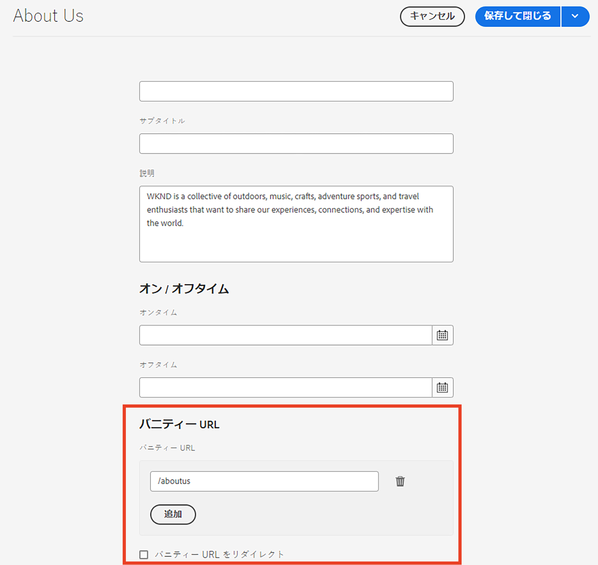

# Dispatcher バニティー URL

[目次](./overview.md)

[&lt; — 前：Dispatcher のフラッシュ](./disp-flushing.md)

## 概要

このドキュメントでは、AEMでバニティー URL を扱う方法や、書き換えルールを使用してコンテンツを配信の端に近づける方法を説明します

## バニティー URL とは

意味のあるフォルダー構造に存在するコンテンツがある場合、必ずしも参照しやすい URL に存在するとは限りません。  バニティー URL はショートカットのようなものです。  実際のコンテンツが存在する場所を参照する短い、または一意の URL。

例： `/aboutus` ～を指さす `/content/we-retail/us/en/about-us.html`

AEM 作成者には、AEM内のコンテンツの一部にバニティ URL プロパティを設定して公開するオプションがあります。

この機能を使用するには、バニティを許可するように Dispatcher フィルターを調整する必要があります。  これは、作成者がこれらのバニティーページエントリを設定する必要がある割合で Dispatcher 設定ファイルを調整する場合に不合理になります。

このため、Dispatcher モジュールには、コンテンツツリーにバニティとしてリストされるすべての項目を自動許可する機能があります。


## 仕組み

### バニティー URL のオーサリング

作成者がAEMのページを訪問し、ページのプロパティを訪問して、「バニティ URL」セクションにのエントリを追加します。

ユーザーが変更を保存し、ページをアクティベートすると、バニティーがこのページに割り当てられます。

#### タッチ UI:




#### クラシックコンテンツファインダー：


<div style="color: #000;border-left: 6px solid #2196F3;background-color:#ddffff;"><b>注意：</b>
名前空間の問題が発生しやすいことを理解してください。

バニティエントリはすべてのページに対してグローバルです。これは、後で説明する回避策について計画する必要がある短いコメントの 1 つに過ぎません。
</div>

## リソースの解決/マッピング

各バニティエントリは、内部リダイレクトの Sling マップエントリです。

これらのマップは、AEMインスタンスの Felix コンソール ( `/system/console/jcrresolver` )

バニティエントリによって作成されたマップエントリのスクリーンショットを次に示します。


上記の例では、AEMインスタンスに `/aboutus` それは解決する `/content/we-retail/us/en/about-us.html`

## Dispatcher の自動許可フィルター

安全な状態の Dispatcher は、パスでの要求を除外します `/` Dispatcher 経由で送信する必要があるのは、JCR ツリーのルートだからです。

パブリッシャーが、 `/content` その他の安全な道等  次のようなパスではありません。 `/system` など

以下は、の基本フォルダーに格納されている、これがバニティ URL です。 `/` では、安全を維持しながら、どのようにして出版社にリーチできるのでしょうか。

シンプルな Dispatcher には自動フィルターの許可メカニズムがあり、AEMパッケージをインストールしてから、そのパッケージページを指すように Dispatcher を設定する必要があります。

[https://experience.adobe.com/#/downloads/content/software-distribution/en/aem.html?package=/content/software-distribution/en/details.html/content/dam/aem/public/adobe/packages/granite/vanityurls-components](https://experience.adobe.com/#/downloads/content/software-distribution/en/aem.html?package=/content/software-distribution/en/details.html/content/dam/aem/public/adobe/packages/granite/vanityurls-components)

Dispatcher には、そのファームファイルに設定セクションがあります。

```
/vanity_urls { 
    /url    "/libs/granite/dispatcher/content/vanityUrls.html" 
    /file   "/tmp/vanity_urls" 
    /delay  300 
}
```

この設定は、300 秒ごとにフロントするAEMインスタンスからこの URL を取得し、許可する項目のリストを取得するよう Dispatcher に指示します。

応答のキャッシュを `/file` この例の引数 `/tmp/vanity_urls`

そのため、URI でAEMインスタンスにアクセスすると、そのインスタンスが取得する内容が表示されます。


文字通り、非常にシンプルなリストです

## ルールをバニティルールとして書き換える

上述のように、AEMに組み込まれているデフォルトのメカニズムの代わりに、書き換えルールを使用することが挙げられるのはなぜですか。

簡単に、名前空間の問題、パフォーマンス、より適切に処理できる高レベルのロジックについて説明します。

バニティエントリの例を見てみましょう `/aboutus` 内容は `/content/we-retail/us/en/about-us.html` Apache の `mod_rewrite` モジュールを使用して、これを実行します。

```
RewriteRule ^/aboutus /content/we-retail/us/en/about-us.html [PT,L,NC]
```

この規則は虚栄心を探す `/aboutus` PT フラグ (Pass Through) を使用してレンダラーからフルパスを取得します。

また、他のすべてのルール L フラグ (Last) の処理が停止します。つまり、JCR Resolving などの大量のルールリストをトラバースする必要がなくなります。

リクエストをプロキシせずに、AEMパブリッシャーがこのメソッドのこれらの 2 つの要素に応答するのを待つことで、パフォーマンスが大幅に向上します。

次に、ここでのケーキのアイシングは NC フラグ（大文字と小文字を区別しない）です。これは、顧客が `/AboutUs` の代わりに `/aboutus` 引き続き機能し、適切なページを取得できます。

書き換えルールを作成するには、Dispatcher に設定ファイルを作成します ( 例： `/etc/httpd/conf.d/rewrites/examplevanity_rewrite.rules`) をクリックし、 `.vhost` これらのバニティー url を適用する必要があるドメインを処理するファイル。

以下に、内部のインクルードのコードスニペットの例を示します。 `/etc/httpd/conf.d/enabled_vhosts/we-retail.vhost`

```
<VirtualHost *:80> 
 ServerName weretail.com 
 ServerAlias www.weretail.com 
        ........ SNIP ........ 
 <IfModule mod_rewrite.c> 
  ReWriteEngine on 
  LogLevel warn rewrite:info 
  Include /etc/httpd/conf.d/rewrites/examplevanity_rewrite.rules 
 </IfModule> 
        ........ SNIP ........ 
</VirtualHost>
```

## メソッドと場所

バニティエントリの制御にAEMを使用すると、次の利点があります
- 作成者はその場で作成できます
- コンテンツと共に存在し、コンテンツと共にパッケージ化できます

使用 `mod_rewrite` バニティーエントリを制御するには、次の利点があります
- コンテンツの解決を迅速に行う
- エンドユーザーコンテンツリクエストのエッジに近い
- 他の条件でのコンテンツのマッピング方法を制御するための拡張機能とオプションの追加
- 大文字と小文字を区別しない可能性があります

両方の方法を使用しますが、次の場合にどの方法を使用するかに関するアドバイスと条件を示します。
- バニティが一時的で、予定されているトラフィックレベルが低い場合は、組み込み機能AEMを使用します
- バニティーが頻繁に変更されず、頻繁に使用されるステープルエンドポイントの場合は、 `mod_rewrite` ルール。
- バニティー名前空間の場合 ( 例： `/aboutus`) は、同じAEMインスタンス上の多数のブランドで再利用し、書き換えルールを使用する必要があります。

<div style="color: #000;border-left: 6px solid #2196F3;background-color:#ddffff;"><b>注意：</b>

AEMバニティ機能を使用し、名前空間を避けたい場合は、命名規則を作成できます。  次のようにネストされたバニティー URL の使用 `/brand1/aboutus`, `brand2/aboutus`, `brand3/aboutus`.
</div>

[次へ —> 共通ログ](./common-logs.md)