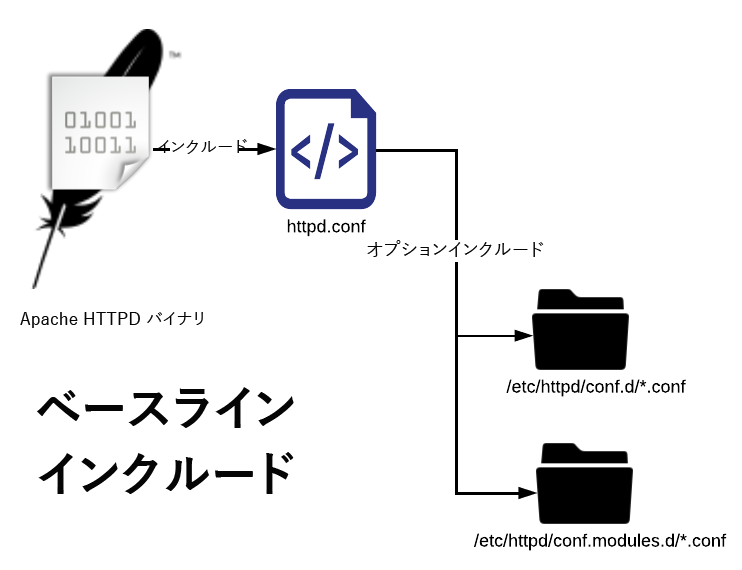

# 設定ファイルの説明

[目次](./overview.md)

[&lt;- 前：基本ファイルレイアウト](./basic-file-layout.md)

このドキュメントでは、Adobe Managed Services でプロビジョニングされた標準ビルドの Dispatcher サーバーにデプロイされた設定ファイルをそれぞれ分類して、使用方法、命名規則などを説明します。

## 命名規則

Apache web サーバーは、`Include` または `IncludeOptional` ステートメントを使用してターゲティングを行っている場合、ファイルの拡張子が何であるかは気にしません。競合や混乱を排除するように適切に命名すると、<b>非常に</b>助けになります。使用される名前は、ファイルが適用される範囲を示すので、作業が容易になります。 すべてに `.conf` という名前を付けると、非常に混乱します。アドビでは、不適切な名前のファイルと拡張子は避けたいと考えています。一般的な AMS 設定済みの Dispatcher で使用される様々なカスタムファイル拡張子と命名規則のリストを以下に示します。

## conf.d / に含まれるファイル

| ファイル | ファイルの保存先 | 説明 |
| ---- | ---------------- | ----------- |
| ファイル名`.conf` | `/etc/httpd/conf.d/` | デフォルトの Enterprise Linux インストールでは、このファイル拡張子とインクルードフォルダーを、httpd.conf で宣言された設定を上書きする場所として使用し、Apache のグローバルレベルで追加機能を追加できるようにします。 |
| ファイル名`.vhost` | ステージング：`/etc/httpd/conf.d/available_vhosts/`<br>アクティブ：`/etc/httpd/conf.d/enabled_vhosts/`<br/><br/><b>メモ：</b>.vhost ファイルは enabled_vhosts フォルダーにはコピーされませんが、available_vhosts/\*.vhost ファイルの相対パスへのシンボリックリンクを使用します</u><br><br> | \*.vhost（仮想ホスト）ファイルは、ホスト名に一致する `<VirtualHosts>` エントリであり、Apache が各ドメイントラフィックを異なるルールで処理できるようにします。`.vhost` ファイルから、`rewrites`、`whitelisting`、`etc` などの他のファイルが含まれます。 |
| ファイル名`_rewrite.rules` | `/etc/httpd/conf.d/rewrites/` | `*_rewrite.rules` ファイルには `mod_rewrite` ルール（`vhost` ファイルによって明示的に含まれて使用される）が格納されます |
| ファイル名`_whitelist.rules` | `/etc/httpd/conf.d/whitelists/` | `*_ipwhitelist.rules` ファイルは `*.vhost` ファイル内から取り込まれます。IP の正規表現または IP の許可リストへの登録を許可する拒否ルールが含まれます。 IP アドレスに基づいて仮想ホストの表示を制限しようとする場合は、これらのファイルの 1 つを生成し、それを `*.vhost` ファイルからインクルードします。 |

## conf.modules.d/ に含まれるファイル

| ファイル | ファイルの保存先 | 説明 |
| --- | --- | --- |
| ファイル名`.any` | `/etc/httpd/conf.dispatcher.d/` | AEM Dispatcher Apache モジュールは、その設定を `*.any` ファイルから取得します。デフォルトの親インクルードファイルは `conf.dispatcher.d/dispatcher.any` です。 |
| ファイル名`_farm.any` | ステージング：`/etc/httpd/conf.dispatcher.d/available_farms/`<br>アクティブ：`/etc/httpd/conf.dispatcher.d/enabled_farms/`<br><br><b>メモ：</b>これらのファームファイルは、`enabled_farms` フォルダーにはコピーされませんが、`available_farms/*_farm.any` ファイルの相対パスへの `symlinks` を使用します。<br/>`*_farm.any` ファイルは、`conf.dispatcher.d/dispatcher.any` ファイル内に含まれます。これらの親 farm ファイルは、レンダリングまたは web サイトタイプごとにモジュールの動作を制御するために存在します。 ファイルは `available_farms` ディレクトリに作成され、`enabled_farms` ディレクトリへの `symlink` によって有効にされます。<br/>`dispatcher.any` ファイルから名前でそれらを自動的に含めます。<br/><b>ベースライン</b> farm ファイルは、最初に読み込まれるようにするために `000_` から始まります。<br><b>カスタム</b> farm ファイルは、適切なインクルード動作を保証するために `100_` で番号スキームを開始してから必要があります。 |
| ファイル名`_filters.any` | `/etc/httpd/conf.dispatcher.d/filters/` | `*_filters.any` ファイルは `conf.dispatcher.d/enabled_farms/*_farm.any` ファイル内から取り込まれます。各 farm には、どのトラフィックをフィルターで除外し、レンダラーに送信しないかを変更する一連のルールがあります。 |
| ファイル名`_vhosts.any` | `/etc/httpd/conf.dispatcher.d/vhosts/` | `*_vhosts.any` ファイルは `conf.dispatcher.d/enabled_farms/*_farm.any` ファイル内からインクルードされます。これらのファイルは、BLOB マッチングによって照合されて、そのリクエストを処理するためのレンダラーを決定するホスト名または URI パスのリストです。 |
| FILENAME`_cache.any` | `/etc/httpd/conf.dispatcher.d/cache/` | `*_cache.any` ファイルは、`conf.dispatcher.d/enabled_farms/*_farm.any` ファイル内からインクルードされます。これらのファイルは、キャッシュされる項目とキャッシュされない項目を指定します。 |
| FILENAME`_invalidate_allowed.any` | `/etc/httpd/conf.dispatcher.d/cache/` | `*_invalidate_allowed.any` ファイルは `conf.dispatcher.d/enabled_farms/*_farm.any` ファイル内でインクルードされます。フラッシュリクエストと無効化リクエストの送信を許可する IP アドレスを指定します。 |
| FILENAME`_clientheaders.any` | `/etc/httpd/conf.dispatcher.d/clientheaders/` | `*_clientheaders.any` ファイルは `conf.dispatcher.d/enabled_farms/*_farm.any` ファイル内でインクルードされます。各レンダラーに渡すクライアントヘッダーを指定します。 |
| FILENAME`_renders.any` | `/etc/httpd/conf.dispatcher.d/renders/` | `*_renders.any` ファイルは `conf.dispatcher.d/enabled_farms/*_farm.any` ファイル内でインクルードされます。各レンダラーの IP、ポートおよびタイムアウト設定を指定します。適切なレンダラーは、LiveCycle サーバーか、Dispatcher で取得／プロキシ化できるリクエストを送信する任意の AEM システムです。 |

## 問題の回避

命名規則に従うと、最悪の結果をもたらす可能性のある犯しがちなミスを避けることができます。例をいくつか取り上げます。

### 問題の例

ExampleCo のサイト例として、Dispatcher 設定の開発者が 2 つの設定ファイルを作成しました。

<b>/etc/httpd/conf.d/exampleco.conf</b>

```
<VirtualHost *:80> 
    ServerName  "exampleco" 
    ServerAlias "www.exampleco.com" 
    .......... SNIP ............... 
    <IfModule mod_rewrite.c> 
        ReWriteEngine   on 
        LogLevel warn rewrite:trace1 
        Include /etc/httpd/conf.d/rewrites/exampleco.conf 
    </IfModule> 
</VirtualHost>
```

<b>/etc/httpd/conf.d/rewrites/exampleco.conf</b>

```
RewriteRule ^/$ /content/exampleco/en.html [PT,L] 
RewriteRule ^/robots.txt$ /content/dam/exampleco/robots.txt [PT,L]
```

#### `POTENTIAL DANGER - The file names are the same`

`vhost` ファイルが誤って `rewrites` フォルダーに格納され、`rewrites file` が `vhosts` フォルダーに格納された場合、ファイル名で判断して適切にデプロイされるように思われますが、Apache は *エラー*&#x200B;をスローし、問題はすぐには明らかになりません。

<b>これが通常どう問題になるか</b>

`two files` が `same` の場所にダウンロードされた場合、それらは `overwrite themselves` か見分けがつかなくなり、デプロイメントプロセスが悪夢のような状況になります。

<b>ファイル拡張子が同じで自動インクルードが発生しやすい</b>

ファイル拡張子が同じで、Apache が多くのデフォルトフォルダー内のすべての `.conf` ファイルを `auto include` する自動インクルード拡張子を使用しています。

<b>これが通常どう問題になるか</b>

拡張子が `.conf` の vhost ファイルが `/etc/httpd/conf.d/` フォルダーに格納されている場合、Apache はこれをメモリに読み込もうとします。通常はこれで問題ありませんが、拡張子が `.conf` の書き換えルールファイルが `/etc/httpd/conf.d/` フォルダーに格納されると、それが自動的にインクルードされてグローバルに適用されるので、混乱を招き、望ましくない結果が生じます。

## 解決策

実行する内容に応じて、自動インクルードルールの名前空間に属さない安全な名前をファイルに付けます。

仮想ホストファイルの場合は、`.vhost` を拡張子として使用します。

書き換えルールファイルの場合は、site`_rewrite.rules` を接尾辞および拡張子として使用します。この命名規則により、ファイルがどのサイトを対象にしているかや、一連の書き換えルールであることが明確になります。

IP 許可リストルールファイルの場合は、description`_whitelist.rules` を接尾辞および拡張子として使用します。この命名規則により、その目的と、それが一連の IP マッチングルールであることがわかります。

これらの命名規則を使用すると、属していない自動インクルードディレクトリにファイルが移動された場合に、問題を回避できます。

たとえば、`.rules`、`.any` または `.vhost` という名前のファイルを `/etc/httpd/conf.d/` という自動インクルードフォルダーに格納しても、影響はありません。

デプロイメント変更リクエストで「exampleco_rewrite.rules を実稼動環境の Dispatcher にデプロイしてください」と表示された場合、変更をデプロイしているユーザーは、新しいサイトを追加しているのではなく、ファイル名で示されているように書き換えルールを更新しているだけであることが既にわかっている可能性があります。

### インクルード順序

Enterprise Linux にインストールされた Apache Web Server の機能と設定を拡張する場合は、いくつかの重要なインクルード順序を理解しておく必要があります。

### Apache ベースラインインクルード



上記の図でわかるように、httpd バイナリは httpd.conf ファイルにのみ注目します。それが設定ファイルだからです。そのファイルには次のステートメントが含まれています。

```
Include conf.modules.d/*.conf 
IncludeOptional conf.d/*.conf
```

### AMS トップレベルインクルード

標準を適用する際に、追加のファイルタイプと独自のインクルードをいくつか追加しました。

以下に示すのは、AMS ベースラインディレクトリとトップレベルインクルードです。
 に存在する実際の設定ファイルへのシンボリックリンクです。

Apache のベースラインに基づいて、追加フォルダーと `conf.d` フォルダーのトップレベルインクルードのほか、`/etc/httpd/conf.dispatcher.d/` 下にネストされたモジュール固有のディレクトリが AMS でどう作成されたかを示します。

Apache が読み込まれると、`/etc/httpd/conf.modules.d/02-dispatcher.conf` が取り込まれ、そのファイルにはバイナリファイル `/etc/httpd/modules/mod_dispatcher.so` が含まれて実行状態になります。

```
LoadModule dispatcher_module modules /mod_dispatcher .so
```

`<VirtualHost />` でモジュールを使用するには、`dispatcher_vhost.conf` という名前の設定ファイルを `/etc/httpd/conf.d/` にドロップします。このファイル内で、モジュールが機能するために必要な基本的なパラメーターを使用してセットアップすることがわかります。

```
<IfModule disp_apache2.c> 
    DispatcherConfig conf.dispatcher.d/dispatcher.any 
    ...SNIP... 
</IfModule>
```

上記のように、これには Dispatcher モジュールが `/etc/httpd/conf.dispatcher.d/dispatcher.any` から設定ファイルを取得するためのトップレベルの `dispatcher.any` ファイルが含まれます。

このファイルの内容に注意を払ってください。

```
/farms { 
    $include "enabled_farms/*_farm.any" 
}
```

トップレベルの `dispatcher.any` ファイルには、`/etc/httpd/conf.dispatcher.d/enabled_farms/` に存在するすべての有効なファームファイルが含まれています。ファイル名は `FILENAME_farm.any` であり、標準の命名規則に従っています。

前述の `dispatcher_vhost.conf` ファイルの後半では、`/etc/httpd/conf.d/enabled_vhosts/` にある有効なバーチャルホストファイルを、標準の命名規則に従って `FILENAME.vhost` というファイル名で有効にするためのインクルード文も記述しています。

```
IncludeOptional /etc/httpd/conf.d/enabled_vhosts/*.vhost
```

それぞれの .vhost ファイルでは、Dispatcher モジュールがディレクトリのデフォルトのファイルハンドラーとして初期化されることに注意してください。構文を示す.vhost ファイルの例を次に示します。

```
<VirtualHost *:80> 
 ServerName "weretail" 
 ServerAlias www.weretail.com weretail.com 
 <Directory /> 
  <IfModule disp_apache2.c> 
   ....SNIP.... 
   SetHandler dispatcher-handler 
  </IfModule> 
  ....SNIP.... 
 </Directory> 
 ....SNIP.... 
</VirtualHost>
```

トップレベルのインクルードの解決後に、言及価値のある他のサブインクルードがあります。ファームファイルおよび vhost ファイルに他のサブ要素が含まれる仕組みの概要図を次に示します。

### AMS 仮想ホストのインクルード


`/etc/httpd/conf.d/availabled_vhosts/` ディレクトリの `.vhost` ファイルが `/etc/httpd/conf.d/enabled_vhosts/` ディレクトリにシンボリックリンクされた場合、実行中の設定に使用されます。

この `.vhost` ファイルには、見つかった共通部分に基づくサブインクルードが含まれています。変数、許可リスト、書き換えルールなどがあります。

`.vhost` ファイルには、`.vhost` ファイルのどこにインクルードする必要があるかに基づいて、各ファイルのインクルード文を記述します。参考までに `.vhost` ファイルの構文例を示します。

```
Include /etc/httpd/conf.d/variables/weretail.vars 
<VirtualHost *:80> 
 ServerName "${MAIN_DOMAIN}" 
 <Directory /> 
  Include /etc/httpd/conf.d/whitelists/weretail*_whitelist.rules 
  <IfModule disp_apache2.c> 
   ....SNIP.... 
   SetHandler dispatcher-handler 
  </IfModule> 
  ....SNIP.... 
 </Directory> 
 ....SNIP.... 
 <IfModule mod_rewrite.c> 
  ReWriteEngine   on 
  LogLevel warn rewrite:trace1 
  Include /etc/httpd/conf.d/rewrites/weretail_rewrite.rules 
 </IfModule> 
</VirtualHost>
```

上記の例に示すように、この設定ファイルで必要な変数には、後で使用するインクルードがあります。

ファイル `/etc/httpd/conf.d/variables/weretail.vars` の内部では、どのような変数が定義されているか確認できます。

```
Define MAIN_DOMAIN dev.weretail.com
```

また、様々な許可リストの基準に基づいて、このコンテンツを閲覧できる人を制限する `_whitelist.rules` ファイルのリストを含む行も表示されます。許可リストファイル `/etc/httpd/conf.d/whitelists/weretail_mainoffice_whitelist.rules` の中身を見てみましょう。

```
<RequireAny> 
  Require ip 192.150.16.0/23 
</RequireAny>
```

また、一連の書き換えルールを含む行も確認できます。次に、`weretail_rewrite.rules` ファイルを見てみましょう。

```
RewriteRule ^/robots.txt$ /content/dam/weretail/robots.txt [NC,PT] 
RewriteCond %{SERVER_NAME} brand1.weretail.net [NC] 
RewriteRule ^/favicon.ico$ /content/dam/weretail/favicon.ico [NC,PT] 
RewriteCond %{SERVER_NAME} brand2.weretail.com [NC] 
RewriteRule ^/sitemap.xml$ /content/weretail/general/sitemap.xml [NC,PT] 
RewriteRule ^/logo.jpg$ /content/dam/weretail/general/logo.jpg [NC,PT]
```

### AMS ファームのインクルード


`/etc/httpd/conf.dispatcher.d/available_farms/` ディレクトリにある FILENAME_farm.any ファイルが `/etc/httpd/conf.dispatcher.d/enabled_farms/` ディレクトリにシンボリックリンクされると、そのファイルが実行中の設定で使用されます。

ファームファイルには、キャッシュ、クライアント ヘッダー、フィルター、レンダーおよび vhost など、[ファームのトップレベルセクション](https://experienceleague.adobe.com/docs/experience-manager-dispatcher/using/configuring/dispatcher-configuration.html?lang=ja#defining-farms-farms)に基づくサブインクルードがあります。

`FILENAME_farm.any` ファイルには、ファームファイル内のインクルード先に基づいて、各ファイルのインクルード文が含まれます。参考として、`FILENAME_farm.any` ファイルの構文例を示します。

```
/weretailfarm {   
 /clientheaders { 
  $include "/etc/httpd/conf.dispatcher.d/clientheaders/ams_publish_clientheaders.any" 
  $include "/etc/httpd/conf.dispatcher.d/clientheaders/ams_common_clientheaders.any" 
 } 
 /virtualhosts { 
  $include "/etc/httpd/conf.dispatcher.d/vhosts/weretail_vhosts.any" 
 } 
 /renders { 
  $include "/etc/httpd/conf.dispatcher.d/renders/ams_publish_renders.any" 
 } 
 /filter { 
  $include "/etc/httpd/conf.dispatcher.d/filters/ams_publish_filters.any" 
  $include "/etc/httpd/conf.dispatcher.d/filters/weretail_search_filters.any" 
 } 
 ....SNIP.... 
 /cache { 
  ....SNIP.... 
  /rules { 
   $include "/etc/httpd/conf.dispatcher.d/cache/ams_publish_cache.any" 
  } 
  ....SNIP.... 
  /allowedClients { 
   /0000 { 
    /glob "*.*.*.*" 
    /type "deny" 
   } 
   $include "/etc/httpd/conf.dispatcher.d/cache/ams_publish_invalidate_allowed.any" 
  } 
 ....SNIP.... 
 } 
}
```

WaRetail ファームの各セクションは、必要なすべての構文を持つ代わりに、インクルード文を使用して表示されます。

これらのインクルードのいくつかの構文を見て、各サブインクルードがどのように表示されるかを把握しましょう。

`/etc/httpd/conf.dispatcher.d/vhosts/weretail_publish_vhosts.any`：

```
"brand1.weretail.com" 
"brand2.weretail.com" 
"www.weretail.comf"
```

これは、改行で区切られたドメイン名のリストで、このファームから他のファームより上位にレンダリングする必要があります。

次に `/etc/httpd/conf.dispatcher.d/filters/weretail_search_filters.any` について見てみましょう。

```
/400 { /type "allow" /method "GET" /path "/bin/weretail/lists/*" /extension "json" } 
/401 { /type "allow" /method "POST" /path "/bin/weretail/search/' /extension "html" }
```

[次へ -> キャッシュについて](./understanding-cache.md)
