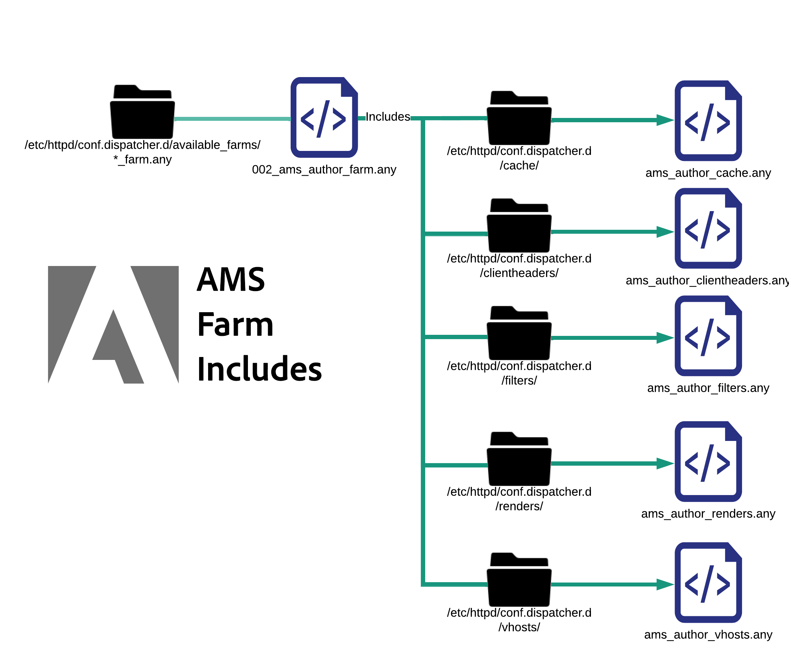

# 設定ファイルの説明

[目次](./overview.md)

[&lt; — 前：基本ファイルレイアウト](./basic-file-layout.md)

このドキュメントでは、Adobe Managed Services でプロビジョニングされた標準のビルド Dispatcher サーバーにデプロイされた各設定ファイルについて、それぞれを分類し説明します。 使用方法、命名規則など

## 命名規則

Apache Web サーバーは、実際には、 `Include` または `IncludeOptional` 文。  競合や混乱を避ける名前を付けると、 <b>トン</b>. 使用される名前は、ファイルが適用される範囲を示すので、作業が容易になります。 すべての項目に `.conf` これは本当に紛らわしくなる。 ファイル名や拡張子の名前が不十分な場合は避けたいと思います。  一般的な AMS 設定済みの Dispatcher で使用される様々なカスタムファイル拡張子と命名規則のリストを以下に示します。

## conf.d/に含まれるファイル

| ファイル | ファイルの保存先 | 説明 |
| ---- | ---------------- | ----------- |
| ファイル名`.conf` | `/etc/httpd/conf.d/` | デフォルトの Enterprise Linux インストールでは、このファイル拡張子を使用し、httpd.conf で宣言された設定を上書きし、Apache のグローバルレベルで追加機能を追加できる場所として include フォルダーを使用します。 |
| ファイル名`.vhost` | ステージ： `/etc/httpd/conf.d/available_vhosts/`<br>アクティブ： `/etc/httpd/conf.d/enabled_vhosts/`<br/><br/><div style="color: #000;border-left: 6px solid #2196F3;background-color:#ddffff;"><b>注意：</b> .vhost ファイルは enabled_vhosts フォルダにコピーされませんが、available_vhosts/\*.vhost ファイルへの相対パスへの symlinks を使用します。</div></u><br><br> | \*.vhost （仮想ホスト）ファイルは `<VirtualHosts>`  エントリを使用してホスト名を照合し、Apache が異なるルールで各ドメイントラフィックを処理できるようにします。 次の `.vhost` ファイル、その他のファイル（例： ） `rewrites`, `whitelisting`, `etc` が含まれます。 |
| ファイル名`_rewrite.rules` | `/etc/httpd/conf.d/rewrites/` | `*_rewrite.rules` ファイルストア `mod_rewrite` 明示的に含まれ、使用されるルール `vhost` ファイル |
| ファイル名`_whitelist.rules` | `/etc/httpd/conf.d/whitelists/` | `*_ipwhitelist.rules` ファイルは、 `*.vhost` ファイル。 IP の正規表現または IP のホワイトリスト登録を許可する拒否ルールが含まれます。 IP アドレスに基づいて仮想ホストの表示を制限しようとする場合は、これらのファイルの 1 つを生成し、 `*.vhost` ファイル |

## conf.dispatcher.d/に含まれるファイル

| ファイル | ファイルの保存先 | 説明 |
| --- | --- | --- |
| ファイル名`.any` | `/etc/httpd/conf.dispatcher.d/` | AEM Dispatcher Apache Module は、から設定を取得します。 `*.any` ファイル。 デフォルトの親インクルードファイルは、 `conf.dispatcher.d/dispatcher.any` |
| ファイル名`_farm.any` | ステージ： `/etc/httpd/conf.dispatcher.d/available_farms/`<br>アクティブ： `/etc/httpd/conf.dispatcher.d/enabled_farms/`<br><br><div style="color: #000;border-left: 6px solid #2196F3;background-color:#ddffff;"><b>注意：</b> これらのファームファイルは、 `enabled_farms` フォルダは使用しますが、 `symlinks` を `available_farms/*_farm.any` ファイル </div> <br/>`*_farm.any` ファイルが `conf.dispatcher.d/dispatcher.any` ファイル。 これらの親ファームファイルは、レンダリングまたは Web サイトタイプごとにモジュールの動作を制御するために存在します。 ファイルは `available_farms` ディレクトリを使用し、 `symlink` に `enabled_farms` ディレクトリ。  <br/>これにより、 `dispatcher.any` ファイル。<br/><b>ベースライン</b> ファームファイルは、 `000_` 最初に読み込まれるようにするために、<br><b>カスタム</b> ファームファイルは、次の場所で番号スキームを開始することにより、の後に読み込む必要があります： `100_` 適切なインクルード動作を保証する。 |
| ファイル名`_filters.any` | `/etc/httpd/conf.dispatcher.d/filters/` | `*_filters.any` ファイルは、 `conf.dispatcher.d/enabled_farms/*_farm.any` ファイル。 各ファームには、フィルターで除外するトラフィックを変更し、レンダラーに送らないようにする一連のルールがあります。 |
| ファイル名`_vhosts.any` | `/etc/httpd/conf.dispatcher.d/vhosts/` | `*_vhosts.any` ファイルは、 `conf.dispatcher.d/enabled_farms/*_farm.any` ファイル。 これらのファイルは、BLOB 照合によって照合されるホスト名または URI パスのリストで、その要求を処理するために使用するレンダラーを決定します |
| ファイル名`_cache.any` | `/etc/httpd/conf.dispatcher.d/cache/` | `*_cache.any` ファイルは、 `conf.dispatcher.d/enabled_farms/*_farm.any` ファイル。 これらのファイルは、キャッシュされる項目とキャッシュされない項目を指定します |
| ファイル名`_invalidate_allowed.any` | `/etc/httpd/conf.dispatcher.d/cache/` | `*_invalidate_allowed.any` ファイルが `conf.dispatcher.d/enabled_farms/*_farm.any` ファイル。 フラッシュ要求と無効化要求の送信を許可する IP アドレスを指定します。 |
| ファイル名`_clientheaders.any` | `/etc/httpd/conf.dispatcher.d/clientheaders/` | `*_clientheaders.any` ファイルが `conf.dispatcher.d/enabled_farms/*_farm.any` ファイル。 各レンダラーに渡すクライアントヘッダーを指定します。 |
| ファイル名`_renders.any` | `/etc/httpd/conf.dispatcher.d/renders/` | `*_renders.any` ファイルが `conf.dispatcher.d/enabled_farms/*_farm.any` ファイル。 各レンダラーの IP、ポート、タイムアウトの設定を指定します。 適切なレンダラーは、Dispatcher が要求を取得/プロキシできる LiveCycle サーバーまたはAEMシステムです。 |

## 回避された問題

命名規則に従うと、破局的な結果を招く可能性のあるミスを簡単に行うことができます。  いくつかの例を取り上げます。

### 問題の例

ExampleCo のサイト例として、Dispatcher 設定の開発者が 2 つの設定ファイルを作成しました。

<b>/etc/httpd/conf.d/exampleco.conf</b>

```
<VirtualHost *:80> 
    ServerName  "exampleco" 
    ServerAlias "www.exampleco.com" 
    .......... SNIP ............... 
    <IfModule mod_rewrite.c> 
        ReWriteEngine   on 
        LogLevel warn rewrite:trace1 
        Include /etc/httpd/conf.d/rewrites/exampleco.conf 
    </IfModule> 
</VirtualHost>
```

<b>/etc/httpd/conf.d/rewrites/exampleco.conf</b>

```
RewriteRule ^/$ /content/exampleco/en.html [PT,L] 
RewriteRule ^/robots.txt$ /content/dam/exampleco/robots.txt [PT,L]
```

#### `POTENTIAL DANGER - The file names are the same`

この `vhost` ファイルが誤って `rewrites` フォルダーと `rewrites file` が `vhosts` フォルダー。  ファイル名で適切にデプロイされているように見えますが、Apache は *エラー* そして問題はすぐには明らかにならない。

<b>これが通常どのように問題になるか</b>

この `two files` が `same` 場所： `overwrite themselves` また、デプロイメントプロセスを悪夢の中にすることで、区別がつかなくなるようにすることもできます。

<b>ファイル拡張子は同じで、自動インクルードが発生しやすくなります</b>

ファイル拡張子は同じで、Apache が予め提供する自動インクルードの拡張子を使用します `auto include` 任意 `.conf` ファイルの多くはデフォルトのフォルダーです。

<b>これが通常どのように問題になるか</b>

の拡張子を持つ vhost ファイルが `.conf` が `/etc/httpd/conf.d/` フォルダーは、通常は問題なく、Apache 上のメモリに読み込もうとしますが、書き換えルールファイルの拡張子が `.conf` は、 `/etc/httpd/conf.d/` フォルダーに自動インクルードされ、グローバルに適用され、混乱を招く、望ましくない結果が生じます。

## 解決方法

実行内容に基づいてファイルに名前を付け、自動インクルードルールの名前空間から安全にファイルに名前を付けます。

仮想ホストファイルの場合は、 `.vhost` を拡張として使用します。

書き換えルールファイルの場合は、site と名前を付けます。`_rewrite.rules` をサフィックスと拡張子として使用します。 この命名規則により、どのサイトに適用され、書き換えルールのセットであるかが明確になります。

IP ホワイトリストルールファイルの場合は、説明を入力します。`_whitelist.rules` をサフィックスと拡張子として使用します。 この命名規則では、何のためのもの、および一連の IP 一致ルールであることについて説明します。

これらの命名規則を使用すると、ファイルが属さない自動インクルードディレクトリに移動された場合に、問題を回避できます。

例えば、という名前のファイルを `.rules`, `.any`または `.vhost` 自動インクルードフォルダー内 `/etc/httpd/conf.d/` 何の影響も与えなかった

デプロイメントの変更リクエストに「exampleco_rewrite.rules を実稼動 Dispatchers にデプロイしてください」と表示された場合、変更をデプロイするユーザーは、既に新しいサイトが追加されていないことを知っている場合、ファイル名で示された書き換えルールを更新しています。

### 注文を含める

Enterprise Linux にインストールされた Apache Web サーバーで機能と設定を拡張する場合、理解したい注文を含む重要な作業がいくつかあります

### Apache ベースラインに含まれる


上の図で示すように、httpd バイナリは、設定ファイルと同じように httpd.conf ファイルのみを参照します。  そのファイルには次の文が含まれています。

```
Include conf.modules.d/*.conf 
IncludeOptional conf.d/*.conf
```

### AMS トップレベルインクルード

標準を適用した際に、独自のファイルタイプとをいくつか追加しました。

AMS ベースラインディレクトリとトップレベルインクルードは次のとおりです


Apache のベースラインを構築する際には、AMS が用に追加のフォルダーとトップレベルのインクルードを作成する方法を示します。 `conf.d` フォルダと、の下にネストされたモジュール固有のディレクトリ `/etc/httpd/conf.dispatcher.d/`

Apache が読み込むと、 `/etc/httpd/conf.modules.d/02-dispatcher.conf` と指定し、そのファイルにバイナリファイルが含まれます `/etc/httpd/modules/mod_dispatcher.so` 実行状態に移行します。

```
LoadModule dispatcher_module modules /mod_dispatcher .so
```

モジュールを `<VirtualHost />` 次の場所に設定ファイルをドロップします。 `/etc/httpd/conf.d/` 名前付き `dispatcher_vhost.conf` このファイル内には、モジュールの動作に必要な基本パラメータを設定する方法が表示されます。

```
<IfModule disp_apache2.c> 
    DispatcherConfig conf.dispatcher.d/dispatcher.any 
    ...SNIP... 
</IfModule>
```

上記のように、これには最上位レベルが含まれます `dispatcher.any` Dispatcher モジュールが設定ファイルを取得するためのファイル `/etc/httpd/conf.dispatcher.d/dispatcher.any`

このファイルの内容に注意を払う：

```
/farms { 
    $include "enabled_farms/*_farm.any" 
}
```

最上位レベル `dispatcher.any` ファイルには、 `/etc/httpd/conf.dispatcher.d/enabled_farms/` ファイル名を `FILENAME_farm.any` 標準の命名規則に従う

後で `dispatcher_vhost.conf` 前述のファイルでは、に存在する有効な各仮想ホストファイルを有効にする include ステートメントも実行します `/etc/httpd/conf.d/enabled_vhosts/` ファイル名を `FILENAME.vhost` 標準の命名規則に従う

```
IncludeOptional /etc/httpd/conf.d/enabled_vhosts/*.vhost
```

各.vhost ファイルでは、Dispatcher モジュールがディレクトリのデフォルトのファイルハンドラーとして初期化されることに注意してください。  構文を示す.vhost ファイルの例を次に示します。

```
<VirtualHost *:80> 
 ServerName "weretail" 
 ServerAlias www.weretail.com weretail.com 
 <Directory /> 
  <IfModule disp_apache2.c> 
   ....SNIP.... 
   SetHandler dispatcher-handler 
  </IfModule> 
  ....SNIP.... 
 </Directory> 
 ....SNIP.... 
</VirtualHost>
```

最上位レベルのインクルードの解決の後に、言及する価値のある他のサブインクルードを持ちます。  ファームと vhosts ファイルに他のサブ要素が含まれる仕組みの概要図を次に示します

### AMS 仮想ホストに含まれる


いずれかの場合 `.vhost` から `/etc/httpd/conf.d/availabled_vhosts/` ディレクトリは次の場所に symlinked `/etc/httpd/conf.d/enabled_vhosts/` 実行中の設定で使用されるディレクトリ。

この `.vhost` ファイルには、見つかった共通部分に基づくサブインクルードが含まれています。  変数、ホワイトリスト、書き換えルールなどがあります。

この `.vhost` ファイルには、ファイルを含める必要がある場所に基づいて、各ファイルの include ステートメントが含まれます `.vhost` ファイル。  次に、 `.vhost` ファイルを参照してください。

```
Include /etc/httpd/conf.d/variables/weretail.vars 
<VirtualHost *:80> 
 ServerName "${MAIN_DOMAIN}" 
 <Directory /> 
  Include /etc/httpd/conf.d/whitelists/weretail*_whitelist.rules 
  <IfModule disp_apache2.c> 
   ....SNIP.... 
   SetHandler dispatcher-handler 
  </IfModule> 
  ....SNIP.... 
 </Directory> 
 ....SNIP.... 
 <IfModule mod_rewrite.c> 
  ReWriteEngine   on 
  LogLevel warn rewrite:trace1 
  Include /etc/httpd/conf.d/rewrites/weretail_rewrite.rules 
 </IfModule> 
</VirtualHost>
```

上記の例に示すように、この設定ファイルで必要な変数には、後で使用するインクルードがあります。

ファイル内 `/etc/httpd/conf.d/variables/weretail.vars` 定義されている変数を確認できます。

```
Define MAIN_DOMAIN dev.weretail.com
```

また、 `_whitelist.rules` 様々なホワイトリスト条件に基づいて、このコンテンツを表示できるユーザーを制限するファイル。  いずれかのホワイトリストファイルの内容を見てみましょう `/etc/httpd/conf.d/whitelists/weretail_mainoffice_whitelist.rules`:

```
<RequireAny> 
  Require ip 192.150.16.0/23 
</RequireAny>
```

また、一連の書き換えルールを含む行を確認することもできます。  次に、 `weretail_rewrite.rules` ファイル：

```
RewriteRule ^/robots.txt$ /content/dam/weretail/robots.txt [NC,PT] 
RewriteCond %{SERVER_NAME} brand1.weretail.net [NC] 
RewriteRule ^/favicon.ico$ /content/dam/weretail/favicon.ico [NC,PT] 
RewriteCond %{SERVER_NAME} brand2.weretail.com [NC] 
RewriteRule ^/sitemap.xml$ /content/weretail/general/sitemap.xml [NC,PT] 
RewriteRule ^/logo.jpg$ /content/dam/weretail/general/logo.jpg [NC,PT]
```

### AMS ファームインクルード



次の FILENAME_farm.any ファイルが存在する場合： `/etc/httpd/conf.dispatcher.d/available_farms/` ディレクトリは次の場所に symlinked `/etc/httpd/conf.dispatcher.d/enabled_farms/` 実行中の設定で使用されるディレクトリ。

ファームファイルには、次に基づくサブインクルードが含まれています： [農場の最上位セクション](https://experienceleague.adobe.com/docs/experience-manager-dispatcher/using/configuring/dispatcher-configuration.html?lang=en#defining-farms-farms) キャッシュ、clientheaders、filters、renders、vhosts など。

この `FILENAME_farm.any` ファイルには、ファームファイル内のインクルード先に基づいて、各ファイルのインクルードステートメントが含まれます。  次に、 `FILENAME_farm.any` ファイルを参照してください。

```
/weretailfarm {   
 /clientheaders { 
  $include "/etc/httpd/conf.dispatcher.d/clientheaders/ams_publish_clientheaders.any" 
  $include "/etc/httpd/conf.dispatcher.d/clientheaders/ams_common_clientheaders.any" 
 } 
 /virtualhosts { 
  $include "/etc/httpd/conf.dispatcher.d/vhosts/weretail_vhosts.any" 
 } 
 /renders { 
  $include "/etc/httpd/conf.dispatcher.d/renders/ams_publish_renders.any" 
 } 
 /filter { 
  $include "/etc/httpd/conf.dispatcher.d/filters/ams_publish_filters.any" 
  $include "/etc/httpd/conf.dispatcher.d/filters/weretail_search_filters.any" 
 } 
 ....SNIP.... 
 /cache { 
  ....SNIP.... 
  /rules { 
   $include "/etc/httpd/conf.dispatcher.d/cache/ams_publish_cache.any" 
  } 
  ....SNIP.... 
  /allowedClients { 
   /0000 { 
    /glob "*.*.*.*" 
    /type "deny" 
   } 
   $include "/etc/httpd/conf.dispatcher.d/cache/ams_publish_invalidate_allowed.any" 
  } 
 ....SNIP.... 
 } 
}
```

weretail ファームの各セクションは、必要なすべての構文を持つ代わりに、include ステートメントを使用して表示されます。

これらのインクルードのいくつかの構文を見て、各サブインクルードがどのように表示されるかを把握しましょう

 `/etc/httpd/conf.dispatcher.d/vhosts/weretail_publish_vhosts.any`：

```
"brand1.weretail.com" 
"brand2.weretail.com" 
"www.weretail.comf"
```

これは、このファームから他のファームよりもレンダリングする必要があるドメイン名の新しい行区切りリストです。

次に、 `/etc/httpd/conf.dispatcher.d/filters/weretail_search_filters.any`:

```
/400 { /type "allow" /method "GET" /path "/bin/weretail/lists/*" /extension "json" } 
/401 { /type "allow" /method "POST" /path "/bin/weretail/search/' /extension "html" }
```

[次へ —> キャッシュについて](./understanding-cache.md)
