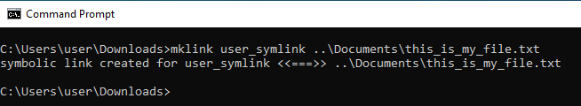

# Git へのシンボリックリンクの追加

[目次](./overview.md)

[&lt;- 前：Dispatcher ヘルスチェック](./health-check.md)

AMS では、Dispatcher のソースコードが格納され、開発とカスタマイズを開始する準備が整っている、事前に入力された Git リポジトリを取得します。

最初の `.vhost` ファイル、または最上位の `farm.any` ファイルを作成したら、`available_*` ディレクトリから `enabled_*` ディレクトリへのシンボリックリンクを作成する必要があります。適切なリンクタイプを使用することが、Cloud Manager パイプラインを介したデプロイメントを成功させるうえで重要になります。このページは、その方法を知るのに役立ちます。

## Dispatcher アーキタイプ

AEM 開発者は通常、[AEM アーキタイプ](https://github.com/adobe/aem-project-archetype)からプロジェクトを開始します

使用されているシンボリックリンクを確認できるソースコードの領域のサンプルを以下に示します。

```
$ tree dispatcher
dispatcher
└── src
   ├── conf.d
.....SNIP.....
    │   └── available_vhosts
    │   │   ├── 000_unhealthy_author.vhost
    │   │   ├── 000_unhealthy_publish.vhost
    │   │   ├── aem_author.vhost
    │   │   ├── aem_flush.vhost
    │   │   ├── aem_health.vhost
    │   │   ├── aem_lc.vhost
    │   │   └── aem_publish.vhost
    └── dispatcher_vhost.conf
    │   └── enabled_vhosts
    │   │   ├── aem_author.vhost -> ../available_vhosts/aem_author.vhost
    │   │   ├── aem_flush.vhost -> ../available_vhosts/aem_flush.vhost
    │   │   ├── aem_health.vhost -> ../available_vhosts/aem_health.vhost
    │   │   └── aem_publish.vhost -> ../available_vhosts/aem_publish.vhost
.....SNIP.....
    └── conf.dispatcher.d
    │   ├── available_farms
    │   │   ├── 000_ams_author_farm.any
    │   │   ├── 001_ams_lc_farm.any
    │   │   └── 002_ams_publish_farm.any
.....SNIP.....
    │   └── enabled_farms
    │   │   ├── 000_ams_author_farm.any -> ../available_farms/000_ams_author_farm.any
    │   │   └── 002_ams_publish_farm.any -> ../available_farms/002_ams_publish_farm.any
.....SNIP.....
17 directories, 60 files
```

例えば、`/etc/httpd/conf.d/available_vhosts/` ディレクトリには、実行中の設定で使用できるステージングされた潜在的な `.vhost` ファイルが含まれています。

有効な `.vhost` ファイルは、`/etc/httpd/conf.d/enabled_vhosts/` ディレクトリ内の相対パス `symlinks` として表示されます。

## シンボリックリンクの作成

ファイルへのシンボリックリンクを使用して、Apache web サーバーが宛先ファイルを同じファイルとして扱うようにします。両方のディレクトリにファイルを複製しないようにします。代わりに、一方のディレクトリからもう一方のディレクトリへのショートカット（シンボリックリンク）を使用します。

デプロイした設定が Linux ホストをターゲットにしていることを認識します。ターゲットシステムと互換性のないシンボリックリンクを作成すると、エラーや望ましくない結果が発生します。

ワークステーションが Linux マシン以外の場合、これらのリンクを適切に作成して Git にコミットできるようにするには、どのコマンドを使用すればよいのか疑問に思うかもしれません。

> `TIP:` Apache web サーバーのローカルコピーをインストールし、インストールベースが異なる場合でもリンクは引き続き機能するので、相対リンクを使用することが重要です。絶対パスを使用する場合は、ワークステーションや他のシステムが完全に同じディレクトリ構造に一致する必要があります。

### OSX／Linux

シンボリックリンクはこれらのオペレーティングシステムにネイティブです。リンクの作成方法の例を以下に示します。お気に入りのターミナルアプリケーションを開き、次のコマンド例を使用してリンクを作成します。

```
$ cd <LOCATION OF CLONED GIT REPO>\src\conf.d\enabled_vhosts
$ ln -s ../available_vhosts/<Destination File Name> <Target File Name>
```

参照用に入力したコマンドの例を以下に示します。

```
$ git clone https://github.com/adobe/aem-project-archetype.git
$ cd aem-project-archetype/src/main/archetype/dispatcher.ams/src/conf.d/enabled_vhosts/
$ ln -s ../available_vhosts/aem_flush.vhost aem_flush.vhost
```

`ls` コマンドを使用してファイルをリストした場合のリンクの例を以下に示します。

```
ls -l
total 0
lrwxrwxrwx. 1 root root 35 Oct 13 21:38 aem_flush.vhost -> ../available_vhosts/aem_flush.vhost
```

### Windows

> `Note:` MS Windows（NTFS）は、Windows Vista からシンボリックリンクをサポートしています。


> `Warning:` シンボリックリンクを作成する mklink コマンドを正しく実行するには、管理者権限が必要です。管理者アカウントでも、開発者モードが有効になっていない場合は、コマンドプロンプトを「管理者として」実行する必要があります。
> <br/>不適切な権限：
> 
> <br/>適切な権限：
> 

リンクを作成するコマンドを以下に示します。

```
C:\<PATH TO SRC>\enabled_vhosts> mklink <Target File Name> ..\available_vhosts\<Destination File Name>
```


参照用に入力したコマンドの例を以下に示します。

```
C:\> git clone https://github.com/adobe/aem-project-archetype.git
C:\> cd aem-project-archetype\src\main\archetype\dispatcher.ams\src\conf.d\enabled_vhosts\
C:\aem-project-archetype\src\main\archetype\dispatcher.ams\src\conf.d\enabled_vhosts> mklink aem_flush.vhost ..\available_vhost\aem_flush.vhost
symbolic link created for aem_flush.vhost <<===>> ..\available_vhosts\aem_flush.vhost
```

#### 開発者モード（Windows 10）

Windows 10 を[開発者モード](https://docs.microsoft.com/ja-jp/windows/apps/get-started/enable-your-device-for-development)にすると、開発中のアプリをより簡単にテストしたり、Ubuntu Bash シェル環境を使用したり、開発者向けの様々な設定を変更したり、その他の操作を行うことができます。

Microsoft は、開発者モードに継続して機能を追加し、機能がより広く採用されて安定していると見なした場合、デフォルトで機能の一部を有効にしているようです（例えば、Creators Update により、Ubuntu Bash シェル環境は開発者モードを必要としなくなりました）。

シンボリックリンクはどうですか？開発者モードを有効にすると、昇格された特権でコマンドプロンプトを実行してシンボリックリンクを作成する必要がなくなります。したがって、開発者モードを有効にすると、すべてのユーザーがシンボリックリンクを作成できます。

> 開発者モードを有効にした後、ユーザーはログオフ／ログオンして変更を有効にする必要があります。

これで、管理者として実行しなくてもコマンドが機能することがわかります。



#### 代替アプローチ／プログラムによるアプローチ

特定のユーザーにシンボリックリンクの作成を許可する特定のポリシーがあります → [シンボリックリンクの作成（Windows 10）- Windows セキュリティ | Microsoft ドキュメント](https://docs.microsoft.com/ja-jp/windows/security/threat-protection/security-policy-settings/create-symbolic-links)

メリット：
- これを利用すれば、顧客は各デバイスで開発者モードを手動で有効にしなくても、組織（すなわち、Active Directory）内のすべての開発者にシンボリックリンクの作成をプログラムで許可することができます。
- さらには、デベロッパーモードを提供しない MS Windows の以前のバージョンで、このポリシーを利用できます。

デメリット：
- このポリシーは、管理者グループに属するユーザーには影響を与えないように思われます。 それでも、管理者は、昇格された特権でコマンドプロンプトを実行する必要があります。 これは奇妙なことです。

> ローカル／グループポリシーの変更を有効にするには、ユーザーのログオフ／ログオンが必要です。

`gpedit.msc` を実行し、必要に応じてユーザーを追加または変更します。 管理者はデフォルトで存在します


#### GIT でのシンボリックリンクの有効化

Git では、core.symlinks オプションに従ってシンボリックリンクを処理します

出典：[Git - git-config ドキュメント](https://git-scm.com/docs/git-config#Documentation/git-config.txt-coresymlinks)

*core.symlinks が false の場合、シンボリックリンクは、リンクテキストを含んだ小さなプレーンファイルとしてチェックアウトされます。 `git-update-index[1]` と `git-add[1]` は、記録されたタイプを通常のファイルには変更しません。 シンボリックリンクをサポートしていない FAT などのファイルシステムで役立ちます。
デフォルトは true です。ただし、`git-clone[1]` や `git-init[1] will probe and set core.symlinks false if appropriate when the repository is created.`ほとんどの場合、Git では、Windows がシンボリックリンクに対しては適切でないと見なし、これを false に設定します。*

Windows での Git の動作について詳しくは、シンボリックリンク・git-for-windows／git Wiki・GitHub を参照してください。

> `Info`：Windows 特に NTFS 上で考えられる AEM 開発者の設定と、ここではファイルのシンボリックリンクとディレクトリのシンボリックリンクの比較のみを念頭に置いているという事実から、上記のリンク先のドキュメントで仮定されている事項は問題ないように思われます。

ありがたいことに、[Git for Windows バージョン2.10.2](https://github.com/git-for-windows/git/releases/tag/v2.10.2.windows.1) 以降、インストーラーには [シンボリックリンクのサポートを有効にするための明示的なオプション](https://github.com/git-for-windows/git/issues/921)があります。

> `Warning`：core.symlink オプションは、実行時、リポジトリのクローン作成時に指定することができます。または、グローバル設定として保存することもできます。


Git for Window では、グローバル環境設定を `"C:\Program Files\Git\etc\gitconfig"` に保存します。これらの設定は、他の Git デスクトップクライアントアプリでは考慮されない可能性があります。
ここからが問題です。すべての開発者が Git ネイティブクライアント (Git Cmd、Git Bash) を使用するとは限らず、一部の Git デスクトップアプリ（GitHub Desktop、Atlassian Sourcetree など）では、システムまたは組み込み Git を使用するための設定やデフォルトが異なっている場合があります。

以下は `gitconfig` ファイルの内容の例です。

```
[diff "astextplain"]
    textconv = astextplain
[filter "lfs"]
    clean = git-lfs clean -- %f
    smudge = git-lfs smudge -- %f
    process = git-lfs filter-process
    required = true
[http]
    sslBackend = openssl
    sslCAInfo = C:/Program Files/Git/mingw64/ssl/certs/ca-bundle.crt
[core]
    autocrlf = true
    fscache = true
    symlinks = true
[pull]
    rebase = false
[credential]
    helper = manager-core
[credential "https://dev.azure.com"]
    useHttpPath = true
[init]
    defaultBranch = master
```

#### Git コマンドラインに関するヒント

新しい vhost や新しいファームの追加など、新しいシンボリックリンクの作成が必要な場合があります。

Windows にはシンボリックリンクを作成する「mklink」コマンドが用意されていることを、上記のドキュメントで確認しました。

Git Bash 環境で作業する場合は、代わりに標準の Bash コマンド `ln -s` を使用できますが、次の例のように特別な命令を前に付ける必要があります。

```
MSYS=winsymlinks:nativestrict ln -s test_vhost_symlink ../dispatcher/src/conf.d/available_vhosts/default.vhost
```

#### 概要

Microsoft Windows OS で（少なくとも現在の AEM Dispatcher 設定ベースラインの範囲について）Git でシンボリックリンクを正しく処理するには、以下のものが必要になります。

| 項目 | 最小バージョン／設定 | 推奨バージョン／設定 |
|------|---------------------------------|-------------------------------------|
| オペレーティングシステム | Windows Vista 以降 | Windows 10 Creators Update 以降 |
| ファイルシステム | NTFS | NTFS |
| Windows ユーザーのシンボリックリンクを処理する機能 | `"Create symbolic links"` グループ／ローカルポリシー `under "Group Computer Configuration\Windows Settings\Security Settings\Local Policies\User Rights Assignment"` | Windows 10 開発者モードが有効になっている |
| Git | ネイティブクライアントバージョン 1.5.3 | ネイティブクライアントバージョン 2.10.2 以降 |
| Git 設定 | コマンドラインから Git クローンを実行する場合の「`--core.symlinks=true`」オプション | Git グローバル設定 <br/>`[core]`<br/> symlinks = true <br/> ネイティブ Git クライアント設定パス：`C:\Program Files\Git\etc\gitconfig` <br/> Git デスクトップクライアントの標準的な場所：`%HOMEPATH%\.gitconfig` |

> `Note:` 既にローカルリポジトリがある場合は、元の場所から新しくクローンを作成する必要があります。新しい場所にクローンを作成し、コミットされていないローカル変更やステージングされていないローカル変更を、新しくクローンされたリポジトリに手動で結合できます。
