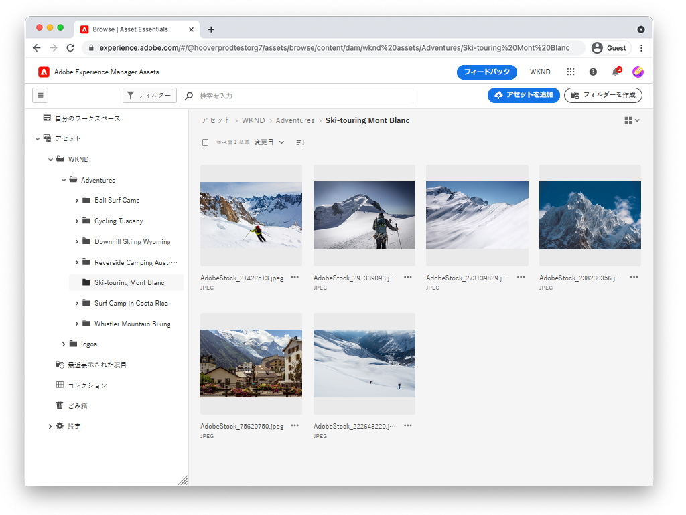

# Assets Essentials のビデオ

Experience Manager Assets Essentials は、軽量なアセット管理とコラボレーションを実現する、合理化されたユーザーインターフェイスを提供します。

Assets Essentials を使用した Adobe の管理方法およびアセットを Adobe Workfront および Adobe Journey Orchestrator と統合する方法に関するビデオをご覧ください。

## Assets Essentials の詳細

<table>
<td>
   
   

      <a href="./basics/managing.md">
 <strong>Assets Essentials の概要</strong>
 </a>
   

   

      <em>Assets Essentials の基本について学ぶ</em>
   

</td>
<td>
   
   

      <a href="https://experienceleague.adobe.com/docs/experience-manager-assets-essentials/help/introduction.html?lang=ja">
 <strong>Assets Essentials ドキュメント</strong>
 </a>
   

   

      <em>Assets Essentials 製品ドキュメントをご覧ください。</em>
   

</td>
<td>
   
   

      <a href="https://experienceleague.adobe.com/docs/journey-optimizer-learn/tutorials/create-messages/create-email-content-with-the-message-editor.html?lang=ja">
 <strong>Adobe Journey Optimizer との統合</strong>
 </a>
   

   

      <em>Assets Essentials と Adobe Journey Optimizer の統合方法を説明します。</em>
   

</td>
</table>
