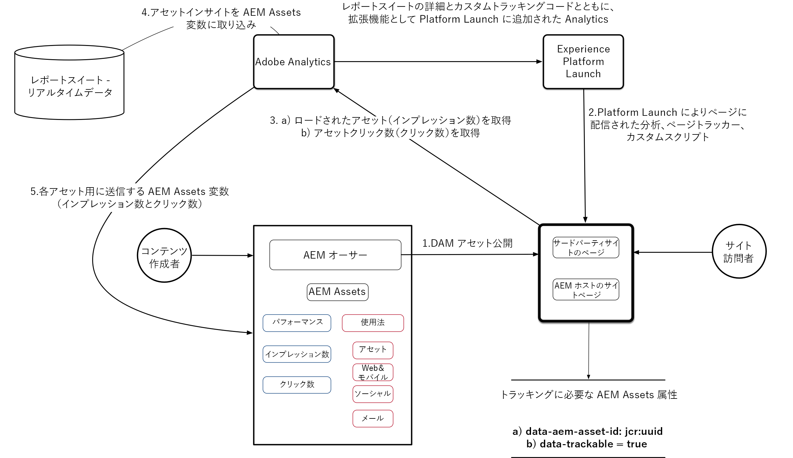

# AEM AssetsとAdobe Experience Platform Launchでアセットインサイトを設定

この5つの部分のビデオシリーズでは、Adobeの起動を介してデプロイされたExperience Manager用のアセットインサイトの設定と設定について説明します。

## パート1:アセットインサイトの概要{#overview}

アセットインサイトの概要 コアコンポーネント、サンプル画像コンポーネントおよびその他のコンテンツパッケージをインストールして、環境の準備を整えます。

>[!VIDEO](https://video.tv.adobe.com/v/25943/?quality=12&learn=on)

### アーキテクチャ図 {#architecture-diagram}



>[!CAUTION]
>
>お使いの導入用に、[最新バージョンのコアコンポーネント](https://github.com/adobe/aem-core-wcm-components)をダウンロードしてください。

このビデオでは、最新バージョンではなくなったコアコンポーネントv2.2.2が使用されています。次のセクションに進む前に、必ず最新バージョンを使用してください。

* [アセットインサイトのサンプル画像コンテンツ](./assets/asset-insights-launch-tutorial/aem-assets-insights-sample.zip)をダウンロード
* [最新のAEM WCMコアコンポーネント](https://github.com/adobe/aem-core-wcm-components/releases)をダウンロード

## パート2:サンプル画像コンポーネントのアセットインサイトトラッキングを有効にする{#sample-image-component-asset-insights}

コアコンポーネントの機能強化と、Asset Insightsでのプロキシコンポーネント（サンプル画像コンポーネント）の使用。 コンテンツページテンプレートポリシーを編集して、リファレンスサイトのサンプル画像コンポーネントを有効にします。

>[!VIDEO](https://video.tv.adobe.com/v/25944/?quality=12&learn=on)

>[!NOTE]
>
>Image Core Componentには、アセットのUUID（JCR内で作成されたノードの固有な識別子値）の追跡を無効にしてUUID追跡を無効にする機能が含まれています

コアイメージコンポーネントは、イメージタグの親&lt;div>内で&#x200B;***data-asset-id***&#x200B;属性を使用して、この機能を有効/無効にします。 プロキシコンポーネントは、次の変更でコアコンポーネントを上書きします。

* image.html内の&lt;img>要素の親divから&#x200B;***data-asset-id***&#x200B;を削除します。
* image.html内の&lt;img>要素に&#x200B;***data-aem-asset-id***&#x200B;を直接追加します。
* image.html内の&lt;img>要素に&#x200B;***data-trackable=&#39;true&#39;***&#x200B;値を追加します。
* ***data-aem-asset-*** idと ***data-trackable=&#39;true&#39;*** は同じノードレベルに保持されます

>[!NOTE]
>
>*data-aem-asset-id=&#39;image.UUID&#39;* and  *data-trackable=&#39;true&#39;* は、アセットインプレッションに必要な主要属性です。アセットクリックインサイトの場合、&lt;img>タグに存在する上記のデータ属性に加えて、親&lt;a>タグに有効なhref値が必要です。

## パート3:Adobe Analytics — レポートスイートの作成。リアルタイムデータ収集とAEM Assetsレポートを有効にする{#adobe-analytics-asset-insights}

リアルタイムデータ収集のレポートスイートが、アセット追跡用に作成されます。 AEM Assetsインサイトの設定は、Adobe Analyticsの資格情報を使用して設定されます。

>[!VIDEO](https://video.tv.adobe.com/v/25945/?quality=12&learn=on)

>[!NOTE]
Adobe Analyticsレポートスイートでリアルタイムデータ収集とAEMアセットレポートを有効にする必要があります。 AEMアセットレポートを有効にすると、アセットのインサイトを追跡するための分析変数が予約されます。

AEM Assetsインサイト設定には、次の資格情報が必要です

* データセンター
* Analytics会社名
* Analyticsユーザー名
* Shared Secret(*Adobe Analytics/管理者/会社設定/Webサービス*&#x200B;から入手できます)。
* レポートスイート(アセットのレポートに使用する適切なレポートスイートを必ず選択してください)

## パート4:Adobe Experience Platform Launchを使用したAdobe Analytics拡張子の追加{#part-using-launch-by-adobe-for-adding-adobe-analytics-extension}

Adobe Analytics拡張機能の追加、ページ型ルールの作成およびAEMとの統合(AdobeIMSテクニカルアカウントを使用)

>[!VIDEO](https://video.tv.adobe.com/v/25946/?quality=12&learn=on)

>[!NOTE]
すべての変更を作成者インスタンスから発行インスタンスに複製してください。

### ルール1:ページトラッカー(pagetracker.js) {#rule-page-tracker-pagetracker-js}

```javascript
//For AEM 6.3
<script type="text/javascript" src="http://localhost:4503/etc/clientlibs/foundation/assetinsights/pagetracker.js"></script>
```

```javascript
//For AEM 6.4
<script type="text/javascript" src="http://localhost:4503/etc.clientlibs/dam/clientlibs/assetinsights/pagetracker.js"></script>
```

ページトラッカーは、2つのコールバックを実装します（asset-embed-codeに登録）

* **\&lt;code>assetAnalytics.core.assetLoaded\&lt;/code>** &lt;code>&lt;code>:アセットのDOM要素に対して「load」イベントがディスパッチされたときに呼び出されます。&lt;/code>&lt;/code>
* **\&lt;code>assetAnalytics.core.assetClicked\&lt;/code>** &lt;code>&lt;code>:asset-DOM-elementに対して&#39;click&#39;イベントがディスパッチされた場合に呼び出されます。これは、asset-DOM-elementが、有効な外部の&#39;href&#39;属性を持つ親としてアンカータグを持つ場合にのみ有効です&lt;/code>&lt;/code>

最後に、ページトラッカーは初期化関数をとして実装します。

* **\&lt;code>assetAnalytics.dispatcher.init()\&lt;/code>** &lt;code>&lt;code>:ページトラッカーコンポーネントを初期化するために呼び出されます。&lt;/code>&lt;/code> このIDは、Webページからアセットインサイトイベント（インプレッション数やクリック数）が生成される前に呼び出す必要があります。
* **\&lt;code>assetAnalytics.dispatcher.init()\&lt;/code>** &lt;code>&lt;code>:オプションでAppMeasurementオブジェクトを受け入れます。指定した場合、AppMeasurementオブジェクトの新しいインスタンスを作成しようとはしません。&lt;/code>&lt;/code>

### ルール2:画像トラッカー — アクション1 (asset-insights.js) {#rule-image-tracker-action-asset-insights-js}

```javascript
/*
 * AEM Asset Insights
 */

var sObj = window.s;
_satellite.notify('in assetAnalytics customInit');
(function initializeAssetAnalytics() {
 if ((!!window.assetAnalytics) && (!!assetAnalytics.dispatcher)) {
 _satellite.notify('assetAnalytics ready');
 /** NOTE:
  Copy over the call to 'assetAnalytics.dispatcher.init()' from Assets Pagetracker
  Be mindful about changing the AppMeasurement object as retrieved above.
  */
 assetAnalytics.dispatcher.init(
                                "",  /** RSID to send tracking-call to */
                                "",  /** Tracking Server to send tracking-call to */
                                "",  /** Visitor Namespace to send tracking-call to */
                                "",  /** listVar to put comma-separated-list of Asset IDs for Asset Impression Events in tracking-call, e.g. 'listVar1' */
                                "",  /** eVar to put Asset ID for Asset Click Events in, e.g. 'eVar3' */
                                "",  /** event to include in tracking-calls for Asset Impression Events, e.g. 'event8' */
                                "",  /** event to include in tracking-calls for Asset Click Events, e.g. 'event7' */
                                sObj  /** [OPTIONAL] if the webpage already has an AppMeasurement object, please include the object here. If unspecified, Pagetracker Core shall create its own AppMeasurement object */
                                );
 sObj.usePlugins = true;
 sObj.doPlugins = assetAnalytics.core.updateContextData;
}
 else {
 _satellite.notify('assetAnalytics not available. Consider updating the Custom Page Code', 4);
 }
})();
```

### ルール2:画像トラッカー — アクション2 (image-tracker.js) {#rule-image-tracker-action-image-tracker-js}

```javascript
/*
 * AEM Asset Insights
 */

document.querySelectorAll('[data-aem-asset-id]').forEach(function(element) {
    assetAnalytics.core.assetLoaded(element);
    var parent = element.parentElement;
    if (parent.nodeName == "A") {
        parent.addEventListener("click", function() {
            assetAnalytics.core.assetClicked(this)
        });
    }
});
```

* assetAnalytics.core.assetLoaded() :は、ページの読み込み完了時に呼び出され、すべての追跡可能な画像に対してアセットのインプレッション数をトリガーします。
* 読み込まれたアセットリストを含むAnalytics変数：**contextData[&#39;c.a.assets.idList&#39;]**
* assetAnalytics.core.assetClicked() :は、アセットのDOM要素に有効なhref値のアンカータグがある場合に呼び出されます。 アセットがクリックされると、クリックされたアセットIDを値として持つcookieが作成されます。**(Cookie名：a.assets.clickdid)**
* 読み込まれたアセットリストを含むAnalytics変数：**contextData[&#39;c.a.assets.clickedid&#39;]**
* 接触チャネル元：**contextData[&#39;c.a.assets.source&#39;]**

### コンソールデバッグ文{#console-debug-statements}

```javascript
//Launch Build Info
_satellite.buildInfo

//Enables debug messages
_satellite.setDebug(true);

//Asset Insight JS Object
assetAnalytics

//List of trackable images
document.querySelectorAll(".cmp-image__image");
```

Analyticsをデバッグする方法として、2つのGoogle Chromeブラウザー拡張機能がビデオ内で参照されます。 他のブラウザーにも同様の拡張機能があります。

* [Switch Chrome Extensionの起動](https://chrome.google.com/webstore/detail/launch-and-dtm-switch/nlgdemkdapolikbjimjajpmonpbpmipk?hl=en)
* [Adobe Experience Cloudデバッガ](https://chrome.google.com/webstore/detail/adobe-experience-cloud-de/ocdmogmohccmeicdhlhhgepeaijenapj?hl=en)

次のChrome Extensionを使用して、DTMをデバッグモードに切り替えることもできます。[DTM Switch](https://chrome.google.com/webstore/detail/launch-and-dtm-switch/nlgdemkdapolikbjimjajpmonpbpmipk?hl=en)を起動します。 これにより、DTMのデプロイメントに関連するエラーがあるかどうかを簡単に確認できます。 さらに、次のスニペットを追加して、任意のブラウザー&#x200B;*開発ツール —> JSコンソール*&#x200B;を介して、DTMを手動でデバッグモードに切り替えることができます。

## パート5:分析追跡とインサイトデータの同期のテスト{#analytics-tracking-asset-insights}

AEMアセットレポート同期ジョブスケジューラーとアセットインサイトレポートの設定

>[!VIDEO](https://video.tv.adobe.com/v/25947/?quality=12&learn=on)
