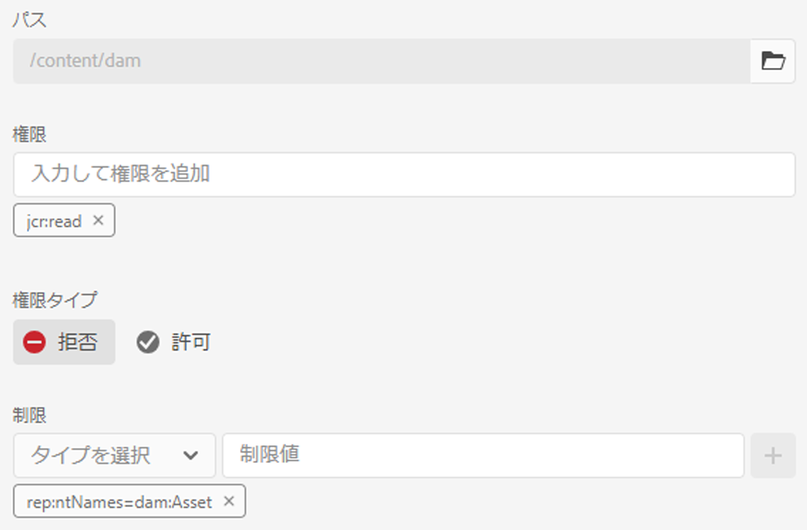
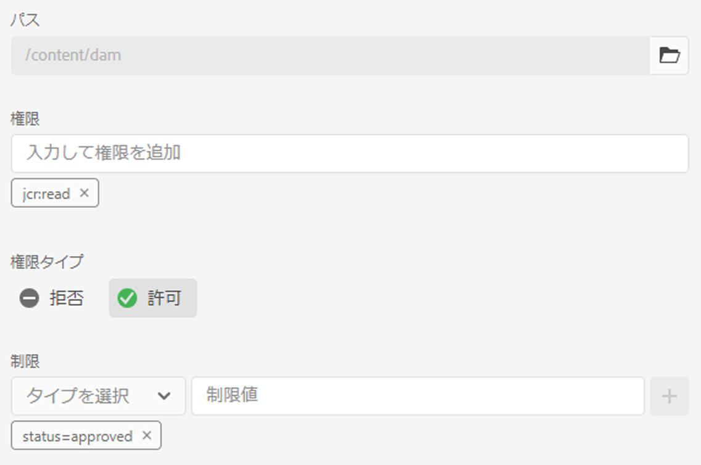
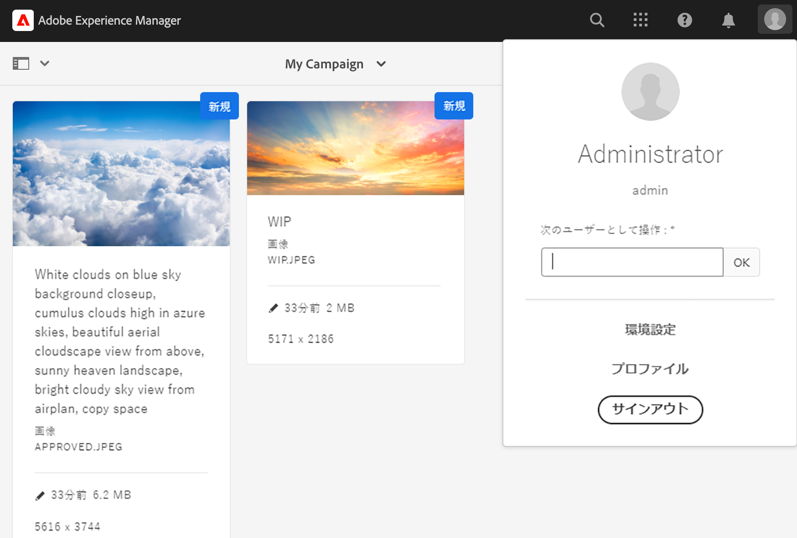
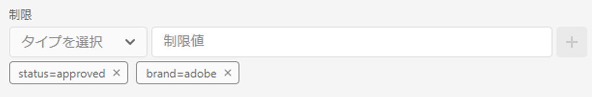
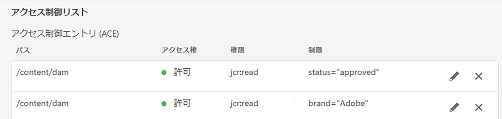

# メタデータ駆動型の権限{#metadata-driven-permissions}

メタデータ駆動型の権限は、AEM Assets オーサーのアクセス制御決定がフォルダー構造ではなくアセットメタデータプロパティに基づくようにするために使用される機能です。 この機能を使用すると、アセットのステータス、タイプ、定義したカスタムメタデータプロパティなどの属性を評価するアクセス制御ポリシーを定義できます。

例を見てみましょう。 クリエイティブが、キャンペーン関連フォルダーに作業をAEM Assetsにアップロードしました。使用中のアセットが、使用を承認されていない可能性があります。 マーケターに、このキャンペーンで承認されたアセットのみが表示されるようにします。 メタデータプロパティを利用して、アセットが承認され、マーケターが使用できることを示します。

## 仕組み

メタデータ駆動型の権限を有効にするには、「ステータス」や「ブランド」などのアクセス制限を推進するアセットメタデータプロパティを定義する必要があります。 その後、これらのプロパティを使用して、特定のプロパティ値を持つアセットにアクセスできるユーザーグループを指定するアクセス制御エントリを作成できます。

## 前提条件

メタデータ駆動型の権限を設定するには、最新バージョンに更新されたAEMas a Cloud Service環境にアクセスできる必要があります。


## 開発手順

メタデータ駆動権限を実装するには：

1. アクセス制御に使用するアセットメタデータプロパティを決定します。 ここでは、という名前のプロパティになります。 `status`.
1. OSGi 設定の作成 `com.adobe.cq.dam.assetmetadatarestrictionprovider.impl.DefaultRestrictionProviderConfiguration.cfg.json` （プロジェクト内）。
1. 作成したファイルに次の JSON をペーストします

   ```json
   {
     "restrictionPropertyNames":[
       "status"
     ],
     "restrictionPaths":[
       "/content/dam"
     ]
   }
   ```

1. プロパティ名および制限パスを必要な値に置き換えます。


制限ベースのアクセス制御エントリを追加する前に、新しい最上位エントリを追加して、アセットの権限評価の対象となるすべてのグループ（「投稿者」など）に対する読み取りアクセスをまず拒否する必要があります。

1. ツール/セキュリティ→アクセス権→画面に移動します
1. 「投稿者」グループ（または、すべてのユーザーグループが属する他のカスタムグループ）を選択します
1. 画面の右上隅にある「Add ACE」をクリックします
1. 「パス」に/content/dam を選択します
1. Privileges に jcr:read と入力します。
1. 権限タイプとして「拒否」を選択します
1. 「制限」で「rep:ntNames」を選択し、「制限値」に「dam:Asset」と入力します
1. 「保存」をクリックする



アセットメタデータプロパティの値に基づいて、ユーザーグループに読み取りアクセス権を付与するアクセス制御エントリを追加できるようになりました。

1. ツール/セキュリティ→アクセス権→画面に移動します
1. 目的のグループを選択
1. 画面の右上隅にある「Add ACE」をクリックします
1. 「パス」に/content/dam （またはサブフォルダー）を選択
1. Privileges に jcr:read と入力します。
1. 「権限タイプを許可」を選択します
1. 「制限」で、設定済みのアセットメタデータプロパティ名の 1 つを選択します（OSGi 設定で定義されたプロパティはここに含まれます）
1. 「制限値」フィールドに、必須のメタデータプロパティ値を入力します
1. 「+」アイコンをクリックして、アクセス制御エントリに制限を追加します。
1. 「保存」をクリックする



サンプルフォルダーには、2 つのアセットが含まれています。



権限を設定し、それに応じてアセットメタデータのプロパティを設定したら、ユーザー（この場合はマーケターのユーザー）には、承認済みアセットのみが表示されます。


## メリットと考慮事項

メタデータ駆動権限の利点は次のとおりです。

- 特定の属性に基づいて、アセットへのアクセスをきめ細かく制御します。
- アクセス制御ポリシーとフォルダー構造を分離することで、アセット編成の柔軟性を高めることができます。
- 複数のメタデータプロパティに基づいて複雑なアクセス制御ルールを定義する機能。

>[!NOTE]
>
> 次の点に注意してください。
> 
> - メタデータプロパティは、文字列の等価性（まだサポートされていない他のデータタイプ、例：日付）を使用して、制限に照らして評価されます
> - 1 つの制限プロパティに対して複数の値を許可するには、「タイプを選択」ドロップダウンから同じプロパティを選択し、新しい制限値（など）を入力して、アクセス制御エントリに追加の制限を追加できます。 `status=approved`, `status=wip`）を選択し、「+」をクリックしてエントリに制限を追加します
> 
> - 異なるプロパティ名を持つ 1 つのアクセス制御エントリの複数の制限（例： `status=approved`, `brand=Adobe`）が AND 条件として評価されます。つまり、選択したユーザーグループに、次を含むアセットへの読み取りアクセス権が付与されます `status=approved AND brand=Adobe`
> 
> - メタデータプロパティ制限を持つ新しいアクセス制御エントリを追加すると、エントリの OR 条件（制限を持つ単一のエントリなど）が確立されます `status=approved` を含む単一のエントリ `brand=Adobe` はとして評価されます `status=approved OR brand=Adobe`
> 
