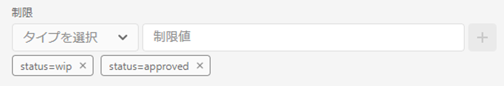

# メタデータ駆動型の権限{#metadata-driven-permissions}

メタデータ駆動型の権限は、フォルダー構造ではなくアセットのメタデータプロパティに基づいて、AEM Assets オーサーに対するアクセス制御の決定を可能にするのに使用される機能です。この機能を使用すると、アセットのステータス、タイプまたは定義したカスタムメタデータプロパティなどの属性を評価するアクセス制御ポリシーを定義できます。

例を見てみましょう。クリエイティブは、自分の作品を AEM Assets のキャンペーン関連フォルダーにアップロードします。これは、使用が承認されていない処理中のアセットである可能性があります。マーケターには、このキャンペーンで承認されたアセットのみが表示されていることを確認します。メタデータプロパティを利用すると、アセットが承認され、マーケターが使用できることを示すことができます。

## 仕組み

メタデータ駆動型の権限を有効にするには、「ステータス」や「ブランド」など、アクセス制限を推進するアセットメタデータプロパティを定義する必要があります。これらのプロパティを使用すると、特定のプロパティ値を持つアセットにアクセスできるユーザーグループを指定するアクセス制御エントリを作成できます。

## 前提条件

メタデータ駆動型の権限を設定するには、最新バージョンに更新された AEM as a Cloud Service 環境へのアクセスが必要です。

## OSGi 設定 {#configure-permissionable-properties}

メタデータ駆動権限を実装するには、開発者は OSGi 設定をAEM固有の設定にデプロイする必要があります。これにより、as a Cloud Serviceのアセットメタデータプロパティで、メタデータ駆動権限を強化できます。

1. アクセス制御に使用するアセットメタデータプロパティを決定します。プロパティ名は、アセットのの `jcr:content/metadata` リソース。 ここでは、`status` というプロパティにします。
1. OSGi 設定の作成 `com.adobe.cq.dam.assetmetadatarestrictionprovider.impl.DefaultRestrictionProviderConfiguration.cfg.json` AEM Maven プロジェクトで、
1. 作成したファイルに次の JSON を貼り付けます。

   ```json
   {
     "restrictionPropertyNames":[
       "status",
       "brand"
     ],
     "enabled":true
   }
   ```

1. プロパティ名を必要な値に置き換えます。

## 基本アセット権限のリセット

制限ベースのアクセス制御エントリを追加する前に、新しいト上位レベルのエントリを追加して、アセットの権限評価の対象となるすべてのグループ（「寄稿者」など）への読み取りアクセスを最初に拒否する必要があります。

1. に移動します。 __ツール→セキュリティ→権限__ 画面
1. 「」を選択します __投稿者__ グループ （または、すべてのユーザーグループが属する他のカスタムグループ）
1. クリック __ACE の追加__ 画面の右上隅に
1. を選択 `/content/dam` （用） __パス__
1. Enter `jcr:read` （用） __権限__
1. を選択 `Deny` （用） __権限タイプ__
1. 「制限」で、次の項目を選択します `rep:ntNames` を入力します `dam:Asset` as the __制限値__
1. 「__保存__」をクリックします。


## メタデータによるアセットへのアクセス権の付与

アクセス制御エントリを追加して、 [設定済みのアセットメタデータプロパティの値](#configure-permissionable-properties).

1. に移動します。 __ツール→セキュリティ→権限__ 画面
1. アセットにアクセスできるユーザーグループを選択します
1. クリック __ACE の追加__ 画面の右上隅に
1. を選択 `/content/dam` （またはサブフォルダー） __パス__
1. Enter `jcr:read` （用） __権限__
1. を選択 `Allow` （用） __権限タイプ__
1. 次の下 __制限__、次のいずれかを選択します [osgi 設定で設定されたアセットメタデータプロパティ名](#configure-permissionable-properties)
1. 必要なメタデータプロパティの値を __制限値__ フィールド
1. 「」をクリックします __+__ アクセス制御エントリに制限を追加するためのアイコン
1. 「__保存__」をクリックします。


## 有効なメタデータ駆動権限

サンプルフォルダーには、複数のアセットが含まれます。


権限を設定し、それに応じてアセットメタデータプロパティを設定すると、ユーザー（ここでは、マーケターユーザー）には、承認済みアセットのみが表示されます。


## メリットと考慮事項

メタデータ駆動権限の利点は次のとおりです。

- 特定の属性に基づいて、アセットへのアクセスをきめ細かく制御します。
- アクセス制御ポリシーをフォルダー構造から切り離すことで、より柔軟なアセット編成が可能になります。
- 複数のメタデータプロパティに基づいて複雑なアクセス制御ルールを定義できます。

>[!NOTE]
>
> 次に注意することが重要です。
> 
> - メタデータプロパティは、次を使用して、制限に照らして評価されます __文字列の等号__ （`=`）（他のデータ型または演算子は、まだサポートされていません。例：（`>`）または Date プロパティ）
> - 1 つの制限プロパティに対して複数の値を許可するには、「タイプを選択」ドロップダウンから同じプロパティを選択し、新しい制限値（例：`status=approved`、`status=wip`）を入力し、「+」をクリックして制限をエントリに追加することで、アクセス制御エントリに追加の制限を追加できます。
> 
> - __および制限__ は、異なるプロパティ名（など）を持つ 1 つのアクセス制御エントリで複数の制限を通じてサポートされます。 `status=approved`, `brand=Adobe`）が AND 条件として評価されます。つまり、選択したユーザーグループに、次を含むアセットへの読み取りアクセス権が付与されます `status=approved AND brand=Adobe`
> 
> - __OR 制限__ メタデータプロパティ制限を持つ新しいアクセス制御エントリを追加することでサポートされ、エントリに OR 条件を確立します（例：制限を持つ単一のエントリ） `status=approved` を含む単一のエントリ `brand=Adobe` はとして評価されます `status=approved OR brand=Adobe`
> 
