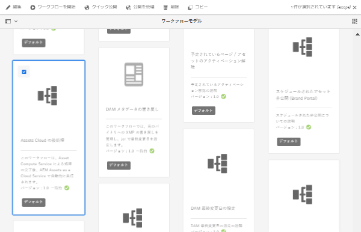
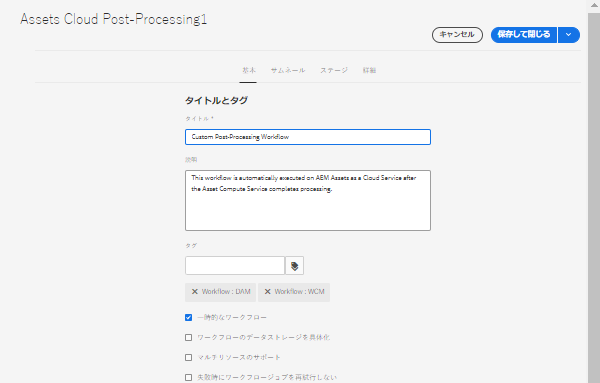
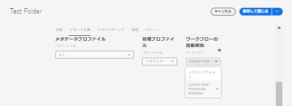

# ワークフローの自動開始

自動開始ワークフローは、アセット処理の完了後のアップロード時または再処理時にカスタムワークフローを自動的に呼び出すことで、AEM as a Cloud Service のアセット処理を拡張します。

>[!VIDEO](https://video.tv.adobe.com/v/37323?quality=12&learn=on)

>[!NOTE]
>
>アセットの後処理をカスタマイズするには、ワークフローランチャーを使用するのではなく、自動開始ワークフローを使用します。自動開始ワークフローは、アセットの処理中に複数回呼び出される可能性のあるランチャーとは異なり、アセット処理の完了後に&#x200B;_のみ_&#x200B;呼び出されます。

## 後処理ワークフローのカスタマイズ

後処理ワークフローをカスタマイズするには、デフォルトの Assets クラウド後処理[ワークフローモデル](../../foundation/workflow/use-the-workflow-editor.md)をコピーします。

1. _ツール_／_ワークフロー_／_モデル_&#x200B;に移動して、ワークフローモデル画面から開始します。
2. _Assets クラウド後処理_&#x200B;ワークフローモデル を検索して選択します。
   
3. 「_コピー_」ボタンを選択して、カスタムワークフローを作成します。
4. 現在のワークフローモデル（_Assets クラウド後処理 1_）を選択し、「_編集_」ボタンをクリックしてワークフローを編集します。
5. ワークフローのプロパティで、カスタム後処理ワークフローにわかりやすい名前を付けます 。
   
6. ビジネス要件を満たすように、ステップを追加します。この例では、アセットの処理が完了したときに実行されるタスクを追加します。ワークフローの最後のステップは、必ず&#x200B;_ワークフロー完了_&#x200B;ステップにする必要があります。 
   

   >[!NOTE]
   >
   >自動開始ワークフローは、アセットのアップロードまたは再処理のたびに実行されるので、特に[一括読み込み](../../cloud-service/migration/bulk-import.md)や移行などの一括操作の場合は、ワークフローステップのスケーリングの影響を慎重に考慮します。

7. 「_同期_」ボタンを選択して変更内容を保存し、ワークフローモデルを同期させます。

## カスタム後処理ワークフローの使用

カスタム後処理はフォルダーに対して設定します。カスタム後処理ワークフローをフォルダーに対して設定するには：

1. ワークフローを設定するフォルダーを選択し、フォルダーのプロパティを編集します。
2. 「_アセット処理_」タブに切り替えます。
3. _自動開始ワークフロー_&#x200B;選択ボックスでカスタム後処理ワークフローを選択します。 
   
4. 変更内容を保存します。

これで、このフォルダーの下にアップロードまたは再処理されたすべてのアセットに対して、カスタム後処理ワークフローが実行されるようになります。
