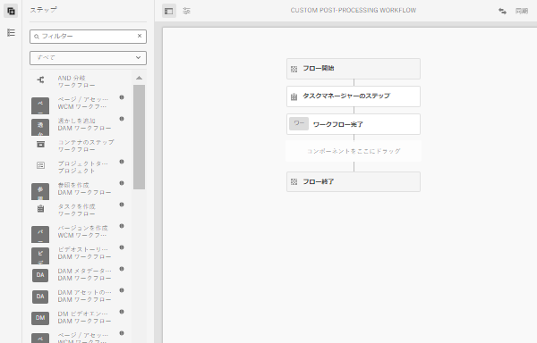

# ワークフローの自動開始

自動開始ワークフローは、アセット処理が完了した後、アップロード時または再処理時にカスタムワークフローを自動的に呼び出すことで、AEMas a Cloud Serviceのアセット処理を拡張します。

>[!VIDEO](https://video.tv.adobe.com/v/37323?quality=12&learn=on)
> `Notice`:ワークフローランチャーを使用するのではなく、アセットの後処理をカスタマイズするための自動開始ワークフローを使用します。 自動開始ワークフローは、 _のみ_ アセットの処理が完了すると呼び出されます。ランチャーは、アセットの処理中に複数回呼び出される場合があります。

## 後処理ワークフローのカスタマイズ

後処理ワークフローをカスタマイズするには、デフォルトの Assets Cloud 後処理をコピーします。 [ワークフローモデル](../../foundation/workflow/use-the-workflow-editor.md).

1. ワークフローモデル画面で、に移動して開始します。 _ツール_ > _ワークフロー_ > _モデル_
2. 検索と選択 _Assets Cloud の後処理_ ワークフローモデル 
   
3. を選択します。 _コピー_ ボタンを使用してカスタムワークフローを作成します
4. 現在のワークフローモデルを選択します（このモデルはと呼ばれます）。 _Assets Cloud Post-Processing1_) をクリックし、 _編集_ ボタンを使用してワークフローを編集します
5. ワークフローのプロパティから、カスタムの後処理ワークフローにわかりやすい名前を付けます。 
   
6. ビジネス要件を満たす手順を追加します。この手順では、アセットの処理が完了したときにタスクを追加します。 ワークフローの最後のステップが常に _ワークフロー完了_ 手順 
   
   > `Note`:自動開始ワークフローは、アセットのアップロードまたは再処理のたびに実行されるので、特に一括操作に関して、ワークフローステップのスケーリングの影響を慎重に考慮します。 [一括インポート](../../cloud-service/migration/bulk-import.md) または移行。
7. を選択します。 _同期_ ボタンをクリックして変更を保存し、ワークフローモデルを同期します。

## カスタム後処理ワークフローの使用

カスタムの後処理は、フォルダーに対して設定します。 フォルダー上でカスタム後処理ワークフローを設定するには：

1. ワークフローを設定するフォルダーを選択し、フォルダーのプロパティを編集します
2. 次に切り替え： _アセット処理_ タブ
3. カスタム後処理ワークフローを _ワークフローの自動開始_ 選択ボックス 
   
4. 変更を保存します。

これで、そのフォルダーにアップロードまたは再処理されたすべてのアセットに対してカスタムの後処理ワークフローが実行されます。