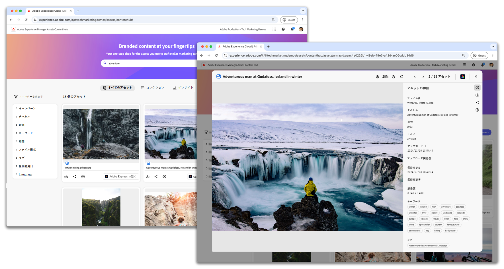

# AEM Assets コンテンツハブ

{align=center}

Adobe Experience Manager Assets as a Cloud Service コンテンツハブでアセットをアップロードし、タグを適用し、承認ワークフローを理解する方法について説明します。

## コンテンツハブに関するビデオ

このビデオシリーズでは、AEM Assets コンテンツハブを効果的に操作するために必要な内容をすべてカバーします。アセットの管理からチームとの共同作業まで、各ビデオでは、AEM Assets コンテンツハブを日常業務で最大限に活用するための明確な手順と実用的なヒントを提供します。

<!-- CARDS

* https://experienceleague.adobe.com/en/docs/experience-manager-learn/assets/content-hub/set-up {title = Set up}
* https://experienceleague.adobe.com/en/docs/experience-manager-learn/assets/content-hub/configure {title = Configure}
* https://experienceleague.adobe.com/en/docs/experience-manager-learn/assets/content-hub/add-assets {title = Add assets}
* https://experienceleague.adobe.com/en/docs/experience-manager-learn/assets/content-hub/download-assets {title = Download assets}
* https://experienceleague.adobe.com/en/docs/experience-manager-learn/assets/content-hub/image-variants {title = Create image variants}
* https://experienceleague.adobe.com/en/docs/experience-manager-learn/assets/content-hub/collections {title = Collections}
* https://experienceleague.adobe.com/en/docs/experience-manager-learn/assets/content-hub/share {title = Sharing}

-->
<!-- START CARDS HTML - DO NOT MODIFY BY HAND -->

    

        

            

                <figure class="image x-is-16by9">
                    
                </figure>
            

            

                

                    

                        <a href="https://experienceleague.adobe.com/ja/docs/experience-manager-learn/assets/content-hub/set-up" target="_blank" rel="referrer" title="設定">設定</a>
                    

                    
AEM as a Cloud Service で Adob Experience Manager Assets コンテンツハブを設定する方法について説明します。

                

                <a href="https://experienceleague.adobe.com/ja/docs/experience-manager-learn/assets/content-hub/set-up" target="_blank" rel="referrer" class="spectrum-Button spectrum-Button--outline spectrum-Button--primary spectrum-Button--sizeM" style="align-self: flex-start; margin-top: 1rem;">
                     ウォッチ 
                </a>
            

        

    

    

        

            

                <figure class="image x-is-16by9">
                    
                </figure>
            

            

                

                    

                        <a href="https://experienceleague.adobe.com/en/docs/experience-manager-learn/assets/content-hub/configure" target="_blank" rel="referrer" title="設定">設定</a>
                    

                    
使用可能なタブを移動する方法と、組織のニーズに合わせて設定オプションをカスタマイズする方法を説明します。

                

                <a href="https://experienceleague.adobe.com/en/docs/experience-manager-learn/assets/content-hub/configure" target="_blank" rel="referrer" class="spectrum-Button spectrum-Button--outline spectrum-Button--primary spectrum-Button--sizeM" style="align-self: flex-start; margin-top: 1rem;">
                     ウォッチ 
                </a>
            

        

    

    

        

            

                <figure class="image x-is-16by9">
                    
                </figure>
            

            

                

                    

                        <a href="https://experienceleague.adobe.com/ja/docs/experience-manager-learn/assets/content-hub/add-assets" target="_blank" rel="referrer" title="アセットの追加">アセットの追加</a>
                    

                    
Adobe Experience Manager Assets コンテンツハブでアセットをアップロードし、タグを適用し、承認ワークフローを理解する方法について説明します。

                

                <a href="https://experienceleague.adobe.com/ja/docs/experience-manager-learn/assets/content-hub/add-assets" target="_blank" rel="referrer" class="spectrum-Button spectrum-Button--outline spectrum-Button--primary spectrum-Button--sizeM" style="align-self: flex-start; margin-top: 1rem;">
                     詳細情報 
                </a>
            

        

    

    

        

            

                <figure class="image x-is-16by9">
                    
                </figure>
            

            

                

                    

                        <a href="https://experienceleague.adobe.com/ja/docs/experience-manager-learn/assets/content-hub/download-assets" target="_blank" rel="referrer" title="アセットのダウンロード">アセットのダウンロード</a>
                    

                    
Adobe Experience Manager Assets コンテンツハブでアセットを移動、検索、フィルタリング、ダウンロードする方法について説明します。

                

                <a href="https://experienceleague.adobe.com/ja/docs/experience-manager-learn/assets/content-hub/download-assets" target="_blank" rel="referrer" class="spectrum-Button spectrum-Button--outline spectrum-Button--primary spectrum-Button--sizeM" style="align-self: flex-start; margin-top: 1rem;">
                     ウォッチ 
                </a>
            

        

    

    

        

            

                <figure class="image x-is-16by9">
                    
                </figure>
            

            

                

                    

                        <a href="https://experienceleague.adobe.com/ja/docs/experience-manager-learn/assets/content-hub/image-variants" target="_blank" rel="referrer" title="画像バリアントの作成">画像バリアントの作成</a>
                    

                    
Experience Manager Assets コンテンツハブ内で Adobe Express を使用して画像バリアントを作成および編集する方法について説明します。

                

                <a href="https://experienceleague.adobe.com/ja/docs/experience-manager-learn/assets/content-hub/image-variants" target="_blank" rel="referrer" class="spectrum-Button spectrum-Button--outline spectrum-Button--primary spectrum-Button--sizeM" style="align-self: flex-start; margin-top: 1rem;">
                     ウォッチ 
                </a>
            

        

    

    

        

            

                <figure class="image x-is-16by9">
                    
                </figure>
            

            

                

                    

                        <a href="https://experienceleague.adobe.com/ja/docs/experience-manager-learn/assets/content-hub/collections" target="_blank" rel="referrer" title="コレクション">コレクション</a>
                    

                    
AEM Assets コンテンツハブでコレクションを作成して使用し、アセットへのアクセスを効率化、共同リソース共有を促進して、様々なプロジェクト間で効率的かつ組織的なチームワークを確保する方法について説明します。

                

                <a href="https://experienceleague.adobe.com/ja/docs/experience-manager-learn/assets/content-hub/collections" target="_blank" rel="referrer" class="spectrum-Button spectrum-Button--outline spectrum-Button--primary spectrum-Button--sizeM" style="align-self: flex-start; margin-top: 1rem;">
                     ウォッチ 
                </a>
            

        

    

    

        

            

                <figure class="image x-is-16by9">
                    
                </figure>
            

            

                

                    

                        <a href="https://experienceleague.adobe.com/ja/docs/experience-manager-learn/assets/content-hub/share" target="_blank" rel="referrer" title="共有">共有</a>
                    

                    
AEM Assets コンテンツハブでチームメンバーとアセットやコレクションを共有し、効果的なチームワークと安全なアセット共有を促進する方法について説明します。

                

                <a href="https://experienceleague.adobe.com/ja/docs/experience-manager-learn/assets/content-hub/share" target="_blank" rel="referrer" class="spectrum-Button spectrum-Button--outline spectrum-Button--primary spectrum-Button--sizeM" style="align-self: flex-start; margin-top: 1rem;">
                     ウォッチ 
                </a>
            

        

    

<!-- END CARDS HTML - DO NOT MODIFY BY HAND -->

## コンテンツハブに関するドキュメント

AEM Assets コンテンツハブを理解し、最大限に活用するには、コンテンツハブの製品ドキュメントを参照してください。これらのリソースでは、その機能の使用に関する詳細なガイダンスを示し、効率的なアセット管理に必要なサポートを確実に提供します。

<!-- CARDS

* https://experienceleague.adobe.com/en/docs/experience-manager-cloud-service/content/assets/content-hub/product-overview {title=Content Hub documentation} {description=This documentation serves as your entry point to learn about Content Hub's key benefits, access methods, and how to provide feedback on the available options.}
* https://experienceleague.adobe.com/en/docs/experience-manager-cloud-service/content/assets/content-hub/deploy-content-hub {description=Learn how to deploy and activate Content Hub, providing users with various privileges, including asset uploads and administrator access.}
* https://experienceleague.adobe.com/en/docs/experience-manager-cloud-service/content/assets/content-hub/frequently-asked-questions-content-hub {title = Content Hub FAQs}

-->
<!-- START CARDS HTML - DO NOT MODIFY BY HAND -->

    

        

            

                <figure class="image x-is-16by9">
                    
                </figure>
            

            

                

                    

                        <a href="https://experienceleague.adobe.com/ja/docs/experience-manager-cloud-service/content/assets/content-hub/product-overview" target="_blank" rel="referrer" title="コンテンツハブに関するドキュメント">コンテンツハブに関するドキュメント</a>
                    

                    
このドキュメントは、Content Hubの主なメリット、アクセス方法、利用可能なオプションに関するフィードバックを提供する方法を学ぶための入口として機能します。

                

                <a href="https://experienceleague.adobe.com/ja/docs/experience-manager-cloud-service/content/assets/content-hub/product-overview" target="_blank" rel="referrer" class="spectrum-Button spectrum-Button--outline spectrum-Button--primary spectrum-Button--sizeM" style="align-self: flex-start; margin-top: 1rem;">
                     詳細情報 
                </a>
            

        

    

    

        

            

                <figure class="image x-is-16by9">
                    
                </figure>
            

            

                

                    

                        <a href="https://experienceleague.adobe.com/ja/docs/experience-manager-cloud-service/content/assets/content-hub/deploy-content-hub" target="_blank" rel="referrer" title="コンテンツハブのデプロイ">コンテンツハブのデプロイ</a>
                    

                    
Content Hubをデプロイしてアクティブ化し、アセットのアップロードや管理者アクセスなど、様々な権限をユーザーに提供する方法について説明します。

                

                <a href="https://experienceleague.adobe.com/ja/docs/experience-manager-cloud-service/content/assets/content-hub/deploy-content-hub" target="_blank" rel="referrer" class="spectrum-Button spectrum-Button--outline spectrum-Button--primary spectrum-Button--sizeM" style="align-self: flex-start; margin-top: 1rem;">
                     詳細情報 
                </a>
            

        

    

    

        

            

                <figure class="image x-is-16by9">
                    
                </figure>
            

            

                

                    

                        <a href="https://experienceleague.adobe.com/ja/docs/experience-manager-cloud-service/content/assets/content-hub/frequently-asked-questions-content-hub" target="_blank" rel="referrer" title="コンテンツハブに関するよくある質問">コンテンツハブに関するよくある質問</a>
                    

                    
コンテンツハブに関するよくある質問（FAQ）への回答を参照してください。

                

                <a href="https://experienceleague.adobe.com/ja/docs/experience-manager-cloud-service/content/assets/content-hub/frequently-asked-questions-content-hub" target="_blank" rel="referrer" class="spectrum-Button spectrum-Button--outline spectrum-Button--primary spectrum-Button--sizeM" style="align-self: flex-start; margin-top: 1rem;">
                     詳細情報 
                </a>
            

        

    

<!-- END CARDS HTML - DO NOT MODIFY BY HAND -->

 
 
