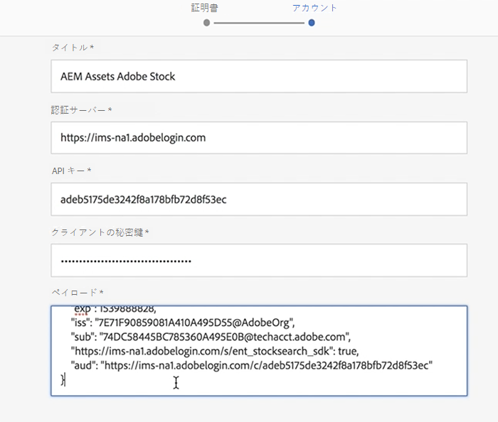

# Adobe StockとAEM Assets{#using-adobe-stock-assets-with-aem-assets}を使う

AEM 6.4.2では、AEMから直接、Adobe Stockアセットの検索、プレビュー、保存、ライセンス認証を行うことができます。 組織は、Adobe Stockエンタープライズ計画をAEM Assetsと統合し、ライセンスされたアセットがAEMの強力なアセット管理機能を備え、クリエイティブやマーケティングプロジェクトで広く利用できるようにします。

>[!VIDEO](https://video.tv.adobe.com/v/24678/?quality=9&learn=on)

>[!NOTE]
>
>この統合を利用するには、[Adobe Stock エンタープライズプラン](https://landing.adobe.com/en/na/products/creative-cloud/ctir-4625-stock-for-enterprise/index.html)と、最新の Service Pack 2 を展開した AEM 6.4 が必要です。AEM 6.4 サービスパックについて詳しくは、[リリースノート](https://helpx.adobe.com/jp/experience-manager/6-4/release-notes/sp-release-notes.html)を参照してください。

Adobe StockとAEM Assetsの統合により、コンテンツ作成者やマーケターは、クリエイティブやマーケティングの目的で、株価資産のライセンスを容易に取得して使用できます。 位置フィルターを「オムニ検索」として追加するか、AEM Assetsのメインナビゲーションから「Adobe StockコーラルUIを検索」アイコンをクリックして、Stockアセット検索を実行できます。

## 機能

### 検索と保存

* AEM workspaceを終了せずに、Adobe Stockアセット検索を実行します。
* プレビュー用にAdobe Stockアセットを保存します。アセットのライセンスは取得しません。
* Adobe Stock資産のライセンス認証とAEM Assetsへの保存
* AEM AssetsUI内でAdobe Stockから類似のアセットを検索可能
* Adobe StockのWebサイトのAEM Assetsにある株式検索で選択したアセットの表示
* ライセンス済みのアセットファイルには、識別しやすい青いライセンス済みのバッジが付いています

### アセットメタデータ

* 免許資産はAEM Assets内に保管される。 アセットプロパティには、別のアセットメタデータタブの下にStockメタデータが含まれます
* アセットメタデータにライセンス参照を追加する機能

### 資産の在庫プロファイル

* ユーザーは、*ユーザー/環境設定/株価プロファイル*&#x200B;の下のAdobe Stock環境を選択できます。
* 必須およびオプションの参照は、アセットライセンスウィンドウに追加できます。
* 領域に基づいて、アセットライセンスウィンドウの言語設定を選択できます。

### フィルター

* 類似のアセットタイプ、方向、表示に基づいて、Stock Assetsをフィルタリングできます。
* アセットタイプには、写真、イラスト、ベクトル、ビデオ、テンプレート、3D、Premium、Editorialが含まれます
* 方向には、「水平」、「垂直」、「四角」があります。
* 表示類似フィルタにはAdobe Stockファイル番号が必要です

### アクセス制御

* 管理者は、Adobe Stockクラウドサービスの設定を行う際に、特定のユーザーまたはグループに対して、Stockアセットのライセンス認証の権限を与えることができます。
* 特定のユーザー/グループにStock Assetsのライセンス認証の権限がない場合、*Stock Asset Search / Asset licensing*&#x200B;機能は無効になります。

## Adobe StockをAEM Assetsとセットアップ{#set-up-adobe-stock-with-aem-assets}

AEM 6.4.2では、AEMから直接、Adobe Stockアセットの検索、プレビュー、保存、ライセンス認証を行うことができます。 このビデオでは、Adobe I/Oコンソールを使用してAdobeストックをAEM Assetsで設定する方法の概要を簡単に説明します。

>[!VIDEO](https://video.tv.adobe.com/v/25043/?quality=12&learn=on)

>[!NOTE]
>
>Adobe Stockクラウドサービス設定の場合、PROD環境とライセンス済みアセットのパスを選択し、/content/damを指定する必要があります。 次回のAEMリリースでは環境フィールドが削除され、ライセンスされたアセットパスは今後の機能の一部となり、このフィールドのサポートは次回のAEMリリースで導入されます。

>[!NOTE]
>
>この統合を利用するには、[Adobe Stock エンタープライズプラン](https://landing.adobe.com/en/na/products/creative-cloud/ctir-4625-stock-for-enterprise/index.html)と、最新の Service Pack 2 を展開した AEM 6.4 が必要です。AEM 6.4 サービスパックについて詳しくは、[リリースノート](https://helpx.adobe.com/experience-manager/6-4/release-notes/sp-release-notes.html)を参照してください。また、統合を設定するには、[Adobe I/Oコンソール](https://console.adobe.io/)、[Adobe Admin Console](https://adminconsole.adobe.com/)、Adobe Experience Managerの管理者権限も必要です。

### インストール {#installations}

* AEM 6.4の場合、[AEM Service Pack 2](https://www.adobeaemcloud.com/content/marketplace/marketplaceProxy.html?packagePath=/content/companies/public/adobe/packages/cq640/servicepack/AEM-6.4.2.0)をインストールし、cq-dam-stock-integration-content-1.0.4.zipファイルを再インストールする必要があります。
* [Adobe I/Oコンソール](https://console.adobe.io/)、[Adobe Admin Console](https://adminconsole.adobe.com/)、Adobe Experience Managerの管理者権限を持っていることを確認して、統合を設定します。

#### Adobe I/Oコンソール{#set-up-adobe-ims-configuration-using-adobe-i-o-console}を使用してAdobeIMS設定を設定

1. **ツール/セキュリティ**&#x200B;で、AdobeIMSテクニカルアカウント設定を作成します。
2. *Cloud Solution*&#x200B;を&#x200B;*Adobe Stock*&#x200B;として選択し、新しい証明書を作成するか、既存の証明書を設定に再使用します。
3. Adobe I/Oコンソールに移動し、*Adobe Stock*&#x200B;の新しいサービスアカウント統合を作成します。
4. 手順2の証明書をAdobe Stockサービスアカウント統合にアップロードします。
5. 必要なAdobe Stockプロファイル設定を選択し、サービス統合を完了します。
6. 統合の詳細を使用して、AdobeIMSテクニカルアカウントの設定を完了します
7. AdobeのIMSテクニカルアカウントを使用してアクセストークンを受け取れることを確認します。

#### Adobe StockCloud Servicesの設定{#set-up-adobe-stock-cloud-services}

1. **ツール/Cloud Servicesで、Adobe Stockの新しいクラウドサービス設定を作成します。**
2. *Adobe Stockクラウド*&#x200B;設定用に上記のセクションで作成した&#x200B;*AdobeIMS設定*&#x200B;を選択します

3. 必ず&#x200B;**環境**&#x200B;をPRODとして選択してください。 ステージング環境はサポートされておらず、AEMの次回のリリースで削除されます。
4. **ライセンス済みのアセット** パスは、/content/dam以下の任意のディレクトリを指すことができます。このフィールドの機能のサポートは、AEMの次回のリリースで追加されます
5. ロケールを選択し、設定を完了します。
6. また、ユーザー/グループをAdobe Stockクラウドサービスに追加して、特定のユーザーまたはグループに対するアクセスを有効にすることもできます。

### その他のリソース

* [エンタープライズストックプラン](https://landing.adobe.com/en/na/products/creative-cloud/ctir-4625-stock-for-enterprise/index.html)
* [AEM 6.4 Service Pack 2リリースノート](https://helpx.adobe.com/experience-manager/6-4/release-notes/sp-release-notes.html)
* [AEM と Adobe Stock の統合](https://helpx.adobe.com/experience-manager/6-5/assets/using/aem-assets-adobe-stock.html#IntegrateAEMandAdobeStock)
* [Adobe I/Oコンソール統合API](https://www.adobe.io/apis/cloudplatform/console/authentication/gettingstarted.html)
* [Adobe StockAPIドキュメント](https://www.adobe.io/apis/creativecloud/stock/docs.html)