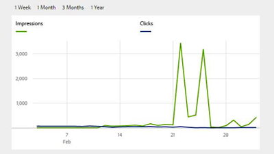
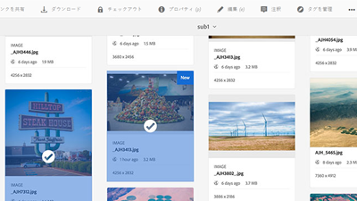

# 概要 {#overview}

Adobe Experience Managerアセットは、AEM Platformのデジタルアセット管理ツールで、Webベースのリポジトリでデジタルアセット(画像、ビデオ、ドキュメント、オーディオクリップ)を作成、管理、共有できます。 このユーザガイドには、AEM Assetsの多くの機能に関するビデオとチュートリアルが含まれています。

## 新機能

* **[アセットの公開（ビデオ）](./sharing/publish.md)**

   *AEM AuthorからAEM Publishへのアセットの発行に関する説明*

* **[透かし（ビデオ）](./advanced/watermarks.md)**

   *AEMでアセットレンディションをCloud Serviceとして透かしを付ける方法を説明します。*

* **[ベースライン権限（ビデオ）](./configuring/baseline-permissions.md)**

   *基本権限を持つAEM Assetsを設定する方法とその重要性について説明します。*

* **[自動開始ワークフロー（ビデオ）](./configuring/auto-start-workflows.md)**

   *アップロードされたアセットまたは再処理されたアセットでAEMワークフローを自動的に呼び出す方法を学びます。*

* **[処理プロファイル（ビデオ）](./configuring/processing-profiles.md)**

   *レンディションアセットに対してアセットマイクロサービスを呼び出す方法の確認*

## スタッフの選考

<table>
<td>
   
   

      <a href="./creative-workflows/aem-desktop-app.md">
      <strong>AEM Desktop App の使用</strong>
      </a>
   

   

      <em>デスクトップからAEMのアセットに直接アクセス</em>
   

</td>
<td>
   
   

      <a href="./advanced/asset-insights-launch-tutorial.md">
      <strong>AEM Asset Insightsの起動との使用</strong>
      </a>
   

   

      <em>アセットの使用方法に関する洞察を得る</em>
   

</td>
<td>
   
   

      <a href="./dynamic-media/dynamic-media-overview-feature-video-use.md">
      <strong>Dynamic Media概要</strong>
      </a>
   

   

      <em>Dynamic Mediaを使用したメディアコンテンツの管理とアクセス</em>
   

</td>
</table>

## その他のリソース

* [Experience League- AEMの調査](https://experienceleague.adobe.com/#recommended/solutions/experience-manager)
* [AEM Assets文書](https://helpx.adobe.com/jp/experience-manager/6-5/assets/user-guide.html)
* [AEM as a Cloud Service チュートリアル](/help/cloud-service/overview.md)
* [AEM Sites チュートリアル](/help/sites/overview.md)
* [AEM Forms チュートリアル](/help/forms/overview.md)
* [AEM Foundation チュートリアル](/help/foundation/overview.md)
