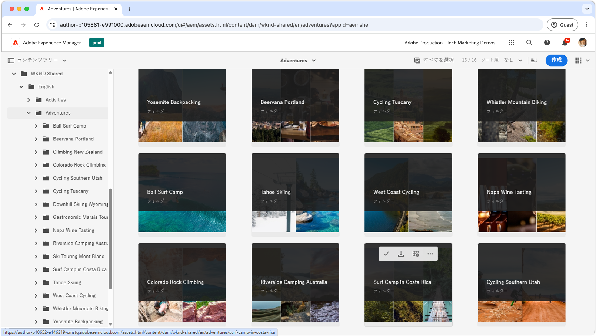

# 管理者向けビデオ再生リスト

{align="center"}

これらのプレイリストを調べて、AEM Assets as a Cloud Serviceの管理者ビューをマスターします。これには、設定、最適化、使用、クリエイティブワークフローとのシームレスな統合などが含まれます。 AEM Assets as a Cloud Serviceを使用して成功するために必要なインサイトを得る。

## 管理ビューの設定

AEM Assets as a Cloud Serviceをチームやプロジェクトに対してシームレスに動作させるための基本的な設定および設定の基本を学びます。

<!-- CARDS

* https://experienceleague.adobe.com/en/playlists/experience-manager-all-configure-administrative-access
* https://experienceleague.adobe.com/en/playlists/experience-manager-assets-configure-administrators

-->
<!-- START CARDS HTML - DO NOT MODIFY BY HAND -->

    

        

            

                <figure class="image x-is-16by9">
                    
                </figure>
            

            

                

                    

                        <a href="https://experienceleague.adobe.com/en/playlists/experience-manager-all-configure-administrative-access" target="_blank" rel="referrer" title="Experience Managerへの管理者アクセスの設定">Experience Managerへの管理者アクセスの設定 </a>
                    

                    
ユーザーがAEM as a Cloud Serviceに対してAdobe IMSを使用して認証する方法、およびAdobe IMSユーザー、ユーザーグループ、製品プロファイルを使用してAEMとその機能および機能性へのアクセスを制御する方法を確認します。

                

                <a href="https://experienceleague.adobe.com/en/playlists/experience-manager-all-configure-administrative-access" target="_blank" rel="referrer" class="spectrum-Button spectrum-Button--outline spectrum-Button--primary spectrum-Button--sizeM" style="align-self: flex-start; margin-top: 1rem;">
                    所要時間
                </a>
            

        

    

    

        

            

                <figure class="image x-is-16by9">
                    
                </figure>
            

            

                

                    

                        <a href="https://experienceleague.adobe.com/en/playlists/experience-manager-assets-configure-administrators" target="_blank" rel="referrer" title="AEM Assetsの設定">AEM Assetsの設定 </a>
                    

                    
ベースラインコンテンツアーキテクチャや分類の設定からメタデータやアセット処理のカスタマイズに至るまで、中心的事項を設定して、AEM Assets実装のための強固な基盤を確立する方法を説明します。

                

                <a href="https://experienceleague.adobe.com/en/playlists/experience-manager-assets-configure-administrators" target="_blank" rel="referrer" class="spectrum-Button spectrum-Button--outline spectrum-Button--primary spectrum-Button--sizeM" style="align-self: flex-start; margin-top: 1rem;">
                    所要時間
                </a>
            

        

    

<!-- END CARDS HTML - DO NOT MODIFY BY HAND -->

## 管理ビューの基本を学ぶ

プロのような管理インターフェイスでの操作 – アセットを効率的に管理するためのツールとテクニックを説明します。

<!-- CARDS

* https://experienceleague.adobe.com/en/playlists/experience-manager-assets-get-started-business-users  
* https://experienceleague.adobe.com/en/playlists/experience-manager-assets-understand-metadata
* https://experienceleague.adobe.com/en/playlists/experience-manager-assets-optimize-search
* https://experienceleague.adobe.com/en/playlists/experience-manager-assets-use-smart-tags

-->
<!-- START CARDS HTML - DO NOT MODIFY BY HAND -->

    

        

            

                <figure class="image x-is-16by9">
                    
                </figure>
            

            

                

                    

                        <a href="https://experienceleague.adobe.com/en/playlists/experience-manager-assets-get-started-business-users" target="_blank" rel="referrer" title="ビジネスユーザー向けAEM Assets管理者ビューの概要"> ビジネスユーザー向けのAEM Assets管理者ビューの概要 </a>
                    

                    
ナビゲーション、アセットの整理およびモデル化の方法、作成、更新、削除などの基本的な操作など、AEM Assets管理ビューの基本について説明します。

                

                <a href="https://experienceleague.adobe.com/en/playlists/experience-manager-assets-get-started-business-users" target="_blank" rel="referrer" class="spectrum-Button spectrum-Button--outline spectrum-Button--primary spectrum-Button--sizeM" style="align-self: flex-start; margin-top: 1rem;">
                    所要時間
                </a>
            

        

    

    

        

            

                <figure class="image x-is-16by9">
                    
                </figure>
            

            

                

                    

                        <a href="https://experienceleague.adobe.com/en/playlists/experience-manager-assets-understand-metadata" target="_blank" rel="referrer" title="AEM Assetsのアセットメタデータについて">AEM Assetsでのアセットメタデータについて </a>
                    

                    
AEM Assetsのアセットメタデータについて知る必要のあるすべての事項を説明します。

                

                <a href="https://experienceleague.adobe.com/en/playlists/experience-manager-assets-understand-metadata" target="_blank" rel="referrer" class="spectrum-Button spectrum-Button--outline spectrum-Button--primary spectrum-Button--sizeM" style="align-self: flex-start; margin-top: 1rem;">
                    所要時間
                </a>
            

        

    

    

        

            

                <figure class="image x-is-16by9">
                    
                </figure>
            

            

                

                    

                        <a href="https://experienceleague.adobe.com/en/playlists/experience-manager-assets-optimize-search" target="_blank" rel="referrer" title="AEM Assetsでの検索の最適化">AEM Assetsでの検索の最適化 </a>
                    

                    
AEM Assetsで検索エクスペリエンスを最大限に活用する方法を説明します

                

                <a href="https://experienceleague.adobe.com/en/playlists/experience-manager-assets-optimize-search" target="_blank" rel="referrer" class="spectrum-Button spectrum-Button--outline spectrum-Button--primary spectrum-Button--sizeM" style="align-self: flex-start; margin-top: 1rem;">
                    所要時間
                </a>
            

        

    

    

        

            

                <figure class="image x-is-16by9">
                    
                </figure>
            

            

                

                    

                        <a href="https://experienceleague.adobe.com/en/playlists/experience-manager-assets-use-smart-tags" target="_blank" rel="referrer" title="スマートタグを使用したアセット検出の強化"> スマートタグを使用したアセット検出の強化 </a>
                    

                    
AEM Assetsでスマートタグを使用してアセットを検出可能にする方法を説明します。

                

                <a href="https://experienceleague.adobe.com/en/playlists/experience-manager-assets-use-smart-tags" target="_blank" rel="referrer" class="spectrum-Button spectrum-Button--outline spectrum-Button--primary spectrum-Button--sizeM" style="align-self: flex-start; margin-top: 1rem;">
                    所要時間
                </a>
            

        

    

<!-- END CARDS HTML - DO NOT MODIFY BY HAND -->

## クリエイティブワークフローとAEM Assetsの接続

AEM Assets as a Cloud Serviceをクリエイティブツールと統合し、凝集した効率的なワークフローを確保することで、スムーズなコラボレーションを実現します。

<!-- CARDS

* https://experienceleague.adobe.com/en/playlists/experience-manager-assets-create-renditions-content-automation
* https://experienceleague.adobe.com/en/playlists/experience-manager-assets-use-creative-operations-with-content-automation

-->
<!-- START CARDS HTML - DO NOT MODIFY BY HAND -->

    

        

            

                <figure class="image x-is-16by9">
                    
                </figure>
            

            

                

                    

                        <a href="https://experienceleague.adobe.com/en/playlists/experience-manager-assets-create-renditions-content-automation" target="_blank" rel="referrer" title="AEM コンテンツ自動処理を使用したカスタムレンディションの作成">AEM コンテンツ自動処理を使用したカスタムレンディションの作成 </a>
                    

                    
コンテンツ自動処理アドオンを使用して、Adobe Experience Manager Assets as a Cloud Service をAdobe Creative Cloud Service API と統合し、アセットを効率的に処理する方法を説明します。

                

                <a href="https://experienceleague.adobe.com/en/playlists/experience-manager-assets-create-renditions-content-automation" target="_blank" rel="referrer" class="spectrum-Button spectrum-Button--outline spectrum-Button--primary spectrum-Button--sizeM" style="align-self: flex-start; margin-top: 1rem;">
                    所要時間
                </a>
            

        

    

    

        

            

                <figure class="image x-is-16by9">
                    
                </figure>
            

            

                

                    

                        <a href="https://experienceleague.adobe.com/en/playlists/experience-manager-assets-use-creative-operations-with-content-automation" target="_blank" rel="referrer" title="AEM Assets コンテンツ自動処理でのCreative操作の使用">AEM Assets コンテンツ自動処理でのCreative操作の使用 </a>
                    

                    
コンテンツ自動処理アドオンを使用して、Adobe Experience Manager AssetsでCreative Cloud操作を実行する方法を説明します。

                

                <a href="https://experienceleague.adobe.com/en/playlists/experience-manager-assets-use-creative-operations-with-content-automation" target="_blank" rel="referrer" class="spectrum-Button spectrum-Button--outline spectrum-Button--primary spectrum-Button--sizeM" style="align-self: flex-start; margin-top: 1rem;">
                    所要時間
                </a>
            

        

    

<!-- END CARDS HTML - DO NOT MODIFY BY HAND -->

