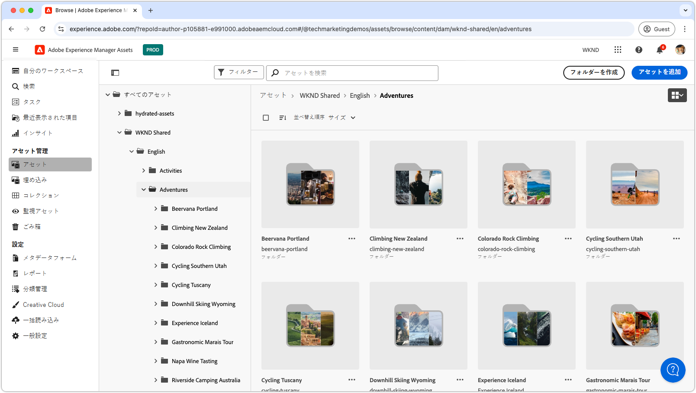

# Assets ビューのビデオ再生リスト

{align="center"}

これらのプレイリストを調べて、AEM Assetsのas a Cloud ServiceのAssets ビュー（設定、最適化、使用、クリエイティブワークフローとのシームレスな統合など）をマスターします。 AEM Assetsのas a Cloud Serviceを活用して、成功に必要なインサイトを得ます。

## Assets ビューを設定

AEM Assetsas a Cloud Serviceをチームやプロジェクトでシームレスに動作させるための基本的な設定および設定の基本を学びます。

<!-- CARDS

* https://experienceleague.adobe.com/en/playlists/experience-manager-all-configure-administrative-access
* https://experienceleague.adobe.com/en/playlists/experience-manager-assets-get-started-assets-essentials

-->
<!-- START CARDS HTML - DO NOT MODIFY BY HAND -->

    

        

            

                <figure class="image x-is-16by9">
                    
                </figure>
            

            

                

                    

                        <a href="https://experienceleague.adobe.com/en/playlists/experience-manager-all-configure-administrative-access" target="_blank" rel="referrer" title="Experience Managerへの管理者アクセスの設定">Experience Managerへの管理アクセスの設定 </a>
                    

                    
AEM as a Cloud Serviceに対するAdobe IMSを使用したユーザーの認証方法と、Adobe IMSユーザー、ユーザーグループおよび製品プロファイルを使用してAEMおよびその機能および機能へのアクセスを制御する方法について説明します。

                

                <a href="https://experienceleague.adobe.com/en/playlists/experience-manager-all-configure-administrative-access" target="_blank" rel="referrer" class="spectrum-Button spectrum-Button--outline spectrum-Button--primary spectrum-Button--sizeM" style="align-self: flex-start; margin-top: 1rem;">
                     ウォッチ 
                </a>
            

        

    

    

        

            

                <figure class="image x-is-16by9">
                    
                </figure>
            

            

                

                    

                        <a href="https://experienceleague.adobe.com/en/playlists/experience-manager-assets-get-started-assets-essentials" target="_blank" rel="referrer" title="AEM Assets Essentials の基本を学ぶ">AEM Assets Essentials の概要 </a>
                    

                    
AEM Assets Essentials で部門のアセット管理を効率化する方法を説明します。

                

                <a href="https://experienceleague.adobe.com/en/playlists/experience-manager-assets-get-started-assets-essentials" target="_blank" rel="referrer" class="spectrum-Button spectrum-Button--outline spectrum-Button--primary spectrum-Button--sizeM" style="align-self: flex-start; margin-top: 1rem;">
                     ウォッチ 
                </a>
            

        

    

<!-- END CARDS HTML - DO NOT MODIFY BY HAND -->

## アセットビューの概要

Assets ビューインターフェイスをプロのように操作する – アセットを効率的に管理するためのツールとテクニックを学びます。

<!-- CARDS

* https://experienceleague.adobe.com/en/playlists/experience-manager-assets-generate-image-assets-with-adobe-firefly
* https://experienceleague.adobe.com/en/playlists/experience-manager-assets-assets-view-search-use

-->
<!-- START CARDS HTML - DO NOT MODIFY BY HAND -->

    

        

            

                <figure class="image x-is-16by9">
                    
                </figure>
            

            

                

                    

                        <a href="https://experienceleague.adobe.com/en/playlists/experience-manager-assets-generate-image-assets-with-adobe-firefly" target="_blank" rel="referrer" title="Adobe Fireflyを使用して画像Assetsを生成">Adobe Fireflyを使用して画像Assetsを生成 </a>
                    

                    
AEM AssetsでAdobe Fireflyと Gen AI を使用してコンテンツベロシティ（コンテンツ創出の速度）を向上させる方法を説明します。

                

                <a href="https://experienceleague.adobe.com/en/playlists/experience-manager-assets-generate-image-assets-with-adobe-firefly" target="_blank" rel="referrer" class="spectrum-Button spectrum-Button--outline spectrum-Button--primary spectrum-Button--sizeM" style="align-self: flex-start; margin-top: 1rem;">
                     ウォッチ 
                </a>
            

        

    

    

        

            

                <figure class="image x-is-16by9">
                    
                </figure>
            

            

                

                    

                        <a href="https://experienceleague.adobe.com/en/playlists/experience-manager-assets-assets-view-search-use" target="_blank" rel="referrer" title="AEM Assets Assets ビューで検索して、Assetsを見つけます">AEM Assets Assets ビューで検索して、Assetsを見つける </a>
                    

                    
AEM Assets Assets ビュー検索を使用してアセットをすばやく簡単に見つける方法を説明します。

                

                <a href="https://experienceleague.adobe.com/en/playlists/experience-manager-assets-assets-view-search-use" target="_blank" rel="referrer" class="spectrum-Button spectrum-Button--outline spectrum-Button--primary spectrum-Button--sizeM" style="align-self: flex-start; margin-top: 1rem;">
                     ウォッチ 
                </a>
            

        

    

<!-- END CARDS HTML - DO NOT MODIFY BY HAND -->

## クリエイティブワークフローとAEM Assetsの接続

AEM Assetsのas a Cloud Serviceをクリエイティブツールと統合することで、スムーズなコラボレーションを活用し、凝集した効率的なワークフローを確保します。

<!-- CARDS

* https://experienceleague.adobe.com/en/playlists/experience-manager-assets-manage-creative-workflows-with-workfront-and-assets-essentials

-->
<!-- START CARDS HTML - DO NOT MODIFY BY HAND -->

    

        

            

                <figure class="image x-is-16by9">
                    
                </figure>
            

            

                

                    

                        <a href="https://experienceleague.adobe.com/en/playlists/experience-manager-assets-manage-creative-workflows-with-workfront-and-assets-essentials" target="_blank" rel="referrer" title="WorkfrontとAssets Essentialsを使用したクリエイティブワークフローの管理">WorkfrontとAssets Essentialsを使用したクリエイティブワークフローの管理 </a>
                    

                    
Adobe WorkfrontとExperience Manager Assets Essentials でクリエイティブワークフローを管理する方法を説明します。

                

                <a href="https://experienceleague.adobe.com/en/playlists/experience-manager-assets-manage-creative-workflows-with-workfront-and-assets-essentials" target="_blank" rel="referrer" class="spectrum-Button spectrum-Button--outline spectrum-Button--primary spectrum-Button--sizeM" style="align-self: flex-start; margin-top: 1rem;">
                     ウォッチ 
                </a>
            

        

    

<!-- END CARDS HTML - DO NOT MODIFY BY HAND -->

