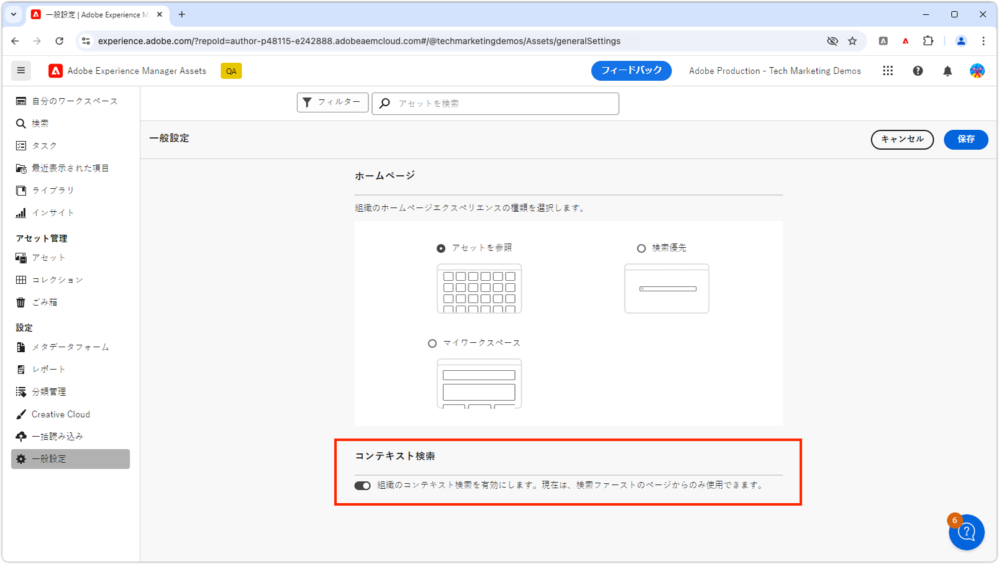

# コンテキスト検索

Adobe Experience Manager Assets のコンテキスト検索を使用して、自然言語クエリでアセットを効率的に見つける方法を説明します。

>[!VIDEO](https://video.tv.adobe.com/v/3428667/?learn=on)

## コンテキスト検索の切り替え

すべてのユーザーに対してコンテキスト検索を有効または無効にするには、AEM 管理者は&#x200B;__一般設定__&#x200B;に移動し、__コンテキスト検索__&#x200B;を目的の設定に切り替えることで実行できます。

デフォルトでは、コンテキスト検索はすべてのユーザーに対して有効になっています。

