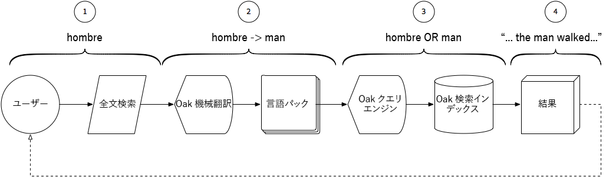

# AEM Assetsでのスマート翻訳検索の使用{#using-smart-translation-search-with-aem-assets}

スマート翻訳検索を使用すると、AEMコンテンツ、アセットとページの両方にわたって自動的に多言語間の検索と検出が可能になり、50以上の言語をサポートし、手動コンテンツ翻訳の必要性を減らすことができます。

>[!VIDEO](https://video.tv.adobe.com/v/21297/?quality=9&learn=on)

AEM Smart Translation Searchを使用すると、ユーザーは英語以外の用語を使用してAEMのコンテンツの検索を実行し、同等の英語の用語を持つAEMのアセットと一致させることができます。

スマート翻訳検索は、英語でアセットに適用されるAEMのスマートタグに対して完璧な補完機能です。

このビデオでは、 [AEM Smart Translation Search](smart-translation-search-technical-video-setup.md) （スマート翻訳検索）が設定済みであることを前提としています。

## スマート翻訳検索の仕組み {#how-smart-translation-search-works}

1. AEMユーザーがフルテキスト検索を実行し、ローカライズされた検索語句( スペイン語で「man」、「hombre」を表す用語)。
2. Apache Oak Machine Translation OSGiバンドルが提供するSmart Translation Searchが関与し、提供された検索用語が登録済みの言語パックを使用して翻訳できるかどうかを評価します。
3. 手順#2の翻訳済みのすべての用語が収集され、クエリが内部的に拡張されて、検索用語として含められます。 この拡張された検索用語セットは、関連する一致を探すAEM検索インデックスに対して通常評価される場合に使用します。
4. 元の語（「本語」）や翻訳語（「人」）に一致する検索結果が収集され、検索結果としてユーザに返送される。

## その他のリソース{#additional-resources}

* [AEM Assetsでのスマート翻訳検索の設定](smart-translation-search-technical-video-setup.md)
* [Apache Joshua言語パック](https://cwiki.apache.org/confluence/display/JOSHUA/Language+Packs)