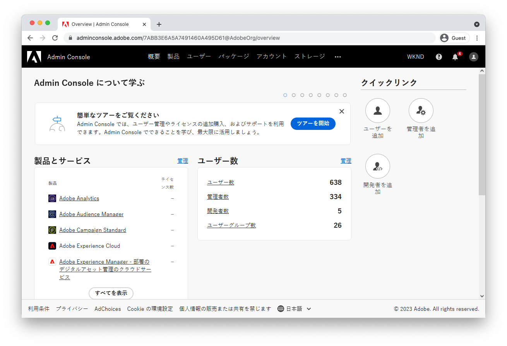

# AEM as a Cloud Service へのアクセスの設定 {#configuring-access-to-aem-as-a-cloud-service}

>[!CONTEXTUALHELP]
>id="aemcloud_adobeims_overview"
>title="Adobe IMS の概要"
>abstract="AEM as a Cloud Service は、AEM オーサーサービスへのユーザー (管理者と通常のユーザーの両方) のログインを容易にするために、Adobe IMS (Identity Management System) を活用します。Adobe IMS のユーザー、グループおよび製品プロファイルを AEM のグループおよび権限と連携して使用し、AEM オーサーサービスへのきめ細かなアクセス制御を提供する方法を説明します。"

AEM as a Cloud Service により、AEM アプリケーションをクラウドネイティブな方法で利用できます。そのため、Adobe IMS（ID 管理システム）を活用することで、管理者ユーザーも一般ユーザーも AEM オーサーサービスにログインしやすくなります。

Adobe IMS のユーザー、グループおよび製品プロファイルを AEM のグループおよび権限と連携して使用し、AEM オーサーサービスへのきめ細かなアクセス制御を提供する方法を説明します。

## Adobe IMS ユーザー

AEM オーサーサービスへのアクセスが必要なユーザーは、[Adobe Admin Console](https://adminconsole.adobe.com) で [Adobe IMS ユーザー](https://helpx.adobe.com/jp/enterprise/using/set-up-identity.html)として管理されます。Adobe IMS ユーザーとは何か、および Admin Console での Adobe IMS ユーザーへのアクセス方法や管理方法について説明します。

>[!NOTE]
>
>IMS ユーザーを Admin Console から削除しても AEM からは自動的に削除されませんが、AEM セッション（トークン）の有効期限が切れると AEM にログインできなくなります。

[Adobe IMS ユーザーについて](./adobe-ims-users.md)

## Adobe IMS ユーザーグループ

AEM オーサーサービスにアクセスするユーザーは、[Adobe Admin Console](https://adminconsole.adobe.com) で [Adobe IMS ユーザーグループ](https://helpx.adobe.com/jp/enterprise/using/user-groups.html)を使用して論理グループに編成する必要があります。Adobe IMS ユーザーグループは、AEM への権限やアクセス許可を直接提供するものではありません（その制御は [Adobe IMS 製品プロファイル](#adobe-ims-product-profiles)の役割です）。ただし、ユーザーの論理グループを定義すると、AEM のグループと権限を使用して、AEM オーサーサービスの特定のアクセスレベルに変換することができます。

[Adobe IMS ユーザーグループについて](./adobe-ims-user-groups.md)

## Adobe IMS 製品プロファイル

[Adobe IMS 製品プロファイル](https://helpx.adobe.com/jp/enterprise/using/manage-permissions-and-roles.html)は、[Adobe IMS ユーザー](#adobe-ims-users)が AEM オーサーサービスにログインするための基本レベルのアクセスを提供する仕組みで、[Adobe Admin Console](https://adminconsole.adobe.com) で管理されます。

+ __AEM ユーザー__&#x200B;の製品プロファイルでは、AEM の「コントリビューター」グループのメンバーシップを通じて、ユーザーに AEM への読み取り専用アクセスを提供します。
+ __AEM 管理者__&#x200B;の製品プロファイルでは、ユーザーに AEM への完全な管理アクセスを提供します。

[Adobe IMS 製品プロファイルについて](./adobe-ims-product-profiles.md)

## AEM のユーザー、グループ、権限

Adobe Experience Manager は、Adobe IMS ユーザー、ユーザーグループおよび製品プロファイルに基づいて構築されており、AEM へのカスタマイズ可能なアクセスをユーザーに提供します。AEM のグループと権限を定義する方法と、Adobe IMS の抽象概念と連携して AEM へのシームレスかつカスタマイズ可能なアクセスを提供する方法について説明します。

[AEM のユーザー、グループ、権限について](./aem-users-groups-and-permissions.md)

## アクセスと権限に関するウォークスルー

Adobe Admin Console で Adobe IMS ユーザー、ユーザーグループおよび製品プロファイルを設定する手順の概要と、AEM Author で Adobe IMS のこれらの抽象概念を活用して特定のグループベースの権限を定義し、管理する方法について説明します。

[AEM のアクセスと権限に関するウォークスルー](./walk-through.md)

## Adobe Admin Console のその他のリソース

以下のドキュメントでは、[Adobe Admin Console](https://adminconsole.adobe.com) 固有の詳細事項と懸念事項について説明します。これらは、Adobe Admin Console をより深く理解し、それを使用して Experience Cloud 製品全体にわたってユーザーとアクセスを管理するのに役立ちます。

+ [Adobe Admin Console の ID の概要](https://helpx.adobe.com/jp/enterprise/using/identity.html)
+ [Adobe Admin Console の管理者ロール](https://helpx.adobe.com/jp/enterprise/using/admin-roles.html)
+ [Adobe Admin Console の開発者ロール](https://helpx.adobe.com/jp/enterprise/using/manage-developers.html)
