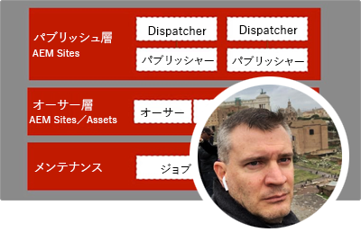
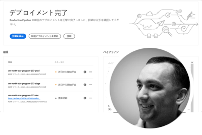
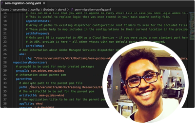

# Adobe Experience Manager as a Cloud Service Experts Series

Adobe Experience Manager(AEM) を構築するAdobeのエキスパートエンジニアや、それを提供するプロフェッショナルサービスチームからas a Cloud Service的に取り組む方法について説明します。 Adobeの専門家に参加して、AEMのas a Cloud Service、AEM 6 との同じ機能と違い、AEM 6 からAEM as a Cloud Serviceへの移行方法を調べます。

  
 

## AEM as a Cloud Service - はじめに

AEM as a Cloud Servicesの基本と、AEM 6 との違い、Adobeエンジニアリングの上級クラウドアーキテクトとの違いについて説明します。

<table>
  <tr>
   <td>
      
      

         <a href="./migration/moving-to-aem-as-a-cloud-service/introduction.md"><strong>違う考え方</strong></a>         
          <em>Darin Kuntze 氏（上級クラウドアーキテクト）</em>
      

      

         
         AEM as a Cloud Serviceのアーキテクチャと、AEM as a Cloud Service実装に関する考え方を説明します。
      

     </td>   
     <td>
      
      

         <a href="./migration/moving-to-aem-as-a-cloud-service/onboarding.md"><strong>AEM as a Cloud Serviceのオンボーディング</strong></a>
          <em>Damian Langsweirdt 氏（シニアクラウドアーキテクト）</em>
      

      

         
         AEM as a Cloud Serviceのオンボーディングについて説明します。まず、Cloud Manager を使用してセルフサービス環境を設定する契約段階から始まります。
      

   </td>     
   </td>   
     <td>
      
      

         <a href="./migration/moving-to-aem-as-a-cloud-service/cloud-manager.md"><strong>AEM as a Cloud Service版 Cloud Manager</strong></a>
          <em>Bryan Stopp 氏（上級クラウドアーキテクト）</em>
      

      

         
         AEM as a Cloud Service向け Cloud Manager と、AEM版 Cloud Manager for Adobe on Cloud Manager Services(AMS) との違いについて説明します。
      

   </td> 
  </tr>
</table>

## AEM as a Cloud Service への移行?

AEM 6 からAEM as a Cloud Serviceに移行する予定は？ AdobeがAEM as a Cloud Serviceに移行するための方法論と、これをスムーズな移行にする様々なツールおよび機能について説明します。

<table>
  <tr>
   <td>
      
      

         <a href="./migration/moving-to-aem-as-a-cloud-service/bpa-and-cam.md" target="_aem-experts-series-video"><strong>移行手法</strong></a>
          <em>ロジャー・ブラントンとAdobe・コンサルティング・サービス・テクニカル・アーキテクト</em>
      

      

         
        AEM Best Practice Analyzer(BPA) と Cloud Acceleration Manager(CAM) を使用して、AEM 6 からAEM as a Cloud Serviceに移行する際のベストプラクティス移行方法を確認します。
      

   </td>   
     <td>
      
      

         <a href="./migration/moving-to-aem-as-a-cloud-service/aem-modernization-tools.md" target="_aem-experts-series-video"><strong>コンテンツの最新化</strong></a>
          <em>Bryan Stopp 氏（上級クラウドアーキテクト）</em>
      

      

         
         最新のAEMas a Cloud Service機能を利用するために、AEMコンテンツを自動的に最新化する方法を説明します。
      

   </td>     
   </td>   
     <td>
      
      

         <a href="./migration/moving-to-aem-as-a-cloud-service/repository-modernization.md" target="_aem-experts-series-video"><strong>AEM Maven プロジェクトの最新化</strong></a>
          <em>クラウドアーキテクト、Varun Mitra との連携</em>
      

      

         
         カスタムAEMアプリケーションの Maven プロジェクト構造と組織を自動的に最新化し、AEMとas a Cloud Serviceの互換性を保ち、Adobeの最新のベストプラクティスに合わせる方法を説明します。
      

   </td> 
  </tr>
  <tr>
   <td>
      
      

         <a href="./migration/moving-to-aem-as-a-cloud-service/search-and-indexing.md" target="_aem-experts-series-video"><strong>Oak インデックスの最新化</strong></a>
          <em>Darin Kuntze 氏（上級クラウドアーキテクト）</em>
      

      

         
        AEM 6 Oak インデックス定義をAEMas a Cloud Service互換に自動変換する方法と、今後AEMas a Cloud Service用の Oak インデックスを維持する方法について説明します。
      

   </td>   
     <td>
      
      

         <a href="./migration/moving-to-aem-as-a-cloud-service/dispatcher.md" target="_aem-experts-series-video"><strong>Dispatcher 設定の最新化</strong></a>
          <em>Bryan Stopp 氏（上級クラウドアーキテクト）</em>
      

      

         
         AEM 6 向け Dispatcher の主な変更点、Dispatcher 変換ツール、および Dispatcher ツール SDK の使用方法に重点を置いた、AEMas a Cloud Service版のAEM Dispatcher について説明します。
      

   </td>     
   </td>   
     <td>
      
      

         <a href="./migration/moving-to-aem-as-a-cloud-service/content-migration/content-transfer-tool.md" target="_aem-experts-series-video"><strong>AEM as a Cloud Serviceへのコンテンツの転送</strong></a>
          <em>シニアクラウドアーキテクトの Kiran Murugulla 氏と</em>
      

      

         
         コンテンツ転送ツールを使用して、AEM 6.3 以降からas a Cloud Serviceにコンテンツを移行する方法を説明します。
      

   </td> 
  </tr>  
</table>

## AEM as a Cloud Services機能

AEMas a Cloud Serviceの独自の機能について、Adobeの専門家にお問い合わせください。

<table>
  <tr>
   <td>
      
      

         <a href="./migration/moving-to-aem-as-a-cloud-service/asset-compute-microservices.md" target="_aem-experts-series-video"><strong>asset computeマイクロサービス</strong></a>
          <em>Amol Anand 氏と共に、主要クラウドアーキテクト</em>
      

      

         
        AEM Assets のAsset computeマイクロサービス、AEM 6 のアセット処理を置き換える方法、およびカスタムアセットレンディションを生成するために拡張する方法について説明します。
      

   </td>   
    <td></td>
    <td></td>
  </tr>
</table>
