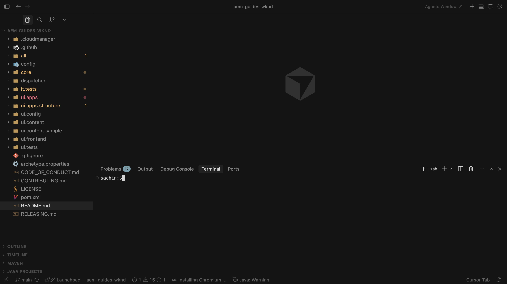
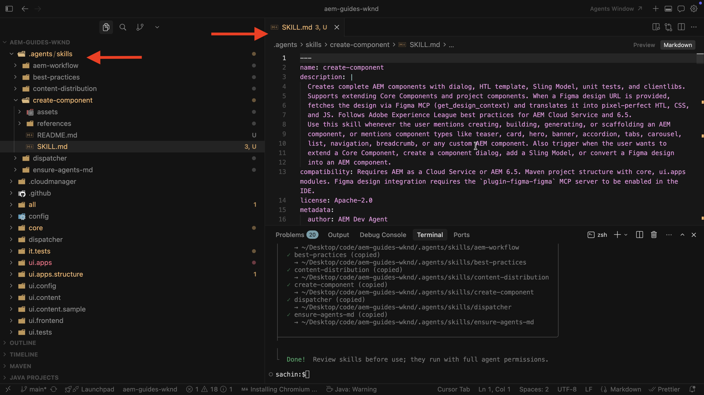

# AEM エージェントスキルの設定

AIを活用した開発にAEM Agent Skillsを設定する方法を説明します。

AIを活用したIDEを介してコーディングエージェントにAEM開発タスクの作業を依頼すると、汎用モデルトレーニングやリポジトリから推測できることだけを使用するのではなく、**AEM Agent Skills** Adobeの手順ガイダンスを使用できます。

Adobeは、[AEM Skills](https://github.com/adobe/skills) リポジトリを介してAdobe Agent Skillsを提供します。 AdobeがAI支援による開発にどのように役立つかについては、[AI支援による開発](../overview.md)も参照してください。

このチュートリアルでは、[WKND Sites プロジェクト &#x200B;](https://github.com/adobe/aem-guides-wknd)のローカルクローンにスキルをインストールします。 同じ手順を独自のAEM as a Cloud Service プロジェクトに使用できます。

>[!VIDEO](https://video.tv.adobe.com/v/3484940/?learn=on&enablevpops)

## 前提条件

このチュートリアルに従うには、次の操作が必要です。

- [WKND Sites プロジェクト &#x200B;](https://github.com/adobe/aem-guides-wknd)または独自のAEM as a Cloud Service プロジェクトのローカルクローン。
- カーソルやGitHub Copilot機能を備えたVisual Studio CodeなどのAIを活用したIDE。

## AEM Agent Skillsのインストール

`npx` コマンドを使用してAEM Agent Skillsをインストールします（[Node.js](https://nodejs.org/)が必要なので、`npx`を利用できます）。 Claude Code プラグインやGitHub CLI拡張機能など、その他のインストールオプションについては、Adobe Skills リポジトリの「[&#x200B; インストール &#x200B;](https://github.com/adobe/skills/tree/main#installation)」セクションを参照してください。

1. [WKND サイトプロジェクト &#x200B;](https://github.com/adobe/aem-guides-wknd)をローカルに複製します。

   ```shell
   $ git clone https://github.com/adobe/aem-guides-wknd.git
   ```

1. AIを搭載したIDE （カーソルなど）で複製されたプロジェクトを開き、統合ターミナルを開きます。
   

1. 次のコマンドを実行して、AEM Agent Skills for Cursorを追加します。

   ```shell
   $ npx skills add https://github.com/adobe/skills/tree/main/plugins/aem/cloud-service --agent cursor
   ```

   その他のエージェントタイプについては、Adobe Skills リポジトリの[&#x200B; インストール &#x200B;](https://github.com/adobe/skills/tree/main#installation) セクションを参照してください。

1. プロンプトが表示されたら、インストールするAEM Agent Skillsを選択します。
   

   **ensure-agents-md** スキルを選択して、インストーラーがリポジトリルートで&#x200B;**AGENTS.md**&#x200B;および&#x200B;**CLAUDE.md** ファイルを作成できるようにします。 そのブートストラップスキルは、ルート `pom.xml`やモジュールなどのプロジェクトを検査し、カスタマイズされたエージェントのガイダンスを生成します。

   **AGENTS.md**&#x200B;が既に存在する場合、**not**&#x200B;は上書きされます。

1. インストール範囲を選択します。 このチュートリアルでは、**プロジェクト**&#x200B;のスコープが一般的なので、スキルファイルがリポジトリに存在します。
   

1. `.agents/skills`の下のインストールを確認してください。 **SKILLS.md**&#x200B;および関連する参照フォルダーとアセットフォルダーが表示されます。
   

1. Adobeでスキルを追加または更新する場合は、CLIを使用してスキルを追加、更新、削除または一覧表示します。 すべてのコマンドを表示するには：

   ```shell
   $ npx skills --help
   ```

   

## ユースケース

<!-- 
CARDS
{target = _self}

* ../use-cases/component-development.md    
    {title = Create AEM Component with AI-assisted development}
    {description = Learn how to use AI-assisted development to develop AEM components.}
    {image = ../assets/component-development/review-generated-code.png}
    {cta = Create AEM Component}
-->
<!-- START CARDS HTML - DO NOT MODIFY BY HAND -->
<div class="columns">
    <div class="column is-half-tablet is-half-desktop is-one-third-widescreen" aria-label="Create AEM Component with AI-assisted development">
        <div class="card" style="height: 100%; display: flex; flex-direction: column; height: 100%;">
            <div class="card-image">
                <figure class="image x-is-16by9">
                    <a href="../use-cases/component-development.md" title="AIを活用した開発でAEM コンポーネントを作成する" target="_self" rel="referrer">
                        
                    </a>
                </figure>
            </div>
            <div class="card-content is-padded-small" style="display: flex; flex-direction: column; flex-grow: 1; justify-content: space-between;">
                <div class="top-card-content">
                    <p class="headline is-size-6 has-text-weight-bold">
                        <a href="../use-cases/component-development.md" target="_self" rel="referrer" title="AIを活用した開発でAEM コンポーネントを作成する">AIを活用した開発でAEM コンポーネントを作成</a>
                    </p>
                    <p class="is-size-6">AIを活用した開発を使用して、AEMコンポーネントを開発する方法を説明します。</p>
                </div>
                <a href="../use-cases/component-development.md" target="_self" rel="referrer" class="spectrum-Button spectrum-Button--outline spectrum-Button--primary spectrum-Button--sizeM" style="align-self: flex-start; margin-top: 1rem;">
                    <span class="spectrum-Button-label has-no-wrap has-text-weight-bold">AEM コンポーネントの作成</span>
                </a>
            </div>
        </div>
    </div>
</div>
<!-- END CARDS HTML - DO NOT MODIFY BY HAND -->

## その他のリソース

- [AI ツールを使用したローカル開発](https://experienceleague.adobe.com/ja/docs/experience-manager-cloud-service/content/ai-in-aem/local-development-with-ai-tools)

- [AI コーディングエージェント向けAdobeのスキル](https://github.com/adobe/skills)

- [AGENTS.md](https://agents.md/)

- [エージェントスキル](https://agentskills.io/home)
