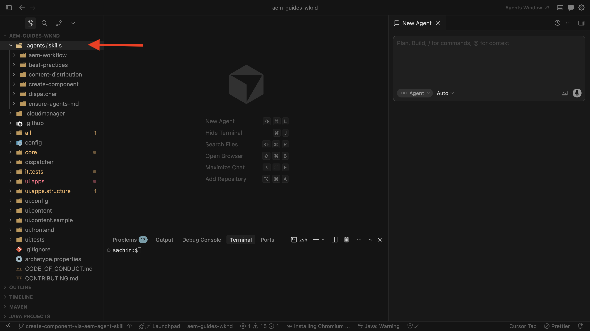
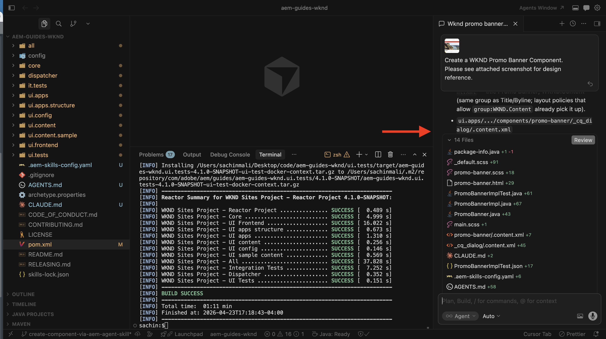
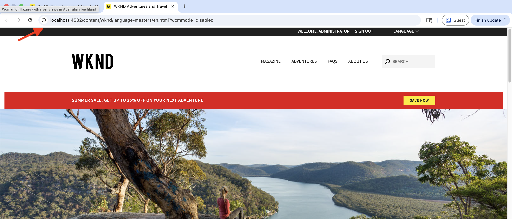
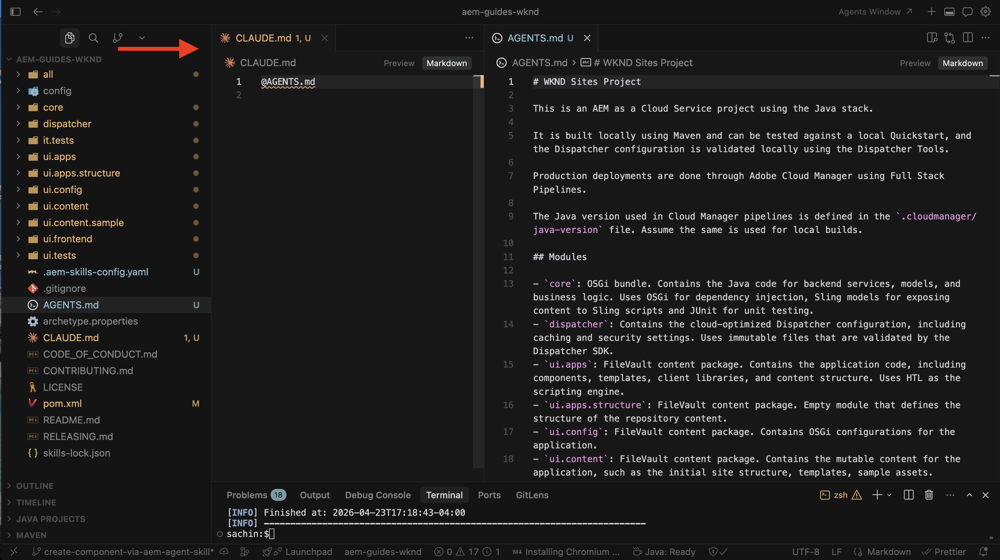

# AEM Agent Skillsを使用したコンポーネント開発

AEM Agent Skillsを[AI支援の開発](../overview.md)の一部として使用して、AEM コンポーネントを開発する方法を説明します。

このチュートリアルでは、AIを活用したIDE （カーソルなど）で自然言語を使用して、[WKND サイトプロジェクト &#x200B;](https://github.com/adobe/aem-guides-wknd)で&#x200B;**プロモーションバナー** コンポーネントを開発します。 コーディングエージェントは、`create-component` AEM エージェントスキルを適用して実装を生成します。

>[!VIDEO](https://video.tv.adobe.com/v/3484952/?learn=on&enablevpops)

## 前提条件

このチュートリアルに従うには、次の操作が必要です。

- カーソルやGitHub Copilot機能を備えたVisual Studio CodeなどのAIを活用したIDE。
- [WKND Sites プロジェクト &#x200B;](https://github.com/adobe/aem-guides-wknd)のローカルクローンがビルドされ、_ローカル AEM SDK_ インスタンスにデプロイされました。
- そのプロジェクトに&#x200B;_AEM Agent Skills_&#x200B;がインストールされています。 まだ実行していない場合は、[AEM エージェントスキルの設定](../setup/agent-skills.md)を完了してください。

## コンポーネント要件

WKND チームがホームページにプロモーションバナーを表示する場合、デザイン参照は次のようになります。


作成者は、コンポーネントダイアログで&#x200B;_プロモーションラベル_、_CTAラベル_、_CTAリンク_&#x200B;のフィールドを設定できる必要があります。

デザイン参照は、ワイヤーフレーム、モックアップ、または静的マークアップキャプチャを介して取得されたスクリーンショットです。

## コンポーネントの開発

1. IDEでWKND プロジェクトを開きます。 AEM エージェントスキルが存在することを確認し（例：`.agents/skills`）、新しいエージェントチャットを開始します。
   

1. 次のようなプロンプトを入力します。 IDEがチャットで画像をサポートしている場合は、コンポーネントデザインのスクリーンショット（ワイヤーフレーム、モックアップ、または静的マークアップキャプチャを介して取得）を添付します。

   ```text
   Create a WKND Promo Banner Component. Please see attached screenshot for design reference.
   
   Dialog specification are:
   
   1. Promo Label - Textfield, required
   2. CTA Text - Textfield, required
   3. CTA Link - Pathfield, required
   ```

1. コーディングエージェントは、`create-component` AEM エージェントスキルを使用してコンポーネントを生成します。 提案されたHTL、Sling モデル、ダイアログ XMLおよび関連ファイルを確認します。
   

>[!TIP]
>
>デザイン参照をスクリーンショットとして提供する代わりに、[Figma MCP サーバー](https://www.figma.com/mcp-catalog/)を介してFigma デザインを提供してコンポーネントを生成することもできます。 `create-component` スキルは[Figma デザイン統合](https://github.com/adobe/skills/blob/main/plugins/aem/cloud-service/skills/create-component/references/figma-design-rules.md)をサポートしています


1. コンポーネントをローカルのAEM インスタンス/SDKにデプロイします。

   ```shell
   $ mvn clean install -PautoInstallSinglePackage
   ```

1. オーサリングでは、ホームページにプロモーションバナーを配置して、動作を検証します。 デザイン参照と異なる場合は、実装を調整します。
   

1. ページまたは「公開済みとして表示」を公開して、新しく作成したコンポーネントを確認します。
   

おめでとうございます。 AIを活用した開発の一環として、AEM Agent Skillsを使用して新しいAEM コンポーネントを正常に作成しました。

## 単純なコンポーネントから脱却

このチュートリアルでは、シンプルなコンポーネントを使用します。 同じ`create-component` スキルは、次のような豊富なケースもサポートしています。

- マルチフィールドとネストされたダイアログフィールド
- AEM コアコンポーネント拡張機能（Sling Resource Merger パターンを含む）
- Figma MCP サーバー（例：`plugin-figma-figma`）がIDEで有効になっている場合、レイアウトとスタイル設定のためのFigma ファイルまたはフレーム URL

フィールドタイプ、ダイアログパターン、Figma ルールおよび例については、インストール済みのスキルフォルダー（例：`.agents/skills/create-component/SKILL.md`）の`SKILL.md`をお読みください。

概要、IDEによるインストールパス、およびトラブルシューティングについては、Adobe Skills リポジトリの[AEM Component Development Agent](https://github.com/adobe/skills/blob/main/plugins/aem/cloud-service/skills/create-component/README.md)を参照してください。

## AGENTS.md

最後に、コンポーネントの作成の一環としてAGENTS.mdがどのように生成されたかを説明します。

AEM as a Cloud Service プロジェクトの場合、`ensure-agents-md` ブートストラップスキル（[AEM Agent Skillsの設定](../setup/agent-skills.md)中に選択）は、**環境にない**&#x200B;場合に、リポジトリルートに`AGENTS.md`を作成します。 プロジェクトレイアウトから学んだものを使用します。

既存の`AGENTS.md` ファイルを&#x200B;**not**&#x200B;が上書きします。



## その他のリソース

- [AI ツールを使用したローカル開発](https://experienceleague.adobe.com/en/docs/experience-manager-cloud-service/content/ai-in-aem/local-development-with-ai-tools)

- [AI コーディングエージェント向けAdobeのスキル](https://github.com/adobe/skills)

- [AGENTS.md](https://agents.md/)

- [エージェントスキル](https://agentskills.io/home)
