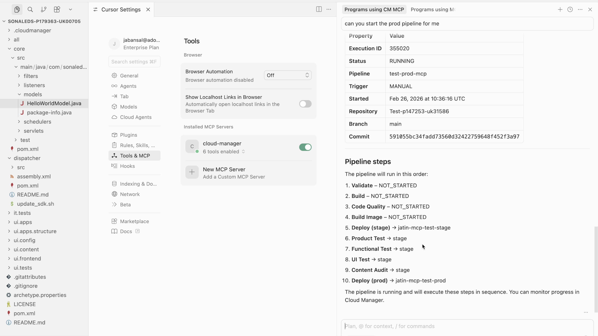

# AEMのMCP サーバー

お好みのAIを活用したIDEまたはチャットベースのアプリケーションからAEM _Model Context Protocol （MCP） Servers_&#x200B;を使用して、AEM コンテンツ作業を効率化し、高速化する方法を説明します。 ローレベルのAPI コードを記述したり、AEM UIを移動したりする代わりに、自然言語で必要なことを記述できます。

## AEM MCP サーバーの一覧

すべてのAEM MCP サーバーは、`https://mcp.adobeaemcloud.com/adobe/mcp/`で利用できます。 詳しくは、[AEM as a Cloud ServiceでのMCPの使用](https://experienceleague.adobe.com/en/docs/experience-manager-cloud-service/content/ai-in-aem/using-mcp-with-aem-as-a-cloud-service)を参照してください。

- **コンテンツ** （`/content`） – ページ、フラグメント、アセットを作成、読み取り、更新、削除するための完全なアクセス権。
- **コンテンツ （読み取り専用）** （`/content-readonly`） – ページ、フラグメント、アセットをリストおよび取得するための読み取り専用（変更なし）。
- **Cloud Manager** （`/cloudmanager`） — Adobe Cloud Manager プログラム、環境、リポジトリ、パイプラインを管理します。

>[!TIP]
>
>各サーバーが公開するツールは、時間の経過とともに変化する可能性があります。 現在使用可能な内容を確認するには、AIに対してすべてのAEM MCP ツール （例：`List all AEM MCP tools available from this server and describe what they do`）のリストを取得するか、IDEに`tools/list` プロンプトを入力するように依頼します。

## MCP サーバーの使用パターン

AEM MCP Serverの使用を開始する前に、MCP Serverの2つの主な使用パターンについて説明します。

- **Human-centric** – あなたは運転席に座っています。 IDEでツールが提案または実行されます。
- **エージェント** — エージェント型アプリケーション （エージェントまたはサブエージェント）がサーバーを単独で呼び出し、ツールを選択し、人間の入力がほとんどない目標に向かって作業します。

ここでは、ふたつの利用パターンの違いを紹介します。

| 項目 | 人間中心 | エージェント |
| ------ | ------------- | ------- |
| **アクションを実行するユーザー** | あなた。   AIは、IDEまたはチャットベースのアプリケーションでツールを提案または実行します。 | AIです。  使用するツールを選択し、最小限のガイダンスで続行します。 |
| **決定機関** | 常にコントロールできます。 各ステップを承認またはトリガーします。 | AIの方が自由度が高い。 インパクトの大きいアクションには、ガードレールや承認が必要な場合があります。 |
| **一般的な使用パターン** | **開発者**&#x200B;ごとに、独自のIDEまたはチャットベースのアプリケーションから使用できます。1つの開発者はセッションごとに1人で、日々の開発作業に適しています。 | エージェント型アプリケーションを介した&#x200B;**共有**。多くのユーザーまたはエージェントの共有サービスおよびゲートウェイとして使用できます。 |
| **最適な用途：** | 情報の確認からガイド付きの更新、探索、日常的な作業の繰り返しまで、あらゆる作業が円滑に進みます。 | エージェント型ワークフロー、バッチジョブ、パイプライン、最小限の介入でシステムを実行する目標。 |

### エージェンティックシステムでMCPを使用する場合

MCP サーバーは、インタラクティブなUXと人間による監視を備えた&#x200B;**人が操作するMCP クライアント**&#x200B;向けに設計されています。 MCP ツールの仕様では、ツール呼び出しを承認または拒否できる&#x200B;_人がループ_&#x200B;に含まれていることを推奨しています。

エージェント型システムまたは自律型システムでMCP サーバーを使用する場合は、それを別の互換性の階層として扱います。 **プロンプト**、_許可リスト_、_ルーティングロジック_&#x200B;で&#x200B;_ハードコード_&#x200B;のツール名を実行しないでください。 MCPでは、_ツール名_&#x200B;はプログラム識別子であり、_説明_&#x200B;はLLMのモデル向けヒントです。 プロンプトと選択に基づいて、機能や説明を確認できます。

`tools/list`を介したランタイム検出を実装し、ツールリストの変更（`notifications/tools/list_changed`）を処理し、オンボーディングとバージョン管理に関するMCP サーバープロバイダーと連携して、プロトコルベースラインを超えた安定性の保証が必要な場合に対応します。

## MCP エンティティとそのマッピング

MCPは、**ホスト**、**クライアント**、**サーバー**&#x200B;の3つのエンティティで構築されています。 [MCP仕様](https://modelcontextprotocol.io/docs/getting-started/intro)は、それらを正式に定義します。 ただし、次の表では、AEM MCP Serverを使用する場合のそれぞれのマッピングを簡単に説明しています。

| コンポーネント | 標準定義 | AEM MCP サーバーを使用する場合 |
| --------- | ------------------- | ---------------- |
| **主催者** | すべてを実行するアプリは、コンテキストを収集し、AIと対話し、権限を処理し、クライアントを作成します。 | **IDE** （カーソル）またはチャットベースのアプリケーションがホストです。 MCP クライアントを実行し、セッションで使用できるツールとサーバーを決定します。 |
| **クライアント** | ホストから1台のサーバーへの1つの接続。 メッセージをやり取りし、サーバーのアクセスを他のサーバーとは分離します。 | **MCP クライアント**&#x200B;は、IDEまたはチャットベースのアプリケーションに存在します。 AEM Content MCP Serverを設定に追加すると、IDEまたはチャットベースのアプリケーションがそのサーバーに接続するクライアントを作成します。 プロンプトやツールの呼び出しは、このクライアントを経由します。 |
| **サーバー** | MCP経由でツール、データ、プロンプトを公開するサービス。 お使いのマシン上で実行することも、リモートで実行することもできます。 | Adobeでホストされている&#x200B;**AEM MCP Server**&#x200B;では、ページ、コンテンツフラグメント、およびアセットを作成、読み取り、更新、および削除するツールを提供しています。これにより、IDEまたはチャットベースのアプリケーションのAIがAEM環境と連携できるようになります。 |

簡単に言えば、**ホスト**&#x200B;はIDEまたはチャットベースのアプリケーションであり、**クライアント**&#x200B;はIDEまたはチャットベースのアプリケーションからAEMへの接続であり、**サーバー**&#x200B;はAdobeでホストされているAEM MCP サーバーです。

## セットアップ

AEM MCP サーバーは、定義されたMCP互換アプリケーションのセットで動作するように設計されています。
お好みのIDEまたはチャットベースのアプリケーションでAEM MCP サーバーをセットアップするには、詳細については、[ サポートされているMCP アプリケーション ](https://experienceleague.adobe.com/en/docs/experience-manager-cloud-service/content/ai-in-aem/mcp-support/using-mcp-with-aem-as-a-cloud-service#supported-mcp-applications)を参照してください。

## ユースケース

<!-- 
CARDS
{target = _self}

* ./accelerate-content-operations-with-aem-mcp-server.md    
  {title = Accelerate Content Operations with AEM MCP Server}
  {description = Learn how to use the AEM Content MCP Server from Cursor IDE to streamline and accelerate your AEM content work.}
  {image = ../assets/content-mcp-server/update-adventure-price-prompt-response.png}
  {cta = Learn Content MCP Server}

* ./cloud-manager.md
  {title = Cloud Manager MCP Server}
  {description = Learn how to use the AEM Cloud Manager MCP Server from Cursor IDE to streamline and accelerate your AEM cloud manager work.}
  {image = ../assets/cm-mcp-server/start-pipeline.png}
  {cta = Learn Cloud Manager MCP Server}
-->
<!-- START CARDS HTML - DO NOT MODIFY BY HAND -->

    

        

            

                <figure class="image x-is-16by9">
                    
                </figure>
            

            

                

                    

                        <a href="./accelerate-content-operations-with-aem-mcp-server.md" target="_self" rel="referrer" title="AEM MCP Serverでコンテンツ運用を高速化">AEM MCP Server</a>でコンテンツ操作を高速化
                    

                    
Cursor IDEのAEM Content MCP Serverを使用して、AEM コンテンツ作業を効率化および高速化する方法について説明します。

                

                <a href="./accelerate-content-operations-with-aem-mcp-server.md" target="_self" rel="referrer" class="spectrum-Button spectrum-Button--outline spectrum-Button--primary spectrum-Button--sizeM" style="align-self: flex-start; margin-top: 1rem;">
                     コンテンツ MCP サーバーを学ぶ
                </a>
            

        

    

    

        

            

                <figure class="image x-is-16by9">
                    
                </figure>
            

            

                

                    

                        <a href="./cloud-manager.md" target="_self" rel="referrer" title="Cloud Manager MCP Server">Cloud Manager MCP Server</a>
                    

                    
Cursor IDEのAEM Cloud Manager MCP Serverを使用して、AEM Cloud Managerの作業を効率化し、高速化する方法を説明します。

                

                <a href="./cloud-manager.md" target="_self" rel="referrer" class="spectrum-Button spectrum-Button--outline spectrum-Button--primary spectrum-Button--sizeM" style="align-self: flex-start; margin-top: 1rem;">
                    Cloud Manager MCP Serverについて学ぶ
                </a>
            

        

    

<!-- END CARDS HTML - DO NOT MODIFY BY HAND -->
