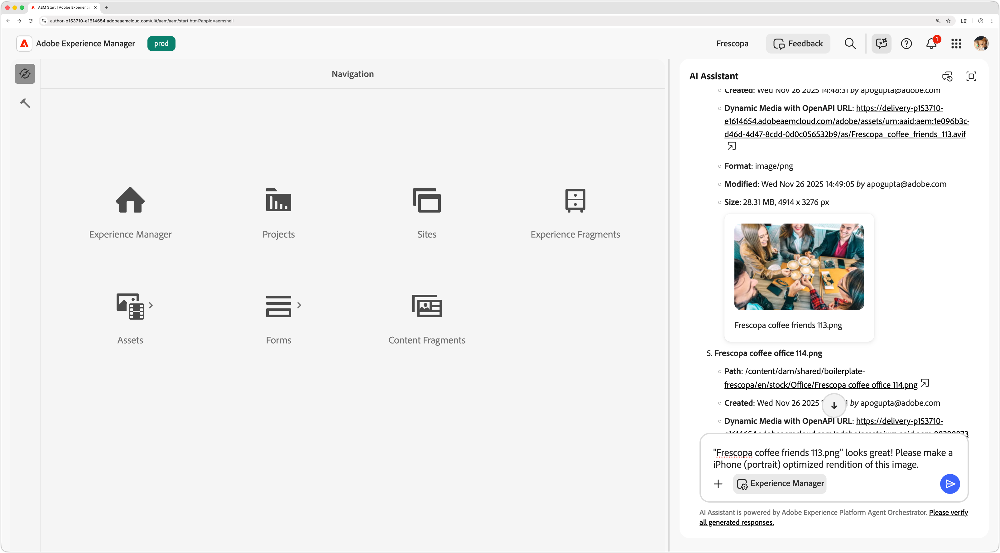

# Experience Managerの AI

Experience Manager as a Cloud Serviceは、コンテンツ管理を強化し、ワークフローを合理化し、ユーザーエクスペリエンスを向上させる高度な AI 機能を提供します。 AEM AI Assistant やAEM AI Agent などの AI を活用した機能を統合することで、タスクの自動化、インサイトの取得、コンテンツ配信の最適化を行うことができます。

<!-- CARDS 

* ./ai-assistant/overview.md
    {title = AEM AI Assistant}
    {description = Learn how AI Assistant provides product knowledge and support in AEM.}
    {cta = Learn}

* ./agents/overview.md
    {title = Agents in AEM}
    {description = Discover how AI-powered agents automate tasks and enhance workflows in AEM.}
    {cta = Learn}

* ./mcp/overview.md
    {title = AEM MCP Servers}
    {description = Learn how to extend AEM into your favorite AI-tools.}
    {cta = Learn}    

* ../../sites/generative-ai/generate-variations.md
    {title = Generate Variations}
    {description = Generate Variations in Adobe Experience Manager optimizes text and images for any experiences.}
    {cta = Watch}
    
* ../../assets/search-and-discovery/ai-search.md
    {title = AI Search}
    {description = Learn how AEM Assets AI Search enhances search by intelligently surfacing relevant assets and enabling smarter search experiences.}
    {cta = Watch}
-->
<!-- START CARDS HTML - DO NOT MODIFY BY HAND -->

    

        

            

                <figure class="image x-is-16by9">
                    
                </figure>
            

            

                

                    

                        <a href="./ai-assistant/overview.md" target="_blank" rel="referrer" title="AEM AI アシスタント">AEM AI アシスタント </a>
                    

                    
AI アシスタントがAEMで製品のナレッジとサポートを提供する方法について説明します。

                

                <a href="./ai-assistant/overview.md" target="_blank" rel="referrer" class="spectrum-Button spectrum-Button--outline spectrum-Button--primary spectrum-Button--sizeM" style="align-self: flex-start; margin-top: 1rem;">
                     詳細 
                </a>
            

        

    

    

        

            

                <figure class="image x-is-16by9">
                    
                </figure>
            

            

                

                    

                        <a href="./mcp/overview.md" target="_blank" rel="referrer" title="AEM MCP サーバー">AEM MCP サーバー </a>
                    

                    
お気に入りの AI ツールにAEMを拡張する方法を説明します。

                

                <a href="./mcp/overview.md" target="_blank" rel="referrer" class="spectrum-Button spectrum-Button--outline spectrum-Button--primary spectrum-Button--sizeM" style="align-self: flex-start; margin-top: 1rem;">
                     詳細 
                </a>
            

        

    

    

        

            

                <figure class="image x-is-16by9">
                    
                </figure>
            

            

                

                    

                        <a href="../../sites/generative-ai/generate-variations.md" target="_blank" rel="referrer" title="バリエーションの生成">バリエーションを生成</a>
                    

                    
Adobe Experience Manager のバリエーションを生成は、あらゆるエクスペリエンスに合わせてテキストと画像を最適化します。

                

                <a href="../../sites/generative-ai/generate-variations.md" target="_blank" rel="referrer" class="spectrum-Button spectrum-Button--outline spectrum-Button--primary spectrum-Button--sizeM" style="align-self: flex-start; margin-top: 1rem;">
                    所要時間
                </a>
            

        

    

    

        

            

                <figure class="image x-is-16by9">
                    
                </figure>
            

            

                

                    

                        <a href="../../assets/search-and-discovery/ai-search.md" target="_blank" rel="referrer" title="AI 検索">AI 検索</a>
                    

                    
AEM Assets AI 検索を使用して、関連するアセットをインテリジェントに表示し、よりスマートな検索エクスペリエンスを可能にすることで、検索を強化する方法を説明します。

                

                <a href="../../assets/search-and-discovery/ai-search.md" target="_blank" rel="referrer" class="spectrum-Button spectrum-Button--outline spectrum-Button--primary spectrum-Button--sizeM" style="align-self: flex-start; margin-top: 1rem;">
                    所要時間
                </a>
            

        

    

<!-- END CARDS HTML - DO NOT MODIFY BY HAND -->
