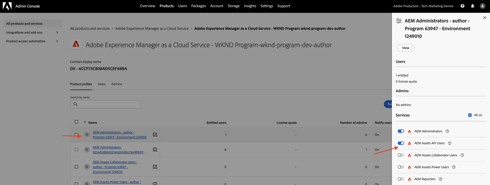

# OpenAPI ベースのAEM API を呼び出してサーバー間認証を行う{#invoke-openapi-based-aem-apis}

_OAuth サーバー間_ 認証を使用して、カスタムアプリケーションからAEM as a Cloud Serviceで OpenAPI ベースのAEM API を設定して呼び出す方法について説明します。

OAuth サーバー間認証は、ユーザーの操作なしで API アクセスが必要なバックエンドサービスに最適です。 クライアントアプリケーションの認証には、OAuth 2.0 _client_credentials_ 付与タイプを使用します。

>[!AVAILABILITY]
>
>OpenAPI ベースのAEM API は、早期アクセスプログラムの一部として利用できます。 これらにアクセスすることに関心がある場合は、ユースケースの説明を記載した電子メール ](mailto:aem-apis@adobe.com)0}aem-apis@adobe.com} を送信することをお勧めします。[

このチュートリアルでは、次の方法を学びます。

- お使いのAEM as a Cloud Service環境で OpenAPI ベースのAEM API アクセスを有効にします。
- Adobe Developer Console（ADC）プロジェクトを作成し、_OAuth サーバー間認証_ を使用してAEM API にアクセスするように設定します。
- Assets オーサー API を呼び出して特定のアセットのメタデータを取得するサンプル NodeJS アプリケーションを開発します。

開始する前に、[AdobeAPI へのアクセスと関連概念 ](overview.md#accessing-adobe-apis-and-related-concepts) の節を確認してください。

## 前提条件

このチュートリアルを完了するには、次が必要になります。

- AEM as a Cloud Service環境を最新化し、次の機能を実現しました。
   - AEM リリース `2024.10.18459.20241031T210302Z` 以降。
   - 新しいスタイルの製品プロファイル（2024 年 11 月より前に環境が作成された場合）

- サンプルの [WKND Sites](https://github.com/adobe/aem-guides-wknd?#aem-wknd-sites-project) プロジェクトをこのプロジェクトにデプロイする必要があります。

- [Adobe Developer Console](https://developer.adobe.com/developer-console/docs/guides/getting-started/) にアクセスします。

- [Node.js](https://nodejs.org/ja/) をローカルマシンにインストールして、サンプルの NodeJS アプリケーションを実行します。

## 開発手順

大まかな開発手順は次のとおりです。

1. AEM as a Cloud Service環境の最新化。
1. AEM API アクセスを有効にします。
1. Adobe Developer Console（ADC）プロジェクトを作成します。
1. ADC プロジェクトの設定
   1. 目的のAEM API を追加
   1. 認証の設定
   1. 製品プロファイルと認証設定の関連付け
1. AEM インスタンスを設定して、ADC プロジェクト通信を有効にします
1. サンプル NodeJS アプリケーションの開発
1. エンドツーエンドフローの検証

## AEM as a Cloud Serviceの最新化

まず、AEM as a Cloud Service環境を最新化します。 この手順は、環境が最新化されていない場合にのみ必要です。

AEM as a Cloud Service環境の最新化は、次の 2 つの手順で構成されます。

- 最新のAEM リリースバージョンへのアップデート
- 新しい製品プロファイルを追加します。

### AEM インスタンスを更新

AEM インスタンスを更新するには、「Adobe[Cloud Manager](https://my.cloudmanager.adobe.com/)」の「_環境_」セクションで、環境名の横にある _省略記号_ アイコンを選択し、「**更新**」オプションを選択します。


次に、「**送信**」ボタンをクリックし、提案されたフルスタックパイプラインを実行します。


この場合、フルスタックパイプラインの名前は _Dev :: Fullstack-Deploy_ AEM環境名は _wknd-program-dev_ ですが、状況によって異なる場合があります。

### 新しい製品プロファイルを追加

AEM インスタンスに新しい製品プロファイルを追加するには、「Adobe[Cloud Manager](https://my.cloudmanager.adobe.com/)」の「_環境_」セクションで、環境名の横にある _省略記号_ アイコンを選択し、「**製品プロファイルを追加**」オプションを選択します。


環境名の横にある _省略記号_ アイコンをクリックし、**アクセスを管理**/**プロファイルを作成** を選択すると、新しく追加された製品プロファイルを確認できます。

_製品_ ウィンドウに、新しく追加されたAdmin Consoleプロファイルが表示されます。


上記の手順で、AEM as a Cloud Service環境の最新化が完了します。

## AEM API アクセスの有効化

新しい製品プロファイルを使用すると、Adobe Developer Console（ADC）で OpenAPI ベースのAEM API アクセスが可能になります。

新しく追加された製品プロファイルは、事前に定義されたアクセス制御リスト（ACL）を持つAEM ユーザーグループを表す _サービス_ に関連付けられています。 _サービス_ は、AEM API へのアクセスレベルを制御するために使用されます。

また、製品プロファイルに関連付けられた _サービス_ を選択または選択解除して、アクセスレベルを増減することもできます。

製品プロファイル名の横にある _詳細を表示_ アイコンをクリックして、関連付けを確認します。


デフォルトでは、**AEM Assets API Users** Service は製品プロファイルに関連付けられていません。 新しく追加された **AEM Administrators - author - Program XXX - Environment XXX** Product Profile に関連付けましょう。 この関連付けの後、ADC プロジェクトの _Asset Author API_ で、OAuth サーバー間認証を設定し、認証アカウントを製品プロファイルに関連付けることができます。



最新化の前に、AEM オーサーインスタンスで 2 つの製品プロファイル（**AEM Administrators-XXX} と** 2}AEM Users-XXX **が使用可能であることに注意してください。**&#x200B;また、これらの既存の製品プロファイルを新しいサービスに関連付けることもできます。

## Adobe Developer Console（ADC）プロジェクトの作成

次に、AEM API にアクセスする ADC プロジェクトを作成します。

1. Adobe IDを使用して ](https://developer.adobe.com/console)0}Adobe Developer Console} にログインします。[

   

1. 「_クイックスタート_」セクションで、「**新規プロジェクトを作成**」ボタンをクリックします。

   

1. これにより、デフォルトの名前で新しいプロジェクトが作成されます。

   

1. 右上隅の **プロジェクトを編集** ボタンをクリックして、プロジェクト名を編集します。 意味のある名前を指定し、「保存 **をクリックし** す。

   

## ADC プロジェクトの設定

次に、ADC プロジェクトを設定してAEM API を追加し、その認証を設定して、製品プロファイルを関連付けます。

1. AEM API を追加するには、「**API を追加**」ボタンをクリックします。

   

1. _API を追加_ ダイアログで、_Experience Cloudでフィルタリングし_ 「**AEM Assets オーサー API**」カードを選択して、「**次へ**」をクリックします。

   

1. 次に、_API を設定_ ダイアログで「**サーバー間**」認証オプションを選択し、「**次へ**」をクリックします。 サーバー間の認証は、ユーザーの操作なしで API へのアクセスが必要なバックエンドサービスに最適です。

   

1. 識別を容易にするために資格情報の名前を変更し（必要に応じて）、「**次へ**」をクリックします。 デモ用に、デフォルト名が使用されます。

   

1. **AEM Administrators - author - Program XXX - Environment XXX** Product Profile を選択し、「**保存**」をクリックします。 ご覧のように、AEM Assets API ユーザーサービスに関連付けられた製品プロファイルのみを選択できます。

   

1. AEM API と認証設定を確認します。

   

   


## AEM インスタンスを設定して、ADC プロジェクト通信を有効にします

ADC プロジェクトの OAuth サーバー間資格情報クライアント ID をAEM インスタンスと通信できるようにするには、AEM インスタンスを設定する必要があります。

それには、AEM プロジェクトの `config.yaml` ファイルで設定を定義します。 次に、Cloud Managerで設定パイプラインを使用して `config.yaml` ファイルをデプロイします。

1. AEM プロジェクトで、`config` フォルダーから `config.yaml` ファイルを探すか作成します。

   

1. 次の設定を `config.yaml` ファイルに追加します。

   ```yaml
   kind: "API"
   version: "1.0"
   metadata: 
       envTypes: ["dev", "stage", "prod"]
   data:
       allowedClientIDs:
           author:
           - "<ADC Project's OAuth Server-to-Server credential ClientID>"
   ```

   `<ADC Project's OAuth Server-to-Server credential ClientID>` を ADC プロジェクトの OAuth サーバー間資格情報の実際の ClientID に置き換えます。 このチュートリアルで使用する API エンドポイントはオーサー層でのみ使用できますが、その他の API の場合、yaml 設定に _publish_ または _preview_ ノードを含めることもできます。

1. 設定の変更を Git リポジトリにコミットし、変更内容をリモートリポジトリにプッシュします。

1. Cloud Managerで設定パイプラインを使用して、上記の変更をデプロイします。 コマンドラインツールを使用して `config.yaml` ファイルを RDE にインストールすることもできます。

   

## サンプル NodeJS アプリケーションの開発

Assets オーサー API を呼び出すサンプル NodeJS アプリケーションを作成しましょう。

Java や Python などの他のプログラミング言語を使用して、アプリケーションを開発できます。

テストの目的で、[Postman](https://www.postman.com/)、[curl](https://curl.se/) またはその他の REST クライアントを使用して、AEM API を呼び出すことができます。

### API を確認する

アプリケーションを開発する前に、{2[Assets オーサー API から ](https://developer.adobe.com/experience-cloud/experience-manager-apis/api/experimental/assets/author/#operation/getAssetMetadata) 指定したアセットのメタデータを配信する _エンドポイントを確認してみましょう。_ API 構文は次のとおりです。

```http
GET https://{bucket}.adobeaemcloud.com/adobe/assets/{assetId}/metadata
```

特定のアセットのメタデータを取得するには、`bucket` と `assetId` の値が必要です。 `bucket` はAEM インスタンス名で、Adobeドメイン名（.adobeaemcloud.com）は除かれています（例：`author-p63947-e1420428`）。

`assetId` は、`urn:aaid:aem:` のプレフィックスが付いたアセットの JCR UUID です（例：`urn:aaid:aem:a200faf1-6d12-4abc-bc16-1b9a21f870da`）。 `assetId` を取得する方法は複数あります。

- AEM asset path `.json` 拡張機能を追加して、アセットのメタデータを取得します。 例えば、を `https://author-p63947-e1420429.adobeaemcloud.com/content/dam/wknd-shared/en/adventures/cycling-southern-utah/adobestock-221043703.jpg.json` して、`jcr:uuid` プロパティを探します。

- または、ブラウザーの要素インスペクターでアセットを調べることで、`assetId` を取得できます。 `data-id="urn:aaid:aem:..."` 属性を探します。

  

### ブラウザーを使用した API の呼び出し

アプリケーションを開発する前に、[API ドキュメント ](https://developer.adobe.com/experience-cloud/experience-manager-apis/api/experimental/assets/author/#operation/getAssetMetadata) にある **試す** 機能を使用して API を呼び出します。

1. ブラウザーで [Assets Author API ドキュメント ](https://developer.adobe.com/experience-cloud/experience-manager-apis/api/experimental/assets/author) を開きます。

1. 「_メタデータ_」セクションを展開し、「**指定したアセットのメタデータを配信**」オプションをクリックします。

1. 右側のペインで、「試す **ボタンをクリックし** す。
   

1. 次の値を入力します。
   1. `bucket` の値は、Adobeドメイン名を除いたAEM インスタンス名です（例：.adobeaemcloud.com）。例：`author-p63947-e1420428`

   1. `Bearer Token` と `X-Api-Key` の値に関連する **セキュリティ** セクションは、ADC プロジェクトの OAuth サーバー間資格情報から取得されます。 **アクセストークンを生成** をクリックして、`Bearer Token` の値を取得し、`ClientID` の値を `X-Api-Key` として使用します。
      

   1. 値に関連する **パラメーター** セクション `assetId`、AEM内のアセットの一意の ID です。 `X-Adobe-Accept-Experimental` は 1 に設定されます。

      

1. 「**送信**」をクリックして、API を呼び出します。

1. 「**Response**」タブを確認し、API の応答を確認します。

   

上記の手順は、AEM as a Cloud Service環境の最新化を確認し、AEM API へのアクセスを可能にします。 また、ADC プロジェクトの設定が成功したことや、AEM オーサーインスタンスとの OAuth サーバー間資格情報の ClientID 通信が成功したことも確認します。

### NodeJS アプリケーションのサンプル

サンプルの NodeJS アプリケーションを開発しましょう。

アプリケーションを開発するには、_Run-the-sample-application_ または _Step-by-step-development_ 手順を使用します。


>[!BEGINTABS]

>[!TAB Run-the-sample-application]

1. サンプルの [demo-nodejs-app-to-invoke-aem-openapi](assets/demo-nodejs-app-to-invoke-aem-openapi.zip) アプリケーションの zip ファイルをダウンロードして抽出します。

1. 抽出したフォルダーに移動して、依存関係をインストールします。

   ```bash
   $ npm install
   ```

1. `.env` ファイルのプレースホルダーを、ADC Project の OAuth サーバー間資格情報の実際の値に置き換えます。

1. `src/index.js` ファイルの `<BUCKETNAME>` と `<ASSETID>` を実際の値に置き換えます。

1. NodeJS アプリケーションを実行します。

   ```bash
   $ node src/index.js
   ```

>[!TAB  開発手順 ]

1. 新しい NodeJS プロジェクトを作成します。

   ```bash
   $ mkdir demo-nodejs-app-to-invoke-aem-openapi
   $ cd demo-nodejs-app-to-invoke-aem-openapi
   $ npm init -y
   ```

1. _fetch_ ライブラリと _dotenv_ ライブラリをインストールして、HTTP リクエストを行い、環境変数を読み取ります。

   ```bash
   $ npm install node-fetch
   $ npm install dotenv
   ```

1. お気に入りのコードエディターでプロジェクトを開き、`package.json` ファイルを更新して `type` を `module` に追加します。

   ```json
   {
       ...
       "version": "1.0.0",
       "type": "module",
       "main": "index.js",
       ...
   }
   ```

1. ファイル `.env` 作成し、次の設定を追加します。 プレースホルダーを、ADC プロジェクトの OAuth サーバー間資格情報の実際の値に置き換えます。

   ```properties
   CLIENT_ID=<ADC Project OAuth Server-to-Server credential ClientID>
   CLIENT_SECRET=<ADC Project OAuth Server-to-Server credential Client Secret>
   SCOPES=<ADC Project OAuth Server-to-Server credential Scopes>
   ```

1. ファイル `src/index.js` 作成して次のコードを追加し、`<BUCKETNAME>` と `<ASSETID>` を実際の値に置き換えます。

   ```javascript
   // Import the dotenv configuration to load environment variables from the .env file
   import "dotenv/config";
   
   // Import the fetch function to make HTTP requests
   import fetch from "node-fetch";
   
   // REPLACE THE FOLLOWING VALUES WITH YOUR OWN
   const bucket = "<BUCKETNAME>"; // Bucket name is the AEM instance name (e.g. author-p63947-e1420428)
   const assetId = "<ASSETID>"; // Asset ID is the unique identifier for the asset in AEM (e.g. urn:aaid:aem:a200faf1-6d12-4abc-bc16-1b9a21f870da). You can get it by inspecting the asset in browser's element inspector, look for data-id="urn:aaid:aem:..."
   
   // Load environment variables for authentication
   const clientId = process.env.CLIENT_ID; // Adobe IMS client ID
   const clientSecret = process.env.CLIENT_SECRET; // Adobe IMS client secret
   const scopes = process.env.SCOPES; // Scope for the API access
   
   // Adobe IMS endpoint for obtaining an access token
   const adobeIMSV3TokenEndpointURL =
   "https://ims-na1.adobelogin.com/ims/token/v3";
   
   // Function to obtain an access token from Adobe IMS
   const getAccessToken = async () => {
       console.log("Getting access token from IMS"); // Log process initiation
       //console.log("Client ID: " + clientId); // Display client ID for debugging purposes
   
       // Configure the HTTP POST request to fetch the access token
       const options = {
           method: "POST",
           headers: {
           "Content-Type": "application/x-www-form-urlencoded", // Specify form data content type
           },
           // Send client ID, client secret, and scopes as the request body
           body: `grant_type=client_credentials&client_id=${clientId}&client_secret=${clientSecret}&scope=${scopes}`,
       };
   
       // Make the HTTP request to fetch the access token
       const response = await fetch(adobeIMSV3TokenEndpointURL, options);
   
       //console.log("Response status: " + response.status); // Log the HTTP status for debugging
   
       const responseJSON = await response.json(); // Parse the JSON response
   
       console.log("Access token received"); // Log success message
   
       // Return the access token
       return responseJSON.access_token;
   };
   
   // Function to retrieve metadata for a specific asset from AEM
   const getAssetMetadat = async () => {
       // Fetch the access token using the getAccessToken function
       const accessToken = await getAccessToken();
   
       console.log("Getting asset metadata from AEM");
   
       // Invoke the Assets Author API to retrieve metadata for a specific asset
       const resp = await fetch(
           `https://${bucket}.adobeaemcloud.com/adobe/assets/${assetId}/metadata`, // Construct the URL with bucket and asset ID
           {
           method: "GET",
           headers: {
               "If-None-Match": "string", // Header to handle caching (not critical for this tutorial)
               "X-Adobe-Accept-Experimental": "1", // Header to enable experimental Adobe API features
               Authorization: "Bearer " + accessToken, // Provide the access token for authorization
               "X-Api-Key": clientId, // Include the OAuth S2S ClientId for identification
           },
           }
       );
   
       const data = await resp.json(); // Parse the JSON response
   
       console.log("Asset metadata received"); // Log success message
       console.log(data); // Display the retrieved metadata
   };
   
   // Call the getAssets function to start the process
   getAssetMetadat();
   ```

1. NodeJS アプリケーションを実行します。

   ```bash
   $ node src/index.js
   ```

>[!ENDTABS]

### API 応答

正常に実行されると、API 応答がコンソールに表示されます。 応答には、指定したアセットのメタデータが含まれます。

```json
{
  "assetId": "urn:aaid:aem:9c09ff70-9ee8-4b14-a5fa-ec37baa0d1b3",
  "assetMetadata": {    
    ...
    "dc:title": "A Young Mountain Biking Couple Takes A Minute To Take In The Scenery",
    "xmp:CreatorTool": "Adobe Photoshop Lightroom Classic 7.5 (Macintosh)",
    ...
  },
  "repositoryMetadata": {
    ...
    "repo:name": "adobestock-221043703.jpg",
    "repo:path": "/content/dam/wknd-shared/en/adventures/cycling-southern-utah/adobestock-221043703.jpg",
    "repo:state": "ACTIVE",
    ...
  }
}
```

これで完了です。OAuth サーバー間認証を使用して、カスタムアプリケーションから OpenAPI ベースのAEM API を正常に呼び出しました。

### アプリケーションコードを確認します

サンプル NodeJS アプリケーションコードの主要なコールアウトは次のとおりです。

1. **IMS 認証**:ADC プロジェクトで設定された OAuth サーバー間資格情報を使用して、アクセストークンを取得します。

   ```javascript
   // Function to obtain an access token from Adobe IMS
   const getAccessToken = async () => {
   
       // Configure the HTTP POST request to fetch the access token
       const options = {
           method: "POST",
           headers: {
           "Content-Type": "application/x-www-form-urlencoded", // Specify form data content type
           },
           // Send client ID, client secret, and scopes as the request body
           body: `grant_type=client_credentials&client_id=${clientId}&client_secret=${clientSecret}&scope=${scopes}`,
       };
   
       // Make the HTTP request to fetch the access token from Adobe IMS token endpoint https://ims-na1.adobelogin.com/ims/token/v3
       const response = await fetch(adobeIMSV3TokenEndpointURL, options);
   
       const responseJSON = await response.json(); // Parse the JSON response
   
       // Return the access token
       return responseJSON.access_token;
   };
   ...
   ```

1. **API 呼び出し**:Assets オーサー API を呼び出し、認証用のアクセストークンを提供して、特定のアセットのメタデータを取得します。

   ```javascript
   // Function to retrieve metadata for a specific asset from AEM
   const getAssetMetadat = async () => {
       // Fetch the access token using the getAccessToken function
       const accessToken = await getAccessToken();
   
       console.log("Getting asset metadata from AEM");
   
       // Invoke the Assets Author API to retrieve metadata for a specific asset
       const resp = await fetch(
           `https://${bucket}.adobeaemcloud.com/adobe/assets/${assetId}/metadata`, // Construct the URL with bucket and asset ID
           {
           method: "GET",
           headers: {
               "If-None-Match": "string", // Header to handle caching (not critical for this tutorial)
               "X-Adobe-Accept-Experimental": "1", // Header to enable experimental Adobe API features
               Authorization: "Bearer " + accessToken, // Provide the access token for authorization
               "X-Api-Key": clientId, // Include the OAuth S2S ClientId for identification
           },
           }
       );
   
       const data = await resp.json(); // Parse the JSON response
   
       console.log("Asset metadata received"); // Log success message
       console.log(data); // Display the retrieved metadata
   };
   ...
   ```

## 概要

このチュートリアルでは、カスタムアプリケーションから OpenAPI ベースのAEM API を呼び出す方法を学びました。 Adobe Developer Console（ADC）プロジェクトへのAEM API のアクセスを有効にし、ADC プロジェクトを作成して設定しました。
ADC プロジェクトで、AEM API を追加し、その認証タイプを設定して、製品プロファイルを関連付けました。 また、ADC プロジェクト通信を有効にするようにAEM インスタンスを設定し、Assets オーサー API を呼び出すサンプル NodeJS アプリケーションを開発しました。
