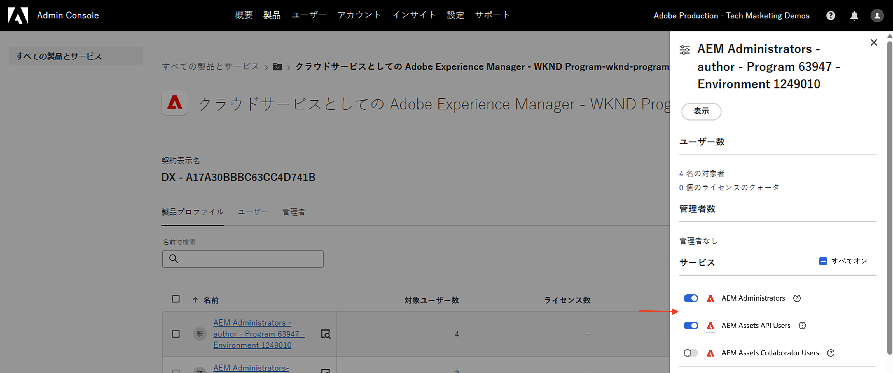
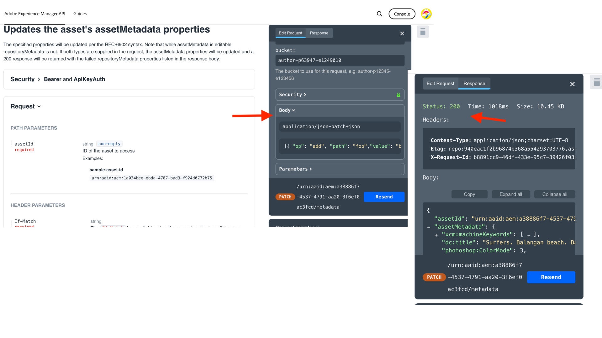

# API 資格情報と製品プロファイル管理

OpenAPI ベースのAEM API の _資格情報と製品プロファイル_ を管理する方法について説明します。

このチュートリアルでは、以下を追加または削除する方法を学びます。

- _資格情報_:AEM API の認証を指定します。
- _製品プロファイル_:AEM リソースにアクセスするための資格情報に対する権限（または認証）を提供します。

## 背景

AEM API を使用する場合は、Adobe Developer Console（または ADC）プロジェクトで _資格情報_ と _製品プロファイル_ を定義する必要があります。 次のスクリーンショットでは、AEM Assets オーサー API の _資格情報_ および _製品プロファイル_ を確認できます。

_資格情報_ は、API の認証メカニズムを提供します。 _製品プロファイル_ は、資格情報に _権限（または認証）_ を付与し、AEM リソースへのアクセスを提供します。 API リクエストは、アプリケーションまたはユーザーの代わりに行うことができます。

製品プロファイルは、1 つ以上の _サービス_ に関連付けられています。 AEM as a Cloud Serviceでは、_サービス_ は、リポジトリノード用に事前定義されたアクセス制御リスト（ACL）を持つユーザーグループを表し、詳細な権限管理を可能にします。

API が正常に呼び出されると、ADC プロジェクトの資格情報を表すユーザーが、製品プロファイルおよびサービス設定に一致するユーザーグループと共に、AEM オーサーサービスに作成されます。

上記のシナリオでは、ユーザー `1323d2...` はAEM オーサーサービスで作成され、ユーザーグループ `AEM Assets Collaborator Users - Service` および `AEM Assets Collaborator Users - author - Program XXX - Environment XXX` のメンバーです。

## 資格情報の追加または削除

AEM API は、認証用に次のタイプの資格情報をサポートしています。

1. **OAuth サーバー間**：マシン間インタラクション用に設計されています。
1. **OAuth web アプリ**：クライアントアプリケーションのバックエンドサーバーとのユーザー主導のインタラクション用に設計されています。
1. **OAuth 単一ページアプリ**：クライアントアプリケーションにバックエンドサーバーを使用しないユーザー主導のインタラクション用に設計されています。

様々なタイプの資格情報を使用して、様々なユースケースをサポートできます。

すべての資格情報は、ADC プロジェクトで管理されます。

>[!BEGINTABS]

>[!TAB  資格情報の追加 ]

AEM API の資格情報を追加するには、ADC プロジェクトの「**API**」セクションに移動し、「**別の資格情報を接続**」をクリックします。 次に、特定の資格情報の種類に対応する手順に従います。

>[!TAB  資格情報の削除 ]

AEM API 資格情報を削除するには、ADC プロジェクトの「**API**」セクションで資格情報を選択し、「**資格情報を削除**」をクリックします。

>[!ENDTABS]

## 製品プロファイルの追加または削除

_製品プロファイル_ は、AEM リソースにアクセスするための資格情報への _権限（または認証）_ を提供します。 _製品プロファイル_ が提供する権限は、_製品プロファイル_ に関連付けられた _サービス_ に基づいています。 ほとんどの _サービス_ は、_サービス_ と同じ名前を持つAEM インスタンスのユーザーグループを介して、AEM リソースに _読み取り_ 権限を提供します。

資格情報（別名テクニカルアカウントユーザー）には、AEM リソースの _作成、更新、削除_ （CUD））などの追加の権限が必要な場合があります。 その場合、必要な権限を提供する _サービス_ に関連付けられた新しい _製品プロファイル_ を追加する必要があります。

例えば、AEM Assets オーサー API の呼び出しでGET以外のリクエストに対して [403 エラー ](../use-cases/invoke-api-using-oauth-s2s.md#403-error-for-non-get-requests) が発生した場合は、**AEM管理者 – オーサー – プログラム XXX – 環境 XXX**_製品プロファイル_ を追加して問題を解決できます。

>[!CAUTION]
>
>**AEM管理者** サービスは、Experience Managerへの _FULL_ 管理アクセスを提供します。 または、[ サービス権限 ](./services-user-group-permission-management.md) を更新して、必要な権限のみを提供することもできます。

>[!BEGINTABS]

>[!TAB  製品プロファイルの追加 ]

AEM API の製品プロファイルを追加するには、ADC プロジェクトの **API** セクションの **製品プロファイルを編集** をクリックし、**Configure API** ダイアログで目的の製品プロファイルを選択して、変更内容を保存します。

必要なサービスに関連付ける目的の製品プロファイル （例：**AEM管理者 – 作成者 – プログラム XXX – 環境 XXX**）を選択し、変更内容を保存します。

**AEM Administrators - author - Program XXX - Environment XXX** 製品プロファイルは、**AEM Administrators** サービスと **AEM Assets API Users** サービスの両方に関連付けられています。 後者がない場合、製品プロファイルは使用可能な製品プロファイルのリストに表示されません。

アセットのメタデータを更新する **0}PATCH} リクエストは問題なく機能するようになりました。**

>[!TAB  製品プロファイルの削除 ]

AEM API の製品プロファイルを削除するには、ADC プロジェクトの **API** セクションの **製品プロファイルを編集** をクリックし、**API を設定** ダイアログで目的の製品プロファイルの選択を解除して、変更内容を保存します。

>[!ENDTABS]

## 概要

Adobe Developer Console（ADC）プロジェクトで _資格情報と製品プロファイル_ を使用して、AEM API の認証メカニズムと権限を変更する方法を学びました。
