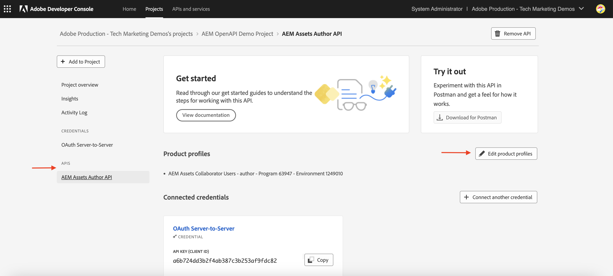

# API 資格情報と製品プロファイル管理

OpenAPI ベースの AEM API の&#x200B;_資格情報と製品プロファイル_&#x200B;を管理する方法を学びます。

このチュートリアルでは、次を追加または削除する方法を学びます。

- _資格情報_：AEM API の認証を提供します。
- _製品プロファイル_：AEM リソースにアクセスするための資格情報に対する権限（または承認）を提供します。

## 背景

AEM API を使用する場合は、Adobe Developer Console（または ADC）プロジェクトで&#x200B;_資格情報_&#x200B;と&#x200B;_製品プロファイル_&#x200B;を定義する必要があります。次のスクリーンショットでは、AEM Assets Author API の&#x200B;_資格情報_&#x200B;と&#x200B;_製品プロファイル_&#x200B;を確認できます。

_資格情報_&#x200B;は、API の認証メカニズムを提供します。_製品プロファイル_&#x200B;は、資格情報に&#x200B;_権限（または承認）_&#x200B;を付与し、AEM リソースへのアクセスを提供します。API リクエストは、アプリケーションまたはユーザーの代わりに行うことができます。

製品プロファイルは、1 つ以上の&#x200B;_サービス_&#x200B;に関連付けられています。AEM as a Cloud Service では、_サービス_&#x200B;は、リポジトリノード用に事前定義されたアクセス制御リスト（ACL）を持つユーザーグループを表し、細かい権限管理を可能にします。

API が正常に呼び出されると、製品プロファイルおよびサービス設定に一致するユーザーグループと共に、ADC プロジェクトの資格情報を表すユーザーが AEM オーサーサービスに作成されます。

上記のシナリオでは、ユーザー `1323d2...` は AEM オーサーサービスで作成され、ユーザーグループ `AEM Assets Collaborator Users - Service` と `AEM Assets Collaborator Users - author - Program XXX - Environment XXX` のメンバーです。

## 資格情報の追加または削除

AEM API は、認証用に次のタイプの資格情報をサポートしています。

1. **OAuth サーバー間**：マシン間インタラクション用に設計されています。
1. **OAuth web アプリ**：クライアントアプリケーションでのバックエンドサーバーとのユーザー主導のインタラクション用に設計されています。
1. **OAuth 単一ページアプリ**：クライアントアプリケーションでのバックエンドサーバーを使用しないユーザー主導のインタラクション用に設計されています。

様々なタイプの資格情報を使用して、様々なユースケースをサポートできます。

すべての資格情報は、ADC プロジェクトで管理されます。

>[!BEGINTABS]

>[!TAB 資格情報の追加]

AEM API の資格情報を追加するには、ADC プロジェクトの「**API**」セクションに移動し、「**別の資格情報を接続**」をクリックします。次に、特定の資格情報タイプ用の手順に従います。

>[!TAB 資格情報の削除]

AEM API 資格情報を削除するには、ADC プロジェクトの「**API**」セクションで資格情報を選択してから、「**資格情報の削除**」をクリックします。

>[!ENDTABS]

## 製品プロファイルの追加または削除

_製品プロファイル_&#x200B;は、AEM リソースにアクセスするための資格情報への&#x200B;_権限（または承認）_&#x200B;を提供します。_製品プロファイル_&#x200B;が提供する権限は、_製品プロファイル_&#x200B;に関連付けられた&#x200B;_サービス_&#x200B;に基づいています。ほとんどの&#x200B;_サービス_&#x200B;は、_サービス_&#x200B;と同じ名前を持つ AEM インスタンスのユーザーグループを介して、AEM リソースに&#x200B;_読み取り_&#x200B;権限を提供します。

資格情報（別名テクニカルアカウントユーザー）には、AEM リソースの&#x200B;_作成、更新、削除_（CUD）などの追加の権限が必要な場合があります。その場合、必要な権限を提供する&#x200B;_サービス_&#x200B;に関連付けられた新しい&#x200B;_製品プロファイル_&#x200B;を追加する必要があります。

例えば、AEM Assets Author API の呼び出しで [GET 以外のリクエストに対して 403 エラー](../use-cases/invoke-api-using-oauth-s2s.md#403-error-for-non-get-requests)が発生した場合は、**AEM 管理者 - オーサー - プログラム XXX - 環境 XXX** _製品プロファイル_&#x200B;を追加して問題を解決できます。

>[!CAUTION]
>
>**AEM 管理者**&#x200B;サービスは、Experience Manager への&#x200B;_完全な_&#x200B;管理アクセスを提供します。または、[サービス権限](./services-user-group-permission-management.md)を更新して、必要な権限のみを提供することもできます。

>[!BEGINTABS]

>[!TAB 製品プロファイルの追加]

AEM API の製品プロファイルを追加するには、ADC プロジェクトの「**API**」セクションの「**製品プロファイルを編集**」をクリックし、**API の設定**&#x200B;ダイアログで目的の製品プロファイルを選択して、変更内容を保存します。

必要なサービスに関連付ける目的の製品プロファイル（例：**AEM 管理者 - オーサー - プログラム XXX - 環境 XXX**）を選択してから、変更内容を保存します。

**AEM 管理者 - オーサー - プログラム XXX - 環境 XXX** 製品プロファイルは、**AEM 管理者**&#x200B;サービスと **AEM Assets API ユーザー**&#x200B;サービスの両方に関連付けられています。後者がない場合、製品プロファイルは使用可能な製品プロファイルのリストに表示されません。

アセットのメタデータを更新する **PATCH** リクエストが問題なく機能するようになりました。

>[!TAB 製品プロファイルの削除]

AEM API の製品プロファイルを削除するには、ADC プロジェクトの「**API**」セクションの「**製品プロファイルを編集**」をクリックし、**API の設定**&#x200B;ダイアログで目的の製品プロファイルの選択を解除して、変更内容を保存します。

>[!ENDTABS]

## 概要

Adobe Developer Console（ADC）プロジェクトで&#x200B;_資格情報と製品プロファイル_&#x200B;を使用して、AEM API の認証メカニズムと権限を変更する方法を学びました。
