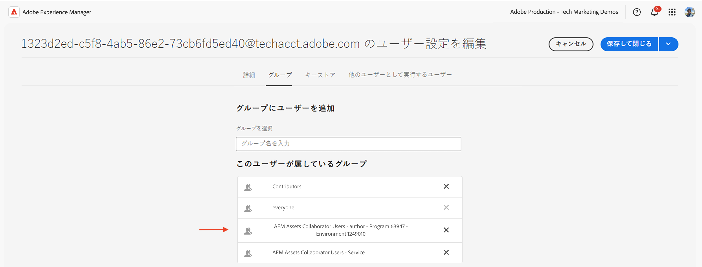

# 製品プロファイルとサービスユーザーグループの権限管理

AEM as a Cloud Service で製品プロファイルとサービスユーザーグループの権限を管理する方法を学びます。

このチュートリアルでは、次の内容について説明します。

- 製品プロファイルとサービスとの関連付け。
- サービスユーザーグループの権限の更新。

## 背景

AEM API を使用する場合は、_製品プロファイル_&#x200B;を Adobe Developer Console（または ADC）プロジェクトの&#x200B;_資格情報_&#x200B;に割り当てる必要があります。_製品プロファイル_（および関連するサービス）は、AEM リソースにアクセスするための資格情報に&#x200B;_権限または承認_&#x200B;を提供します。次のスクリーンショットでは、AEM Assets Author API の&#x200B;_資格情報_&#x200B;と&#x200B;_製品プロファイル_&#x200B;を確認できます。


製品プロファイルは、1 つ以上の&#x200B;_サービス_&#x200B;に関連付けられています。AEM as a Cloud Service では、_サービス_&#x200B;は、リポジトリノード用に事前定義されたアクセス制御リスト（ACL）を持つユーザーグループを表し、細かい権限管理を可能にします。


API が正常に呼び出されると、製品プロファイルおよびサービス設定に一致するユーザーグループと共に、ADC プロジェクトの資格情報を表すユーザーが AEM オーサーサービスに作成されます。



上記のシナリオでは、ユーザー `1323d2...` は AEM オーサーサービスで作成され、ユーザーグループ `AEM Assets Collaborator Users - Service` と `AEM Assets Collaborator Users - author - Program XXX - Environment XXX` のメンバーです。

## サービスユーザーグループの権限の更新

ほとんどの&#x200B;_サービス_&#x200B;は、_サービス_&#x200B;と同じ名前を持つ AEM インスタンスのユーザーグループを介して、AEM リソースに&#x200B;_読み取り_&#x200B;権限を提供します。

資格情報（別名テクニカルアカウントユーザー）には、AEM リソースの&#x200B;_作成、更新、削除_（CUD）などの追加の権限が必要な場合があります。その場合は、AEM インスタンス内の&#x200B;_サービス_&#x200B;ユーザーグループの権限を更新できます。

例えば、AEM Assets Author API の呼び出しで [GET 以外のリクエストに対して 403 エラー](../use-cases/invoke-api-using-oauth-s2s.md#403-error-for-non-get-requests)が発生した場合は、AEM インスタンスの _AEM Assets 共同作業者ユーザー - サービス_&#x200B;ユーザーグループの権限を更新できます。

権限ユーザーインターフェイスまたは [Sling リポジトリの初期化](https://sling.apache.org/documentation/bundles/repository-initialization.html)スクリプトを使用すると、AEM インスタンスのすぐに使えるユーザーグループの権限を更新できます。

### 権限ユーザーインターフェイスを使用した権限の更新

権限ユーザーインターフェイスを使用してサービスユーザーグループ（例：`AEM Assets Collaborator Users - Service`）の権限を更新するには、次の手順に従います。

- AEM インスタンスで&#x200B;**ツール**／**セキュリティ**／**権限**&#x200B;に移動します。

- サービスユーザーグループ（例：`AEM Assets Collaborator Users - Service`）を検索します。

  

- 「**ACE を追加**」をクリックして、ユーザーグループに新しいアクセス制御エントリ（ACE）を追加します。

  

### リポジトリ初期化スクリプトを使用した権限の更新

リポジトリ初期化スクリプトを使用してサービスユーザーグループ（例：`AEM Assets Collaborator Users - Service`）の権限を更新するには、次の手順に従います。

- 使い慣れた IDE で AEM プロジェクトを開きます。

- `ui.config` モジュールに移動

- 以下の内容で、`org.apache.sling.jcr.repoinit.RepositoryInitializer-services-group-acl-update.cfg.json` という名前の `ui.config/src/main/content/jcr_root/apps/<PROJECT-NAME>/osgiconfig/config.author` にファイルを作成します。

  ```json
  {
      "scripts": [
          "set ACL for \"AEM Assets Collaborator Users - Service\" (ACLOptions=ignoreMissingPrincipal)",
          "    allow jcr:read,jcr:versionManagement,crx:replicate,rep:write on /content/dam",
          "end"
      ]
  }
  ```

- 変更をコミットし、リポジトリにプッシュします。

- [Cloud Manager のフルスタックパイプライン](https://experienceleague.adobe.com/ja/docs/experience-manager-cloud-service/content/implementing/using-cloud-manager/cicd-pipelines/introduction-ci-cd-pipelines#full-stack-pipeline)を使用して、変更を AEM インスタンスにデプロイします。

- また、**権限**&#x200B;ビューを使用して、ユーザーグループの権限を確認することもできます。AEM インスタンスで&#x200B;**ツール**／**セキュリティ**／**権限**&#x200B;に移動します。

  

### 権限の確認

上記の方法のいずれかを使用して権限を更新した後、アセットのメタデータを更新する PATCH リクエストは問題なく機能するようになりました。


## 概要

AEM as a Cloud Service で製品プロファイルとサービスユーザーグループの権限を管理する方法を学びました。権限ユーザーインターフェイスまたはリポジトリ初期化スクリプトを使用して、AEM インスタンスのサービスユーザーグループの権限を更新できます。
