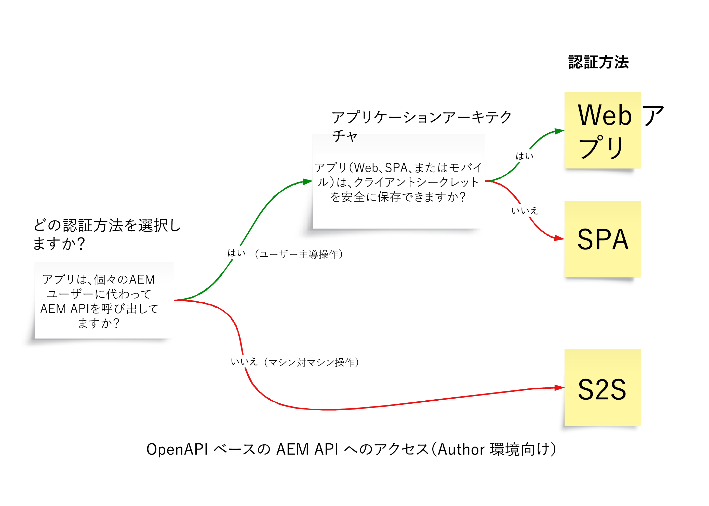

# OpenAPI ベースの AEM API

>[!IMPORTANT]
>
>OpenAPI ベースの AEM API は AEM as a Cloud Service でのみ使用でき、AEM 6.X とは互換性がありません。

認証のサポート、主要概念、Adobe API へのアクセス方法など、OpenAPI ベースの AEM API について学びます。

[OpenAPI Specification](https://swagger.io/specification/)（旧称 Swagger）は、RESTful API の定義に広く使用されている標準です。AEM as a Cloud Service には、複数の OpenAPI Specification の API（または単に OpenAPI ベースの AEM API）が用意されており、AEM のオーサーサービスタイプまたはパブリッシュサービスタイプとやり取りするカスタムアプリケーションを簡単に作成できます。以下にいくつかの例を示します。

**Sites**

- [Sites API](https://developer.adobe.com/experience-cloud/experience-manager-apis/api/stable/sites/)：コンテンツフラグメントを操作するための API。

**Assets**

- [フォルダー API](https://developer.adobe.com/experience-cloud/experience-manager-apis/api/experimental/folders/)：フォルダーの作成、リスト化、削除などのフォルダーを操作するための API。

- [Assets Author API](https://developer.adobe.com/experience-cloud/experience-manager-apis/api/experimental/assets/author/)：アセットとそのメタデータを操作するための API。

**Forms**

- [Forms Communications API](https://developer.adobe.com/experience-cloud/experience-manager-apis/api/experimental/document/)：フォームとドキュメントを操作するための API。

今後のリリースでは、追加のユースケースをサポートするために、OpenAPI ベースの AEM API がさらに追加される予定です。

## 認証サポート{#authentication-support}

OpenAPI ベースの AEM API は、次の付与タイプを含む、OAuth 2.0 認証をサポートしています。

- **OAuth サーバー間資格情報**：ユーザーインタラクションなしで API アクセスが必要なバックエンドサービスに最適です。_client_credentials_ 付与タイプを使用して、サーバーレベルで安全なアクセス管理を有効にします。詳しくは、[OAuth サーバー間資格情報](https://developer.adobe.com/developer-console/docs/guides/authentication/ServerToServerAuthentication/#oauth-server-to-server-credential)を参照してください。

- **OAuth web アプリ資格情報**：ユーザーの代わりに AEM API にアクセスするフロントエンドおよび&#x200B;_バックエンド_&#x200B;コンポーネントを持つ web アプリケーションに適しています。_authorization_code_ 付与タイプを使用し、バックエンドサーバーが秘密鍵とトークンを安全に管理します。詳しくは、[OAuth web アプリ資格情報](https://developer.adobe.com/developer-console/docs/guides/authentication/UserAuthentication/implementation#oauth-web-app-credential)を参照してください。

- **OAuth 単一ページアプリ資格情報**：バックエンドサーバーを使用せずにユーザーの代わりに API にアクセスする必要がある、ブラウザーで実行される SPA 用に設計されています。_authorization_code_ 付与タイプを使用し、PKCE（Proof Key for Code Exchange）を使用したクライアント側のセキュリティメカニズムに依存して、承認コードフローを保護します。詳しくは、[OAuth 単一ページアプリ資格情報](https://developer.adobe.com/developer-console/docs/guides/authentication/UserAuthentication/implementation#oauth-single-page-app-credential)を参照してください。

## 使用する認証方法{#auth-method-decision}

使用する認証方法を決定する際は、次の点を考慮します。

AEM ユーザーコンテキストが関係する場合は常に、ユーザー認証（web アプリまたは単一ページアプリ）がデフォルトの選択になります。これにより、リポジトリ内のすべてのアクションが認証済みユーザーに適切に関連付けられ、ユーザーは認められた権限のみに制限されます。
個々のユーザーの代わりにサーバー間（または技術的なシステムアカウント）を使用してアクションを実行すると、セキュリティモデルがバイパスされ、権限のエスカレーションや不正確な監査などのリスクが発生します。

## OAuth サーバー間資格情報と、web アプリ資格情報と単一ページアプリ資格情報の違い{#difference-between-oauth-server-to-server-vs-web-app-vs-single-page-app-credentials}

次の表に、OpenAPI ベースの AEM API でサポートされる 3 つの OAuth 認証方法の違いを示します。

|  | OAuth サーバー間 | OAuth web アプリ | OAuth 単一ページアプリ（SPA） |
| --- | --- | --- | --- |
| **認証の目的** | マシン間インタラクション用に設計されています。 | _バックエンド_&#x200B;を使用した web アプリでのユーザー主導のインタラクション用に設計されています。 | _クライアントサイド JavaScript アプリケーション_&#x200B;でのユーザー主導のインタラクション用に設計されています。 |
| **トークン動作** | クライアントアプリケーション自体を表すアクセストークンを発行します。 | 認証済みユーザーの代わりに&#x200B;_バックエンド経由で_&#x200B;アクセストークンを発行します。 | 認証済みユーザーの代わりに&#x200B;_フロントエンドのみのフローを介して_&#x200B;アクセストークンを発行します。 |
| **ユースケース** | ユーザーインタラクションのない API アクセスを必要とするバックエンドサービス。 | ユーザーの代わりに API にアクセスするフロントエンドおよびバックエンドコンポーネントを持つ web アプリケーション。 | バックエンドを持たないユーザーの代わりに API にアクセスする純粋なフロントエンド（JavaScript）アプリケーション。 |
| **セキュリティに関する考慮事項** | 機密性の高い資格情報（`client_id`、`client_secret`）をバックエンドシステムに安全に保存します。 | ユーザー認証後、ユーザーには、_バックエンド呼び出しを介して一時的なアクセストークン_&#x200B;が付与されます。アクセストークンの承認コードを交換するために、機密性の高い資格情報（`client_id`、`client_secret`）をバックエンドシステムに安全に保存します。 | ユーザー認証後、ユーザーには、_フロントエンド呼び出しを介して一時的なアクセストークン_&#x200B;が付与されます。フロントエンドアプリに保存すると安全ではないため、`client_secret` は使用しないでください。アクセストークンの承認コードを交換するために PKCE に依存します。 |
| **付与タイプ** | _client_credentials_ | _authorization_code_ | _authorization_code_ と **PKCE** |
| **Adobe Developer Console 資格情報の種類** | OAuth サーバー間 | OAuth web アプリ | OAuth 単一ページアプリ |
| **チュートリアル** | [サーバー間認証を使用した API の呼び出し](./use-cases/invoke-api-using-oauth-s2s.md) | [Web アプリ認証を使用した API の呼び出し](./use-cases/invoke-api-using-oauth-web-app.md) | [単一ページアプリ認証を使用した API の呼び出し](./use-cases/invoke-api-using-oauth-single-page-app.md) |

## Adobe API へのアクセスと関連概念{#accessing-adobe-apis-and-related-concepts}

Adobe API にアクセスする前に、次の主要な構成要素を理解しておく必要があります。

- **[Adobe Developer Console](https://developer.adobe.com/)**：Adobe API、SDK、リアルタイムイベント、サーバーレス関数などにアクセスするための開発者ハブ。これは、AEM アプリケーションのデバッグに使用される _AEM_ Developer Console とは異なることに注意してください。

- **[Adobe Developer Console プロジェクト](https://developer.adobe.com/developer-console/docs/guides/projects/)**：API 統合、イベントおよびランタイム関数を一元的に管理する場所。ここでは、API を設定し、認証を設定して、必要な資格情報を生成します。

- **[製品プロファイル](https://helpx.adobe.com/jp/enterprise/using/manage-product-profiles.html)**：製品プロファイルには、AEM、Adobe Target、Adobe Analytics などのアドビ製品へのユーザーまたはアプリケーションのアクセスを制御できる権限プリセットが用意されています。すべてのアドビ製品には、事前に定義された製品プロファイルが関連付けられています。

- **サービス**：サービスは、実際の権限を定義し、製品プロファイルに関連付けられます。権限プリセットを減らしたり増やしたりするには、製品プロファイルに関連付けられているサービスを選択解除または選択します。これにより、製品とその API へのアクセスレベルを制御できます。AEM as a Cloud Service では、サービスは、リポジトリノード用に事前定義されたアクセス制御リスト（ACL）を持つユーザーグループを表し、細かい権限管理を可能にします。

## 今すぐ始める

AEM as a Cloud Service 環境と Adobe Developer Console プロジェクトを設定して、OpenAPI ベースの AEM API へのアクセスを有効にする方法を学びます。また、ブラウザーを使用して AEM API にアクセスし、設定を確認して、リクエストと応答を確認します。

<!-- CARDS
{target = _self}

* ./setup.md
  {title = Set up OpenAPI-based AEM APIs}
  {description = Learn how to set up your AEM as a Cloud Service environment to enable access to the OpenAPI-based AEM APIs.}
  {image = ./assets/setup/OpenAPI-Setup.png}
-->
<!-- START CARDS HTML - DO NOT MODIFY BY HAND -->

    

        

            

                <figure class="image x-is-16by9">
                    
                </figure>
            

            

                

                    

                        <a href="./setup.md" target="_self" rel="referrer" title="OpenAPI ベースの AEM API の設定">OpenAPI ベースの AEM API の設定</a>
                    

                    
AEM as a Cloud Service 環境を設定して、OpenAPI ベースの AEM API へのアクセスを有効にする方法を学びます。

                

                <a href="./setup.md" target="_self" rel="referrer" class="spectrum-Button spectrum-Button--outline spectrum-Button--primary spectrum-Button--sizeM" style="align-self: flex-start; margin-top: 1rem;">
                    詳細情報
                </a>
            

        

    

<!-- END CARDS HTML - DO NOT MODIFY BY HAND -->

## API チュートリアル

様々な OAuth 認証方法を使用して、OpenAPI ベースの AEM API を使用する方法を学びます。

<!-- CARDS
{target = _self}

* ./use-cases/invoke-api-using-oauth-s2s.md
  {title = Invoke API using Server-to-Server authentication}
  {description = Learn how to invoke OpenAPI-based AEM APIs from a custom NodeJS application using OAuth Server-to-Server authentication.}
  {image = ./assets/s2s/OAuth-S2S.png}
* ./use-cases/invoke-api-using-oauth-web-app.md
  {title = Invoke API using Web App authentication}
  {description = Learn how to invoke OpenAPI-based AEM APIs from a custom web application using OAuth Web App authentication.}
  {image = ./assets/web-app/OAuth-WebApp.png}
* ./use-cases/invoke-api-using-oauth-single-page-app.md
  {title = Invoke API using Single Page App authentication}
  {description = Learn how to invoke OpenAPI-based AEM APIs from a custom Single Page App (SPA) using OAuth Single Page App authentication.}
  {image = ./assets/spa/OAuth-SPA.png}  
-->
<!-- START CARDS HTML - DO NOT MODIFY BY HAND -->

    

        

            

                <figure class="image x-is-16by9">
                    
                </figure>
            

            

                

                    

                        <a href="./use-cases/invoke-api-using-oauth-s2s.md" target="_self" rel="referrer" title="サーバー間認証を使用した API の呼び出し">サーバー間認証を使用した API の呼び出し</a>
                    

                    
OAuth サーバー間認証を使用して、カスタム NodeJS アプリケーションから OpenAPI ベースの AEM API を呼び出す方法を説明します。

                

                <a href="./use-cases/invoke-api-using-oauth-s2s.md" target="_self" rel="referrer" class="spectrum-Button spectrum-Button--outline spectrum-Button--primary spectrum-Button--sizeM" style="align-self: flex-start; margin-top: 1rem;">
                    詳細情報
                </a>
            

        

    

    

        

            

                <figure class="image x-is-16by9">
                    
                </figure>
            

            

                

                    

                        <a href="./use-cases/invoke-api-using-oauth-web-app.md" target="_self" rel="referrer" title="Web アプリ認証を使用した API の呼び出し">Web アプリ認証を使用した API の呼び出し</a>
                    

                    
OAuth web アプリ認証を使用して、カスタム web アプリケーションから OpenAPI ベースの AEM API を呼び出す方法を説明します。

                

                <a href="./use-cases/invoke-api-using-oauth-web-app.md" target="_self" rel="referrer" class="spectrum-Button spectrum-Button--outline spectrum-Button--primary spectrum-Button--sizeM" style="align-self: flex-start; margin-top: 1rem;">
                    詳細情報
                </a>
            

        

    

    

        

            

                <figure class="image x-is-16by9">
                    
                </figure>
            

            

                

                    

                        <a href="./use-cases/invoke-api-using-oauth-single-page-app.md" target="_self" rel="referrer" title="単一ページアプリ認証を使用した API の呼び出し">単一ページアプリ認証を使用した API の呼び出し</a>
                    

                    
OAuth 単一ページアプリ認証を使用して、カスタム単一ページアプリ（SPA）から OpenAPI ベースの AEM API を呼び出す方法を学びます。

                

                <a href="./use-cases/invoke-api-using-oauth-single-page-app.md" target="_self" rel="referrer" class="spectrum-Button spectrum-Button--outline spectrum-Button--primary spectrum-Button--sizeM" style="align-self: flex-start; margin-top: 1rem;">
                    詳細情報
                </a>
            

        

    

<!-- END CARDS HTML - DO NOT MODIFY BY HAND -->
