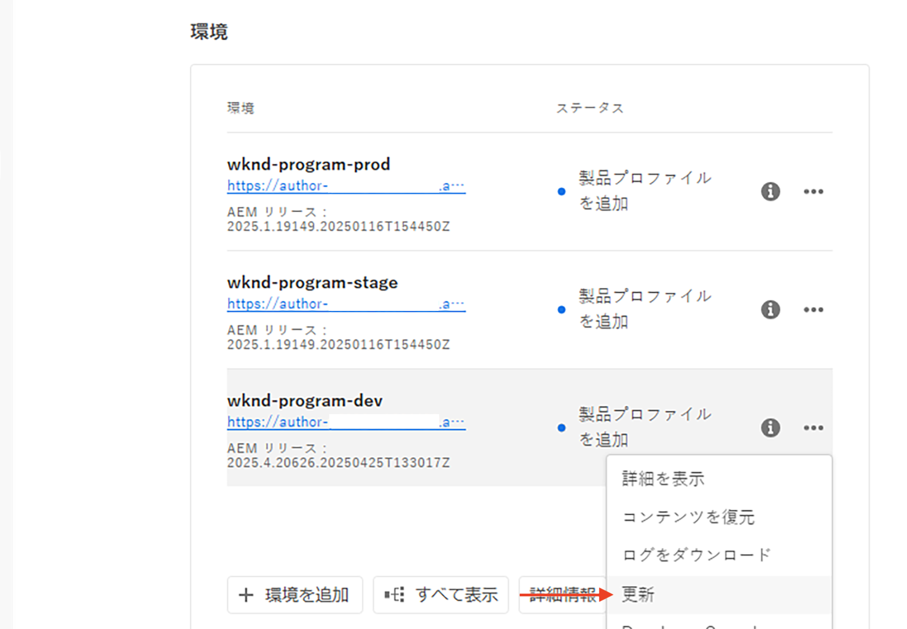
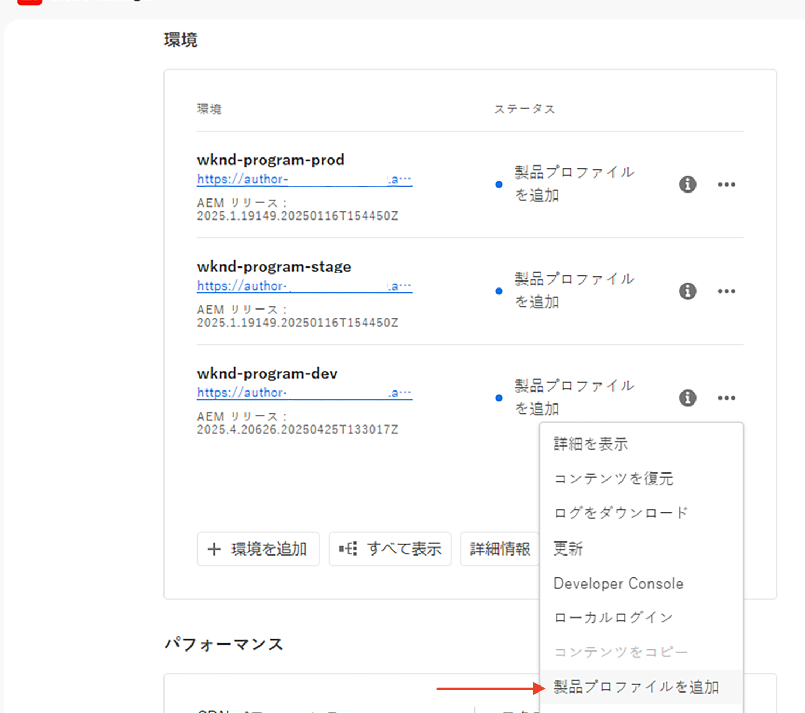
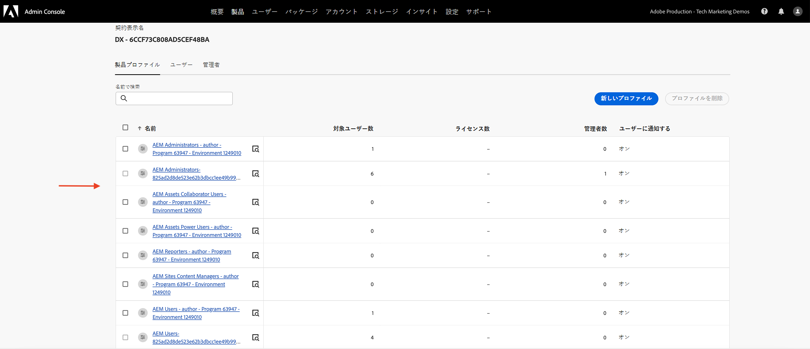
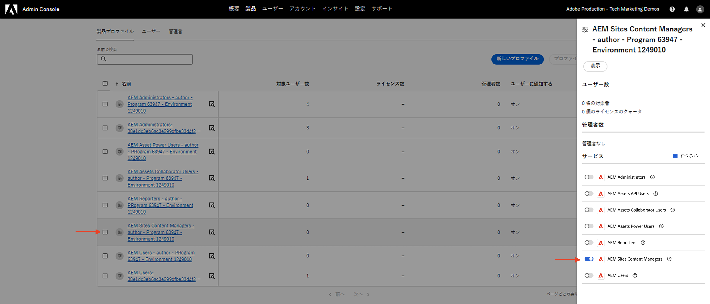
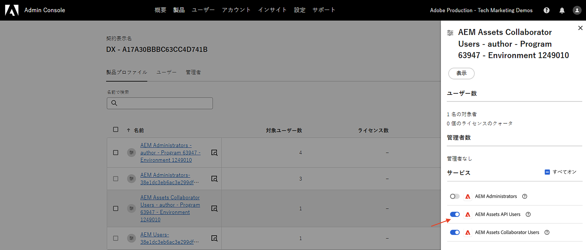
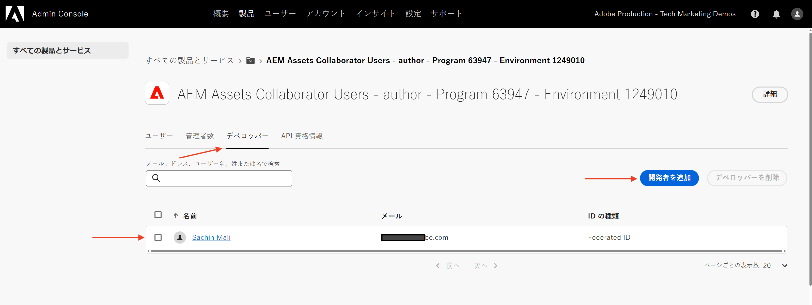
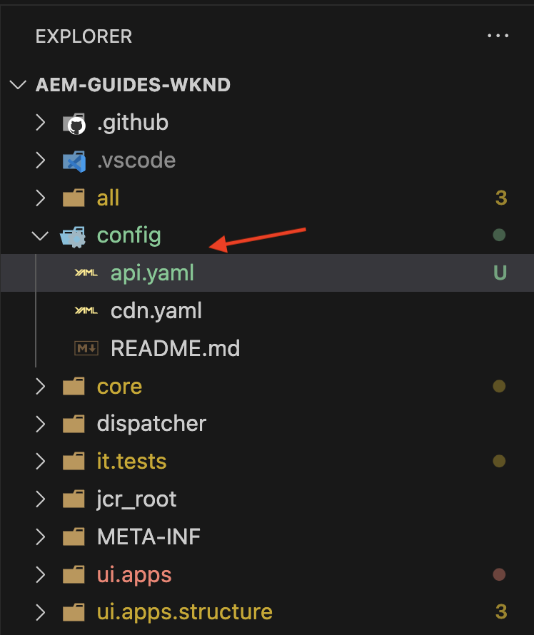
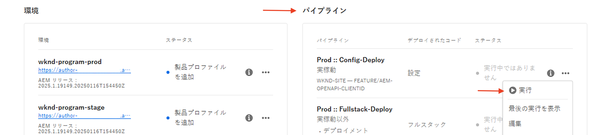

# OpenAPI ベースの AEM API の設定

AEM as a Cloud Service 環境を設定して、OpenAPI ベースの AEM API へのアクセスを有効にする方法を学びます。

この例では、サーバー間認証方法を使用するAEM Assets API を使用して、設定プロセスを示します。 他の OpenAPI ベースのAEM API についても、同じ手順に従うことができます。

>[!VIDEO](https://video.tv.adobe.com/v/3457510?quality=12&learn=on)

高度な設定プロセスには、次の手順が含まれます。

1. AEM as a Cloud Service 環境の最新化。
1. AEM API アクセスの有効化。
1. Adobe Developer Console（ADC）プロジェクトの作成。
1. ADC プロジェクトの設定。
1. ADC プロジェクト通信を有効にする AEM インスタンスの設定。

## AEM as a Cloud Service 環境の最新化。{#modernization-of-aem-as-a-cloud-service-environment}

AEM as a Cloud Service 環境の最新化は、次の手順を含む環境アクティビティごとに 1 回行われます。

- AEM リリース（**2024.10.18459.20241031T210302Z**）以降に更新します。
- リリース（2024.10.18459.20241031T210302Z）より前に環境が作成された場合は、新しい製品プロファイルを追加します。

### AEM インスタンスの更新{#update-aem-instance}

AEM インスタンスを更新するには、「Adobe [Cloud Manager](https://my.cloudmanager.adobe.com/)」の「_環境_」セクションで、環境名の横にある&#x200B;_省略記号_&#x200B;アイコンを選択し、「**更新**」オプションを選択します。



次に、「**送信**」ボタンをクリックし、_推奨_&#x200B;フルスタックパイプラインを実行します。


この場合、フルスタックパイプラインの名前は **Dev :: Fullstack-Deploy** で、AEM 環境の名前は **wknd-program-dev** です。名前が異なる場合があります。

### 新しい製品プロファイルの追加{#add-new-product-profiles}

AEM インスタンスに新しい製品プロファイルを追加するには、「Adobe [Cloud Manager](https://my.cloudmanager.adobe.com/)」の「_環境_」セクションで、環境名の横にある&#x200B;_省略記号_&#x200B;アイコンを選択し、「**製品プロファイルの追加**」オプションを選択します。



環境名の横にある&#x200B;_省略記号_&#x200B;アイコンをクリックし、**アクセスを管理**／**プロファイルの作成**&#x200B;を選択すると、新しく追加された製品プロファイルを確認できます。

_Admin Console_ ウィンドウに、新しく追加された製品プロファイルが表示されます。



上記の手順で、AEM as a Cloud Service 環境の最新化が完了します。

## AEM API アクセスの有効化{#enable-aem-apis-access}

_新しい製品プロファイル_&#x200B;が存在すると、Adobe Developer Console（ADC）で OpenAPI ベースの AEM API アクセスが可能になります。[Adobe Developer Console（ADC）](./overview.md#accessing-adobe-apis-and-related-concepts)は、Adobe API、SDK、リアルタイムイベント、サーバーレス関数などにアクセスするための開発者ハブです。

新しく追加された製品プロファイルは、_サービス_&#x200B;に関連付けられています。これは、_事前定義されたアクセス制御リスト（ACL）を持つ AEM ユーザーグループ_&#x200B;を表します。_サービス_&#x200B;は、AEM API へのアクセスレベルを制御するために使用されます。

また、製品プロファイルに関連付けられた&#x200B;_サービス_&#x200B;を選択または選択解除して、アクセスレベルを増減することもできます。

製品プロファイル名の横にある&#x200B;_詳細を表示_&#x200B;アイコンをクリックして、関連付けを確認します。



### AEM Assets API アクセスの有効化{#enable-aem-assets-apis-access}

デフォルトでは、**AEM Assets API Users** Service は製品プロファイルに関連付けられていません。新しく追加された **AEM Assets Collaborator Users - author - Program XXX - Environment XXX** Product Profile またはAEM Assets API アクセスに使用するその他の製品プロファイルに関連付けます。



### サーバー間認証を有効にする

目的のAEM API に対してサーバー間認証を有効にするには、Adobe Developer Console（ADC）を使用してインテグレーションを設定するユーザーを、サービスが関連付けられている Product Profile に Developer として追加する必要があります。

例えば、AEM Assets API に対してサーバー間認証を有効にするには、ユーザーを開発者として **AEM Assets Collaborator Users - author - Program XXX - Environment XXX** Product Profile に追加する必要があります。



この関連付けの後、ADC プロジェクトの _Asset Author API_ で目的のサーバー間認証を設定し、ADC プロジェクトの認証アカウント（次の手順で作成）を製品プロファイルに関連付けることができます。

>[!IMPORTANT]
>
>上記の手順は、目的のAEM API のサーバー間認証を有効にするために重要です。 この関連付けがないと、AEM API をサーバー間認証方法と共に使用できません。

## Adobe Developer Console（ADC）プロジェクトの作成。{#adc-project}

ADC プロジェクトを使用して、目的の API を追加し、その認証を設定して、認証アカウントを製品プロファイルに関連付けます。

ADC プロジェクトを作成するには、次の手順に従います。

1. Adobe ID を使用して [Adobe Developer Console](https://developer.adobe.com/console) にログインします。

   

1. 「_クイックスタート_」セクションで、「**新規プロジェクトの作成**」ボタンをクリックします。

   

1. これにより、デフォルトの名前で新しいプロジェクトが作成されます。

   

1. 右上隅の「**プロジェクトを編集**」ボタンをクリックして、プロジェクト名を編集します。わかりやすい名前を指定し、「**保存**」をクリックします。

   

## ADC プロジェクトの設定{#configure-adc-project}

ADC プロジェクトを作成したら、目的の AEM API を追加し、その認証を設定して、認証アカウントを製品プロファイルに関連付ける必要があります。

1. AEM API を追加するには、「**API を追加**」ボタンをクリックします。

   

1. _API を追加_&#x200B;ダイアログで、_Experience Cloud_ でフィルタリングし、目的の AEM API を選択します。例えば、この場合、「_Asset Author API_」が選択されます。

   

1. 次に、_API を設定_&#x200B;ダイアログで、目的の認証オプションを選択します。例えば、この場合、「**サーバー間**」認証オプションが選択されます。

   

   サーバー間認証は、ユーザーインタラクションなしで API アクセスが必要なバックエンドサービスに最適です。Web アプリと単一ページアプリの認証オプションは、ユーザーの代わりに API アクセスを必要とするアプリケーションに適しています。詳しくは、[OAuth サーバー間資格情報と、web アプリ間資格情報と単一ページアプリ資格情報の違い](./overview.md#difference-between-oauth-server-to-server-vs-web-app-vs-single-page-app-credentials)を参照してください。

   >[!TIP]
   >
   >サーバー間認証オプションが表示されない場合は、統合を設定するユーザーが、サービスが関連付けられている製品プロファイルに開発者として追加されていないことを意味します。 詳しくは、[ サーバー間認証を有効にする ](#enable-server-to-server-authentication) を参照してください。


1. 必要に応じて、識別しやすくするために API の名前を変更できます。デモ用には、デフォルト名が使用されます。

   

1. この場合、認証方法は **OAuth サーバー間**&#x200B;なので、認証アカウントを製品プロファイルに関連付ける必要があります。**AEM Assets 共同作業者ユーザー - オーサー - プログラム XXX - 環境 XXX** 製品プロファイルを選択し、「**保存**」をクリックします。

   

1. AEM API と認証設定を確認します。

   

   

**OAuth Web アプリ**&#x200B;または **OAuth 単一ページアプリ**&#x200B;の認証方法を選択した場合、製品プロファイルの関連付けは表示されませんが、アプリケーションリダイレクト URI が必要です。アプリケーションリダイレクト URI は、認証コードによる認証後にユーザーをアプリケーションにリダイレクトするために使用されます。関連するユースケースのチュートリアルでは、このような認証固有の設定について概説しています。

## ADC プロジェクト通信を有効にする AEM インスタンスの設定{#configure-aem-instance}

AEM インスタンスと通信する ADC プロジェクトのクライアント ID を有効にするには、AEM インスタンスを設定する必要があります。

それには、API 設定を YAML ファイルで定義し、Cloud Manager の設定パイプラインを使用してデプロイします。YAML ファイルには、AEM インスタンスと通信できる ADC プロジェクトの許可されたクライアント ID が定義されています。

1. AEM プロジェクトで、`config` フォルダーから `api.yaml` ファイルを見つけるか作成します。

   {width="500" zoomable="no"}

1. 次の設定を `api.yaml` ファイルに追加します。

   ```yaml
   kind: "API"
   version: "1.0"
   metadata: 
       envTypes: ["dev", "stage", "prod"]
   data:
       allowedClientIDs:
           author:
           - "<ADC Project's Credentials ClientID>"
   ```

   `<ADC Project's Credentials ClientID>` を ADC プロジェクトの資格情報値の実際のクライアント ID に置き換えます。このチュートリアルで使用する API エンドポイントはオーサー層でのみ使用できますが、その他の API の場合、yaml 設定に _publish_ または _preview_ ノードを含めることもできます。

   >[!CAUTION]
   >
   > デモ目的では、すべての環境で同じクライアント ID が使用されます。セキュリティと制御の強化に、環境（開発、ステージ、実稼動）ごとに個別のクライアント ID を使用することをお勧めします。

1. 設定変更をコミットし、Cloud Manager パイプラインが接続されているリモート Git リポジトリに変更をプッシュします。

1. Cloud Manager の設定パイプラインを使用して、上記の変更をデプロイします。 また、`api.yaml` ファイルは、コマンドラインツールを使用して RDE にインストールすることもできます。

   

## 次の手順

AEM インスタンスを設定して ADC プロジェクト通信を有効にすると、OpenAPI ベースの AEM API の使用を開始できます。様々な OAuth 認証方法を使用して、OpenAPI ベースの AEM API を使用する方法を学びます。

<!-- CARDS
{target = _self}

* ./use-cases/invoke-api-using-oauth-s2s.md
  {title = Invoke API using Server-to-Server authentication}
  {description = Learn how to invoke OpenAPI-based AEM APIs from a custom NodeJS application using OAuth Server-to-Server authentication.}
  {image = ./assets/s2s/OAuth-S2S.png}
* ./use-cases/invoke-api-using-oauth-web-app.md
  {title = Invoke API using Web App authentication}
  {description = Learn how to invoke OpenAPI-based AEM APIs from a custom web application using OAuth Web App authentication.}
  {image = ./assets/web-app/OAuth-WebApp.png}
* ./use-cases/invoke-api-using-oauth-single-page-app.md
  {title = Invoke API using Single Page App authentication}
  {description = Learn how to invoke OpenAPI-based AEM APIs from a custom Single Page App (SPA) using OAuth 2.0 PKCE flow.}
  {image = ./assets/spa/OAuth-SPA.png}  
-->
<!-- START CARDS HTML - DO NOT MODIFY BY HAND -->
<div class="columns">
    <div class="column is-half-tablet is-half-desktop is-one-third-widescreen" aria-label="Invoke API using Server-to-Server authentication">
        <div class="card" style="height: 100%; display: flex; flex-direction: column; height: 100%;">
            <div class="card-image">
                <figure class="image x-is-16by9">
                    <a href="./use-cases/invoke-api-using-oauth-s2s.md" title="サーバー間認証を使用した API の呼び出し" target="_self" rel="referrer">
                        
                    </a>
                </figure>
            </div>
            <div class="card-content is-padded-small" style="display: flex; flex-direction: column; flex-grow: 1; justify-content: space-between;">
                <div class="top-card-content">
                    <p class="headline is-size-6 has-text-weight-bold">
                        <a href="./use-cases/invoke-api-using-oauth-s2s.md" target="_self" rel="referrer" title="サーバー間認証を使用した API の呼び出し">サーバー間認証を使用した API の呼び出し</a>
                    </p>
                    <p class="is-size-6">OAuth サーバー間認証を使用して、カスタム NodeJS アプリケーションから OpenAPI ベースの AEM API を呼び出す方法を説明します。</p>
                </div>
                <a href="./use-cases/invoke-api-using-oauth-s2s.md" target="_self" rel="referrer" class="spectrum-Button spectrum-Button--outline spectrum-Button--primary spectrum-Button--sizeM" style="align-self: flex-start; margin-top: 1rem;">
                    <span class="spectrum-Button-label has-no-wrap has-text-weight-bold">詳細情報</span>
                </a>
            </div>
        </div>
    </div>
    <div class="column is-half-tablet is-half-desktop is-one-third-widescreen" aria-label="Invoke API using Web App authentication">
        <div class="card" style="height: 100%; display: flex; flex-direction: column; height: 100%;">
            <div class="card-image">
                <figure class="image x-is-16by9">
                    <a href="./use-cases/invoke-api-using-oauth-web-app.md" title="Web アプリ認証を使用した API の呼び出し" target="_self" rel="referrer">
                        
                    </a>
                </figure>
            </div>
            <div class="card-content is-padded-small" style="display: flex; flex-direction: column; flex-grow: 1; justify-content: space-between;">
                <div class="top-card-content">
                    <p class="headline is-size-6 has-text-weight-bold">
                        <a href="./use-cases/invoke-api-using-oauth-web-app.md" target="_self" rel="referrer" title="Web アプリ認証を使用した API の呼び出し">Web アプリ認証を使用した API の呼び出し</a>
                    </p>
                    <p class="is-size-6">OAuth web アプリ認証を使用して、カスタム web アプリケーションから OpenAPI ベースの AEM API を呼び出す方法を説明します。</p>
                </div>
                <a href="./use-cases/invoke-api-using-oauth-web-app.md" target="_self" rel="referrer" class="spectrum-Button spectrum-Button--outline spectrum-Button--primary spectrum-Button--sizeM" style="align-self: flex-start; margin-top: 1rem;">
                    <span class="spectrum-Button-label has-no-wrap has-text-weight-bold">詳細情報</span>
                </a>
            </div>
        </div>
    </div>
    <div class="column is-half-tablet is-half-desktop is-one-third-widescreen" aria-label="Invoke API using Single Page App authentication">
        <div class="card" style="height: 100%; display: flex; flex-direction: column; height: 100%;">
            <div class="card-image">
                <figure class="image x-is-16by9">
                    <a href="./use-cases/invoke-api-using-oauth-single-page-app.md" title="単一ページアプリ認証を使用した API の呼び出し" target="_self" rel="referrer">
                        
                    </a>
                </figure>
            </div>
            <div class="card-content is-padded-small" style="display: flex; flex-direction: column; flex-grow: 1; justify-content: space-between;">
                <div class="top-card-content">
                    <p class="headline is-size-6 has-text-weight-bold">
                        <a href="./use-cases/invoke-api-using-oauth-single-page-app.md" target="_self" rel="referrer" title="単一ページアプリ認証を使用した API の呼び出し">単一ページアプリ認証を使用した API の呼び出し</a>
                    </p>
                    <p class="is-size-6">OAuth 2.0 PKCE フローを使用して、カスタム単一ページアプリ（SPA）から OpenAPI ベースの AEM API を呼び出す方法を説明します。</p>
                </div>
                <a href="./use-cases/invoke-api-using-oauth-single-page-app.md" target="_self" rel="referrer" class="spectrum-Button spectrum-Button--outline spectrum-Button--primary spectrum-Button--sizeM" style="align-self: flex-start; margin-top: 1rem;">
                    <span class="spectrum-Button-label has-no-wrap has-text-weight-bold">詳細情報</span>
                </a>
            </div>
        </div>
    </div>
</div>
<!-- END CARDS HTML - DO NOT MODIFY BY HAND -->
