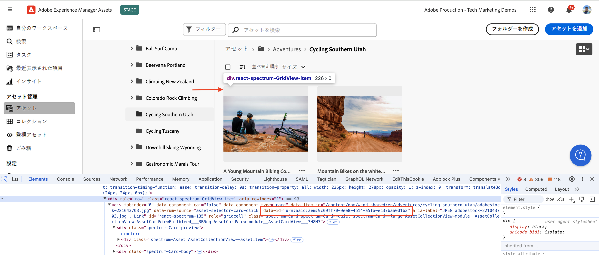
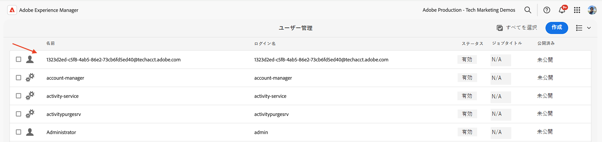
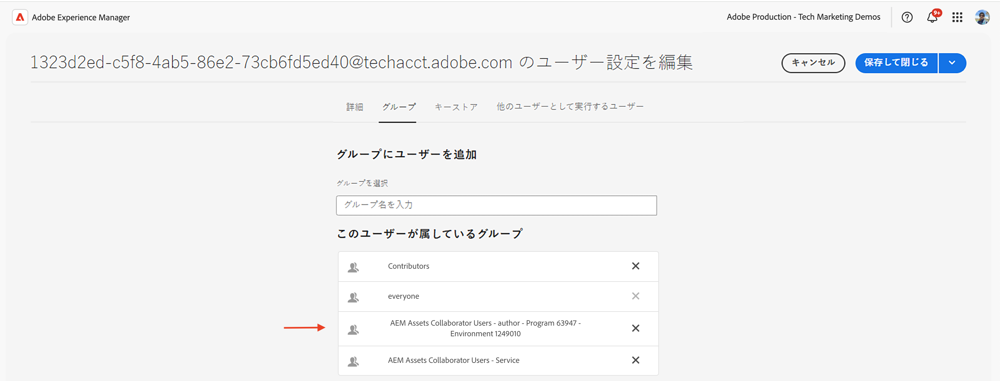
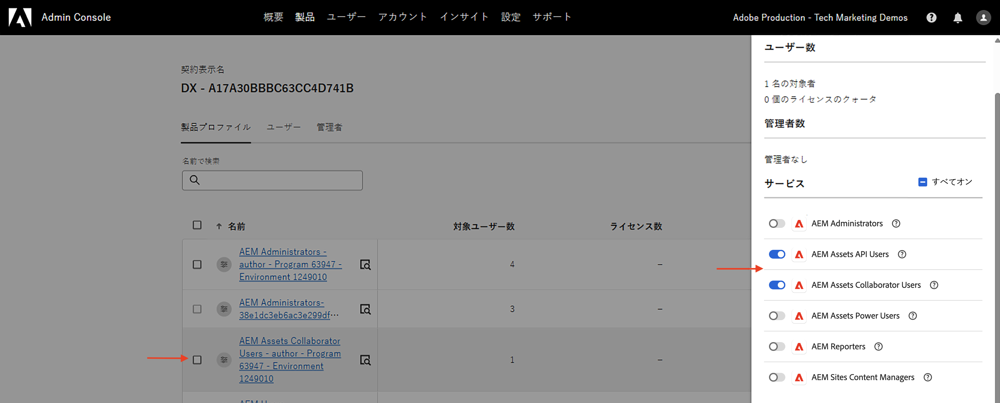
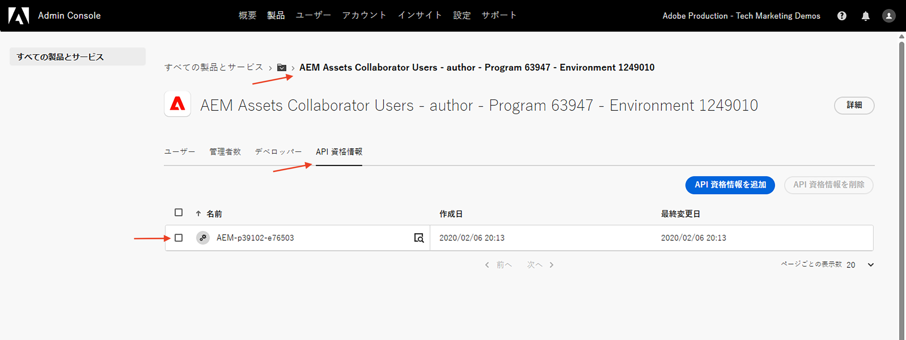

# OAuth サーバー間認証を使用した OpenAPI ベースのAEM API の呼び出し

_OAuth サーバー間_ 認証を使用して、カスタムアプリケーションからAEM as a Cloud Serviceで OpenAPI ベースのAEM API を呼び出す方法について説明します。

OAuth サーバー間認証は、ユーザーの操作なしで API アクセスが必要なバックエンドサービスに最適です。 クライアントアプリケーションの認証には、OAuth 2.0 _client_credentials_ 付与タイプを使用します。

>[!AVAILABILITY]
>
>OpenAPI ベースのAEM API は、早期アクセスプログラムの一部として利用できます。 これらにアクセスすることに関心がある場合は、ユースケースの説明を記載した電子メール ](mailto:aem-apis@adobe.com)0}aem-apis@adobe.com} を送信することをお勧めします。[

## 学習内容{#what-you-learn}

このチュートリアルでは、次の方法を学びます。

- Adobe Developer Console（ADC）プロジェクトを設定し、_OAuth サーバー間認証_ を使用してAssets オーサー API にアクセスします。

- Assets オーサー API を呼び出して特定のアセットのメタデータを取得するサンプル NodeJS アプリケーションを開発します。

開始する前に、次の点を確認してください。

- [Adobe API へのアクセスと関連概念 ](../overview.md#accessing-adobe-apis-and-related-concepts) 節を参照してください。
- [OpenAPI ベースのAEM API の設定 ](../setup.md) 記事

## 前提条件

このチュートリアルを完了するには、次が必要になります。

- AEM as a Cloud Service環境を最新化し、次の機能を実現しました。
   - AEM リリース `2024.10.18459.20241031T210302Z` 以降。
   - 新しいスタイルの製品プロファイル（2024 年 11 月より前に環境が作成された場合）

  詳しくは、[OpenAPI ベースのAEM API の設定 ](../setup.md) を参照してください。

- サンプルの [WKND Sites](https://github.com/adobe/aem-guides-wknd?#aem-wknd-sites-project) プロジェクトをこのプロジェクトにデプロイする必要があります。

- [Adobe Developer Console](https://developer.adobe.com/developer-console/docs/guides/getting-started/) にアクセスします。

- [Node.js](https://nodejs.org/ja/) をローカルマシンにインストールして、サンプルの NodeJS アプリケーションを実行します。

## 開発手順

大まかな開発手順は次のとおりです。

1. ADC プロジェクトの設定
   1. Assets オーサー API を追加します。
   1. 認証方法を OAuth サーバー間として設定します。
   1. 製品プロファイルと認証設定の関連付け
1. AEM インスタンスを設定して、ADC プロジェクト通信を有効にします
1. サンプル NodeJS アプリケーションの開発
1. エンドツーエンドフローの検証

## ADC プロジェクトの設定

ADC プロジェクトの設定手順が、[OpenAPI ベースのAEM API の設定 ](../setup.md) から _繰り返し_ されます。 これを繰り返して、Assets Author API を追加し、その認証方法を OAuth サーバー間として設定します。

>[!TIP]
>
>[OpenAPI ベースのAEM API の設定 **記事から** AEM API アクセスの有効化 ](../setup.md#enable-aem-apis-access) 手順が完了していることを確認します。 これがないと、サーバー間認証オプションは使用できません。


1. [Adobe Developer Console](https://developer.adobe.com/console/projects) から目的のプロジェクトを開きます。

1. AEM API を追加するには、「**API を追加**」ボタンをクリックします。

   

1. _API を追加_ ダイアログで、_Experience Cloudでフィルタリングし_ 「**AEM Assets オーサー API**」カードを選択して、「**次へ**」をクリックします。

   

1. 次に、_API を設定_ ダイアログで「**サーバー間**」認証オプションを選択し、「**次へ**」をクリックします。 サーバー間の認証は、ユーザーの操作なしで API へのアクセスが必要なバックエンドサービスに最適です。

   

1. 識別を容易にするために資格情報の名前を変更し（必要に応じて）、「**次へ**」をクリックします。 デモ用に、デフォルト名が使用されます。

   

1. 「**AEM Assets Collaborator Users - author - Program XXX - Environment XXX** Product Profile」を選択し、「**保存**」をクリックします。 ご覧のように、AEM Assets API ユーザーサービスに関連付けられた製品プロファイルのみを選択できます。

   

1. AEM API と認証設定を確認します。

   

   

## ADC プロジェクト通信を有効にする AEM インスタンスの設定

[OpenAPI ベースのAEM API の設定 ](../setup.md#configure-the-aem-instance-to-enable-adc-project-communication) の記事の手順に従って、AEM インスタンスを設定し、ADC プロジェクト通信を有効にします。

## サンプル NodeJS アプリケーションの開発

Assets オーサー API を呼び出すサンプル NodeJS アプリケーションを作成しましょう。

Java や Python などの他のプログラミング言語を使用して、アプリケーションを開発できます。

テストの目的で、[Postman](https://www.postman.com/)、[curl](https://curl.se/) またはその他の REST クライアントを使用して、AEM API を呼び出すことができます。

### API を確認する

アプリケーションを開発する前に、{2[Assets オーサー API から ](https://developer.adobe.com/experience-cloud/experience-manager-apis/api/experimental/../assets/author/#operation/getAssetMetadata) 指定したアセットのメタデータを配信する _エンドポイントを確認してみましょう。_ API 構文は次のとおりです。

```http
GET https://{bucket}.adobeaemcloud.com/adobe/../assets/{assetId}/metadata
```

特定のアセットのメタデータを取得するには、`bucket` と `assetId` の値が必要です。 `bucket` は、例えば `author-p63947-e1420428` のように、AEM インスタンス名からAdobe ドメイン名（.adobeaemcloud.com）を除いたものです。

`assetId` は、`urn:aaid:aem:` のプレフィックスが付いたアセットの JCR UUID です（例：`urn:aaid:aem:a200faf1-6d12-4abc-bc16-1b9a21f870da`）。 `assetId` を取得する方法は複数あります。

- AEM アセットのパス `.json` 拡張機能を追加して、アセットのメタデータを取得します。 例えば、を `https://author-p63947-e1420429.adobeaemcloud.com/content/dam/wknd-shared/en/adventures/cycling-southern-utah/adobestock-221043703.jpg.json` して、`jcr:uuid` プロパティを探します。

- または、ブラウザーの要素インスペクターでアセットを調べることで、`assetId` を取得できます。 `data-id="urn:aaid:aem:..."` 属性を探します。

  

### ブラウザーを使用した API の呼び出し

アプリケーションを開発する前に、[API ドキュメント ](https://developer.adobe.com/experience-cloud/experience-manager-apis/api/experimental/assets/author/) にある **試す** 機能を使用して API を呼び出します。

1. ブラウザーで [Assets Author API ドキュメント ](https://developer.adobe.com/experience-cloud/experience-manager-apis/api/experimental/assets/author/) を開きます。

1. 「_メタデータ_」セクションを展開し、「**指定したアセットのメタデータを配信**」オプションをクリックします。

1. 右側のペインで、「試す **ボタンをクリックし** す。
   

1. 次の値を入力します。

   | セクション | パラメーター | 値 |
   | --- | --- | --- |
   |  | バケット | Adobe ドメイン名を含まないAEM インスタンス名（.adobeaemcloud.com）（例：`author-p63947-e1420428`）。 |
   | **セキュリティ** | ベアラートークン | ADC プロジェクトの OAuth サーバー間資格情報のアクセストークンを使用します。 |
   | **セキュリティ** | X-Api-Key | ADC プロジェクトの OAuth サーバー間資格情報の `ClientID` 値を使用します。 |
   | **パラメーター** | assetId | AEM内のアセットの一意の ID （例：`urn:aaid:aem:a200faf1-6d12-4abc-bc16-1b9a21f870da`） |
   | **パラメーター** | X-Adobe-Accept-Experimental | 1 |

   

   

1. 「**送信**」をクリックして API を呼び出し、「**応答**」タブで応答を確認します。

   

上記の手順は、AEM as a Cloud Service環境の最新化を確認し、AEM API へのアクセスを可能にします。 また、ADC プロジェクトの設定が成功したことや、AEM オーサーインスタンスとの OAuth サーバー間資格情報の ClientID 通信が成功したことも確認します。

### NodeJS アプリケーションのサンプル

サンプルの NodeJS アプリケーションを開発しましょう。

アプリケーションを開発するには、_Run-the-sample-application_ または _Step-by-step-development_ 手順を使用します。

>[!BEGINTABS]

>[!TAB Run-the-sample-application]

1. サンプルの [demo-nodejs-app-to-invoke-aem-openapi](../assets/s2s/demo-nodejs-app-to-invoke-aem-openapi.zip) アプリケーションの zip ファイルをダウンロードして抽出します。

1. 抽出したフォルダーに移動して、依存関係をインストールします。

   ```bash
   $ npm install
   ```

1. `.env` ファイルのプレースホルダーを、ADC Project の OAuth サーバー間資格情報の実際の値に置き換えます。

1. `src/index.js` ファイルの `<BUCKETNAME>` と `<ASSETID>` を実際の値に置き換えます。

1. NodeJS アプリケーションを実行します。

   ```bash
   $ node src/index.js
   ```

>[!TAB  開発手順 ]

1. 新しい NodeJS プロジェクトを作成します。

   ```bash
   $ mkdir demo-nodejs-app-to-invoke-aem-openapi
   $ cd demo-nodejs-app-to-invoke-aem-openapi
   $ npm init -y
   ```

1. _fetch_ ライブラリと _dotenv_ ライブラリをインストールして、HTTP リクエストを行い、環境変数を読み取ります。

   ```bash
   $ npm install node-fetch
   $ npm install dotenv
   ```

1. お気に入りのコードエディターでプロジェクトを開き、`package.json` ファイルを更新して `type` を `module` に追加します。

   ```json
   {
       ...
       "version": "1.0.0",
       "type": "module",
       "main": "index.js",
       ...
   }
   ```

1. ファイル `.env` 作成し、次の設定を追加します。 プレースホルダーを、ADC プロジェクトの OAuth サーバー間資格情報の実際の値に置き換えます。

   ```properties
   CLIENT_ID=<ADC Project OAuth Server-to-Server credential ClientID>
   CLIENT_SECRET=<ADC Project OAuth Server-to-Server credential Client Secret>
   SCOPES=<ADC Project OAuth Server-to-Server credential Scopes>
   ```

1. ファイル `src/index.js` 作成して次のコードを追加し、`<BUCKETNAME>` と `<ASSETID>` を実際の値に置き換えます。

   ```javascript
   // Import the dotenv configuration to load environment variables from the .env file
   import "dotenv/config";
   
   // Import the fetch function to make HTTP requests
   import fetch from "node-fetch";
   
   // REPLACE THE FOLLOWING VALUES WITH YOUR OWN
   const bucket = "<BUCKETNAME>"; // Bucket name is the AEM instance name (e.g. author-p63947-e1420428)
   const assetId = "<ASSETID>"; // Asset ID is the unique identifier for the asset in AEM (e.g. urn:aaid:aem:a200faf1-6d12-4abc-bc16-1b9a21f870da). You can get it by inspecting the asset in browser's element inspector, look for data-id="urn:aaid:aem:..."
   
   // Load environment variables for authentication
   const clientId = process.env.CLIENT_ID; // Adobe IMS client ID
   const clientSecret = process.env.CLIENT_SECRET; // Adobe IMS client secret
   const scopes = process.env.SCOPES; // Scope for the API access
   
   // Adobe IMS endpoint for obtaining an access token
   const adobeIMSV3TokenEndpointURL =
   "https://ims-na1.adobelogin.com/ims/token/v3";
   
   // Function to obtain an access token from Adobe IMS
   const getAccessToken = async () => {
       console.log("Getting access token from IMS"); // Log process initiation
       //console.log("Client ID: " + clientId); // Display client ID for debugging purposes
   
       // Configure the HTTP POST request to fetch the access token
       const options = {
           method: "POST",
           headers: {
           "Content-Type": "application/x-www-form-urlencoded", // Specify form data content type
           },
           // Send client ID, client secret, and scopes as the request body
           body: `grant_type=client_credentials&client_id=${clientId}&client_secret=${clientSecret}&scope=${scopes}`,
       };
   
       // Make the HTTP request to fetch the access token
       const response = await fetch(adobeIMSV3TokenEndpointURL, options);
   
       //console.log("Response status: " + response.status); // Log the HTTP status for debugging
   
       const responseJSON = await response.json(); // Parse the JSON response
   
       console.log("Access token received"); // Log success message
   
       // Return the access token
       return responseJSON.access_token;
   };
   
   // Function to retrieve metadata for a specific asset from AEM
   const getAssetMetadat = async () => {
       // Fetch the access token using the getAccessToken function
       const accessToken = await getAccessToken();
   
       console.log("Getting asset metadata from AEM");
   
       // Invoke the Assets Author API to retrieve metadata for a specific asset
       const resp = await fetch(
           `https://${bucket}.adobeaemcloud.com/adobe/../assets/${assetId}/metadata`, // Construct the URL with bucket and asset ID
           {
           method: "GET",
           headers: {
               "If-None-Match": "string", // Header to handle caching (not critical for this tutorial)
               "X-Adobe-Accept-Experimental": "1", // Header to enable experimental Adobe API features
               Authorization: "Bearer " + accessToken, // Provide the access token for authorization
               "X-Api-Key": clientId, // Include the OAuth S2S ClientId for identification
           },
           }
       );
   
       const data = await resp.json(); // Parse the JSON response
   
       console.log("Asset metadata received"); // Log success message
       console.log(data); // Display the retrieved metadata
   };
   
   // Call the getAssets function to start the process
   getAssetMetadat();
   ```

1. NodeJS アプリケーションを実行します。

   ```bash
   $ node src/index.js
   ```

>[!ENDTABS]

### API 応答

正常に実行されると、API 応答がコンソールに表示されます。 応答には、指定したアセットのメタデータが含まれます。

```json
{
  "assetId": "urn:aaid:aem:9c09ff70-9ee8-4b14-a5fa-ec37baa0d1b3",
  "assetMetadata": {    
    ...
    "dc:title": "A Young Mountain Biking Couple Takes A Minute To Take In The Scenery",
    "xmp:CreatorTool": "Adobe Photoshop Lightroom Classic 7.5 (Macintosh)",
    ...
  },
  "repositoryMetadata": {
    ...
    "repo:name": "adobestock-221043703.jpg",
    "repo:path": "/content/dam/wknd-shared/en/adventures/cycling-southern-utah/adobestock-221043703.jpg",
    "repo:state": "ACTIVE",
    ...
  }
}
```

これで完了です。 OAuth サーバー間認証を使用して、カスタムアプリケーションから OpenAPI ベースのAEM API を正常に呼び出しました。

### アプリケーションコードを確認します

サンプル NodeJS アプリケーションコードの主要なコールアウトは次のとおりです。

1. **IMS 認証**:ADC プロジェクトで設定された OAuth サーバー間資格情報を使用して、アクセストークンを取得します。

   ```javascript
   // Function to obtain an access token from Adobe IMS
   const getAccessToken = async () => {
   
       // Configure the HTTP POST request to fetch the access token
       const options = {
           method: "POST",
           headers: {
           "Content-Type": "application/x-www-form-urlencoded", // Specify form data content type
           },
           // Send client ID, client secret, and scopes as the request body
           body: `grant_type=client_credentials&client_id=${clientId}&client_secret=${clientSecret}&scope=${scopes}`,
       };
   
       // Make the HTTP request to fetch the access token from Adobe IMS token endpoint https://ims-na1.adobelogin.com/ims/token/v3
       const response = await fetch(adobeIMSV3TokenEndpointURL, options);
   
       const responseJSON = await response.json(); // Parse the JSON response
   
       // Return the access token
       return responseJSON.access_token;
   };
   ...
   ```

1. **API 呼び出し**:Assets オーサー API を呼び出し、認証用のアクセストークンを提供して、特定のアセットのメタデータを取得します。

   ```javascript
   // Function to retrieve metadata for a specific asset from AEM
   const getAssetMetadat = async () => {
       // Fetch the access token using the getAccessToken function
       const accessToken = await getAccessToken();
   
       console.log("Getting asset metadata from AEM");
   
       // Invoke the Assets Author API to retrieve metadata for a specific asset
       const resp = await fetch(
           `https://${bucket}.adobeaemcloud.com/adobe/../assets/${assetId}/metadata`, // Construct the URL with bucket and asset ID
           {
           method: "GET",
           headers: {
               "If-None-Match": "string", // Header to handle caching (not critical for this tutorial)
               "X-Adobe-Accept-Experimental": "1", // Header to enable experimental Adobe API features
               Authorization: "Bearer " + accessToken, // Provide the access token for authorization
               "X-Api-Key": clientId, // Include the OAuth S2S ClientId for identification
           },
           }
       );
   
       const data = await resp.json(); // Parse the JSON response
   
       console.log("Asset metadata received"); // Log success message
       console.log(data); // Display the retrieved metadata
   };
   ...
   ```

## 内部の仕組み

API が正常に呼び出されると、ADC プロジェクトの OAuth サーバー間資格情報を表すユーザーが、製品プロファイルおよびサービス設定に一致するユーザーグループと共に、AEM オーサーサービスに作成されます。 _テクニカルアカウントユーザー_ は、アセットメタデータの _読み取り_ に必要な権限を持つ製品プロファイルおよび _サービス_ ユーザーグループに関連付けられています。

テクニカルアカウントユーザーとユーザーグループの作成を確認するには、次の手順に従います。

- ADC プロジェクトで、**OAuth サーバー間** 資格情報設定に移動します。 **テクニカルアカウントメール** の値をメモします。

  

- AEM オーサーサービスで、**ツール**/**セキュリティ**/**ユーザー** に移動し、**テクニカルアカウントメール** の値を検索します。

  

- テクニカルアカウントユーザーをクリックして、**グループ** メンバーシップなどのユーザーの詳細を表示します。 次に示すように、テクニカルアカウントユーザーは、**AEM Assets Collaborator Users - author - Program XXX - Environment XXX および** 2}AEM Assets Collaborator Users - Service **ユーザーグループに関連付けられています。**

  

- テクニカルアカウントユーザーは、**AEM Assets Collaborator Users - author - Program XXX - Environment XXX** Product Profile に関連付けられています。 製品プロファイルは、**AEM Assets API ユーザー** および **AEM Assets Collaborator ユーザー** サービスに関連付けられています。

  

- 製品プロファイルとテクニカルアカウントのユーザーの関連付けは、**製品プロファイル** の「**API 資格情報**」タブで確認できます。

  

## GET以外のリクエストの 403 エラー

アセットメタデータ _読み取り_ には、OAuth サーバー間資格情報用に作成されたテクニカルアカウントユーザーが、サービスユーザーグループ（例：AEM Assets Collaborator Users - サービス）を介して必要な権限を持っています。

ただし、アセットメタデータを _作成、更新、削除_ （CUD）するには、テクニカルアカウントユーザーは追加の権限を必要とします。 GET以外のリクエスト（PATCH、DELETEなど）で API を呼び出すと検証でき、403 エラー応答が確認できます。

_PATCH_ リクエストを呼び出して、アセットメタデータを更新し、403 エラー応答を確認します。

- ブラウザーで [Assets Author API ドキュメント ](https://developer.adobe.com/experience-cloud/experience-manager-apis/api/experimental/assets/author/) を開きます。

- 次の値を入力します。

  | セクション | パラメーター | 値 |
  | --- | --- | --- |
  | **バケット** |  | Adobe ドメイン名を含まないAEM インスタンス名（.adobeaemcloud.com）（例：`author-p63947-e1420428`）。 |
  | **セキュリティ** | ベアラートークン | ADC プロジェクトの OAuth サーバー間資格情報のアクセストークンを使用します。 |
  | **セキュリティ** | X-Api-Key | ADC プロジェクトの OAuth サーバー間資格情報の `ClientID` 値を使用します。 |
  | **本文** |  | `[{ "op": "add", "path": "foo","value": "bar"}]` |
  | **パラメーター** | assetId | AEM内のアセットの一意の ID （例：`urn:aaid:aem:a200faf1-6d12-4abc-bc16-1b9a21f870da`） |
  | **パラメーター** | X-Adobe-Accept-Experimental | * |
  | **パラメーター** | X-Adobe-Accept-Experimental | 1 |

- 「**送信**」をクリックして _PATCH_ リクエストを呼び出し、403 エラー応答を確認します。

  

403 エラーを修正するには、次の 2 つのオプションがあります。

- ADC プロジェクトで、OAuth サーバー間資格情報に関連付けられている製品プロファイルを、アセットメタデータの _作成、更新、削除_ （CUD）に必要な権限を持つ適切な製品プロファイル（例：**AEM管理者 – オーサー – プログラム XXX – 環境 XXX** で更新します。 詳しくは、[ 方法 – API の接続資格情報と製品プロファイル管理 ](../how-to/credentials-and-product-profile-management.md) の記事を参照してください。

- AEM プロジェクトを使用して、AEM オーサーで関連するAEM サービスユーザーグループ（例：AEM Assets Collaborator Users - サービス）の権限を更新し、アセットメタデータの _作成、更新、削除_ （CUD）を許可します。 詳しくは、[ 方法 – AEM サービスユーザーグループの権限管理 ](../how-to/services-user-group-permission-management.md) を参照してください。

## 概要

このチュートリアルでは、カスタムアプリケーションから OpenAPI ベースのAEM API を呼び出す方法を学びました。 AEM API へのアクセスを有効にし、Adobe Developer Console（ADC）プロジェクトを作成して設定しました。
ADC プロジェクトで、AEM API を追加し、その認証タイプを設定して、製品プロファイルを関連付けました。 また、ADC プロジェクト通信を有効にするようにAEM インスタンスを設定し、Assets オーサー API を呼び出すサンプル NodeJS アプリケーションを開発しました。

## その他のリソース

- [OAuth サーバー間資格情報実装ガイド](https://developer.adobe.com/developer-console/docs/guides/authentication/ServerToServerAuthentication/implementation/)
