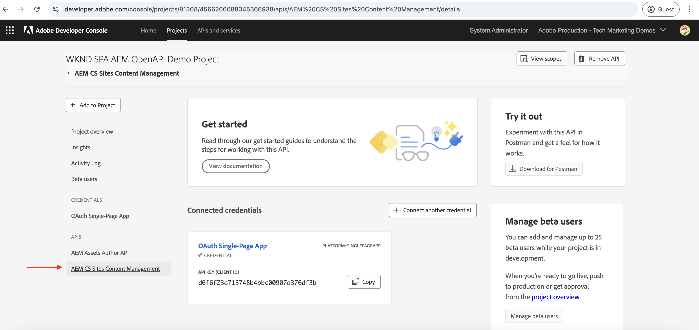

# OAuth 単一ページアプリを使用した OpenAPI ベースの AEM API の呼び出し

**OAuth 単一ページアプリ認証**&#x200B;を使用して、AEM as a Cloud Service で OpenAPI ベースの AEM API を呼び出す方法を学びます。これは、単一ページアプリケーション（SPA）でのユーザーベース認証の OAuth 2.0 PKCE（Proof Key for Code Exchange）フローに従います。

OAuth 単一ページアプリ認証は、ブラウザーで実行される JavaScript ベースのアプリケーションに最適です。バックエンドサーバーがない場合も、ユーザーの代わりに AEM API とやり取りするためにアクセストークンを取得する必要がある場合も同様です。

PKCE フローは、OAuth 2.0 _authorization_code_ 付与タイプを拡張し、承認コードの傍受を防いでセキュリティを強化します。詳しくは、「[OAuth サーバー間資格情報と、web アプリ資格情報と単一ページアプリ資格情報の違い](../overview.md#difference-between-oauth-server-to-server-vs-web-app-vs-single-page-app-credentials)」セクションを参照してください。

## 学習内容{#what-you-learn}

このチュートリアルでは、以下の方法について説明します。

- Adobe Developer Console（ADC）プロジェクトを設定し、_OAuth 単一ページアプリ_&#x200B;認証（一般的に _OAuth 2.0 PKCE フロー_&#x200B;と呼ばれる）を使用して、OpenAPI ベースの AEM API にアクセスします。

- カスタム SPA で OAuth 単一ページアプリ認証フローを実装します。
   - IMS ユーザー認証とアプリ承認。
   - OAuth 2.0 PKCE フローを使用したアクセストークン取得。
   - アクセストークンを使用して、OpenAPI ベースの AEM API を呼び出します。

開始する前に、次を必ず確認します。

- 「[Adobe API へのアクセスと関連概念](../overview.md#accessing-adobe-apis-and-related-concepts)」セクション。
- [OpenAPI ベースの AEM API の設定](../setup.md)記事。

## WKND SPA の概要と機能フロー{#wknd-spa-overview-and-functional-flow}

WKND SPA とは何か、WKND SPA の構造、WKND SPA の機能を見てみましょう。

WKND SPA は、ユーザー固有のアクセストークンを安全に取得し、クライアントサイドから直接 AEM API とやり取りする方法を示す **React ベースの単一ページアプリケーション**&#x200B;です。Adobe IMS を通じた OAuth 2.0 PKCE 認証フローを実装し、次の 2 つの主要な AEM API と統合されています。

1. **Sites API**：コンテンツフラグメントモデルへのアクセス用
1. **Assets API**：DAM フォルダーの管理用

Adobe Developer Console（ADC）プロジェクトは、OAuth 単一ページアプリ認証を有効にするように設定されており、OAuth 2.0 PKCE フローを開始するために必要な **client_id** を提供します。

>[!IMPORTANT]
>
>ADC プロジェクトは _client_secret_ を提供しません。代わりに、SPA は _code_verifier_ と _code_challenge_ を生成して、_アクセストークン_&#x200B;の承認コードを安全に交換します。これにより、クライアント側でクライアントの秘密鍵を保存する必要がなくなり、セキュリティが強化されます。


>[!VIDEO](https://video.tv.adobe.com/v/3456964?quality=12&learn=on)


次の図は、WKND SPA が _OpenAPI ベースの AEM API を呼び出すためのユーザー固有のアクセストークンを取得する_&#x200B;機能フローを示しています。


1. SPA が認証リクエスト経由で Adobe ID 管理システム（IMS）にユーザーを誘導することで認証フローを開始します。
1. 認証リクエストの一環として、SPA は、OAuth 2.0 PKCE フローに従って、_client_id_、_redirect_uri_ および _code_challenge_ を IMS に送信します。SPA はランダムな _code_verifier_ を生成し、SHA-256 を使用してハッシュ化し、Base64 がその結果をエンコードして _code_challenge_ を作成します。
1. IMS がユーザーを認証し、認証に成功すると、_authorization_code_ を発行し、それが _redirect_uri_ 経由で SPA に返されます。
1. SPA は、IMS トークンエンドポイントに POST リクエストを送信することで、_authorization_code_ と _access token_ を交換します。これには、前に送信した _code_challenge_ を検証するリクエストに _code_verifier_ が含まれます。これにより、認証リクエスト（手順 2）とトークンリクエスト（手順 4）が同じ認証フローにリンクされ、傍受攻撃を防ぐことができます。
1. IMS は _code_verifier_ を検証し、ユーザー固有の&#x200B;_アクセストークン_&#x200B;を返します。
1. SPA では、AEM に対する API リクエストに&#x200B;_アクセストークン_&#x200B;を含めて、ユーザー固有のコンテンツを認証および取得します。

WKND SPA は [React](https://react.dev/) ベースのアプリケーションであり、認証状態の管理には [React コンテキスト](https://react.dev/reference/react/createContext)を使用し、ナビゲーションには [React ルーター](https://reactrouter.com/home)を使用します。

Angular、Vue、vanilla JavaScript などの他の SPA フレームワークを使用して、このチュートリアルで示すアプローチに従って Adobe API と統合する SPA を作成できます。

## このチュートリアルの使用方法{#how-to-use-this-tutorial}

このチュートリアルは次の 2 つの方法でアプローチできます。

- [SPA の主要なコードスニペットの確認](#review-spa-key-code-snippets)：OAuth 単一ページアプリ認証フローを理解し、WKND SPA での主要な API 呼び出し実装について確認します。
- [SPA の設定と実行](#setup-and-run-the-spa)：段階的な手順に従って、ローカルマシンに WKND SPA を設定し実行します。

ニーズに合ったパスの選択

## SPA の主要なコードスニペットの確認{#review-spa-key-code-snippets}

次の方法を示す WKND SPA の主要なコードスニペットについて詳しく見てみましょう。

- OAuth 単一ページアプリ認証フローを使用して、ユーザー固有のアクセストークンを取得します。

- クライアント側から直接 OpenAPI ベースの AEM API を呼び出します。

これらのスニペットは、SPA 内の認証プロセスと API のインタラクションを理解するのに役立ちます。

### SPA コードのダウンロード{#download-the-spa-code}

1. [WKND SPA および AEM API - デモアプリ ](../assets/spa/wknd-spa-with-aemapis-demo.zip)zip ファイルをダウンロードして抽出します。

1. 抽出したフォルダーに移動し、お気に入りのコードエディターで `.env.example` ファイルを開きます。必要な設定パラメーターを確認します。

   ```plaintext
   ########################################################################
   # Adobe IMS, Adobe Developer Console (ADC), and AEM as a Cloud Service Information
   ########################################################################
   # Adobe IMS OAuth endpoints
   REACT_APP_ADOBE_IMS_AUTHORIZATION_ENDPOINT=https://ims-na1.adobelogin.com/ims/authorize/v2
   REACT_APP_ADOBE_IMS_TOKEN_ENDPOINT=https://ims-na1.adobelogin.com/ims/token/v3
   
   # Adobe Developer Console (ADC) Project's OAuth Single-Page App credential
   REACT_APP_ADC_CLIENT_ID=<ADC Project OAuth Single-Page App credential ClientID>
   REACT_APP_ADC_SCOPES=<ADC Project OAuth Single-Page App credential Scopes>
   
   # AEM Assets Information
   REACT_APP_AEM_ASSET_HOSTNAME=<AEMCS Hostname, e.g., https://author-p63947-e1502138.adobeaemcloud.com/>
   
   ################################################
   # Single Page Application Information
   ################################################
   
   # Enable HTTPS for local development
   HTTPS=true
   PORT=3001
   
   # SSL Certificate and Key for local development 
   SSL_CRT_FILE=./ssl/server.crt
   SSL_KEY_FILE=./ssl/server.key
   
   # The URL to which the user will be redirected after the OAuth flow is complete
   REACT_APP_REDIRECT_URI=https://localhost:3000/callback
   ```

   プレースホルダーを Adobe Developer Console（ADC）プロジェクトおよび AEM as a Cloud Service Assets インスタンスからの実際の値に置き換える必要があります。

### IMS ユーザー認証と SPA 認証{#ims-user-authentication-and-spa-authorization}

IMS ユーザー認証と SPA 認証を処理するコードを確認しましょう。コンテンツフラグメントモデルと DAM フォルダーを取得するには、Adobe IMS で認証し、自分に代わって AEM API にアクセスするための WKND SPA 権限を付与する必要があります。

最初のログイン中に、ユーザーは同意を入力するように求められ、WKND SPA が必要なリソースに安全にアクセスできるようになります。


1. `src/context/IMSAuthContext.js` ファイルでは、`login` 関数が IMS ユーザー認証およびアプリ承認フローを開始します。ランダムな `code_verifier` と `code_challenge` を生成して、`code` とアクセストークンを安全に交換します。`code_verifier` は、後で使用するためにローカルストレージに保存されます。前述のように、SPA は `client_secret` を保存または使用せず、その場で 1 つを生成し、`authorize` リクエストと `token` リクエストの 2 つの手順で使用します。

   ```javascript
   ...
   const login = async () => {
       try {
           const codeVerifier = generateCodeVerifier();
           const codeChallenge = generateCodeChallenge(codeVerifier);
   
           localStorage.setItem(STORAGE_KEYS.CODE_VERIFIER, codeVerifier);
   
           const params = new URLSearchParams(
               getAuthParams(AUTH_METHODS.S256, codeChallenge, codeVerifier)
           );
   
           window.location.href = `${
               APP_CONFIG.adobe.ims.authorizationEndpoint //https://ims-na1.adobelogin.com/ims/authorize/v2
           }?${params.toString()}`;
       } catch (error) {
           console.error("Login initialization failed:", error);
           throw error;
       }
   };
   ...
   
   // Generate a random code verifier
   export function generateCodeVerifier() {
       const array = new Uint8Array(32);
       window.crypto.getRandomValues(array);
       const wordArray = CryptoJS.lib.WordArray.create(array);
       return base64URLEncode(wordArray);
   }
   
   // Generate code challenge using SHA-256
   export function generateCodeChallenge(codeVerifier) {
       const hash = CryptoJS.SHA256(codeVerifier);
       return base64URLEncode(hash);
   }
   
   // Get authorization URL parameters
   const getAuthParams = useCallback((method, codeChallenge, codeVerifier) => {
       const baseParams = {
           client_id: APP_CONFIG.adobe.adc.clientId, // ADC Project OAuth Single-Page App credential ClientID
           scope: APP_CONFIG.adobe.adc.scopes, // ADC Project OAuth Single-Page App credential Scopes
           response_type: "code",
           redirect_uri: APP_CONFIG.adobe.spa.redirectUri, // SPA redirect URI https://localhost:3000/callback
           code_challenge_method: method, // S256 or plain
       };
   
       return {
           ...baseParams,
           code_challenge:
               method === AUTH_METHODS.S256 ? codeChallenge : codeVerifier,
           };
   }, []);    
   ...
   ```

   ユーザーが Adobe IMS に対して認証されていない場合は、ユーザーに認証を求める Adobe ID ログインページが表示されます。

   既に認証されている場合、ユーザーは _authorization_code_ を使用して WKND SPA の指定された _redirect_uri_ にリダイレクトされます。

### OAuth 2.0 PKCE フローを使用したアクセストークン取得{#access-token-retrieval-using-oauth-20-pkce-flow}

WKND SPA は、_client_id_ および _code_verifier_ を使用して、ユーザー固有のアクセストークンのために、_authorization_code_ を Adobe IMS と安全に交換します。

1. `src/context/IMSAuthContext.js` ファイルでは、`exchangeCodeForToken` 関数は _authorization_code_ をユーザー固有のアクセストークンと交換します。

   ```javascript
   ...
   // Handle the callback from the Adobe IMS authorization endpoint
   const handleCallback = async (code) => {
       if (authState.isProcessingCallback) return;
   
       try {
           updateAuthState({ isProcessingCallback: true });
   
           const data = await exchangeCodeForToken(code);
   
           if (data.access_token) {
               handleStorageToken(data.access_token);
               localStorage.removeItem(STORAGE_KEYS.CODE_VERIFIER);
           }
       } catch (error) {
           console.error("Error exchanging code for token:", error);
           throw error;
       } finally {
           updateAuthState({ isProcessingCallback: false });
       }
   };
   
   ...
   // Exchange the authorization code for an access token
   const exchangeCodeForToken = useCallback(async (code) => {
       const codeVerifier = localStorage.getItem(STORAGE_KEYS.CODE_VERIFIER);
   
       if (!codeVerifier) {
           throw new Error("No code verifier found");
       }
   
       //https://ims-na1.adobelogin.com/ims/token/v3
       const response = await fetch(APP_CONFIG.adobe.ims.tokenEndpoint, {
           method: "POST",
           headers: { "Content-Type": "application/x-www-form-urlencoded" },
           body: new URLSearchParams({
               grant_type: "authorization_code",
               client_id: APP_CONFIG.adobe.adc.clientId, // ADC Project OAuth Single-Page App credential ClientID
               code_verifier: codeVerifier, // Code verifier generated during login
               code, // Authorization code received from the IMS
               redirect_uri: `${window.location.origin}/callback`,
           }),
       });
   
       if (!response.ok) {
           throw new Error("Token request failed");
       }
   
       return response.json();
   }, []);
   
   const handleStorageToken = useCallback(
       (token) => {
           if (token) {
               localStorage.setItem(STORAGE_KEYS.ACCESS_TOKEN, token);
               updateAuthState({ isLoggedIn: true, accessToken: token });
           }
       },
       [updateAuthState]
   );
   ...
   ```

   アクセストークンはブラウザーのローカルストレージに保存され、AEM API への後続の API 呼び出しで使用されます。

### アクセストークンを使用した OpenAPI ベースの AEM API へのアクセス{#accessing-openapi-based-aem-apis-using-the-access-token}

WKND SPA では、ユーザー固有のアクセストークンを使用して、コンテンツフラグメントモデルと DAM フォルダー API エンドポイントを呼び出します。

`src/components/InvokeAemApis.js` ファイルでは、`fetchContentFragmentModels` 関数は、アクセストークンを使用して、OpenAPI ベースの AEM API をクライアント側から呼び出す方法を示します。

```javascript
    ...
  // Fetch Content Fragment Models
  const fetchContentFragmentModels = useCallback(async () => {
    try {
      updateState({ isLoading: true, error: null });
      const data = await makeApiRequest({
        endpoint: `${API_PATHS.CF_MODELS}?cursor=0&limit=10&projection=summary`,
      });
      updateState({ cfModels: data.items });
    } catch (err) {
      updateState({ error: err.message });
      console.error("Error fetching CF models:", err);
    } finally {
      updateState({ isLoading: false });
    }
  }, [makeApiRequest, updateState]);

  // Common API request helper
  const makeApiRequest = useCallback(
    async ({ endpoint, method = "GET", passAPIKey = false, body = null }) => {
    
      // Get the access token from the local storage
      const token = localStorage.getItem("adobe_ims_access_token");
      if (!token) {
        throw new Error("No access token available. Please login again.");
      }

      const headers = {
        Authorization: `Bearer ${token}`,
        "Content-Type": "application/json",
        ...(passAPIKey && { "x-api-key": APP_CONFIG.adobe.adc.clientId }),
      };

      const response = await fetch(
        `${APP_CONFIG.adobe.aem.hostname}${endpoint}`,
        {
          method,
          headers,
          ...(body && { body: JSON.stringify(body) }),
        }
      );

      if (!response.ok) {
        throw new Error(`API request failed: ${response.statusText}`);
      }

      return method === "DELETE" ? null : response.json();
    },
    []
  );
  ...
```

## SPA の設定と実行{#setup-and-run-the-spa}

OAuth 単一ページアプリ認証フローと API 呼び出しを理解するために、WKND SPA をローカルマシンで設定して実行しましょう。

### 前提条件{#prerequisites}

このチュートリアルを完了するには、次が必要になります。

- 次を備えた AEM as a Cloud Service 環境の最新化
   - AEM リリース `2024.10.18459.20241031T210302Z` 以降。
   - 新しいスタイルの製品プロファイル（2024年11月より前に環境が作成された場合）

  詳しくは、[OpenAPI ベースの AEM API の設定](../setup.md)を参照してください。

- サンプル [WKND Sites](https://github.com/adobe/aem-guides-wknd?#aem-wknd-sites-project) プロジェクトをそこにデプロイする必要があります。

- [Adobe Developer Console](https://developer.adobe.com/developer-console/docs/guides/getting-started) にアクセスします。

- [Node.js](https://nodejs.org/ja/) をローカルマシンにインストールして、サンプルの NodeJS アプリケーションを実行します。

### 開発手順{#development-steps}

大まかな開発手順は次のとおりです。

1. ADC プロジェクトの設定
   1. Assets API と Sites API を追加します。
   1. OAuth 単一ページアプリの資格情報を設定します。
1. AEM インスタンスの設定
   1. ADC プロジェクト通信を有効にするには
   1. CORS を設定して SPA がAEM API にアクセスできるようにします。
1. ローカルマシンでの WKND SPA の設定と実行
1. エンドツーエンドフローの検証

### ADC プロジェクトの設定{#configure-adc-project}

ADC プロジェクトの設定手順は、[OpenAPI ベースの AEM API の設定](../setup.md)から&#x200B;_反復_&#x200B;されます。Assets、Sites API を追加し、その認証方法を OAuth 単一ページアプリとして設定するためにそれが反復されます。

1. [Adobe Developer Console](https://developer.adobe.com/console/projects) から目的のプロジェクトを開きます。

1. AEM API を追加するには、「**API を追加**」ボタンをクリックします。

   

1. _API を追加_&#x200B;ダイアログで、_Experience Cloud_ でフィルタリングし「**AEM CS Sites コンテンツ管理**」カードを選択して、「**次へ**」をクリックします。

   

   >[!TIP]
   >
   >必要な **AEM API カード**&#x200B;が無効になっている場合と、_無効になっている理由_&#x200B;情報に「**ライセンスが必要です**」というメッセージが表示される場合、理由の 1 つは、AEM as a Cloud Service環境を最新化していないことが考えられます。詳しくは、[AEM as a Cloud Service 環境の最新化](../setup.md#modernization-of-aem-as-a-cloud-service-environment)を参照してください。

1. 次に、_API を設定_&#x200B;ダイアログで「**ユーザー認証**」認証オプションを選択し、「**次へ**」をクリックします。

   

1. 次の _API を設定_&#x200B;ダイアログで、「**OAuth 単一ページアプリ**」認証オプションを選択し、「**次へ**」をクリックします。

   

1. _OAuth 単一ページアプリを設定_&#x200B;ダイアログで、次の詳細を入力し、「**次へ**」をクリックします。
   - 既定のリダイレクト URI：`https://localhost:3001/callback`
   - リダイレクト URI パターン：`https://localhost:3001/callback`

   

1. 使用可能なスコープを確認し、「**設定済み API を保存**」をクリックします。

   

1. 上記の手順を繰り返して、**AEM Assets オーサー API** を追加します。

1. AEM API と認証設定を確認します。

   

   

### ADC プロジェクト通信を有効にする AEM インスタンスの設定{#configure-aem-instance-to-enable-adc-project-communication}

[OpenAPI ベースの AEM API の設定](../setup.md#configure-the-aem-instance-to-enable-adc-project-communication)記事の手順に従って、AEM インスタンスを設定し、ADC プロジェクト通信を有効にします。

### AEM CORS 設定{#aem-cors-configuration}

AEM as a Cloud Service のクロスオリジンリソース共有（CORS）は、AEM 以外の web プロパティが、AEM API に対してブラウザーベースのクライアントサイド呼び出しを行うのを容易にします。

1. AEM プロジェクトで、`/ui.config/src/main/content/jcr_root/apps/wknd/osgiconfig/config.author/` フォルダーから `com.adobe.granite.cors.impl.CORSPolicyImpl~wknd-graphql.cfg.json` ファイルを見つけるか作成します。

   

1. 次の設定をファイルに追加します。

   ```json
   {
       "alloworigin":[
         ""
       ],
       "alloworiginregexp":[
         "https://localhost:.*",
         "http://localhost:.*"
       ],
       "allowedpaths": [
         "/adobe/sites/.*",
         "/graphql/execute.json.*",
         "/content/_cq_graphql/wknd-shared/endpoint.json",
         "/content/experience-fragments/.*"
       ],
       "supportedheaders": [
         "Origin",
         "Accept",
         "X-Requested-With",
         "Content-Type",
         "Access-Control-Request-Method",
         "Access-Control-Request-Headers",
         "Authorization"
       ],
       "supportedmethods":[
         "GET",
         "HEAD",
         "POST"
       ],
       "maxage:Integer": 1800,
       "supportscredentials": true,
       "exposedheaders":[ "" ]
   }
   ```

1. 設定変更をコミットし、Cloud Manager パイプラインが接続されているリモート Git リポジトリに変更をプッシュします。

1. Cloud Manager のフルスタックパイプラインを使用して、上記の変更をデプロイします。

### SPA の設定と実行{#configure-and-run-the-spa}

1. [WKND SPA および AEM API - デモアプリ ](../assets/spa/wknd-spa-with-aemapis-demo.zip)zip ファイルをダウンロードして抽出します。

1. 抽出したフォルダーに移動し、`.env.example` ファイルを `.env` にコピーします。

1. Adobe Developer Console（ADC）プロジェクトおよび AEM as a Cloud Service 環境からの必要な設定パラメーターを使用して`.env` ファイルを更新します。例：

   ```plaintext
   ########################################################################
   # Adobe IMS, Adobe Developer Console (ADC), and AEM as a Cloud Service Information
   ########################################################################
   # Adobe IMS OAuth endpoints
   REACT_APP_ADOBE_IMS_AUTHORIZATION_ENDPOINT=https://ims-na1.adobelogin.com/ims/authorize/v2
   REACT_APP_ADOBE_IMS_TOKEN_ENDPOINT=https://ims-na1.adobelogin.com/ims/token/v3
   REACT_APP_ADOBE_IMS_USERINFO_ENDPOINT=https://ims-na1.adobelogin.com/ims/userinfo/v2
   
   # Adobe Developer Console (ADC) Project's OAuth Single-Page App credential
   REACT_APP_ADC_CLIENT_ID=ddsfs455a4a440c48c7474687c96945d
   REACT_APP_ADC_SCOPES=AdobeID,openid,aem.folders,aem.assets.author,aem.fragments.management
   
   # AEM Assets Information
   REACT_APP_AEM_ASSET_HOSTNAME=https://author-p69647-e1453424.adobeaemcloud.com/
   
   ################################################
   # Single Page Application Information
   ################################################
   
   # Enable HTTPS for local development
   HTTPS=true
   PORT=3001
   
   # SSL Certificate and Key for local development 
   SSL_CRT_FILE=./ssl/server.crt
   SSL_KEY_FILE=./ssl/server.key
   
   # The URL to which the user will be redirected after the OAuth flow is complete
   REACT_APP_REDIRECT_URI=https://localhost:3000/callback
   ```

1. ターミナルを開き、抽出したフォルダーに移動します。必要な依存関係をインストールし、次のコマンドを使用して WKND SPA を開始します。

   ```bash
   $ npm install
   $ npm start
   ```

### エンドツーエンドフローの検証{#verify-the-end-to-end-flow}

1. ブラウザーを開き、`https://localhost:3001` に移動して WKND SPA にアクセスします。自己署名証明書の警告を受け入れます。

   

1. 「**Adobe IMS ログイン**」ボタンをクリックして、OAuth 単一ページアプリ認証フローを開始します。

1. Adobe IMS に対して認証を行い、WKND SPA がユーザーに代わってリソースにアクセスできるように同意します。

1. 認証が成功すると、WKND SPA の `/invoke-aem-apis` ルートにリダイレクトされ、アクセストークンがブラウザーのローカルストレージに保存されます。

   

1. `https://localhost:3001/invoke-aem-apis` ルートで、「**コンテンツフラグメントモデルを取得**」ボタンをクリックして、コンテンツフラグメントモデル API を呼び出します。SPA にコンテンツフラグメントモデルのリストが表示されます。

   

1. 同様に、「**アセット - フォルダー API**」タブでは、DAM フォルダーの一覧表示、作成および削除を行うことができます。

   

1. ブラウザーの開発者ツールで、ネットワークリクエストと応答を調べて、API 呼び出しを理解できます。

   

>[!IMPORTANT]
>
>認証済みユーザーが AEM リソースのリスト、作成または削除に必要な権限を持っていない場合、API 呼び出しは失敗し、403 Forbidden エラーが表示されます。これにより、ユーザーが認証され、有効な IMS アクセストークンを持っている場合でも、必要な権限がなければ AEM リソースにアクセスできなくなります。

### SPA コードの確認{#review-the-spa-code}

WKND SPA の全体的なコード構造と主なエントリポイントを確認してみましょう。SPA は、React フレームワークを使用して構築され、認証と状態管理に React コンテキスト API を使用します。

1. `src/App.js` ファイルは、WKND SPA の主なエントリポイントです。アプリコンポーネントは、アプリケーション全体を含め、`IMSAuthProvider` コンテキストを初期化します。

1. `src/context/IMSAuthContext.js` は、子コンポーネントに認証状態を提供する Adobe IMSAuthContext を作成します。OAuth 単一ページアプリ認証フローを開始するための login、logout、handleCallback 関数が含まれます。

1. `src/components` フォルダーには、AEM API への API 呼び出しを示す様々なコンポーネントが含まれています。`InvokeAemApis.js` コンポーネントは、アクセストークンを使用して AEM API を呼び出す方法を示しています。

1. `src/config/config.js` ファイルは、`.env` ファイルから環境変数を読み込み、アプリケーションで使用するために書き出します。

1. `src/utils/auth.js` ファイルには、OAuth 2.0 PKCE フローのコードベリファイアおよびコードチャレンジを生成するユーティリティ関数が含まれています。

1. `ssl` フォルダーには、ローカル SSL HTTP プロキシを実行するための自己署名証明書と主要なファイルが含まれています。

このチュートリアルに示すアプローチを使用して、既存の SPA を改良または Adobe API と統合することができます。

## 概要{#summary}

このチュートリアルでは、OAuth 2.0 PKCE フロー経由で単一ページアプリ（SPA）からユーザーベースの認証を使用して、AEM as a Cloud Service で OpenAPI ベースの AEM API を呼び出す方法を学びました。

## その他のリソース{#additional-resources}

- [Adobe Experience Manager as a Cloud Service API](https://developer.adobe.com/experience-cloud/experience-manager-apis/)
- [ユーザー認証実装ガイド](https://developer.adobe.com/developer-console/docs/guides/authentication/UserAuthentication/implementation)
- [リクエストの承認](https://developer.adobe.com/developer-console/docs/guides/authentication/UserAuthentication/ims#authorize-request)
- [アクセストークンの取得](https://developer.adobe.com/developer-console/docs/guides/authentication/UserAuthentication/ims#fetching-access-tokens)
