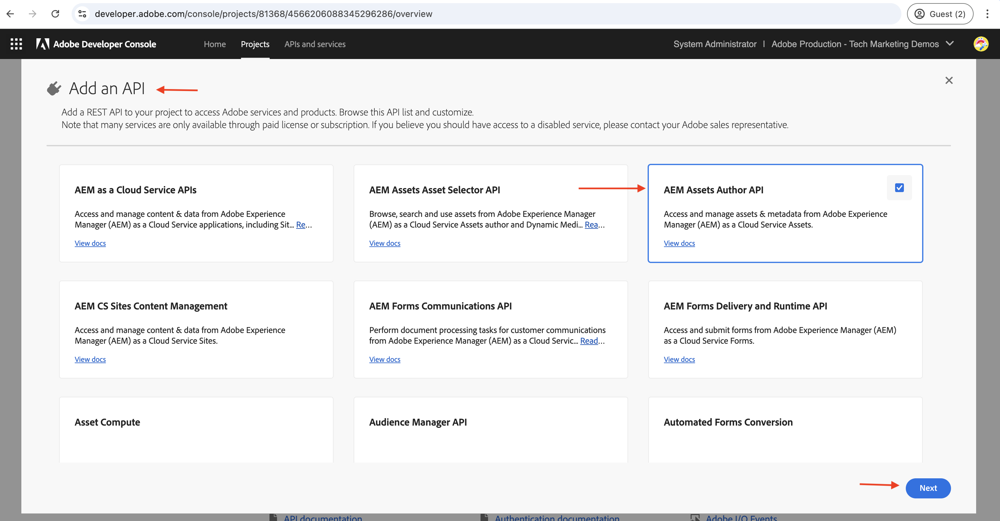

# OAuth web アプリ認証を使用した OpenAPI ベースのAEM API の呼び出し

OAuth Web アプリを使用するカスタム Web アプリからユーザーベースの認証を使用して、AEM as a Cloud Serviceで OpenAPI ベースのAEM API を呼び出す方法について説明します。

OAuth web アプリ認証は、ユーザーの代わりにAEM API にアクセスする **必要があるフロントエンドおよび _バックエンド_ コンポーネントを持つ web アプリケーションに最適** す。 また、OAuth 2.0 _authorization_code_ 付与タイプを使用して、ユーザーの代わりにAEM API にアクセスするためのアクセストークンを取得します。 詳しくは、[OAuth サーバー間資格情報と web アプリ間資格情報とシングルページアプリ資格情報の違い ](../overview.md#difference-between-oauth-server-to-server-vs-web-app-vs-single-page-app-credentials) を参照してください。

## 学習内容{#what-you-learn}

このチュートリアルでは、次の方法を学びます。

- _OAuth Web App_ 認証を使用してAssets オーサー API にアクセスするように、Adobe Developer Console（ADC）プロジェクトを設定します。

- カスタム Web アプリで OAuth Web アプリ認証フローを実装します。
   - IMS ユーザー認証とアプリ認証。
   - ユーザー固有のアクセストークン取得。
   - ユーザー固有のアクセストークンを使用して、OpenAPI ベースのAEM API にアクセスします。

開始する前に、次の点を確認してください。

- [Adobe API へのアクセスと関連概念 ](../overview.md#accessing-adobe-apis-and-related-concepts) 節を参照してください。
- [OpenAPI ベースのAEM API の設定 ](../setup.md) 記事

## サンプル web アプリ：WKND-PIM の概要と機能フロー

サンプル Web アプリ、WKND 製品情報管理（PIM）とその機能フローについて説明します。

WKND PIM アプリは、AEM as a Cloud Serviceに保存された製品属性とそのアセットメタデータを管理するように設計されたサンプル web アプリケーションです。 この例では、web アプリをAdobe API とシームレスに統合して、効率的でユーザー中心のワークフローを提供する方法を示します。

Adobe Developer Console（ADC）プロジェクトは、OAuth Web App 認証を使用してAssets オーサー API にアクセスするように設定されています。 これにより、_authorization_code_ 付与フローを開始するために必要な _client_id_ と _client_secret_ が WKND-PIM Web アプリに提供されます。

>[!VIDEO](https://video.tv.adobe.com/v/3442757?quality=12&learn=on)


次の図に、WKND-PIM web アプリの機能フローを示します _Assets オーサー API とやり取りするためのユーザー固有のアクセストークンの取得_。


1. Web アプリがプロセスを開始し、認証用にユーザーをAdobe Identity Management System （IMS）にリダイレクトします。
1. リダイレクトと共に、web アプリは必要な _client_id_ と _redirect_uri_ を IMS に渡します。
1. IMS はユーザーを認証し、_authorization_code_ を使用して、指定された _redirect_uri_ に送り返します。
1. Web アプリは、_client_id_ および _client_secret_ を使用して、IMS との間でユーザー固有のアクセストークンの _authorization_code_ を交換します。
1. 検証に成功すると、IMS はユーザー固有の _アクセストークン_ を発行します。
1. Web アプリは、_アクセストークン_ を安全に使用してAssets オーサー API とやり取りし、商品のアセットメタデータを取得または更新できるようにします。

WKND-PIM web アプリは、[Node.js](https://nodejs.org/ja) と [Express](https://expressjs.com/) を使用して開発されています。 Express は、秘密鍵とユーザー固有のアクセストークンを安全に管理するサーバーとして機能します。

このチュートリアルに示すアプローチを使用して、Adobe API と連携する web アプリを作成するには、他の web スタック（Java、Python、.NET ベースなど）を使用できます。

## このチュートリアルの使用方法{#how-to-use-this-tutorial}

[Web アプリの主要なコードスニペットを確認 ](#review-web-app-key-code-snippets) セクションのいずれかを参照して、WKND-PIM web アプリで使用される OAuth Web アプリ認証フローと API 呼び出しコードスニペットを理解します。 または、「[web アプリの設定と実行 ](#setup-run-web-app)」セクションに直接進み、ローカルマシンで WKND-PIM web アプリを設定および実行して、OAuth web アプリ認証フローと API 呼び出しを把握します。

## Web アプリの主要なコードスニペットの確認{#review-web-app-key-code-snippets}

WKND-PIM web アプリで使用される主要なコードスニペットを確認して、OAuth web アプリ認証フローと API 呼び出しを理解しましょう。

### WKND-PIM web アプリコードのダウンロード

1. [WKND-PIM web アプリ ](../assets/web-app/wknd-pim-demo-web-app.zip) zip ファイルをダウンロードして抽出します。

1. 抽出したフォルダーに移動し、お気に入りのコードエディターで `.env.example` ファイルを開きます。 必要な設定パラメーターを確認します。

   ```plaintext
   ########################################################################
   # Adobe IMS, Adobe Developer Console (ADC), and AEM Assets Information
   ########################################################################
   # Adobe IMS OAuth endpoints
   ADOBE_IMS_AUTHORIZATION_ENDPOINT=https://ims-na1.adobelogin.com/ims/authorize/v2
   ADOBE_IMS_TOKEN_ENDPOINT=https://ims-na1.adobelogin.com/ims/token/v3
   ADOBE_IMS_USERINFO_ENDPOINT=https://ims-na1.adobelogin.com/ims/userinfo/v2
   
   # Adobe Developer Console (ADC) Project's OAuth Web App credential
   ADC_CLIENT_ID=<ADC Project OAuth Web App credential ClientID>
   ADC_CLIENT_SECRET=<ADC Project OAuth Web App credential Client Secret>
   ADC_SCOPES=<ADC Project OAuth Web App credential credential Scopes>
   
   # AEM Assets Information
   AEM_ASSET_HOSTNAME=<AEM Assets Hostname, e.g., https://author-p63947-e1502138.adobeaemcloud.com/>
   AEM_ASSET_IDS=< AEM Asset IDs Comma Seperated, e.g., urn:aaid:aem:9f20a8ce-934a-4560-8720-250e529fbb17,urn:aaid:aem:6e0123cd-8a67-4d1f-b721-1b3da987d831>
   
   ################################################
   # Web App Information
   ################################################
   # The port number on which this server (web app) will run
   PORT = 3000
   
   # The URL to which the user will be redirected after the OAuth flow is complete
   REDIRECT_URI=https://localhost:3001/callback
   
   # The Express (express-session) uses this secret to encrypt and verify the authenticity of that cookie
   EXPRESS_SESSION_SECRET=<Express Session Secret>
   ```

   プレースホルダーを、Adobe Developer Console（ADC）プロジェクトおよびAEM as a Cloud Service Assets インスタンスからの実際の値に置き換える必要があります。

### IMS ユーザー認証とアプリ承認

IMS ユーザー認証とアプリ承認を開始するコードを確認しましょう。 アセットメタデータをレビューまたは更新するには、Adobe IMSに対して認証を行い、WKND-PIM web アプリが自身の代わりにAssets オーサー API にアクセスすることを許可する必要があります。

初回のログインで、ユーザーは、WKND-PIM web アプリが自分の代わりにAssets オーサー API にアクセスすることを許可するための同意を得る必要があります。


1. `routes/update-product-attributes.js` ファイルは、ユーザーの [Express セッション ](https://www.npmjs.com/package/express-session) にアクセストークンがあるかどうかを確認します。 そうでない場合は、`/auth` ルートにリダイレクトされます。

   ```javascript
   ...
   // The update-product-attributes route, shows the product attributes form with tabs
   router.get("/update-product-attributes", async (req, res) => {
     // Check if the user is authenticated, if not redirect to the auth route
     if (!req.session.accessToken) {
         return res.redirect("/auth");
     }
     ...
   });
   ```

1. ファイル `routes/adobe-ims-auth.js` は、`/auth` ルートが IMS ユーザー認証およびアプリ承認フローを開始します。 Adobe IMS認証エンドポイントに渡される _client_id_、_redirect_uri_、および _response_type_ パラメーターに注意してください。

   ```javascript
   ...
   // Route to initiate Adobe IMS user authentication
   router.get("/auth", (req, res) => {
     // Redirect user to Adobe IMS authorization endpoint
     try {
         // Constructing the authorization URL
         const params = new URLSearchParams({
         client_id: adobeADCConfig.clientId,
         redirect_uri: redirectUri,
         response_type: "code",
         });
   
         // Append scopes if defined in configuration
         if (adobeADCConfig?.scopes) params.append("scope", adobeADCConfig.scopes);
   
         // Redirect user to Adobe IMS authorization URL
         const imsAuthorizationUrl = `${
         adobeIMSConfig.authorizationEndpoint
         }?${params.toString()}`;
   
         res.redirect(imsAuthorizationUrl);
     } catch (error) {
         console.error("Error initiating Adobe IMS authentication:", error);
         res.status(500).send("Unable to initiate authentication");
     }
   });
   ...
   ```

ユーザーがユーザーに対して認証されていない場合は、Adobe IMSの認証を求めるAdobe ID ログインページが表示されます。

既に認証されている場合、ユーザーは _authorization_code_ を使用して、WKND-PIM web アプリの指定された _redirect_uri_ にリダイレクトされます。

### アクセストークン取得

WKND-PIM Web アプリは、ADC プロジェクトの OAuth Web アプリ資格情報の _client_id_ と _client_secret_ を使用して、Adobe IMSと _authorization_code_ をユーザー固有のアクセストークン用に安全に交換します。

`routes/adobe-ims-auth.js` ファイルでは、`/callback` ルートは _authorization_code_ をユーザー固有のアクセストークンのAdobe IMSと交換します。

```javascript
...
// Callback route to exchange authorization code for access token
router.get("/callback", async (req, res) => {
  // Extracting authorization code from the query parameters
  const authorizationCode = req.query.code;

  if (!authorizationCode) {
    return res.status(400).send("Missing authorization code");
  }

  // Exchange authorization code for access token
  try {
    // Fetch access token from Adobe IMS token endpoint
    const response = await fetch(adobeIMSConfig.tokenEndpoint, {
      method: "POST",
      headers: {
        "Content-Type": "application/x-www-form-urlencoded",
        Authorization: `Basic ${Buffer.from(
          `${adobeADCConfig.clientId}:${adobeADCConfig.clientSecret}`
        ).toString("base64")}`,
      },
      body: new URLSearchParams({
        code: authorizationCode,
        grant_type: "authorization_code",
      }),
    });

    if (!response.ok) {
      console.error("Failed to fetch access token:", response.statusText);
      return res.status(500).send("Failed to fetch access token");
    }

    const data = await response.json();

    if (!data.access_token) {
      console.error("Access token missing in the response:", data);
      return res.status(500).send("Invalid response from token endpoint");
    }

    // For debugging purposes
    console.log("Access token:", data.access_token);

    // Store the access token in the session
    req.session.accessToken = data.access_token;

    // Redirect user to update product attributes
    res.redirect("/update-product-attributes");
  } catch (error) {
    console.error("Error exchanging authorization code:", error);
    res.status(500).send("Error during token exchange");
  }
});
```

アクセストークンは、Assets オーサー API への後続のリクエストのために [Express セッション ](https://www.npmjs.com/package/express-session) に保存されます。

### アクセストークンを使用した OpenAPI ベースのAEM API へのアクセス

WKND-PIM web アプリは、ユーザー固有のアクセストークンを安全に使用してAssets オーサー API とやり取りし、製品アセットのメタデータを取得または更新できるようにします。

`routes/invoke-aem-apis.js` ファイルでは、`/api/getAEMAssetMetadata` ルートと `/api/updateAEMAssetMetadata` ルートがアクセストークンを使用してAssets オーサー API を呼び出します。

```javascript
...
// API Route: Get AEM Asset Metadata
router.get("/api/getAEMAssetMetadata", async (req, res) => {
  const assetId = req.query.assetId;
  const bucketName = getBucketName(aemAssetsConfig.hostname);

  if (!assetId || !bucketName) {
    return res.status(400).json({ error: "Missing AEM Information" });
  }

  // Get the access token from the session
  const accessToken = req.session.accessToken;

  if (!accessToken) {
    return res.status(401).json({ error: "Not Authenticated with Adobe IMS" });
  }

  try {
    const assetMetadata = await invokeGetAssetMetadataAPI(
      bucketName,
      assetId,
      accessToken
    );

    const filteredMetadata = getFilteredMetadata(JSON.parse(assetMetadata));
    res.status(200).json(filteredMetadata);
  } catch (error) {
    console.error("Error getting asset metadata:", error.message);
    res.status(500).json({ error: `Internal Server Error: ${error.message}` });
  }
});

// Helper function to invoke the AEM API to get asset metadata
async function invokeGetAssetMetadataAPI(bucketName, assetId, accessToken) {
  const apiUrl = `https://${bucketName}.adobeaemcloud.com/adobe/assets/${assetId}/metadata`;


  // For debugging purposes
  console.log("API URL:", apiUrl);
  console.log("Access Token:", accessToken);
  console.log("API Key:", adobeADCConfig.clientId);

  try {
    const response = await fetch(apiUrl, {
      method: "GET",
      headers: {
        "If-None-Match": "string",
        "X-Adobe-Accept-Experimental": "1",
        Authorization: `Bearer ${accessToken}`,
        "X-Api-Key": adobeADCConfig.clientId,
      },
    });

    console.log("Response Status:", response.status);

    if (!response.ok) {
      throw new Error(`AEM API Error: ${response.statusText}`);
    }

    return await response.text();
  } catch (error) {
    throw new Error(`Failed to fetch asset metadata: ${error.message}`);
  }
}

// Helper function to filter the metadata properties like pim: and dc:
function getFilteredMetadata(data) {
  if (!data || !data.assetMetadata) {
    throw new Error("Invalid metadata structure received from API");
  }

  const properties = data.assetMetadata;
  return Object.keys(properties).reduce((filtered, key) => {
    if (
      key.startsWith("pim:") ||
      key === "dc:title" ||
      key === "dc:description"
    ) {
      filtered[key] = properties[key];
    }
    return filtered;
  }, {});
}

// API Route: Update AEM Asset Metadata
router.post("/api/updateAEMAssetMetadata", async (req, res) => {
  const { assetId, metadata } = req.body;

  if (!assetId || !metadata || typeof metadata !== "object") {
    return res.status(400).json({ error: "Invalid or Missing Metadata" });
  }

  const bucketName = getBucketName(aemAssetsConfig.hostname);
  if (!bucketName) {
    return res.status(400).json({ error: "Missing AEM Information" });
  }

  const accessToken = req.session.accessToken;
  if (!accessToken) {
    return res.status(401).json({ error: "Not Authenticated with Adobe IMS" });
  }

  try {
    const updatedMetadata = await invokePatchAssetMetadataAPI(
      bucketName,
      assetId,
      metadata,
      accessToken
    );
    res.status(200).json(updatedMetadata);
  } catch (error) {
    console.error("Error updating asset metadata:", error.message);
    res.status(500).json({ error: `Internal Server Error: ${error.message}` });
  }
});

// Helper function to invoke the AEM API to update asset metadata
async function invokePatchAssetMetadataAPI(
  bucketName,
  assetId,
  metadata,
  accessToken
) {
  const apiUrl = `https://${bucketName}.adobeaemcloud.com/adobe/assets/${assetId}/metadata`;
  const headers = {
    "Content-Type": "application/json-patch+json",
    "If-Match": "*",
    "X-Adobe-Accept-Experimental": "1",
    Authorization: `Bearer ${accessToken}`,
    "X-Api-Key": adobeADCConfig.clientId,
  };

  try {
    const response = await fetch(apiUrl, {
      method: "PATCH",
      headers,
      body: JSON.stringify(getTransformedMetadata(metadata)),
    });

    if (!response.ok) {
      throw new Error(`AEM API Error: ${response.statusText}`);
    }

    return await response.json();
  } catch (error) {
    throw new Error(`Failed to update asset metadata: ${error.message}`);
  }
}

// Helper function to transform metadata into JSON Patch format, e.g. [{ op: "add", path: "dc:title", value: "New Title" }]
function getTransformedMetadata(metadata) {
  return Object.keys(metadata).map((key) => ({
    op: "add",
    path: `/${key}`,
    value: metadata[key],
  }));
}
```

アクセストークンが確実に管理され、クライアントサイドに公開されないように、OpenAPI ベースのAEM API 呼び出しは、クライアントサイド（ブラウザー）から直接ではなく、サーバーサイド（Express ミドルウェア）から実行されます。

### アクセストークンの更新

有効期限が切れる前にアクセストークンを更新するには、更新トークンフローを実装します。 ただし、チュートリアルの内容をシンプルにするために、WKND-PIM web アプリでは、更新トークンフローを実装していません。


>[!TIP]
>
>次の節に従って、ローカルマシンで WKND-PIM web アプリを試し、OAuth web アプリ認証フローと API 呼び出しの実践的なエクスペリエンスを得ることができます。

## Web アプリケーションのセットアップと実行

ローカルマシンで WKND-PIM web アプリを設定および実行して、OAuth web アプリ認証フローと API 呼び出しを理解します。

### 前提条件

このチュートリアルを完了するには、次が必要になります。

- AEM as a Cloud Service環境を最新化し、次の機能を実現しました。
   - AEM リリース `2024.10.18459.20241031T210302Z` 以降。
   - 新しいスタイルの製品プロファイル（2024 年 11 月より前に環境が作成された場合）

  詳しくは、[OpenAPI ベースのAEM API の設定 ](../setup.md) を参照してください。

- サンプルの [WKND Sites](https://github.com/adobe/aem-guides-wknd?#aem-wknd-sites-project) プロジェクトをこのプロジェクトにデプロイする必要があります。

- [Adobe Developer Console](https://developer.adobe.com/developer-console/docs/guides/getting-started/) にアクセスします。

- [Node.js](https://nodejs.org/ja/) をローカルマシンにインストールして、サンプルの NodeJS アプリケーションを実行します。

- [local-ssl-proxy](https://www.npmjs.com/package/local-ssl-proxy#local-ssl-proxy) をローカルマシンにインストールして、自己署名証明書を使用してローカル SSL HTTP プロキシを作成します。


### 開発手順

大まかな開発手順は次のとおりです。

1. ADC プロジェクトの設定
   1. Assets オーサー API を追加します。
   1. OAuth Web アプリ資格情報の設定
1. AEM インスタンスを設定して、ADC プロジェクト通信を有効にします
1. AEMで、アセットメタデータスキーマを作成して適用します
1. WKND-PIM web アプリの設定と実行
1. エンドツーエンドフローの検証

### ADC プロジェクトの設定

ADC プロジェクトの設定手順が、[OpenAPI ベースのAEM API の設定 ](../setup.md) から _繰り返し_ されます。 これを繰り返して、Assets Author API を追加し、その認証方法を OAuth web アプリとして設定します。

1. [Adobe Developer Console](https://developer.adobe.com/console/projects) から目的のプロジェクトを開きます。

1. AEM API を追加するには、「**API を追加**」ボタンをクリックします。

   

1. _API を追加_ ダイアログで、_Experience Cloudでフィルタリングし_ 「**AEM Assets オーサー API**」カードを選択して、「**次へ**」をクリックします。

   

1. 次に、_API を設定_ ダイアログで「**ユーザー認証** 認証オプションを選択し、「**次へ**」をクリックします。

   

1. 次の _API を設定_ ダイアログで、「**OAuth Web アプリ**」認証オプションを選択し、「**次へ**」をクリックします。

   

1. _OAuth Web アプリを設定_ ダイアログで、次の詳細を入力し、「**次へ**」をクリックします。
   - 既定のリダイレクト URI: `https://localhost:3001/callback`
   - リダイレクト URI パターン：`https://localhost:3001/callback`

   

1. 使用可能なスコープを確認し、「**設定済み API を保存**」をクリックします。

   

1. AEM API と認証設定を確認します。

   

   

### ADC プロジェクト通信を有効にする AEM インスタンスの設定

[OpenAPI ベースのAEM API の設定 ](../setup.md#configure-the-aem-instance-to-enable-adc-project-communication) の記事の手順に従って、AEM インスタンスを設定し、ADC プロジェクト通信を有効にします。

### アセットメタデータスキーマの作成と適用

デフォルトでは、WKND Sites プロジェクトには、製品属性を表示するために必要なアセットメタデータスキーマがありません。 アセットメタデータスキーマを作成して、AEM インスタンスのアセットフォルダーに適用してみましょう。

1. AEM as a Cloud Service Asset インスタンスにログインします。 [ アセット表示 ](https://experienceleague.adobe.com/ja/docs/experience-manager-learn/assets/authoring/switch-views) を使用して `/content/dam/wknd-shared/en` フォルダーに移動します。

   

1. **PIM** を作成してその中に **Camping** フォルダーを作成し、[ サンプル画像 ](../assets/web-app/camping-gear-imgs.zip) を **Camping** フォルダーにアップロードします。

   

次に、PIM 属性固有のメタデータスキーマを作成して、**PIM** フォルダーに適用します。

1. 左側のパネルから **設定**/**メタデータForms** オプションに移動し、「**作成**」ボタンをクリックします。

1. **メタデータフォームを作成**&#x200B;ダイアログで、次の詳細を入力し、「**作成**」をクリックします。
   - 名前：`PIM`
   - 既存のフォーム構造をテンプレートとして使用：`Check`
   - 次から選択：`default`

   

1. **+** アイコンをクリックして新しい **PIM** タブを追加し、そのタブに **1 行のテキスト** コンポーネントを追加します。 メタデータプロパティ名は、プレフィックスで始める必要 `pim:` あります。

   

   | ラベル | プレースホルダー | メタデータプロパティ |
   | --- | --- | --- |
   | SKU | SKU ID を入力 | `pim:sku` |
   | 製品タイプ | 例：バックパック、テント、ジャケット | `pim:productType` |
   | 製品カテゴリ | 例：キャンプ、ハイキング、クライミング | `pim:productCategory` |
   | 製造元 | 製造元名を入力 | `pim:manufacturer` |
   | モデル | モデル名を入力 | `pim:model` |
   | ブランド名 | ブランド名を入力 | `pim:brandName` |

1. 「**保存**&#x200B;して&#x200B;**閉じる**」をクリックして、メタデータフォームを保存します。

1. 最後に、**PIM** メタデータスキーマを **PIM** フォルダーに適用します。

   

上記の手順を実行すると、**PIM** フォルダーのアセットに製品属性メタデータを保存する準備が整います。

### WKND-PIM web アプリの設定と実行

1. [WKND-PIM web アプリ ](../assets/web-app/wknd-pim-demo-web-app.zip) zip ファイルをダウンロードして抽出します。

1. 抽出されたフォルダーに移動し、`.env.example` ファイルを `.env` にコピーします。

1. Adobe Developer Console（ADC）プロジェクトおよびAEM as a Cloud Service Assets インスタンスからの必要な設定パラメーターを使用して、`.env` ファイルを更新します。

   ```plaintext
   ########################################################################
   # Adobe IMS, Adobe Developer Console (ADC), and AEM Assets Information
   ########################################################################
   # Adobe IMS OAuth endpoints
   ADOBE_IMS_AUTHORIZATION_ENDPOINT=https://ims-na1.adobelogin.com/ims/authorize/v2
   ADOBE_IMS_TOKEN_ENDPOINT=https://ims-na1.adobelogin.com/ims/token/v3
   ADOBE_IMS_USERINFO_ENDPOINT=https://ims-na1.adobelogin.com/ims/userinfo/v2
   
   # Adobe Developer Console (ADC) Project OAuth Web App credential
   ADC_CLIENT_ID=e1adsfsd59384320bbe4f9298f00b7ab
   ADC_CLIENT_SECRET=p8e-Mdfgfdsg43RHugVRTEOyWlmEU5m
   ADC_SCOPES=AdobeID,openid,aem.folders,aem.assets.author
   
   # AEM Assets Information
   AEM_ASSET_HOSTNAME=https://author-p3947-e1542138.adobeaemcloud.com/
   AEM_ASSET_IDS=urn:aaid:aem:aa689a9f-04da-4fbb-b460-74a5b6a69090,urn:aaid:aem:e4fdb6f6-1007-4e84-9726-a9522931786a
   
   ################################################
   # Web App Information
   ################################################
   # The port number on which this server (web app) will run
   PORT = 3000
   
   # The URL to which the user will be redirected after the OAuth flow is complete
   REDIRECT_URI=http://localhost:3000/auth/callback
   
   # The Express (express-session) uses this secret to encrypt and verify the authenticity of that cookie
   # For demonstration purposes, this is a simple secret. In production, you should use a strong secret
   EXPRESS_SESSION_SECRET=1234554321
   ```

   `AEM_ASSET_IDS` は、**Camping** フォルダーにアップロードされた画像の `jcr:uuid` プロパティ値です。 詳しくは、この [ 節 ](./invoke-api-using-oauth-s2s.md#review-the-api) を参照してください。

1. ターミナルを開き、抽出されたフォルダーに移動します。 次のコマンドを使用して、必要な依存関係をインストールします。

   ```bash
   $ npm install
   ```

1. 次のコマンドを使用して、WKND-PIM web アプリを起動します。

   ```bash
   $ npm start
   ```

1. 次のコマンドを使用して、ローカル SSL HTTP プロキシを実行します。

   ```bash
   $ local-ssl-proxy --source 3001 --target 3000 --cert ./ssl/server.crt --key ./ssl/server.key
   ```

   IMS ではリダイレクト URI を HTTPS にする必要があるので、ローカル SSL HTTP プロキシが使用されます。

### エンドツーエンドフローの検証

1. ブラウザーを開き、`https://localhost:3001` に移動して WKND-PIM web アプリにアクセスします。 自己署名証明書の警告を受け入れます。

   

1. 「**今すぐ試す**」をクリックして、製品属性のメタデータを確認および更新します。 これにより、IMS ユーザー認証およびアプリ承認フローが開始されます。

1. Adobe IDの資格情報を使用してログインし、WKND-PIM web アプリが、ユーザーに代わってAssets オーサー API にアクセスすることを許可するための同意を入力します。

1. `https://localhost:3001/update-product-attributes` ルート/ページで、「**AEM アセット属性**」タブをクリックします。 **アセット ID** ドロップダウンから、アセット ID を選択してアセットメタデータを表示します。

   

1. アセットメタデータを更新し、「**AEM アセット属性を更新**」をクリックしてアセットメタデータを更新します。

   

>[!IMPORTANT]
>
>認証済みユーザーがアセットメタデータのレビューまたは更新に必要な権限を持っていない場合、OpenAPI ベースのAEM API は 403 Forbidden エラーを返します。 これにより、ユーザーが認証され、有効な IMS アクセストークンを持っている場合でも、必要な権限がなければAEM リソースにアクセスできなくなります。


### アプリケーションコードを確認します

WKND-PIM web アプリの大まかなコード構造と主なエントリポイントを確認してみましょう。 アプリケーションは、Node.js + Express を使用して開発されています。

1. `app.js` は、アプリケーションの主なエントリポイントです。 Express アプリを初期化し、セッションを設定し、ルートをマウントします。

1. `public` フォルダーには、CSS、JavaScript、画像などの静的アセットが含まれます。 `script.js` ファイルには、Express `/api/getAEMAssetMetadata` および `/api/updateAEMAssetMetadata` ルートとやり取りするクライアントサイドのJavaScript コードが含まれています。

1. `routes` フォルダーには、Express ルートが含まれています。
   1. `index.js`: ホームページをレンダリングするメインルート。
   1. `update-product-attributes.js`：製品属性フォームをタブでレンダリングするルートは、アクセストークンの高速セッションも検証します。
   1. `adobe-ims-auth.js`:Adobe IMSユーザー認証およびアプリ認証フローを開始するルート。
   1. `invoke-aem-apis.js`：ユーザー固有のアクセストークンを使用して、OpenAPI ベースのAEM API を呼び出すルート。

1. `views` フォルダーには、HTML ページをレンダリングする EJS テンプレートが含まれています。

1. `utils` フォルダーには、ユーティリティ関数が含まれています。

1. `ssl` フォルダーには、ローカル SSL HTTP プロキシを実行するための自己署名証明書とキーファイルが含まれています。

Java、Python、.NET などの他のサーバーサイドテクノロジーを使用して、既存の web アプリをAdobe API と開発または統合することができます。

## 概要

このチュートリアルでは、OAuth web アプリ認証を使用して、カスタム web アプリからAEM as a Cloud Serviceで OpenAPI ベースのAEM API を呼び出す方法を学びました。 WKND-PIM web アプリで使用される主要なコードスニペットを確認し、OAuth web アプリ認証フローを把握しました。

このチュートリアルを参考にして、OpenAPI ベースのAEM API をカスタム web アプリケーションと統合し、効率的でユーザー中心のワークフローを提供できます。

## その他のリソース

- [ ユーザー認証の実装ガイド ](https://developer.adobe.com/developer-console/docs/guides/authentication/UserAuthentication/implementation/)
- [ リクエストを承認 ](https://developer.adobe.com/developer-console/docs/guides/authentication/UserAuthentication/IMS/#authorize-request)
- [ アクセストークンの取得 ](https://developer.adobe.com/developer-console/docs/guides/authentication/UserAuthentication/IMS/#fetching-access-tokens)
- [ アクセストークンの更新 ](https://developer.adobe.com/developer-console/docs/guides/authentication/UserAuthentication/IMS/#refreshing-access-tokens)
