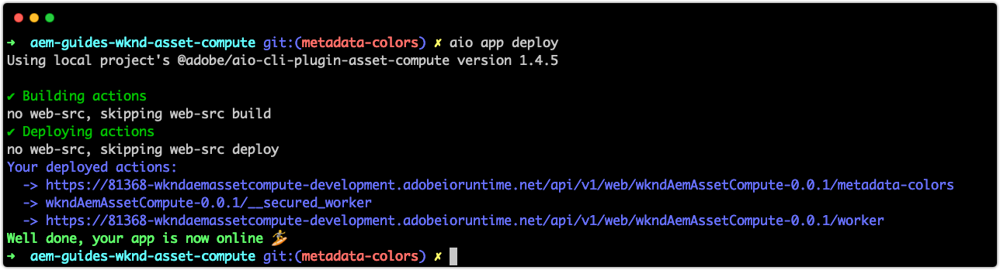
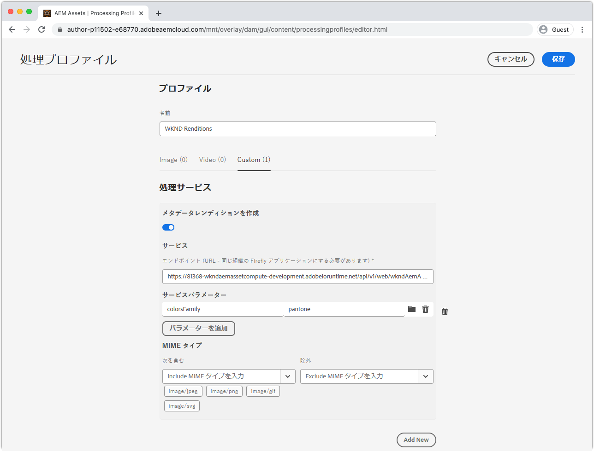
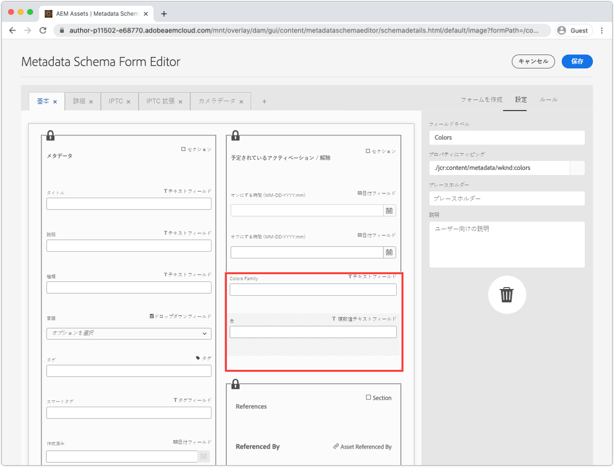
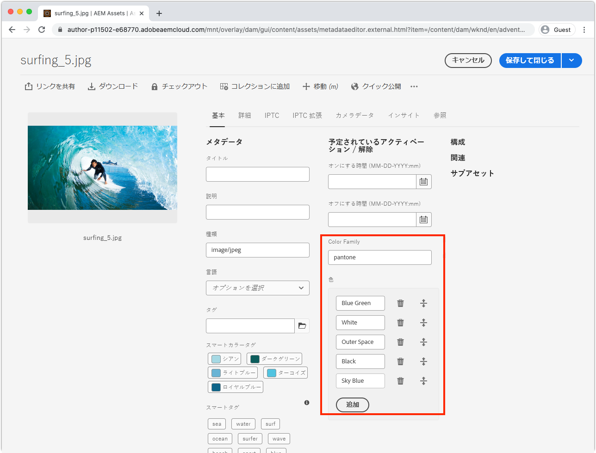
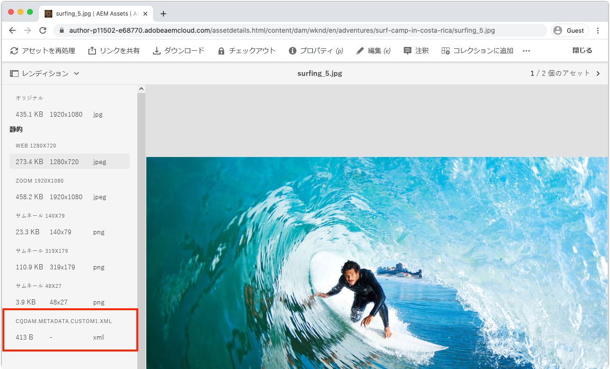

# asset computeメタデータワーカーの開発

カスタムAsset computeワーカーは、AEMに送り返され、アセットのメタデータとして保存されるXMP(XML)データを生成できます。

一般的な使用例を次に示します。

+ 追加のメタデータを取得してアセットに保存する必要があるPIM(Product Information Management System)などのサードパーティ製システムとの統合
+ コンテンツやコマースAIなどのAdobeサービスとの統合により、追加の機械学習属性を使用してアセットメタデータを拡張
+ バイナリからアセットに関するメタデータを取得し、AEMでアセットメタデータとしてCloud Serviceとして保存する

## 今後の作業

>[!VIDEO](https://video.tv.adobe.com/v/327313?quality=12&learn=on)

このチュートリアルでは、Asset computeアセットで最も一般的に使用される色を派生させ、色の名前をAEMのアセットのメタデータに書き戻す画像メタデータワーカーを作成します。 ワーカー自体は基本的ですが、このチュートリアルでは、ワーカーを使用して、AEM内のアセットにCloud Serviceとしてメタデータを書き戻すAsset computeワーカーを使用する方法を検討します。

## asset computeメタデータワーカー呼び出しの論理フロー

asset computeメタデータワーカーの呼び出しは、 [バイナリレンディション生成ワーカーの呼び出しとほぼ同じです。戻り値の型はXMP](../develop/worker.md)(XML)レンディションで、値もアセットのメタデータに書き込まれます。

asset computeワーカーは、概念的に次に示す関数に、Asset computeSDKのワーカーAPI契約を実装し `renditionCallback(...)` ます。

+ __入力：__ AEMアセットの元のバイナリパラメーターと処理プロファイルパラメーター
+ __出力：__ AEMアセットにレンディションとして保持され、アセットのメタデータに保存されるXMP(XML)レンディション


1. AEM Authorサービスは、Asset computeメタデータワーカーを呼び出し、アセットの __(1a)__ 元のバイナリと __(1b)処理プロファイルで定義されたパラメーターを提供します__ 。
1. asset computeSDKは、アセットのバイナリ(1a)と処理Asset computeのパラメータ(1b)に基づいてXMP(XML)レンディションを派生させ、カスタムプロファイルメタデータワーカーの `renditionCallback(...)` 関数の実行を調整し __ます______。
1. asset computeワーカーは、XMP(XML)表現をに保存し `rendition.path`ます。
1. に書き込まれたXMP(XML)データ `rendition.path` は、Asset computeSDKを介してAEM Author Serviceに転送され、 __(4a)テキストレンディションとして公開され__ 、(4b) ____ はアセットのメタデータノードに持続します。

## manifest.ymlの設定{#manifest}

すべてのAsset computeワーカーは、 [manifest.ymlに登録する必要があります](../develop/manifest.md)。

プロジェクトのを開き、新しい作業者を構成する作業者エントリを追加します(この場合はそ `manifest.yml` の `metadata-colors`)。

_覚えてお `.yml` くと空白が区別されます。_

```
packages:
  __APP_PACKAGE__:
    license: Apache-2.0
    actions: 
      worker:
        function: actions/worker/index.js 
        web: 'yes' 
        runtime: 'nodejs:12'
        limits:
          timeout: 60000 # in ms
          memorySize: 512 # in MB
          concurrency: 10 
        annotations:
          require-adobe-auth: true
      metadata-colors:
        function: actions/metadata-colors/index.js 
        web: 'yes' 
        runtime: 'nodejs:12'
        limits:
          memorySize: 512 # in MB   
```

`function` は、 [次の手順で作成したワーカー実装を指します](#metadata-worker)。 ワーカーに意味的な名前を付ける(例えば、よ `actions/worker/index.js` り良い名前を付けた `actions/rendition-circle/index.js`)。これらは [ワーカーのURLに表示され、](#deploy) ワーカーのテストスイートフォルダー名も特定します [](#test)。

および `limits``require-adobe-auth` は、ワーカーごとに個別に設定されます。 このワーカーでは、メモリ `512 MB` の割り当ては、コードが（潜在的に）大きなバイナリイメージデータを検査する（として）行われます。 もう1つ `limits` はデフォルトを使用するために削除されます。

## メタデータワーカーの開発{#metadata-worker}

新しいワーカー用に [定義されたmanifest.ymlのパスにあるAsset computeプロジェクトに、次の場所に新しいメタデータワーカー](#manifest)JavaScriptファイルを作成します。 `/actions/metadata-colors/index.js`

### npmモジュールのインストール

このAsset computeワーカーで使用する追加のnpmモジュール([@adobe/asset-compute-xmp](https://www.npmjs.com/package/@adobe/asset-compute-xmp?activeTab=versions)、 [get-image-colors](https://www.npmjs.com/package/get-image-colors)、 [color-namer](https://www.npmjs.com/package/color-namer))をインストールします。

```
$ npm install @adobe/asset-compute-xmp
$ npm install get-image-colors
$ npm install color-namer
```

### メタデータワーカーコード

このワーカーは、 [レンダリング生成ワーカーと非常に似ています](../develop/worker.md)。主な違いは、XMP(XML)データをAEMに書き込んで保存し、 `rendition.path` に戻すことです。


```javascript
"use strict";

const { worker, SourceCorruptError } = require("@adobe/asset-compute-sdk");
const fs = require("fs").promises;

// Require the @adobe/asset-compute-xmp module to create XMP 
const { serializeXmp } = require("@adobe/asset-compute-xmp");

// Require supporting npm modules to derive image colors from image data
const getColors = require("get-image-colors");
// Require supporting npm modules to convert image colors to color names
const namer = require("color-namer");

exports.main = worker(async (source, rendition, params) => {
  // Perform any necessary source (input) checks
  const stats = await fs.stat(source.path);
  if (stats.size === 0) {
    // Throw appropriate errors whenever an erring condition is met
    throw new SourceCorruptError("source file is empty");
  }
  const MAX_COLORS = 10;
  const DEFAULT_COLORS_FAMILY = 'basic';

  // Read the color family parameter to use to derive the color names
  let colorsFamily = rendition.instructions.colorsFamily || DEFAULT_COLORS_FAMILY;

  if (['basic', 'hex', 'html', 'ntc', 'pantone', 'roygbiv'].indexOf(colorsFamily) === -1) { 
      colorsFamily = DEFAULT_COLORS_FAMILY;
  }
  
  // Use the `get-image-colors` module to derive the most common colors from the image
  let colors = await getColors(source.path, { options: MAX_COLORS });

  // Convert the color Chroma objects to their closest names
  let colorNames = colors.map((color) => getColorName(colorsFamily, color));

  // Serialize the data to XMP metadata
  // These properties are written to the [dam:Asset]/jcr:content/metadata resource
  // This stores
  // - The list of color names is stored in a JCR property named `wknd:colors`
  // - The colors family used to derive the color names is stored in a JCR property named `wknd:colorsFamily`
  const xmp = serializeXmp({
      // Use a Set to de-duplicate color names
      "wknd:colors": [...new Set(colorNames)],
      "wknd:colorsFamily": colorsFamily
    }, {
      // Define any property namespaces used in the above property/value definition
      // These namespaces will be automatically registered in AEM if they do not yet exist
      namespaces: {
        wknd: "https://wknd.site/assets/1.0/",
      },
    }
  );

  // Save the XMP metadata to be written back to the asset's metadata node
  await fs.writeFile(rendition.path, xmp, "utf-8");
});

/**
 * Helper function that derives the closest color name for the color, based on the colors family
 * 
 * @param {*} colorsFamily the colors name family to use
 * @param {*} color the color to convert to a name
 */
function getColorName(colorsFamily, color) {
    if ('hex' === colorsFamily) {  return color; }

    let names = namer(color.rgb())[colorsFamily];

    if (names.length >= 1) { return names[0].name; }
}
```

## メタデータワーカーをローカルで実行する{#development-tool}

ワーカーコードが完了すると、ローカルAsset compute開発ツールを使用して実行できます。

asset computeプロジェクトには2人のワーカー(前の [サークルのレンディション](../develop/worker.md) とこのワーカー `metadata-colors` )が含まれるので、 [](../develop/development-tool.md) Asset compute開発ツールのプロファイル定義では、両方のワーカーのリスト実行プロファイルがされます。 2つ目のプロファイル定義は、新しいワーカーを指し `metadata-colors` ます。


1. asset computeプロジェクトのルートから
1. asset compute開発ツール `aio app run` の開始を実行
1. 「 __ファイルを選択…__ 」ドロップダウンで、処理する [サンプル画像を選択します](../assets/samples/sample-file.jpg) 。
1. 2つ目のプロファイル定義設定( `metadata-colors` ワーカーを指す)では、このワーカーがXMP(XML)レンディションを生成す `"name": "rendition.xml"` るたびに更新されます。 必要に応じて、 `colorsFamily` パラメーター(サポートされている値、 `basic`、 `hex`、 `html`、 `ntc`、 `pantone``roygbiv`)を追加します。

   ```json
   {
       "renditions": [
           {
               "worker": "...",
               "name": "rendition.xml",
               "colorsFamily": "pantone"
           }
       ]
   }
   ```
1. 「 __実行__ 」をタップし、XMLレンダリングが生成されるのを待ちます
   + 両方のワーカーがプロファイル定義に表示されるので、両方のレンディションが生成されます。 オプションで、 [円レンディションのワーカーを指す最上位のプロファイル定義を削除して](../develop/worker.md) 、開発ツールから実行しないようにすることができます。
1. 「 __レンディション__ 」セクションには、生成されたレンディションがプレビューされます。 をタップ `rendition.xml` してダウンロードし、VSコード（またはお気に入りのXML/テキストエディター）で開いて確認します。

## ワーカーのテスト{#test}

メタデータワーカーは、バイナリレンディションと [同じAsset computeテストフレームワークを使用してテストでき](../test-debug/test.md)ます。 唯一の違いは、テストケースの `rendition.xxx` ファイルが、期待されるXMP(XML)レンディションである必要があることです。

1. asset computeプロジェクトに次の構造を作成します。

   ```
   /test/asset-compute/metadata-colors/success-pantone/
   
       file.jpg
       params.json
       rendition.xml
   ```

2. テストケースの [サンプルファイル](../assets/samples/sample-file.jpg) を使用 `file.jpg`します。
3. Add the following JSON to the `params.json`.

   ```
   {
       "fmt": "xml",
       "colorsFamily": "pantone"
   }
   ```

   テストスイート `"fmt": "xml"` にテキストベースのレンディションを生成するように指示する場合は、 `.xml` テキストベースのレンディションを生成する必要があります。

4. フ `rendition.xml` ァイルに、必要なXMLを指定します。 これは、次の方法で取得できます。
   + 開発ツールでテスト入力ファイルを実行し、（検証済みの）XMLレンディションを保存します。

   ```
   <?xml version="1.0" encoding="UTF-8"?><rdf:RDF xmlns:rdf="http://www.w3.org/1999/02/22-rdf-syntax-ns#" xmlns:wknd="https://wknd.site/assets/1.0/"><rdf:Description><wknd:colors><rdf:Seq><rdf:li>Silver</rdf:li><rdf:li>Black</rdf:li><rdf:li>Outer Space</rdf:li></rdf:Seq></wknd:colors><wknd:colorsFamily>pantone</wknd:colorsFamily></rdf:Description></rdf:RDF>
   ```

5. asset computeプロジェクト `aio app test` のルートから実行し、すべてのテストスイートを実行します。

### 作業者をAdobe I/O Runtimeに配置する{#deploy}

この新しいメタデータワーカーをAEM Assetsから呼び出すには、次のコマンドを使用して、Adobe I/O Runtimeに配置する必要があります。

```
$ aio app deploy
```



これにより、プロジェクト内のすべてのワーカーが配置されます。 StageおよびProductionワークスペースに展開する方法について、 [完全な展開手順を確認します](../deploy/runtime.md) 。

### AEM処理プロファイルとの統合{#processing-profile}

新しいを作成するか、このデプロイ済みワーカーを呼び出す既存のカスタム処理プロファイルサービスを変更して、AEMからワーカーを呼び出します。



1. AEM管理者としてのCloud Service作成者サービスとしてAEMに __ログインする__
1. __ツール/アセット/処理プロファイルに移動します。__
1. __新規作成__ 、または ____ 編集と既存の処理プロファイル
1. 「 __カスタム__ 」タブをタップし、「 __新規」をタップします__
1. 新しいサービスの定義
   + __メタデータレンディションを作成__:アクティブに切り替え
   + __エンドポイント：__ `https://...adobeioruntime.net/api/v1/web/wkndAemAssetCompute-0.0.1/metadata-colors`
      + これは、 [デプロイ中またはコマンドの使用中に取得されたワーカーのURLで](#deploy)`aio app get-url`す。 URLが、Cloud Service環境ーとしてのAEMに基づく正しいワークスペースを指していることを確認します。
   + __サービスパラメーター__
      + タップ __追加パラメータ__
         + キー: `colorFamily`
         + 値：`pantone`
            + サポートされる値： `basic`, `hex`, `html`, `ntc`, `pantone`, `roygbiv`
   + __MIME タイプ__
      + __以下を含みます。__`image/jpeg`, `image/png`, `image/gif``image/svg`
         + 色の派生に使用されるサードパーティのnpmモジュールでサポートされるMIMEタイプはこれらのみです。
      + __除外：__ `Leave blank`
1. 右上の「 __保存__ 」をタップします
1. 処理プロファイルーをAEM Assetsフォルダーに適用する（まだ適用していない場合）

### メタデータスキーマの更新{#metadata-schema}

色のメタデータをレビューするには、画像のメタデータスキーマ上の2つの新しいフィールドを、ワーカーが入力する新しいメタデータプロパティにマップします。



1. AEM Authorサービスで、 __ツール/アセット/メタデータスキーマに移動します。__
1. __デフォルトの画像に移動し__ 、 ____ 画像を選択して編集し、読み取り専用フォームフィールドを追加して、生成されたカラーメタデータを表示します
1. Add a __Single Line Text__
   + __フィールドラベル__: `Colors Family`
   + __プロパティにマッピング__: `./jcr:content/metadata/wknd:colorsFamily`
   + __ルール/フィールド/編集を無効にする__:チェック済み
1. Add a __Multi Value Text__
   + __フィールドラベル__: `Colors`
   + __プロパティにマッピング__: `./jcr:content/metadata/wknd:colors`
1. 右上の「 __保存__ 」をタップします

## アセットの処理



1. AEM Authorサービスで、 __アセット/ファイルに移動します。__
1. フォルダー（サブフォルダー）に移動すると、「処理」プロファイルが
1. 新しい画像（JPEG、PNG、GIFまたはSVG）をフォルダーにアップロードするか、更新された [処理プロファイルを使用して既存の画像を再処理します](#processing-profile)
1. 処理が完了したら、アセットを選択し、上部のアクションバーで __プロパティ__ をタップしてメタデータを表示します
1. カスタムAsset computeメタデータワーカーから書き戻されたメタデータ `Colors Family` の `Colors` 、 [](#metadata-schema) およびメタデータフィールドを確認します。

色メタデータがアセットのメタデータに書き込まれた状態で、 `[dam:Asset]/jcr:content/metadata` リソース上でこのメタデータには、検索を使用して、これらの用語を使用して、より高度なアセット発見機能のインデックスが作成されます。その上で ____ DAMメタデータ書き戻しワークフローが呼び出された場合も、アセットのバイナリに書き戻すことができます。

### AEM Assetsでのメタデータレンディション



asset computeメタデータワーカーによって生成された実際のXMPファイルも、アセット上の個別のレンディションとして保存されます。 このファイルは一般に使用されず、アセットのメタデータノードに適用された値が使用されますが、ワーカーからの生のXML出力はAEMで使用できます。

## Github上のmetadata-colorsワーカーコード

最終版 `metadata-colors/index.js` は次の場所でGithubで入手できます。

+ [aem-guides-wknd-asset-compute/actions/metadata-colors/index.js](https://github.com/adobe/aem-guides-wknd-asset-compute/blob/master/actions/metadata-colors/index.js)

最終的な `test/asset-compute/metadata-colors` テストスイートは、次の場所でGithubで入手できます。

+ [aem-guides-wknd-asset-compute/test/asset-compute/metadata-colors](https://github.com/adobe/aem-guides-wknd-asset-compute/blob/master/test/asset-compute/metadata-colors)
