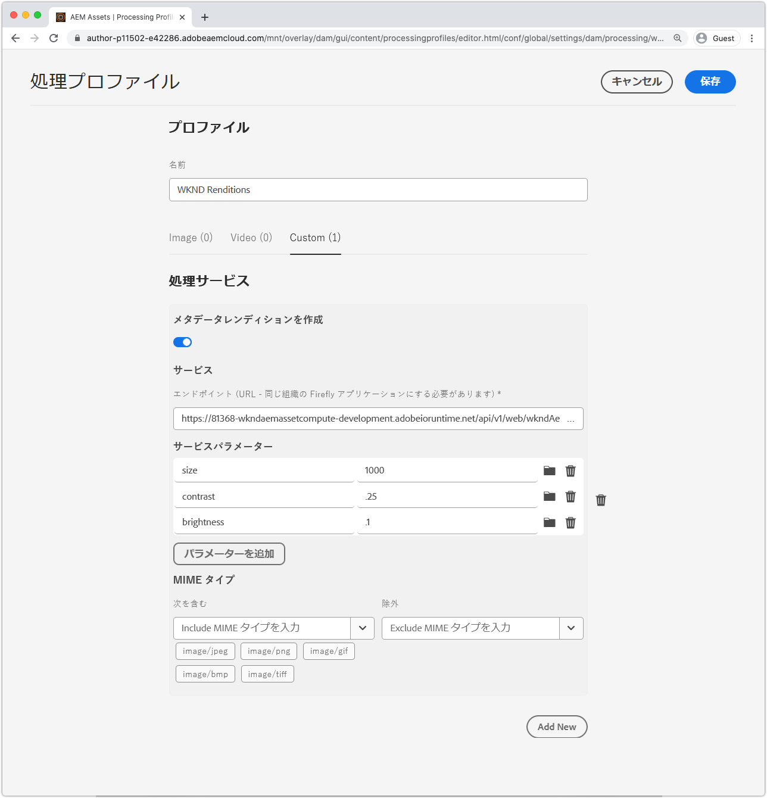
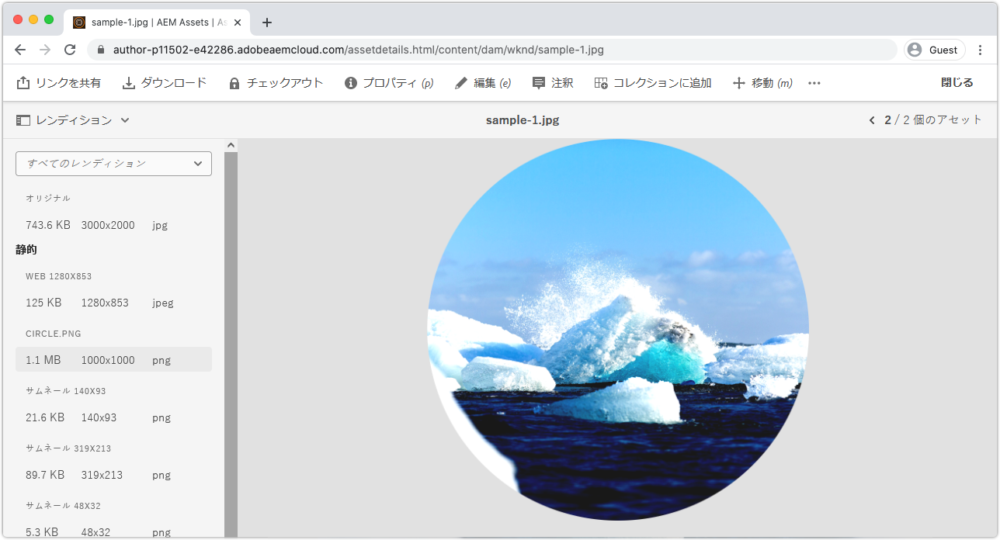

# AEM処理プロファイルとの統合

asset computeワーカーがAEMでカスタムレンディションをCloud Serviceとして生成するには、AEMに、処理プロファイルを介してCloud Service作成者サービスとして登録する必要があります。 その処理プロファイルの対象となるすべてのアセットは、アップロードまたは再処理時にワーカーを呼び出し、カスタムレンディションを生成して、アセットのレンディションを介して使用できるようにします。

## 処理プロファイルの定義

最初に、設定可能なパラメーターを持つワーカーを呼び出す新しい処理プロファイルを作成します。

1. __AEM管理者__&#x200B;として、AEMにCloud Service作成者サービスとしてログインします。 これはチュートリアルなので、開発環境またはサンドボックス内の環境を使用することをお勧めします。
1. __ツール/アセット/処理プロファイル__&#x200B;に移動します。
1. 「__作成__」ボタンをタップします
1. 処理プロファイルに`WKND Asset Renditions`という名前を付けます。
1. 「__カスタム__」タブをタップし、「__追加新規__」をタップします
1. 新しいサービスの定義
   + __レンディション名:__ `Circle`
      + AEM Assetsでこのレンディションを識別するために使用されるファイル名レンディション
   + __拡張子：__ `png`
      + 生成されるレンディションの拡張。 `png`に設定します。これは、ワーカーのWebサービスがサポートするサポートされる出力形式で、円の切り取りの後ろに透明な背景が表示されます。
   + __エンドポイント：__ `https://...adobeioruntime.net/api/v1/web/wkndAemAssetCompute-0.0.1/worker`
      + これは、`aio app get-url`を介して取得したワーカーへのURLです。 URLが、Cloud Service環境ーとしてのAEMに基づく正しいワークスペースを指していることを確認します。
      + ワーカーURLが正しいワークスペースを指していることを確認します。 AEMをCloud Serviceステージとして使用する場合はステージワークスペースURLを、AEMをCloud Service制作として使用する場合は実稼働ワークスペースURLを使用します。
   + __サービスパラメーター__
      + __追加パラメータ__&#x200B;をタップします
         + キー: `size`
         + 値：`1000`
      + __追加パラメータ__&#x200B;をタップします
         + キー: `contrast`
         + 値：`0.25`
      + __追加パラメータ__&#x200B;をタップします
         + キー: `brightness`
         + 値：`0.10`
      + asset computeワーカーに渡され、`rendition.instructions` JavaScriptオブジェクトを介して使用できるこれらのキー/値のペアです。
   + __MIME タイプ__
      + __次を含む：__ `image/jpeg`、 `image/png`、 `image/gif`、 `image/bmp`、  `image/tiff`
         + ワーカーのnpmモジュールには、これらのMIMEタイプのみが含まれます。 このリストは、カスタムワーカーが処理するアセットを制限します。
      + __除外：__ `Leave blank`
         + このサービス設定を使用して、これらのMIMEタイプを持つアセットを処理しないでください。 この場合、許可リストのみを使用します。
1. 右上の「__保存__」をタップします

## 処理プロファイルの適用と呼び出し

1. 新しく作成した処理プロファイル`WKND Asset Renditions`を選択します
1. 上部のアクションバーで「__プロファイルをフォルダーに適用__」をタップします
1. 処理プロファイルを適用するフォルダーを選択し（例：`WKND`）、「__適用__」をタップします
1. __AEM/アセット/ファイル__&#x200B;を介して処理プロファイルが適用されなかったフォルダーに移動し、`WKND`をタップします。
1. 処理プロファイルーが適用されているフォルダー内の任意のフォルダーに新しい画像アセット（[sample-1.jpg](../assets/samples/sample-1.jpg)、[sample-2.jpg](../assets/samples/sample-2.jpg)および[sample-3.jpg](../assets/samples/sample-3.jpg)）をアップロードし、アップロードしたアセットの処理を待ちます。
1. アセットをタップして詳細を開きます
   + 初期設定のレンディションは、カスタムレンディションよりもAEMでは、より迅速に生成および表示されます。
1. 左のサイドバーから&#x200B;__レンディション__&#x200B;表示を開きます
1. `Circle.png`という名前のアセットをタップし、生成されたレンディションを確認します

   

## 完了!

バリデーターがAEMをCloud ServiceAsset computeのマイクロサービスとして拡張する方法について、[チュートリアル](../overview.md)を終えました。 これで、AEMでCloud Service作成者サービスとして使用するカスタムAsset computeワーカーを設定、開発、テスト、デバッグおよびデプロイする機能が必要になります。

### Githubの完全なプロジェクトソースコードを確認します。

最終的なAsset computeプロジェクトは、次の場所でGithubで利用できます。

+ [aem-guides-wknd-asset-compute](https://github.com/adobe/aem-guides-wknd-asset-compute)

_Githubにはプロジェクトの最後の状態が含まれ、ワーカーとテストケースが完全に入力されますが、資格情報は含まれません。`.env`, `.config.json` または `.aio`._

## トラブルシューティング

+ [AEMのアセットにカスタムレンディションが見つかりません](../troubleshooting.md#custom-rendition-missing-from-asset)
+ [AEMでのアセットの処理が失敗する](../troubleshooting.md#asset-processing-fails)
