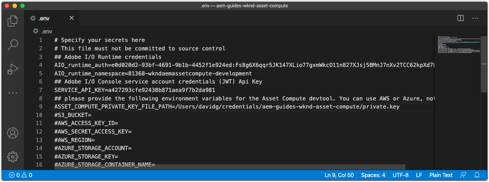

#  環境変数の設定


asset computeワーカーの開発を開始する前に、プロジェクトにAdobe I/O情報とクラウドストレージ情報が設定されていることを確認します。 この情報はプロジェクトの`.env`に保存されます。これはローカル開発のためにのみ使用され、Gitには保存されません。 `.env`ファイルは、キーと値のペアをローカルAsset computeローカル開発環境に公開する便利な方法を提供します。 [](../deploy/runtime.md)Asset computeワーカーをAdobe I/O Runtimeに導入する場合、`.env`ファイルは使用されず、値のサブセットが環境変数を介して渡されます。 サードパーティWebサービスの開発資格情報など、その他のカスタムパラメーターやシークレットを`.env`ファイルに保存することもできます。

## `private.key`



`.env`ファイルを開き、`ASSET_COMPUTE_PRIVATE_KEY_FILE_PATH`キーのコメントを解除し、Adobe I/OFireFlyプロジェクトに追加された公開証明書とペアになるファイルシステムの`private.key`への絶対パスを指定します。

+ キーペアがAdobe I/Oによって生成された場合は、`config.zip`の一部として自動的にダウンロードされました。
+ Adobe I/Oに公開鍵を提供した場合は、一致する秘密鍵も所有する必要があります。
+ これらのキーペアがない場合は、新しいキーペアを生成するか、次の下部に新しい公開鍵をアップロードできます。
   [https://console.adobe.com](https://console.adobe.io) >Asset computeの蛍光プロジェクト> Workspaces @開発>サービスアカウント(JWT)。

`private.key`ファイルは、シークレットを含むのでGitにチェックインしないでください。プロジェクトの外部の安全な場所に保存する必要があります。

例えば、macOSでは次のようになります。

```
...
ASSET_COMPUTE_PRIVATE_KEY_FILE_PATH=/Users/example-user/credentials/aem-guides-wknd-asset-compute/private.key
...
```

## クラウドストレージ資格情報の設定

Asset computeワーカーのローカル開発には、[クラウドストレージ](../set-up/accounts-and-services.md#cloud-storage)へのアクセスが必要です。 ローカル開発に使用するクラウドストレージの資格情報は、`.env`ファイルに格納されます。

このチュートリアルはAzure Blobストレージの使用を優先しますが、AmazonS3および`.env`ファイル内の対応するキーを代わりに使用できます。

### Azure Blobストレージを使用しています

`.env`ファイルの次のキーのコメントを解除して入力し、Azure Portalで見つかったプロビジョニングされたクラウドストレージの値を入力します。


1. `AZURE_STORAGE_CONTAINER_NAME`キーの値
1. `AZURE_STORAGE_ACCOUNT`キーの値
1. `AZURE_STORAGE_KEY`キーの値

例えば、次のようになります（図の値のみ）。

```
...
AZURE_STORAGE_ACCOUNT=aemguideswkndassetcomput
AZURE_STORAGE_KEY=Va9CnisgdbdsNJEJBqXDyNbYppbGbZ2V...OUNY/eExll0vwoLsPt/OvbM+B7pkUdpEe7zJhg==
AZURE_STORAGE_CONTAINER_NAME=asset-compute
...
```

結果の`.env`ファイルは次のようになります。


Microsoft Azure Blobストレージを使用していない場合は、（`#`の前に付けて）コメントアウトしたものを削除するか、そのままにします。

### AmazonS3クラウドストレージ{#amazon-s3}の使用

AmazonS3クラウドストレージを使用している場合は、コメントを解除し、`.env`ファイルに次のキーを入力します。

例えば、次のようになります（図の値のみ）。

```
...
S3_BUCKET=aemguideswkndassetcompute
AWS_ACCESS_KEY_ID=KKIXZLZYNLXJLV24PLO6
AWS_SECRET_ACCESS_KEY=Ba898CnisgabdsNJEJBqCYyVrYttbGbZ2...OiNYExll0vwoLsPtOv
AWS_REGION=us-east-1
...
```

## プロジェクト構成の検証

生成されたAsset computeプロジェクトが構成されたら、コードを変更する前に設定を検証し、サポートするサービスがプロビジョニングされていることを`.env`ファイルで確認します。

asset computeプロジェクト用の開始Asset compute開発ツールを作成するには：

1. asset computeプロジェクトのルート（VSコード）でコマンドラインを開き（IDEで端末/新しい端末を介して直接開くことができます）、次のコマンドを実行します。

   ```
   $ aio app run
   ```

1. ローカルAsset compute開発ツールがデフォルトのWebブラウザー(__http://localhost:9000__)で開きます。

   

1. 開発ツールの初期化時に、コマンドライン出力とWebブラウザーでエラーメッセージが表示されないかを確認します。
1. asset compute開発ツールを停止するには、`aio app run`を実行したウィンドウで`Ctrl-C`をタップし、プロセスを終了します。

## トラブルシューティング

+ [private.keyが見つからないため、開発ツールは開始できません](../troubleshooting.md#missing-private-key)
