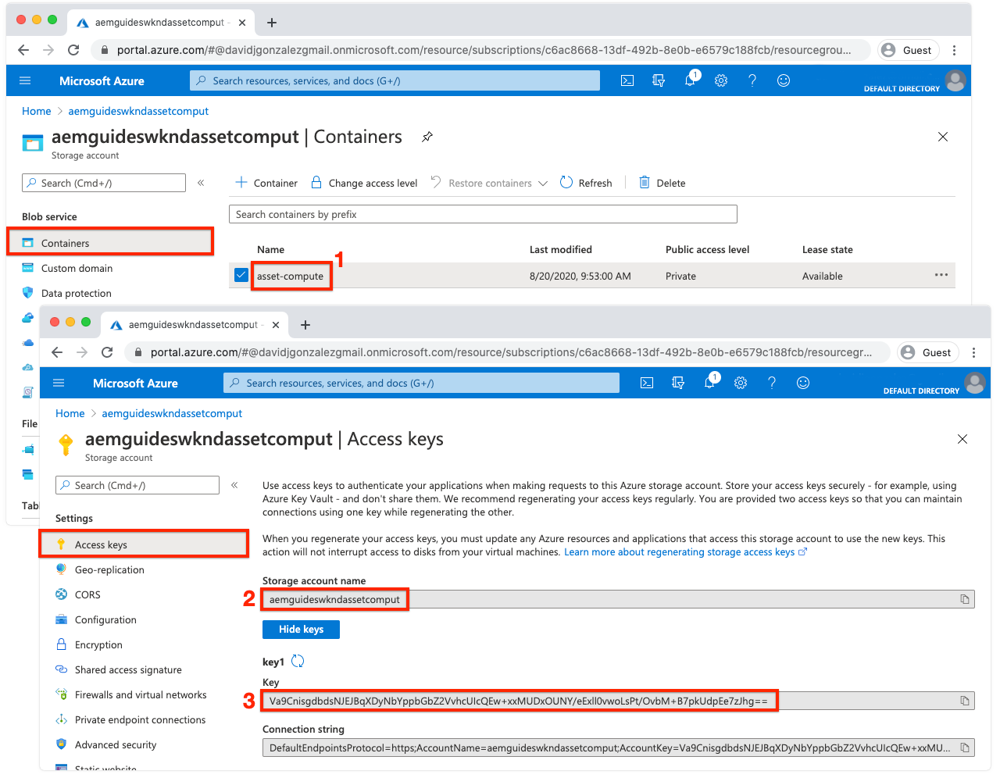

#  環境変数の設定


asset computeワーカーの開発を開始する前に、プロジェクトにAdobe I/Oとクラウドストレージの情報が設定されていることを確認します。 この情報は、プロジェクトの `.env`  これはローカル開発にのみ使用され、Git には保存されません。 この `.env` ファイルは、キーと値のペアをローカルAsset computeローカル開発環境に公開する便利な方法を提供します。 条件 [デプロイ](../deploy/runtime.md) asset computeワーカーのAdobe I/O Runtime、 `.env` ファイルは使用されませんが、値のサブセットが環境変数を介して渡されます。 その他のカスタムパラメーターおよびシークレットは、 `.env` ファイルに保存する必要があります。

## 参照先 `private.key`


を開きます。 `.env` ファイルを開き、コメントを解除します。 `ASSET_COMPUTE_PRIVATE_KEY_FILE_PATH` キーを指定し、ファイルシステムの絶対パスを `private.key` このペアと、公開証明書がAdobe I/Oの App Builder プロジェクトに追加されている。

+ キーペアがAdobe I/Oによって生成された場合は、  `config.zip`.
+ 公開鍵をAdobe I/Oに指定した場合は、一致する秘密鍵も所有する必要があります。
+ これらのキーペアがない場合は、新しいキーペアを生成したり、新しい公開鍵をの下部にアップロードしたりできます。
   [https://console.adobe.com](https://console.adobe.io) /Asset computeApp Builder プロジェクト/ Workspaces @開発/サービスアカウント (JWT)。

を記憶する `private.key` ファイルはシークレットを含んでいるので Git にチェックインしないでください。プロジェクトの外部の安全な場所に保存する必要があります。

例えば、macOSでは次のようになります。

```
...
ASSET_COMPUTE_PRIVATE_KEY_FILE_PATH=/Users/example-user/credentials/aem-guides-wknd-asset-compute/private.key
...
```

## クラウドストレージの資格情報を設定

ローカル開発のAsset computeワーカーは、 [クラウドストレージ](../set-up/accounts-and-services.md#cloud-storage). ローカル開発に使用するクラウドストレージの資格情報は、 `.env` ファイル。

このチュートリアルでは、Azure Blob Storage の使用を推奨しますが、Amazon S3 と、対応するキーは `.env` 代わりに、ファイルを使用できます。

### Azure Blob ストレージの使用

コメントを解除し、 `.env` ファイルを作成し、Azure Portal で見つかったプロビジョニング済みクラウドストレージの値を入力します。



1. の値 `AZURE_STORAGE_CONTAINER_NAME` key
1. の値 `AZURE_STORAGE_ACCOUNT` key
1. の値 `AZURE_STORAGE_KEY` key

例えば、次のようになります（説明の値のみ）。

```
...
AZURE_STORAGE_ACCOUNT=aemguideswkndassetcomput
AZURE_STORAGE_KEY=Va9CnisgdbdsNJEJBqXDyNbYppbGbZ2V...OUNY/eExll0vwoLsPt/OvbM+B7pkUdpEe7zJhg==
AZURE_STORAGE_CONTAINER_NAME=asset-compute
...
```

結果 `.env` ファイルは次のようになります。


Microsoft Azure Blob Storage を使用していない場合は、（のプレフィックスを使用して）コメントアウトされたままにするか、削除します。 `#`) をクリックします。

### Amazon S3 クラウドストレージの使用{#amazon-s3}

Amazon S3 クラウドストレージを使用している場合は、 `.env` ファイル。

例えば、次のようになります（説明の値のみ）。

```
...
S3_BUCKET=aemguideswkndassetcompute
AWS_ACCESS_KEY_ID=KKIXZLZYNLXJLV24PLO6
AWS_SECRET_ACCESS_KEY=Ba898CnisgabdsNJEJBqCYyVrYttbGbZ2...OiNYExll0vwoLsPtOv
AWS_REGION=us-east-1
...
```

## プロジェクト設定の検証

生成されたAsset computeプロジェクトを設定したら、コードを変更する前に設定を検証し、サポートするサービスが `.env` ファイル。

asset computeプロジェクトのAsset compute開発ツールを開始するには：

1. asset computeプロジェクトのルート（VS Code で）のコマンドラインを開き、ターミナル/新しいターミナルから IDE で直接開くことができます。次のコマンドを実行します。

   ```
   $ aio app run
   ```

1. ローカルAsset compute開発ツールが、デフォルトの Web ブラウザー ( ) で開きます。 __http://localhost:9000__.

   

1. 開発ツールの初期化時に、コマンドライン出力と Web ブラウザでエラーメッセージを確認します。
1. asset compute開発ツールを停止するには、 `Ctrl-C` 実行したウィンドウ内 `aio app run` プロセスを終了します。

## トラブルシューティング

+ [private.key が見つからないため、開発ツールを開始できません](../troubleshooting.md#missing-private-key)
