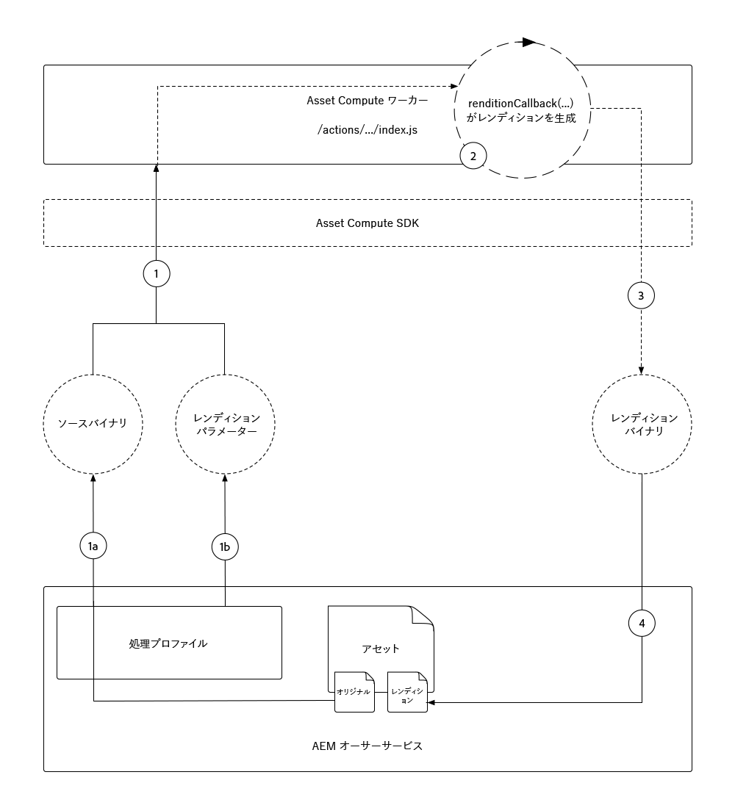

# asset computeワーカーの開発

asset computeワーカーは、Asset computeプロジェクトの中心で、新しいレンディションを作成するためにアセットで実行される作業を実行または編成するカスタム機能を提供します。

asset computeプロジェクトは、アセットの元のバイナリを名前付きのレンディションに変換せずにコピーする、単純なワーカーを自動生成します。 このチュートリアルでは、このワーカーを変更して、より興味深いレンディションを作成し、Asset computeワーカーの力を説明します。

asset computeのぼやけたバージョンのアセットで、アセットレンディションの左右の空き領域をカバーする新しい水平画像レンディションを生成するアセットワーカーを作成します。 最終的なレンディションの幅、高さ、ぼかしがパラメーター化されます。

## asset computeワーカー呼び出しの論理フロー

asset computeワーカーは、Asset computeSDKワーカーAPI契約を、概念上次のような`renditionCallback(...)`関数に実装します。

+ __入力：__ AEMアセットの元のバイナリパラメーターと処理プロファイルパラメーター
+ __出力：__ AEMアセットに追加する1つ以上のレンディション



1. AEMオーサーサービスは、Asset computeの&#x200B;__(1a)__&#x200B;元のバイナリ（`source`パラメーター）と、処理プロファイル（`rendition.instructions`パラメーター）で定義された&#x200B;__(1b)__&#x200B;パラメーターを提供して、アセットワーカーを呼び出します。
1. asset computeSDKは、カスタムAsset computeメタデータワーカーの`renditionCallback(...)`関数の実行を編成し、アセットの元のバイナリ&#x200B;__(1a)__&#x200B;とパラメーター&#x200B;__(1b)__&#x200B;に基づいて新しいバイナリレンディションを生成します。

   + このチュートリアルでは、レンディションは「処理中」に作成されます。つまり、ワーカーがレンディションを構成しますが、レンディション生成用に他のWebサービスAPIにソースバイナリを送信することもできます。

1. asset computeワーカーは、新しいレンディションのバイナリデータを`rendition.path`に保存します。
1. `rendition.path`に書き込まれたバイナリデータは、Asset computeSDKを介してAEMオーサーサービスに転送され、__(4a)__&#x200B;テキストレンディションおよび&#x200B;__(4b)__&#x200B;としてアセットのメタデータノードに公開されます。

上の図は、開発者が直面するAsset computeの問題と、Asset computeワーカーの呼び出しへの論理的な流れを示しています。 興味深いことに、[Asset computeの実行](https://docs.adobe.com/content/help/en/asset-compute/using/extend/custom-application-internals.html)の内部詳細は利用可能ですが、パブリックAsset computeSDK APIの契約のみに依存できます。

## 作業者の分析

すべてのAsset computeワーカーは、同じ基本構造と入出力契約に従います。

```javascript
'use strict';

// Any npm module imports used by the worker
const { worker, SourceCorruptError } = require('@adobe/asset-compute-sdk');
const fs = require('fs').promises;

/**
Exports the worker implemented by a custom rendition callback function, which parametrizes the input/output contract for the worker.
 + `source` represents the asset's original binary used as the input for the worker.
 + `rendition` represents the worker's output, which is the creation of a new asset rendition.
 + `params` are optional parameters, which map to additional key/value pairs, including a sub `auth` object that contains Adobe I/O access credentials.
**/
exports.main = worker(async (source, rendition, params) => {
    // Perform any necessary source (input) checks
    const stats = await fs.stat(source.path);
    if (stats.size === 0) {
        // Throw appropriate errors whenever an erring condition is met
        throw new SourceCorruptError('source file is empty');
    }

    // Access any custom parameters provided via the Processing Profile configuration
    let param1 = rendition.instructions.exampleParam;

    /** 
    Perform all work needed to transform the source into the rendition.
    
    The source data can be accessed:
        + In the worker via a file available at `source.path`
        + Or via a presigned GET URL at `source.url`
    **/
    if (success) {
        // A successful worker must write some data back to `renditions.path`. 
        // This example performs a trivial 1:1 copy of the source binary to the rendition
        await fs.copyFile(source.path, rendition.path);
    } else {
        // Upon failure an Asset Compute Error (exported by @adobe/asset-compute-commons) should be thrown.
        throw new GenericError("An error occurred!", "example-worker");
    }
});

/**
Optionally create helper classes or functions the worker's rendition callback function invokes to help organize code.

Code shared across workers, or to complex to be managed in a single file, can be broken out across supporting JavaScript files in the project and imported normally into the worker. 
**/
function customHelperFunctions() { ... }
```

## ワーカーindex.jsを開く


1. VS CodeでAsset computeプロジェクトが開いていることを確認します。
1. `/actions/worker`フォルダーに移動します。
1. `index.js`ファイルを開きます。

これは、このチュートリアルで変更するワーカーJavaScriptファイルです。

## サポートされているnpmモジュールのインストールとインポート

Node.jsベースのAsset computeプロジェクトは、堅牢な[npmモジュールエコシステム](https://npmjs.com)のメリットを享受できます。 npmモジュールを活用するには、まずnpmモジュールをAsset computeプロジェクトにインストールする必要があります。

このワーカーでは、[jimp](https://www.npmjs.com/package/jimp)を利用して、Node.jsコードで直接レンディション画像を作成および操作します。

>[!WARNING]
>
>アセット操作用のnpmモジュールの一部が、Asset computeでサポートされているわけではありません。 ImageMagickなどのアプリケーションの存在に依存するnpmモジュールや、その他のOS依存ライブラリはサポートされていません。 JavaScriptのみのnpmモジュールの使用を制限することをお勧めします。

1. asset computeプロジェクトのルートにあるコマンドラインを開き（__ターミナル/新しいターミナル__&#x200B;を使用してVSコードで実行できます）、次のコマンドを実行します。

   ```
   $ npm install jimp
   ```

1. `jimp`モジュールをワーカーコードにインポートし、`Jimp` JavaScriptオブジェクト経由で使用できるようにします。
ワーカーの`index.js`の先頭にある`require`ディレクティブを更新し、`jimp`モジュールから`Jimp`オブジェクトをインポートします。

   ```javascript
   'use strict';
   
   const Jimp = require('jimp');
   const { worker, SourceCorruptError } = require('@adobe/asset-compute-sdk');
   const fs = require('fs').promises;
   
   exports.main = worker(async (source, rendition, params) => {
       // Check handle a corrupt input source
       const stats = await fs.stat(source.path);
       if (stats.size === 0) {
           throw new SourceCorruptError('source file is empty');
       }
   
       // Do work here
   });
   ```

## パラメーターの読み取り

asset computeワーカーは、AEM as a Processing Authorサービスで定義された処理プロファイルを介して渡すことができるCloud Serviceーを読み取ることができます。 パラメーターは、`rendition.instructions`オブジェクトを介してワーカーに渡されます。

これらは、ワーカーコードの`rendition.instructions.<parameterName>`にアクセスすることで読み取ることができます。

ここでは、設定可能なレンディションの`SIZE`、`BRIGHTNESS`および`CONTRAST`を読み取り、処理プロファイル経由でデフォルト値が提供されていない場合のデフォルト値を提供します。 AEMからCloud Service処理プロファイルとして呼び出されると、`renditions.instructions`は文字列として渡されるので、ワーカーコード内の正しいデータ型に変換されていることを確認してください。

```javascript
'use strict';

const Jimp = require('jimp');
const { worker, SourceCorruptError } = require('@adobe/asset-compute-sdk');
const fs = require('fs').promises;

exports.main = worker(async (source, rendition, params) => {
    const stats = await fs.stat(source.path);
    if (stats.size === 0) {
        throw new SourceCorruptError('source file is empty');
    }

    // Read in parameters and set defaults if parameters are provided
    // Processing Profiles pass in instructions as Strings, so make sure to parse to correct data types
    const SIZE = parseInt(rendition.instructions.size) || 800; 
    const CONTRAST = parseFloat(rendition.instructions.contrast) || 0;
    const BRIGHTNESS = parseFloat(rendition.instructions.brightness) || 0;

    // Do work here
}
```

## エラーのスロー{#errors}

asset computeワーカーは、エラーを引き起こす状況が発生する場合があります。 AdobeAsset computeSDKには、[事前に定義されたエラーのスイート](https://github.com/adobe/asset-compute-commons#asset-compute-errors)が用意されています。このエラーは、このような状況が発生した場合にスローされます。 特定のエラータイプが適用されない場合は、`GenericError`を使用するか、特定のカスタム`ClientErrors`を定義できます。

レンディションの処理を開始する前に、このワーカーのコンテキストですべてのパラメーターが有効でサポートされていることを確認します。

+ `SIZE`、`CONTRAST`および`BRIGHTNESS`のレンディション指示パラメーターが有効であることを確認します。 そうでない場合は、カスタムエラー`RenditionInstructionsError`をスローします。
   + `ClientError`を拡張するカスタムの`RenditionInstructionsError`クラスが、このファイルの最下部で定義されます。 特定のカスタムエラーを使用すると、ワーカーのテスト](../test-debug/test.md)を[書き込む場合に役立ちます。

```javascript
'use strict';

const Jimp = require('jimp');
// Import the Asset Compute SDK provided `ClientError` 
const { worker, SourceCorruptError, ClientError } = require('@adobe/asset-compute-sdk');
const fs = require('fs').promises;

exports.main = worker(async (source, rendition, params) => {
    const stats = await fs.stat(source.path);
    if (stats.size === 0) {
        throw new SourceCorruptError('source file is empty');
    }

    // Read in parameters and set defaults if parameters are provided
    const SIZE = parseInt(rendition.instructions.size) || 800; 
    const CONTRAST = parseFloat(rendition.instructions.contrast) || 0;
    const BRIGHTNESS = parseFloat(rendition.instructions.brightness) || 0;

    if (SIZE <= 10 || SIZE >= 10000) {
        // Ensure size is within allowable bounds
        throw new RenditionInstructionsError("'size' must be between 10 and 1,0000");
    } else if (CONTRAST <= -1 || CONTRAST >= 1) {
        // Ensure contrast is valid value
        throw new RenditionInstructionsError("'contrast' must between -1 and 1");
    } else if (BRIGHTNESS <= -1 || BRIGHTNESS >= 1) {
        // Ensure contrast is valid value
        throw new RenditionInstructionsError("'brightness' must between -1 and 1");
    }

    // Do work here
}

// Create a new ClientError to handle invalid rendition.instructions values
class RenditionInstructionsError extends ClientError {
    constructor(message) {
        // Provide a:
        // + message: describing the nature of this erring condition
        // + name: the name of the error; usually same as class name
        // + reason: a short, searchable, unique error token that identifies this error
        super(message, "RenditionInstructionsError", "rendition_instructions_error");

        // Capture the strack trace
        Error.captureStackTrace(this, RenditionInstructionsError);
    }
}
```

## レンディションの作成

読み取られ、不要部分が削除され、検証されたパラメーターを使用して、コードが書き込まれ、レンディションが生成されます。 レンディション生成の擬似コードを次に示します。

1. `size`パラメーターで指定された正方形の寸法で新しい`renditionImage`キャンバスを作成します。
1. ソースアセットのバイナリから`image`オブジェクトを作成する
1. __Jimp__&#x200B;ライブラリを使用して画像を変換します。
   + 元の画像を中央の四角形に切り抜く
   + 「2乗」画像の中心から円を切り取る
   + `SIZE`パラメータ値で定義された寸法内に収まるように拡大/縮小
   + `CONTRAST`パラメーター値に基づいてコントラストを調整する
   + `BRIGHTNESS`パラメータ値に基づいて明るさを調整する
1. 変換後の`image`を、背景が透明な`renditionImage`の中心に配置します。
1. 構成済みの`renditionImage`を`rendition.path`に書き込み、アセットレンディションとしてAEMに保存し直すことができます。

このコードでは、[Jimp API](https://github.com/oliver-moran/jimp#jimp)を使用して、これらの画像変換を実行します。

asset computeワーカーは同期的に作業を完了する必要があり、`rendition.path`はワーカーの`renditionCallback`が完了する前に完全にに書き戻す必要があります。 そのためには、`await`演算子を使用して非同期関数呼び出しが同期的におこなわれる必要があります。 JavaScriptの非同期関数と、それらを同期的に実行する方法について詳しくない場合は、[JavaScriptのawait演算子](https://developer.mozilla.org/en-US/docs/Web/JavaScript/Reference/Operators/await)について理解してください。

完成したワーカー`index.js`は次のようになります。

```javascript
'use strict';

const Jimp = require('jimp');
const { worker, SourceCorruptError, ClientError } = require('@adobe/asset-compute-sdk');
const fs = require('fs').promises;

exports.main = worker(async (source, rendition, params) => {
    const stats = await fs.stat(source.path);
    if (stats.size === 0) {
        throw new SourceCorruptError('source file is empty');
    }

    // Read/parse and validate parameters
    const SIZE = parseInt(rendition.instructions.size) || 800; 
    const CONTRAST = parseFloat(rendition.instructions.contrast) || 0;
    const BRIGHTNESS = parseFloat(rendition.instructions.brightness) || 0;

    if (SIZE <= 10 || SIZE >= 10000) {
        throw new RenditionInstructionsError("'size' must be between 10 and 1,0000");
    } else if (CONTRAST <= -1 || CONTRAST >= 1) {
        throw new RenditionInstructionsError("'contrast' must between -1 and 1");
    } else if (BRIGHTNESS <= -1 || BRIGHTNESS >= 1) {
        throw new RenditionInstructionsError("'brightness' must between -1 and 1");
    }

    // Create target rendition image 
    let renditionImage =  new Jimp(SIZE, SIZE, 0x0);

    // Read and perform transformations on the source binary image
    let image = await Jimp.read(source.path);

    // Crop a circle from the source asset, and then apply contrast and brightness
    image.crop(
            image.bitmap.width < image.bitmap.height ? 0 : (image.bitmap.width - image.bitmap.height) / 2,
            image.bitmap.width < image.bitmap.height ? (image.bitmap.height - image.bitmap.width) / 2 : 0,
            image.bitmap.width < image.bitmap.height ? image.bitmap.width : image.bitmap.height,
            image.bitmap.width < image.bitmap.height ? image.bitmap.width : image.bitmap.height
        )   
        .circle()
        .scaleToFit(SIZE, SIZE)
        .contrast(CONTRAST)
        .brightness(BRIGHTNESS);

    // Place the transformed image onto the transparent renditionImage to save as PNG
    renditionImage.composite(image, 0, 0)

    // Write the final transformed image to the asset's rendition
    await renditionImage.writeAsync(rendition.path);
});

// Custom error used for renditions.instructions parameter checking
class RenditionInstructionsError extends ClientError {
    constructor(message) {
        super(message, "RenditionInstructionsError", "rendition_instructions_error");
        Error.captureStackTrace(this, RenditionInstructionsError);
    }
}
```

## ワーカーの実行

これで、ワーカーコードが完了し、以前に[manifest.yml](./manifest.md)に登録および設定されたので、ローカルAsset compute開発ツールを使用して実行し、結果を確認できます。

1. asset computeプロジェクトのルート
1. 実行 `aio app run`
1. asset compute開発ツールが新しいウィンドウで開くのを待つ
1. 「__ファイルを選択…__&#x200B;ドロップダウンで、処理するサンプル画像を選択します。
   + ソースアセットバイナリとして使用するサンプル画像ファイルを選択します
   + まだ存在しない場合は、左側の&#x200B;__(+)__&#x200B;をタップし、[サンプル画像](../assets/samples/sample-file.jpg)ファイルをアップロードして、開発ツールブラウザーウィンドウを更新します
1. `"name": "rendition.png"`をこのワーカーとして更新し、透明なPNGを生成します。
   + この「name」パラメーターは開発ツールにのみ使用され、依存しないでください。

   ```json
   {
       "renditions": [
           {
               "worker": "...",
               "name": "rendition.png"
           }
       ]
   }
   ```

1. __「__&#x200B;を実行」をタップし、レンディションが生成されるのを待ちます。
1. __レンディション__&#x200B;セクションで、生成されたレンディションのプレビューを表示します。 レンディションのプレビューをタップして、レンディション全体をダウンロードします。

   

### パラメータを指定して作業者を実行

処理プロファイル設定を介して渡されるパラメーターは、レンディションパラメーターJSONにキーと値のペアとして提供することで、Asset compute開発ツールでシミュレートできます。

>[!WARNING]
>
>ローカル開発時に、様々なデータ型を使用して値を渡すことができます。AEMからCloud Service処理プロファイルに文字列として渡す場合は、必要に応じて正しいデータ型が解析されるようにします。
> 例えば、Jimpの`crop(width, height)`関数のパラメーターは`int`である必要があります。`parseInt(rendition.instructions.size)`がintに解析されない場合、`jimp.crop(SIZE, SIZE)`への呼び出しは失敗します。これは、パラメーターが「String」型と互換性がないためです。

アドビのコードは次のパラメーターを受け取ります。

+ `size` レンディションのサイズを定義します（高さと幅を整数で指定）。
+ `contrast` コントラスト調整を定義します。-1 ～ 1の範囲を浮動小数点として指定する必要があります。
+ `brightness`  明るい調整を定義します。-1から1の間である必要があります。

これらは、次を介してワーカー`index.js`に読み込まれます。

+ `const SIZE = parseInt(rendition.instructions.size) || 800`
+ `const CONTRAST = parseFloat(rendition.instructions.contrast) || 0`
+ `const BRIGHTNESS = parseFloat(rendition.instructions.brightness) || 0`

1. レンディションパラメーターを更新して、サイズ、コントラスト、明るさをカスタマイズします。

   ```json
   {
       "renditions": [
           {
               "worker": "...",
               "name": "rendition.png",
               "size": "450",
               "contrast": "0.30",
               "brightness": "0.15"
           }
       ]
   }
   ```

1. もう一度&#x200B;__「__&#x200B;を実行」をタップします
1. レンディションのプレビューをタップして、生成されたレンディションをダウンロードし、確認します。 デフォルトのレンディションと比較して、サイズとコントラストと明るさがどのように変更されたかを確認します。

   

1. __ソースファイル__&#x200B;ドロップダウンに他の画像をアップロードし、異なるパラメーターでワーカーを実行してみてください。

## GithubのWorker index.js

最終的な`index.js`は、GitHubで次の場所から入手できます。

+ [aem-guides-wknd-asset-compute/actions/worker/index.js](https://github.com/adobe/aem-guides-wknd-asset-compute/blob/master/actions/worker/index.js)

## トラブルシューティング

+ [レンディションが部分的に描画されたか破損しています](../troubleshooting.md#rendition-returned-partially-drawn-or-corrupt)
