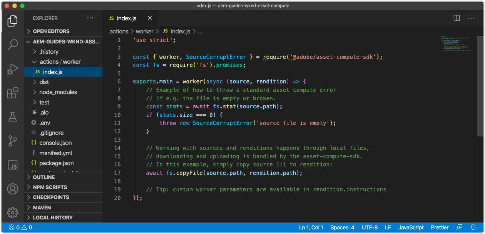

# Asset Compute ワーカーの開発

Asset computeワーカーは、Asset computeプロジェクトの中核となり、アセットで実行された作業を実行（編成）して新しいレンディションを作成するカスタム機能を提供します。

asset computeプロジェクトは、アセットの元のバイナリを名前付きのレンディションに変換せずにコピーする、単純なワーカーを自動生成します。 このチュートリアルでは、このワーカーを変更して、より興味深いレンディションを作成し、Asset computeワーカーの力を説明します。

asset computeのぼやけたバージョンで、アセットレンディションの左右にある空き領域を覆う新しい水平画像レンディションを生成するアセットワーカーを作成します。 最終的なレンディションの幅、高さ、ぼかしがパラメーター化されます。

## asset computeワーカー呼び出しの論理フロー

Asset Compute ワーカーは、Asset Compute SDK ワーカー API コントラクトを `renditionCallback(...)` 関数で実装します。この関数は、概念的には次のようなものになります。

+ __入力：__ AEM アセットのオリジナルバイナリパラメーターと処理プロファイルパラメーター
+ __出力：__ AEMアセットに追加する 1 つ以上のレンディション


1. AEMオーサーサービスはAsset computeワーカーを呼び出し、アセットの __(1a)__ 元のバイナリ (`source` パラメータ )、および __(1b)__ 処理プロファイル (`rendition.instructions` パラメーター )。
1. asset computeSDK は、カスタムAsset computeメタデータワーカーの実行を調整します。 `renditionCallback(...)` 関数、アセットの元のバイナリに基づく新しいバイナリレンディションの生成 __(1a)__ および任意のパラメータ __(1b)__.

   + このチュートリアルでは、レンディションが「処理中」に作成されます。つまり、ワーカーはレンディションを構成しますが、ソースバイナリを他の Web サービス API に送信して、レンディションを生成することもできます。

1. asset computeワーカーは、新しいレンディションのバイナリデータをに保存します。 `rendition.path`.
1. に書き込まれるバイナリデータ `rendition.path` は、Asset computeSDK を介してAEMオーサーサービスに転送され、 __(4a)__ テキストレンディションと __(4b)__ アセットのメタデータノードに保持されます。

上の図は、Asset compute開発者に関する懸念事項と、Asset computeワーカー呼び出しへの論理的な流れを示しています。 興味深い事に [内部でのAsset compute実行の詳細](https://experienceleague.adobe.com/docs/asset-compute/using/extend/custom-application-internals.html) が使用できますが、依存できるのはパブリックAsset computeSDK API の契約のみです。

## 作業者の解剖学

すべてのAsset computeワーカーは、同じ基本構造と入出力契約に従います。

```javascript
'use strict';

// Any npm module imports used by the worker
const { worker, SourceCorruptError } = require('@adobe/asset-compute-sdk');
const fs = require('fs').promises;

/**
Exports the worker implemented by a custom rendition callback function, which parametrizes the input/output contract for the worker.
 + `source` represents the asset's original binary used as the input for the worker.
 + `rendition` represents the worker's output, which is the creation of a new asset rendition.
 + `params` are optional parameters, which map to additional key/value pairs, including a sub `auth` object that contains Adobe I/O access credentials.
**/
exports.main = worker(async (source, rendition, params) => {
    // Perform any necessary source (input) checks
    const stats = await fs.stat(source.path);
    if (stats.size === 0) {
        // Throw appropriate errors whenever an erring condition is met
        throw new SourceCorruptError('source file is empty');
    }

    // Access any custom parameters provided via the Processing Profile configuration
    let param1 = rendition.instructions.exampleParam;

    /** 
    Perform all work needed to transform the source into the rendition.
    
    The source data can be accessed:
        + In the worker via a file available at `source.path`
        + Or via a presigned GET URL at `source.url`
    **/
    if (success) {
        // A successful worker must write some data back to `renditions.path`. 
        // This example performs a trivial 1:1 copy of the source binary to the rendition
        await fs.copyFile(source.path, rendition.path);
    } else {
        // Upon failure an Asset Compute Error (exported by @adobe/asset-compute-commons) should be thrown.
        throw new GenericError("An error occurred!", "example-worker");
    }
});

/**
Optionally create helper classes or functions the worker's rendition callback function invokes to help organize code.

Code shared across workers, or to complex to be managed in a single file, can be broken out across supporting JavaScript files in the project and imported normally into the worker. 
**/
function customHelperFunctions() { ... }
```

## ワーカー index.js を開く



1. VS Code でAsset computeプロジェクトが開いていることを確認します。
1. 次に移動： `/actions/worker` フォルダー
1. を開きます。 `index.js` ファイル

これは、このチュートリアルで変更するワーカー JavaScript ファイルです。

## サポートする npm モジュールのインストールとインポート

Node.js ベースのAsset computeプロジェクトは、堅牢な [npm モジュールエコシステム](https://npmjs.com). npm モジュールを活用するには、まずモジュールをAsset computeプロジェクトにインストールする必要があります。

このワーカーでは、 [ジンプ](https://www.npmjs.com/package/jimp) :Node.js コード内で直接レンディション画像を作成および操作します。

>[!WARNING]
>
>アセット操作用の npm モジュールの一部が、Asset computeでサポートされているわけではありません。 ImageMagick などのアプリケーションの存在に依存する npm モジュールや、その他の OS 依存ライブラリはサポートされていません。 JavaScript のみの npm モジュールの使用に制限することをお勧めします。

1. asset computeプロジェクトのルートでコマンドラインを開きます (VS Code では、 __ターミナル/新しいターミナル__) をクリックし、次のコマンドを実行します。

   ```
   $ npm install jimp
   ```

1. 次をインポート： `jimp` モジュールをワーカーコードに組み込み、 `Jimp` JavaScript オブジェクト。
を更新します。 `require` 労働者の最上位の指令 `index.js` を読み込む `Jimp` オブジェクトを `jimp` モジュール：

   ```javascript
   'use strict';
   
   const Jimp = require('jimp');
   const { worker, SourceCorruptError } = require('@adobe/asset-compute-sdk');
   const fs = require('fs').promises;
   
   exports.main = worker(async (source, rendition, params) => {
       // Check handle a corrupt input source
       const stats = await fs.stat(source.path);
       if (stats.size === 0) {
           throw new SourceCorruptError('source file is empty');
       }
   
       // Do work here
   });
   ```

## パラメーターを読み取り

Asset computeワーカーは、AEM as a Cloud Serviceオーサーサービスで定義された処理プロファイル経由で渡すことができるパラメーターを読み取ることができます。 パラメーターは、 `rendition.instructions` オブジェクト。

これらは、 `rendition.instructions.<parameterName>` 」と入力します。

ここでは、設定可能なレンディションの `SIZE`, `BRIGHTNESS` および `CONTRAST`処理プロファイル経由で指定されていない場合は、デフォルト値を指定します。 注意： `renditions.instructions` は、AEMas a Cloud Serviceの処理プロファイルから呼び出されたときに文字列として渡されるので、ワーカーコード内で正しいデータ型に変換されるようにします。

```javascript
'use strict';

const Jimp = require('jimp');
const { worker, SourceCorruptError } = require('@adobe/asset-compute-sdk');
const fs = require('fs').promises;

exports.main = worker(async (source, rendition, params) => {
    const stats = await fs.stat(source.path);
    if (stats.size === 0) {
        throw new SourceCorruptError('source file is empty');
    }

    // Read in parameters and set defaults if parameters are provided
    // Processing Profiles pass in instructions as Strings, so make sure to parse to correct data types
    const SIZE = parseInt(rendition.instructions.size) || 800; 
    const CONTRAST = parseFloat(rendition.instructions.contrast) || 0;
    const BRIGHTNESS = parseFloat(rendition.instructions.brightness) || 0;

    // Do work here
}
```

## エラーのスロー{#errors}

Asset computeワーカーは、エラーを引き起こす状況が発生する場合があります。 AdobeAsset computeSDK が提供する [事前定義済みのエラーのスイート](https://github.com/adobe/asset-compute-commons#asset-compute-errors) これは、このような状況が発生した場合にスローされる可能性があります。 特定のエラータイプが適用されない場合、 `GenericError` 使用するか、特定のカスタム `ClientErrors` を定義できます。

レンディションの処理を開始する前に、このワーカーのコンテキストですべてのパラメーターが有効でサポートされていることを確認します。

+ 次のレンディション指示パラメーターを確認します。 `SIZE`, `CONTRAST`、および `BRIGHTNESS` は有効です。 そうでない場合は、カスタムエラーをスローします `RenditionInstructionsError`.
   + カスタム `RenditionInstructionsError` を拡張するクラス `ClientError` は、このファイルの末尾で定義されます。 特定のカスタムエラーを使用すると、 [テストの作成](../test-debug/test.md) 労働者にとって

```javascript
'use strict';

const Jimp = require('jimp');
// Import the Asset Compute SDK provided `ClientError` 
const { worker, SourceCorruptError, ClientError } = require('@adobe/asset-compute-sdk');
const fs = require('fs').promises;

exports.main = worker(async (source, rendition, params) => {
    const stats = await fs.stat(source.path);
    if (stats.size === 0) {
        throw new SourceCorruptError('source file is empty');
    }

    // Read in parameters and set defaults if parameters are provided
    const SIZE = parseInt(rendition.instructions.size) || 800; 
    const CONTRAST = parseFloat(rendition.instructions.contrast) || 0;
    const BRIGHTNESS = parseFloat(rendition.instructions.brightness) || 0;

    if (SIZE <= 10 || SIZE >= 10000) {
        // Ensure size is within allowable bounds
        throw new RenditionInstructionsError("'size' must be between 10 and 1,0000");
    } else if (CONTRAST <= -1 || CONTRAST >= 1) {
        // Ensure contrast is valid value
        throw new RenditionInstructionsError("'contrast' must between -1 and 1");
    } else if (BRIGHTNESS <= -1 || BRIGHTNESS >= 1) {
        // Ensure contrast is valid value
        throw new RenditionInstructionsError("'brightness' must between -1 and 1");
    }

    // Do work here
}

// Create a new ClientError to handle invalid rendition.instructions values
class RenditionInstructionsError extends ClientError {
    constructor(message) {
        // Provide a:
        // + message: describing the nature of this erring condition
        // + name: the name of the error; usually same as class name
        // + reason: a short, searchable, unique error token that identifies this error
        super(message, "RenditionInstructionsError", "rendition_instructions_error");

        // Capture the strack trace
        Error.captureStackTrace(this, RenditionInstructionsError);
    }
}
```

## レンディションの作成

パラメーターが読み取られ、不要部分が削除され検証されると、コードが書き込まれてレンディションが生成されます。 レンディション生成の擬似コードを次に示します。

1. 新規作成 `renditionImage` で指定された四角い寸法のキャンバス `size` パラメーター。
1. の作成 `image` オブジェクトをソースアセットのバイナリから取得する
1. 以下を使用します。 __Jimp__ 画像を変換するライブラリ：
   + 元の画像を中央の四角形に切り抜く
   + 「2 乗」画像の中心から円を切り取る
   + 次の条件で定義された寸法内に収まるように拡大/縮小 `SIZE` パラメーター値
   + 以下に基づいてコントラストを調整 `CONTRAST` パラメーター値
   + 明るさを `BRIGHTNESS` パラメーター値
1. 変換後の場所 `image` ～の真ん中に `renditionImage` 透明な背景を持つ
1. 作文を書きなさい。 `renditionImage` から `rendition.path` したがって、アセットレンディションとしてAEMに保存し直すことができます。

このコードは、 [Jimp API](https://github.com/oliver-moran/jimp#jimp) を使用して、これらの画像変換を実行します。

Asset computeワーカーは、同期的に作業を完了し、 `rendition.path` 労働者の前に完全に書き戻されなければならない `renditionCallback` 完了します。 これには、非同期関数呼び出しが、 `await` 演算子を使用します。 JavaScript の非同期関数と、それらを同期的に実行する方法について詳しくない場合は、 [JavaScript の await 演算子](https://developer.mozilla.org/en-US/docs/Web/JavaScript/Reference/Operators/await).

完成した作業者 `index.js` は次のようになります。

```javascript
'use strict';

const Jimp = require('jimp');
const { worker, SourceCorruptError, ClientError } = require('@adobe/asset-compute-sdk');
const fs = require('fs').promises;

exports.main = worker(async (source, rendition, params) => {
    const stats = await fs.stat(source.path);
    if (stats.size === 0) {
        throw new SourceCorruptError('source file is empty');
    }

    // Read/parse and validate parameters
    const SIZE = parseInt(rendition.instructions.size) || 800; 
    const CONTRAST = parseFloat(rendition.instructions.contrast) || 0;
    const BRIGHTNESS = parseFloat(rendition.instructions.brightness) || 0;

    if (SIZE <= 10 || SIZE >= 10000) {
        throw new RenditionInstructionsError("'size' must be between 10 and 1,0000");
    } else if (CONTRAST <= -1 || CONTRAST >= 1) {
        throw new RenditionInstructionsError("'contrast' must between -1 and 1");
    } else if (BRIGHTNESS <= -1 || BRIGHTNESS >= 1) {
        throw new RenditionInstructionsError("'brightness' must between -1 and 1");
    }

    // Create target rendition image 
    let renditionImage =  new Jimp(SIZE, SIZE, 0x0);

    // Read and perform transformations on the source binary image
    let image = await Jimp.read(source.path);

    // Crop a circle from the source asset, and then apply contrast and brightness
    image.crop(
            image.bitmap.width < image.bitmap.height ? 0 : (image.bitmap.width - image.bitmap.height) / 2,
            image.bitmap.width < image.bitmap.height ? (image.bitmap.height - image.bitmap.width) / 2 : 0,
            image.bitmap.width < image.bitmap.height ? image.bitmap.width : image.bitmap.height,
            image.bitmap.width < image.bitmap.height ? image.bitmap.width : image.bitmap.height
        )   
        .circle()
        .scaleToFit(SIZE, SIZE)
        .contrast(CONTRAST)
        .brightness(BRIGHTNESS);

    // Place the transformed image onto the transparent renditionImage to save as PNG
    renditionImage.composite(image, 0, 0)

    // Write the final transformed image to the asset's rendition
    await renditionImage.writeAsync(rendition.path);
});

// Custom error used for renditions.instructions parameter checking
class RenditionInstructionsError extends ClientError {
    constructor(message) {
        super(message, "RenditionInstructionsError", "rendition_instructions_error");
        Error.captureStackTrace(this, RenditionInstructionsError);
    }
}
```

## ワーカーの実行

これで、ワーカーコードが完了し、以前に [manifest.yml](./manifest.md)の場合は、ローカルAsset compute開発ツールを使用して実行し、結果を確認できます。

1. Asset Compute プロジェクトのルートから
1. 実行 `aio app run`
1. asset compute開発ツールが新しいウィンドウで開くのを待つ
1. Adobe Analytics の __ファイルを選択…__ 」ドロップダウンで、処理するサンプル画像を選択します。
   + ソースアセットバイナリとして使用するサンプル画像ファイルを選択
   + まだ存在しない場合は、 __(+)__ を左側にアップロードし、 [サンプル画像](../assets/samples/sample-file.jpg) ファイルを作成し、[ 開発ツール ] ブラウザウィンドウを更新します。
1. 更新 `"name": "rendition.png"` を使用して、透明な PNG を生成します。
   + この「name」パラメーターは開発ツールにのみ使用され、依存しないでください。

   ```json
   {
       "renditions": [
           {
               "worker": "...",
               "name": "rendition.png"
           }
       ]
   }
   ```

1. 「__実行__」をタップして、 レンディションが生成されるのを待ちます。
1. この「__レンディション__」セクションでは、生成されたレンディションのプレビューが表示されます。レンディションのプレビューをタップして、レンディション全体をダウンロードします。

   

### パラメータを指定してワーカーを実行

処理プロファイル設定を通じて渡されるパラメーターは、レンディションパラメーター JSON にキーと値のペアとして指定することで、Asset compute開発ツールでシミュレートできます。

>[!WARNING]
>
>ローカル開発時に、様々なデータ型を使用して値を渡すことができます。AEMからCloud Service処理プロファイルに文字列として渡す場合は、必要に応じて正しいデータ型が解析されるようにします。
> 例えば、Jimp&#39;s `crop(width, height)` 関数には、そのパラメーターが必要です `int`&#39;s.次の場合 `parseInt(rendition.instructions.size)` は int に解析されず、 `jimp.crop(SIZE, SIZE)` パラメーターは「String」タイプと互換性がないので、失敗します。

アドビのコードは次のパラメーターを受け入れます。

+ `size` レンディションのサイズを定義します（高さと幅を整数で指定）。
+ `contrast` コントラスト調整を定義します。-1 ～ 1 の範囲で指定する必要があります。
+ `brightness`  明るい調整を定義します。-1 ～ 1 の範囲にする必要があります。

これらは作業者で読み取られます `index.js` 経由：

+ `const SIZE = parseInt(rendition.instructions.size) || 800`
+ `const CONTRAST = parseFloat(rendition.instructions.contrast) || 0`
+ `const BRIGHTNESS = parseFloat(rendition.instructions.brightness) || 0`

1. レンディションパラメーターを更新して、サイズ、コントラスト、明るさをカスタマイズします。

   ```json
   {
       "renditions": [
           {
               "worker": "...",
               "name": "rendition.png",
               "size": "450",
               "contrast": "0.30",
               "brightness": "0.15"
           }
       ]
   }
   ```

1. タップ __実行__ 再び
1. レンディションのプレビューをタップして、生成されたレンディションをダウンロードして確認します。 サイズと、デフォルトのレンディションと比較したコントラストと明るさの変更に注意してください。

   

1. に他の画像をアップロード __ソースファイル__ ドロップダウンを開き、別のパラメーターを指定してワーカーを実行してみてください。

## Github の Worker index.js

最終的な `index.js` は、GitHub で次の場所から入手できます。

+ [aem-guides-wknd-asset-compute/actions/worker/index.js](https://github.com/adobe/aem-guides-wknd-asset-compute/blob/master/actions/worker/index.js)

## トラブルシューティング

+ [返されたレンディションが部分的に描画されたか破損している](../troubleshooting.md#rendition-returned-partially-drawn-or-corrupt)
