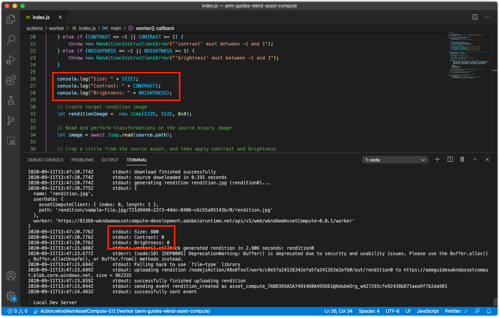
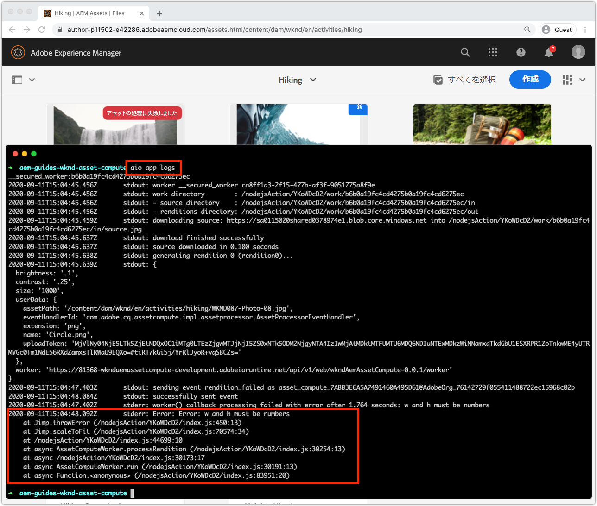

# asset computeワーカーのデバッグ

asset computeワーカーは、単純なデバッグログステートメント、リモートデバッガーとして添付されたVS Code、AEM as a Adobe I/O Runtimeで開始されたCloud Serviceのログのプルなど、複数の方法でデバッグできます。

## ログ

デバッグAsset computeワーカーの最も基本的な形式は、ワーカーコード内で従来の`console.log(..)`文を使用します。 `console` JavaScriptオブジェクトは暗黙的なグローバルオブジェクトなので、すべてのコンテキストで常に存在するので、読み込む必要もなく、必要もありません。

これらのログステートメントは、レビューワーカーの実行方法に応じて、次のように異なるAsset computeで確認できます。

+ `aio app run`から、ログは標準出力と[開発ツールの](../develop/development-tool.md)アクティベーションログに出力されます。
   
+ `aio app test`から、ログは`/build/test-results/test-worker/test.log`に出力されます。
   
+ `wskdebug`を使用すると、ログ文はVS Code Debug Console（表示/デバッグコンソール）に標準出力されます。
   
+ `aio app logs`を使用すると、ログ文はアクティベーションログ出力に出力されます

## アタッチされたデバッガーを介したリモートデバッグ

>[!WARNING]
>
>wskdebugとの互換性を確保するためにMicrosoft Visual Studio Code 1.48.0以降を使用する

[wskdebug](https://www.npmjs.com/package/@openwhisk/wskdebug) npmモジュールは、Asset computeワーカーへのデバッガーの接続をサポートしています。これには、VS Codeでブレークポイントを設定し、コードをステップスルーする機能が含まれます。

>[!VIDEO](https://video.tv.adobe.com/v/40383/?quality=12&learn=on)

_wskdebugを使用したAsset computeワーカーのデバッグのクリックスルー（オーディオなし）_

1. [wskdebug](../set-up/development-environment.md#wskdebug)と[ngrok](../set-up/development-environment.md#ngork) npmモジュールがインストールされていることを確認します。
1. [Docker Desktopと、サポートするDockerイメージ](../set-up/development-environment.md#docker)がインストールされ、実行されていることを確認します。
1. 開発ツールのアクティブな実行中のインスタンスをすべて閉じます。
1. `aio app deploy`を使用して最新のコードをデプロイし、デプロイ済みのアクション名（`[...]`間の名前）を記録します。 これは、手順8で`launch.json`を更新するために使用されます。

   ```
   ℹ Info: Deploying package [wkndAemAssetCompute-0.0.1]...
   ```


1. コマンド`npx adobe-asset-compute devtool`を使用して、Asset compute開発ツールの新しいインスタンスを起動します。
1. VS Codeで、左側のナビゲーションのデバッグアイコンをタップします。
   + プロンプトが表示されたら、「__launch.jsonファイルを作成/Node.js__」をタップして、新しい`launch.json`ファイルを作成します。
   + それ以外の場合は、「__プログラムを起動__」ドロップダウンの右側にある&#x200B;__ギア__&#x200B;アイコンをタップして、既存の`launch.json`をエディターで開きます。
1. `configurations`配列に次のJSONオブジェクト設定を追加します。

   ```json
   {
       "type": "pwa-node",
       "request": "launch",
       "name": "wskdebug",
       "attachSimplePort": 0,
       "runtimeExecutable": "wskdebug",
       "args": [
           "wkndAemAssetCompute-0.0.1/__secured_worker",  // Version must match your Asset Compute worker's version
           "${workspaceFolder}/actions/worker/index.js",  // Points to your worker
           "-l",
           "--ngrok"
       ],
       "localRoot": "${workspaceFolder}",
       "remoteRoot": "/code",
       "outputCapture": "std",
       "timeout": 30000
   }
   ```

1. ドロップダウンから新しい&#x200B;__wskdebug__&#x200B;を選択します。
1. __wskdebug__&#x200B;ドロップダウンの左側にある緑の&#x200B;__Run__&#x200B;ボタンをタップします
1. `/actions/worker/index.js`を開き、行番号の左側をタップして、ブレークポイント1を追加します。 手順6で開いたAsset compute開発ツールWebブラウザーウィンドウに移動します。
1. 「__実行__」ボタンをタップして、ワーカーを実行します
1. VS Codeに戻り、`/actions/worker/index.js`に移動して、コードを順に進みます。
1. デバッグ可能な開発ツールを終了するには、手順6で`npx adobe-asset-compute devtool`コマンドを実行したターミナルで`Ctrl-C`をタップします。

## Adobe I/O Runtime{#aio-app-logs}からログにアクセスする

[AEM as a Cloud Serviceは、Adobe I/O Runtimeで直接呼び出すことで、処理プロファイルを介し](../deploy/processing-profiles.md) てAsset computeワーカーを活用します。これらの呼び出しにはローカル開発が含まれないので、Asset compute開発ツールやwskdebugなどのローカルツールを使用して実行をデバッグすることはできません。 代わりに、Adobe I/OCLIを使用して、Adobe I/O Runtimeの特定のワークスペースで実行されたワーカーからログを取得できます。

1. デバッグが必要なワークスペースに応じて、[ワークスペース固有の環境変数](../deploy/runtime.md)が`AIO_runtime_namespace`と`AIO_runtime_auth`を介して設定されていることを確認します。
1. コマンドラインから、`aio app logs`を実行します。
   + ワークスペースでトラフィックが多い場合は、`--limit`フラグを使用してアクティベーションログの数を増やします。
      `$ aio app logs --limit=25`
1. 最新（指定された`--limit`まで）のアクティベーションログが、確認用のコマンドの出力として返されます。

   

## トラブルシューティング

+ [Debuggerがアタッチしない](../troubleshooting.md#debugger-does-not-attach)
+ [ブレークポイントが一時停止しない](../troubleshooting.md#breakpoints-no-pausing)
+ [VS Codeデバッガがアタッチされていません](../troubleshooting.md#vs-code-debugger-not-attached)
+ [ワーカーの実行開始後に添付されるVS Codeデバッガ](../troubleshooting.md#vs-code-debugger-attached-after-worker-execution-began)
+ [デバッグ中にワーカーがタイムアウトする](../troubleshooting.md#worker-times-out-while-debugging)
+ [デバッガプロセスを終了できません](../troubleshooting.md#cannot-terminate-debugger-process)
