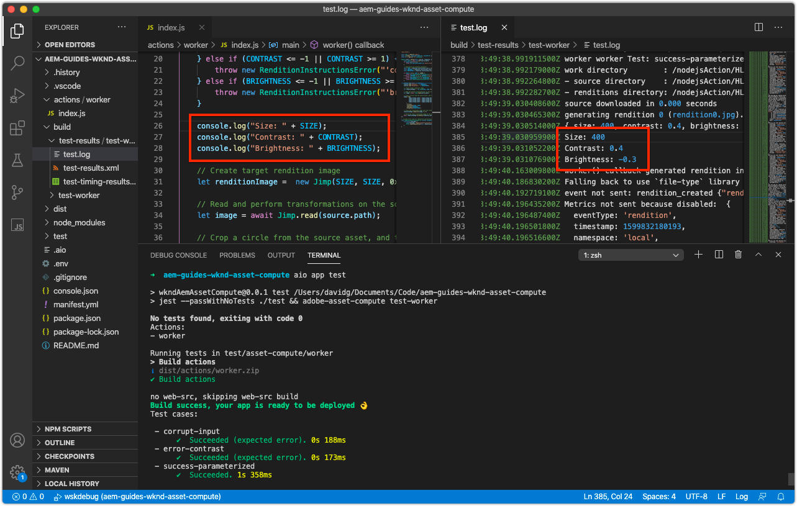

# デバッグワーカーAsset compute

asset computeワーカーは、単純なデバッグログステートメント、リモートデバッガーとして添付された VS Code、AEM as a Cloud Serviceから開始されたAdobe I/O Runtimeでのアクティベーションログのプルなど、様々な方法でデバッグできます。

## ログ

デバッグAsset computeワーカーの最も基本的な形式は、従来の `console.log(..)` ステートメントを使用して、作業者コード内で設定します。 この `console` JavaScript オブジェクトは暗黙的なグローバルオブジェクトなので、すべてのコンテキストに常に存在するので、読み込む必要も不要です。

次のログ文は、レビューワーカーの実行方法に応じて、レビューでAsset computeを使用できます。

+ 送信者 `aio app run`ログは標準出力に出力され、 [開発ツールの](../develop/development-tool.md) アクティベーションログ
   
+ 送信者 `aio app test`，ログを印刷 `/build/test-results/test-worker/test.log`
   
+ 使用 `wskdebug`、ログステートメントは、VS Code Debug コンソール（表示/デバッグコンソール）に、標準出力で出力されます。
   
+ 使用 `aio app logs`, log 文はアクティベーションログの出力に出力されます

## アタッチされたデバッガーを介したリモートデバッグ

>[!WARNING]
>
>wskdebug との互換性を確保するには、Microsoft Visual Studio Code 1.48.0以降を使用します

この [wskdebug](https://www.npmjs.com/package/@openwhisk/wskdebug) npm モジュールでは、Asset computeワーカーへのデバッガーのアタッチをサポートしています。これには、VS Code でブレークポイントを設定し、コードを順を追って設定する機能が含まれます。

>[!VIDEO](https://video.tv.adobe.com/v/40383/?quality=12&learn=on)

_wskdebug を使用したAsset computeワーカーのデバッグのクリックスルー（オーディオなし）_

1. 確認 [wskdebug](../set-up/development-environment.md#wskdebug) および [ngrok](../set-up/development-environment.md#ngork) npm モジュールがインストールされている
1. 確認 [Docker Desktop とサポートする Docker イメージ](../set-up/development-environment.md#docker) インストールされ、実行されている
1. 開発ツールのアクティブな実行中のインスタンスをすべて閉じます。
1. を使用して最新のコードをデプロイします。 `aio app deploy`  をクリックし、デプロイ済みのアクション名 ( `[...]`) をクリックします。 これは、 `launch.json` 手順 8.

   ```
   ℹ Info: Deploying package [wkndAemAssetCompute-0.0.1]...
   ```


1. コマンドを使用して、Asset compute開発ツールの新しいインスタンスを開始します。 `npx adobe-asset-compute devtool`
1. 「VS Code」で、左側のナビゲーションのデバッグアイコンをタップします。
   + プロンプトが表示されたら、をタップします。 __launch.json ファイルを作成し、 Node.js を選択します。__ 新しい `launch.json` ファイル。
   + それ以外の場合は、 __ギア__ アイコン __起動プログラム__ 既存のを開くためのドロップダウン `launch.json` をクリックします。
1. 次の JSON オブジェクト設定を `configurations` 配列：

   ```json
   {
       "type": "pwa-node",
       "request": "launch",
       "name": "wskdebug",
       "attachSimplePort": 0,
       "runtimeExecutable": "wskdebug",
       "args": [
           "wkndAemAssetCompute-0.0.1/__secured_worker",  // Version must match your Asset Compute worker's version
           "${workspaceFolder}/actions/worker/index.js",  // Points to your worker
           "-l",
           "--ngrok"
       ],
       "localRoot": "${workspaceFolder}",
       "remoteRoot": "/code",
       "outputCapture": "std",
       "timeout": 30000
   }
   ```

1. 新しい __wskdebug__ ドロップダウンから
1. 緑をタップ __実行__ の左にあるボタン __wskdebug__ ドロップダウン
1. 開く `/actions/worker/index.js` 次に、行番号の左側をタップして、ブレークポイント 1 を追加します。 手順 6 で開いたAsset compute開発ツール Web ブラウザーウィンドウに移動します。
1. 次をタップします。 __実行__ ワーカーを実行するボタン
1. VS Code に戻り、に移動します。 `/actions/worker/index.js` コードを順に説明します。
1. デバッグ可能な開発ツールを終了するには、 `Ctrl-C` を実行したターミナルで `npx adobe-asset-compute devtool` 手順 6 のコマンド

## Adobe I/O Runtimeからのログへのアクセス{#aio-app-logs}

[AEM as a Cloud Serviceは、処理プロファイルを介したAsset computeワーカーを活用します](../deploy/processing-profiles.md) を直接Adobe I/O Runtimeで呼び出す。 これらの呼び出しはローカル開発を伴わないので、Asset compute開発ツールや wskdebug などのローカルツールを使用して実行をデバッグすることはできません。 代わりに、Adobe I/OCLI を使用して、Adobe I/O Runtimeの特定のワークスペースで実行されたワーカーからログを取得できます。

1. 次を確認します。 [ワークスペース固有の環境変数](../deploy/runtime.md) を介して設定されます。 `AIO_runtime_namespace` および `AIO_runtime_auth`（デバッグが必要なワークスペースに基づく）
1. コマンドラインから、を実行します。 `aio app logs`
   + ワークスペースで大量のトラフィックが発生する場合は、 `--limit` フラグ：
      `$ aio app logs --limit=25`
1. 最新 ( 指定された `--limit`) アクティベーションログは、レビュー用のコマンドの出力として返されます。

   

## トラブルシューティング

+ [Debugger がアタッチしません](../troubleshooting.md#debugger-does-not-attach)
+ [ブレークポイントが一時停止していません](../troubleshooting.md#breakpoints-no-pausing)
+ [VS Code デバッガーが添付されていません](../troubleshooting.md#vs-code-debugger-not-attached)
+ [ワーカーの実行が開始した後に添付される VS コードデバッガ](../troubleshooting.md#vs-code-debugger-attached-after-worker-execution-began)
+ [デバッグ中に作業者がタイムアウトしました](../troubleshooting.md#worker-times-out-while-debugging)
+ [デバッガープロセスを終了できません](../troubleshooting.md#cannot-terminate-debugger-process)
