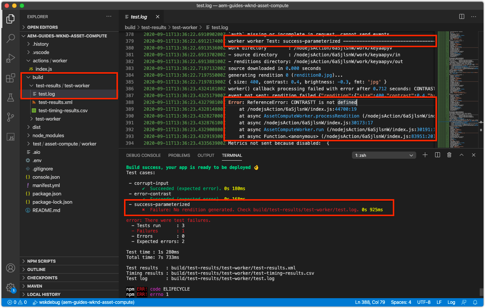

# アセット計算ワーカーのテスト

アセット計算プロジェクトは、アセット計算ワーカーの [テストを簡単に作成および実行するためのパターンを定義します](https://docs.adobe.com/content/help/en/asset-compute/using/extend/test-custom-application.html)。

## ワーカーテストの解析

アセットコンピューティングワーカーのテストはテストスイートに分類され、各テストスイート内で、テスト条件をアサートする1つ以上のテストケースが1つずつ示されます。

アセット計算プロジェクトのテストの構造は次のとおりです。

```
/actions/<worker-name>/index.js
...
/test/
  asset-compute/
    <worker-name>/           <--- Test suite for the worker
        <test-case-1>/       <--- Specific test case 
            file.jpg         <--- Input file (ie. `source.path` or `source.url`)
            params.json      <--- Parameters (ie. `rendition.instructions`)
            rendition.png    <--- Expected output file (ie. `rendition.path`)
        <test-case-2>/       <--- Another specific test case for this worker
            ...
```

各テストキャストには次のファイルを含めることができます。

+ `file.<extension>`
   + テストするソースファイル(拡張子は次を除く任意 `.link`)
   + 必須
+ `rendition.<extension>`
   + 期待されるレンディション
   + 必須（エラーテストを除く）
+ `params.json`
   + 単一レンディションのJSONの手順
   + オプション
+ `validate`
   + 期待される実際のレンディションファイルパスを引数として取得し、結果が正常である場合は終了コード0を返し、検証または比較に失敗した場合は0以外の終了コードを返す必要があるスクリプト。
   + （オプション）デフォルトでは `diff` コマンド
   + 異なる検証ツールを使用する場合に、dockerの実行コマンドをラップするシェルスクリプトを使用する
+ `mock-<host-name>.json`
   + 外部サービス呼び出しを [マッキングするためのJSON形式のHTTP応答](https://www.mock-server.com/mock_server/creating_expectations.html)。
   + （オプション）ワーカーコードが独自のHTTP要求を行う場合にのみ使用します。

## テストケースの作成

このテストケースでは、入力ファイル(`params.json`)のパラメータ化入力(`file.jpg`)が、期待されるPNGレンディション(`rendition.png`)を生成することをアサートします。

1. 最初に、ワーカーがソースを単にレンディションにコピーするのではなく、無効な場合 `simple-worker``/test/asset-compute/simple-worker` に、自動生成されたテストケースを削除します。
1. で新しいテストケースフォルダーを作成し、PNGレンディション `/test/asset-compute/worker/success-parameterized` を生成するワーカーの正常な実行をテストします。
1. フォルダーに、このテストケースのテスト `success-parameterized` 入力ファイル [を追加し、名前を付け](./assets/test/success-parameterized/file.jpg)`file.jpg`ます。
1. フォルダーに、ワーカーの入力パラメーターを定義する、 `success-parameterized` という名前 `params.json` の新しいファイルを追加します。

   ```json
   { 
       "size": "400",
       "contrast": "0.25",
       "brightness": "-0.50"
   }
   ```
   これらは、 [開発ツールのアセット計算プロファイル定義に渡されるキー/値と同じで](../develop/development-tool.md)、キーよりも小さい値で `worker` す。
1. こ追加のテストケースに対して、期待される [レンディションファイル](./assets/test/success-parameterized/rendition.png) 、名前を付け `rendition.png`ます。 このファイルは、指定された入力に対してワーカーが期待する出力を表し `file.jpg`ます。
1. コマンドラインから、 `aio app test`
   + Docker Desktop [](../set-up/development-environment.md#docker) 、およびサポートするDockerイメージがインストールされ、起動されていることを確認します。
   + 実行中の開発ツールインスタンスを終了します


## テストケースのエラーチェックの書き込み

このテストケースでは、パラメーターが無効な値に設定されている場合に、ワーカーが適切なエラーをスローするかどうかをテストします。 `contrast`

1. に新しいテストケースフォルダ `/test/asset-compute/worker/error-contrast``contrast` ーを作成して、パラメータ値が無効なためにワーカーの誤った実行をテストします。
1. フォルダーに、このテストケースのテスト `error-contrast` 入力ファイル [を追加し、名前を付け](./assets/test/error-contrast/file.jpg)`file.jpg`ます。 このファイルの内容はこのテストには重要ではありません。「破損したソース」チェックを通り過ぎるには、このテストケースが検証される有効性チェックを行うために存在する必要があります。 `rendition.instructions`
1. フォルダーに、ワーカーの入力パラメーター `error-contrast``params.json` を定義する次の名前の新しいファイルを追加します。

   ```json
   {
       "contrast": "10",
       "errorReason": "rendition_instructions_error"
   }
   ```

   + パラメ `contrast` ーターをに設定 `10``RenditionInstructionsError`し、無効な値を設定します。コントラストは —1 ～ 1の範囲で指定する必要があります。-1 ～ 1の範囲で指定すると、
   + キーを、期待されたエラーに関連付けられた「reason」に設定することで、テストで適切なエラーがスローされることをアサートします。 `errorReason` この無効なコントラストパラメーターは、 [カスタムエラーをスローします](../develop/worker.md#errors)。したがって `RenditionInstructionsError`、をこのエラーの理由に設定するか `errorReason``rendition_instructions_error` 、アサートします。

1. 実行中にレンディションを生成する必要がないので、 `rendition.<extension>` ファイルは不要です。
1. コマンドを実行して、プロジェクトのルートからテストスイートを実行します `aio app test`
   + Docker Desktop [](../set-up/development-environment.md#docker) 、およびサポートするDockerイメージがインストールされ、起動されていることを確認します。
   + 実行中の開発ツールインスタンスを終了します


## トラブルシューティング

### レンディションが生成されませんでした

レンディションを生成せずにテストケースが失敗する。

+ __エラー：__ 失敗：レンディションが生成されません。
+ __原因：__ JavaScript構文エラーなどの予期しないエラーが発生したため、ワーカーはレンディションの生成に失敗しました。
+ __解像度：__ テストの実行を確認 `test.log` し `/build/test-results/test-worker/test.log`ます。 失敗したテストケースに対応するこのファイル内のセクションを見つけ、エラーを確認します。

   

### テストで誤ったレンディションが生成される

テストケースで、正しくないレンディションの生成に失敗する。

+ __エラー：__ 失敗：レンディション&#39;rendition.xxx&#39;が期待どおりではありません。
+ __原因：__ ワーカーは、テストケースで `rendition.<extension>` 指定されたレンディションと異なるレンディションを出力しました。
   + 期待される `rendition.<extension>` ファイルが、テストケースでローカルに生成されたレンディションと完全に同じ方法で作成されない場合、ビットに何らかの違いがあるので、テストが失敗する可能性があります。 テストケースで期待されるレンディションが、Adobe I/O Runtime内で生成される開発ツールから保存される場合、ビットが技術的に異なる場合があり、人間の観点から見ると、期待されるレンディションファイルと実際のレンディションファイルが同じであっても、テストが失敗します。
+ __解像度：__ テストから出力されたレンディションをレビューします。その際に `/build/test-worker/<worker-name>/<test-run-timestamp>/<test-case>/rendition.<extension>`移動し、テストケースで予想されるレンディションファイルと比較します。
