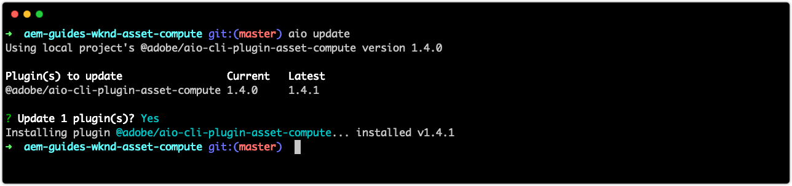

# asset computeの拡張機能のトラブルシューティング

以下は、AEM AssetsのカスタムAsset computeワーカーを開発および配置する際に発生する可能性がある、一般的な問題とエラー、および解決策のインデックスです。

## 開発{#develop}

### レンディションが部分的に描画/破損した{#rendition-returned-partially-drawn-or-corrupt}として返される

+ __エラー__:レンディションが完全にレンダリングされない（画像が破損している場合）、または開くことができない。

   

+ __原因__:レンディションの書き込みが完了する前に、ワーカーの `renditionCallback` 機能を終了してい `rendition.path`ます。
+ __解像度__:カスタムワーカーコードを確認し、を使用してすべての非同期呼び出しが同期されることを確認 `await`します。

## 開発ツール{#development-tool}

### asset computeプロジェクト{#missing-console-json}にConsole.jsonファイルがありません

+ __エラー：__ エラー：検証時に必要なファイルが見つかりません(.../node_modules/@adobe/asset-compute-client/lib/integrationConfiguration.js:XX:YY)(非同期setupAssetCompute (...)/node_modules/@adobe/asset-compute-devtool/src/assetComputeDevTool.js:XX:YY)
+ __原因：__ フ `console.json` ァイルがAsset computeプロジェクトのルートにありません
+ __解決方法：Adobe I/Oプロジェクトの新しい__ フォームを `console.json` ダウンロードする
   1. console.adobe.ioで、Asset computeプロジェクトが使用するように設定されているAdobe I/Oプロジェクトを開きます
   1. 右上の「__ダウンロード__」ボタンをタップします
   1. ファイル名`console.json`を使用して、ダウンロードしたファイルをAsset computeプロジェクトのルートに保存します。

### manifest.yml{#incorrect-yaml-indentation}のYAMLインデントが正しくありません

+ __エラー：__ YAMLException:行X、列Y:(標準out from `aio app run` コマンドを使用)のマッピングエントリのインデントが正しくありません
+ __原因：__ Yamlファイルは空白が区別されます。インデントが正しくない可能性があります。
+ __解像度：__ 確認 `manifest.yml` し、すべてのインデントが正しいことを確認します。

### memorySize制限が小さすぎます{#memorysize-limit-is-set-too-low}

+ __エラー：__  ローカル開発サーバーOpenWiskError:PUThttps://adobeioruntime.net/api/v1/namespaces/xxx-xxx-xxx/actions/xxx-0.0.1/__secured_workeroverwrite=trueがHTTP 400を返しました（無効な要求） —> &quot;要求内容が正しくありません：要件が失敗しました：メモリ64 MBが許容しきい値134217728 Bインチを下回っています。
+ __原因：内のワーカーの__ 制限が、エラーメッセージ（バイト単位）で報告さ `memorySize`  `manifest.yml` れる最小許容しきい値を下回っていました。
+ __解像度：の__  制限を `memorySize` 確認し、すべて許容される最小しきい値より大きいことを確認し `manifest.yml` ます。

### private.key{#missing-private-key}が見つからないため、開発ツールは開始できません

+ __エラー：__ ローカル開発サーバーエラー：validatePrivateKeyFileに必要なファイルがありません….（`aio app run`コマンドから標準出力）
+ __原因：__ ファイル内の `ASSET_COMPUTE_PRIVATE_KEY_FILE_PATH`  `.env` 値。現在のユーザーが参照し `private.key` ていない `private.key` か、読み取り可能ではありません。
+ __解決：フ__ ァイル内の `ASSET_COMPUTE_PRIVATE_KEY_FILE_PATH` 値を確認し、ファイルシステム `.env` 上ののの完全で絶対パスが含まれていること `private.key` を確認します。

### ソースファイルのドロップダウンが正しくない{#source-files-dropdown-incorrect}

asset compute開発ツールは、古いデータを取り込む状態に入る場合があり、不適切な項目が表示される&#x200B;__ソースファイル__&#x200B;ドロップダウンで最も顕著になります。

+ __エラー：__ ソースファイルドロップダウンに正しくない項目が表示される。
+ __原因：キャッシュされ__ た状態が古い場合、
+ __解像度：ブラウザ__ ーで、ブラウザータブの「アプリケーションの状態」、ブラウザーのキャッシュ、ローカルストレージ、サービスワーカーを完全にクリアします。

### devToolTokenクエリパラメーター{#missing-or-invalid-devtooltoken-query-parameter}がないか無効です

+ __エラー：__ Asset compute開発ツールでの「未認証」通知
+ __原因：__ `devToolToken` が見つからないか無効です
+ __解像度：Asset compute開発ツールブラウザーウィンドウを__ 閉じ、 `aio app run` コマンドを使用して開始した実行中の開発ツールプロセスを終了し、(を使用して `aio app run`)再開始開発ツールを終了します。

### ソースファイル{#unable-to-remove-source-files}を削除できません

+ __エラー：追加__ されたソースファイルを開発ツールUIから削除する方法がありません
+ __原因：__ この機能は実装されていません
+ __解決：で定義されている資格情報を使用して、クラウドストレージプロバイダーに__ ログイン `.env`します。開発ツールで使用するコンテナ（`.env`で指定）を探し、__source__&#x200B;フォルダーに移動して、ソース画像を削除します。 削除したソースファイルが開発ツールの「application state」でローカルにキャッシュされるので、ドロップダウンに引き続き表示される場合は、[ソースファイルのドロップダウンに記載されている手順を実行する必要があります。](#source-files-dropdown-incorrect)

   

## テスト{#test}

### テストの実行中にレンディションが生成されません{#test-no-rendition-generated}

+ __エラー：__ 失敗：レンディションが生成されません。
+ __原因：JavaScript__ 構文エラーなどの予期しないエラーが発生したため、ワーカーはレンディションの生成に失敗しました。
+ __解決：テスト実行の__ レビュー `test.log` が `/build/test-results/test-worker/test.log`あります。失敗したテストケースに対応するこのファイル内のセクションを見つけ、エラーを確認します。

   

### テストで誤ったレンディションが生成され、テストが失敗する{#tests-generates-incorrect-rendition}

+ __エラー：__ 失敗：レンディション&#39;rendition.xxx&#39;が期待どおりではありません。
+ __原因：__ ワーカーは、テストケースで `rendition.<extension>` 提供されたレンディションと異なるレンディションを出力しました。
   + 期待される`rendition.<extension>`ファイルが、テストケースでローカルに生成されたレンディションと完全に同じ方法で作成されない場合、ビットに何らかの違いがあるので、テストが失敗する可能性があります。 例えば、Asset computeワーカーがAPIを使用してコントラストを変更し、期待される結果がAdobe Photoshop CCでコントラストを調整して作成された場合、ファイルは同じように見えますが、ビットの小さなバリエーションは異なる場合があります。
+ __解像度：テストからのレンディション出力を__ レビューします。レンディション出力は、テストケースに移動し `/build/test-worker/<worker-name>/<test-run-timestamp>/<test-case>/rendition.<extension>`て確認し、テストケースで期待されるレンディションファイルと比較します。正確に予想されるアセットを作成するには、次のいずれかを行います。
   + 開発ツールを使用して、レンディションを生成し、正しいことを検証し、期待どおりのレンディションファイルとして使用します
   + または、`/build/test-worker/<worker-name>/<test-run-timestamp>/<test-case>/rendition.<extension>`にあるテスト生成ファイルを検証し、正しいことを検証して、期待どおりのレンディションファイルとして使用します

## デバッグ

### デバッガは{#debugger-does-not-attach}をアタッチしません

+ __エラー__:起動の処理中にエラーが発生しました：エラー：次の時点でデバッグターゲットに接続できませんでした…
+ __原因__:Docker Desktopがローカルシステムで実行されていません。VSコードデバッグコンソール(表示/デバッグコンソール)を確認して、このエラーがレポートされることを確認します。
+ __解像度__:開始 [ドッカーデスクトップで、必要なドッカーイメージがインストールされていることを確認し](./set-up/development-environment.md#docker)ます。

### {#breakpoints-no-pausing}を一時停止していないブレークポイント

+ __エラー__:デバッグ可能な開発ツールからAsset computeワーカーを実行する場合、VSコードはブレークポイントで一時停止しません。

#### VSコードデバッガがアタッチされていません{#vs-code-debugger-not-attached}

+ __原因： VSコ__ ードデバッガーが停止または切断されました。
+ __解決：VSコードデバッガーを__ 再起動し、VSコードデバッグ出力コンソール(表示/デバッグコンソール)を見て接続を確認します。

#### ワーカーの実行開始後に添付されたVSコードデバッガ{#vs-code-debugger-attached-after-worker-execution-began}

+ __原因：__  ____ Runin Development Toolをタップする前に、VSコードデバッガーがアタッチされませんでした。
+ __解決：VSコードのデバッグコンソール(表示/デバッグコンソール)を確認し、Asset computeツールからデバッガーを再実行して、デバッガーが接続されていることを__ 確認します。

### {#worker-times-out-while-debugging}のデバッグ中にワーカーがタイムアウトしました

+ __エラー__:Debug Consoleレポートに「Action will timeout in -XXX milliseconds」または [Asset compute開発ツールのレンディションプレビューが無期限に回](./develop/development-tool.md) 転するか、
+ __原因__:デバッグ中に [manifest.](./develop/manifest.md) ymlisで定義されたワーカーのタイムアウトを超えました。
+ __解像度__:manifest. [ymlorでワーカーのタイムアウトを一時的に長くすると、デバッグアクティビティが](./develop/manifest.md) 高速化します。

### デバッガープロセス{#cannot-terminate-debugger-process}を終了できません

+ __エラー__: `Ctrl-C` コマンドラインでデバッガプロセスが終了しない(`npx adobe-asset-compute devtool`)。
+ __原因__:1.3.xのバグ `@adobe/aio-cli-plugin-asset-compute` は、終了コマンドとして認識され `Ctrl-C` ません。
+ __解像度__:バージョン1.4.1以降 `@adobe/aio-cli-plugin-asset-compute` へのアップデート

   ```
   $ aio update
   ```

   

## デプロイ{#deploy}

### AEM{#custom-rendition-missing-from-asset}のアセットにカスタムレンディションが見つかりません

+ __エラー：__ 新しいアセットと再処理されたアセットは正常に処理されますが、カスタムレンディションが見つかりません

#### 処理プロファイルが上位フォルダーに適用されていません

+ __原因：__ カスタムワーカーを使用する処理プロファイルを含むフォルダーの下にアセットが存在しません
+ __解像度：処理プロファイルーをアセットの上位フォルダーに__ 適用

#### 低い処理プロファイルで置き換えられた処理プロファイル

+ __原因：__ このアセットは、カスタムワーカーの処理プロファイルが適用されたフォルダーの下に存在しますが、そのカスタマーワーカーを使用しない別の処理プロファイルが、そのフォルダーとアセットの間で適用されています。
+ __解決：2つの処理プロファイルを__ 結合または調整し、中間処理プロファイルを削除します

### AEM{#asset-processing-fails}でのアセットの処理に失敗

+ __エラー：ア__ セットに表示されるアセット処理に失敗したバッジ
+ __原因：カ__ スタムワーカーの実行中にエラーが発生しました
+ __解像度：を__ 使用したAdobe I/O Runtimeアクティビティの [デバッグに関する手順に従](./test-debug/debug.md#aio-app-logs)  `aio app logs`います。


